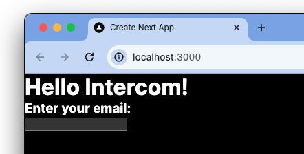
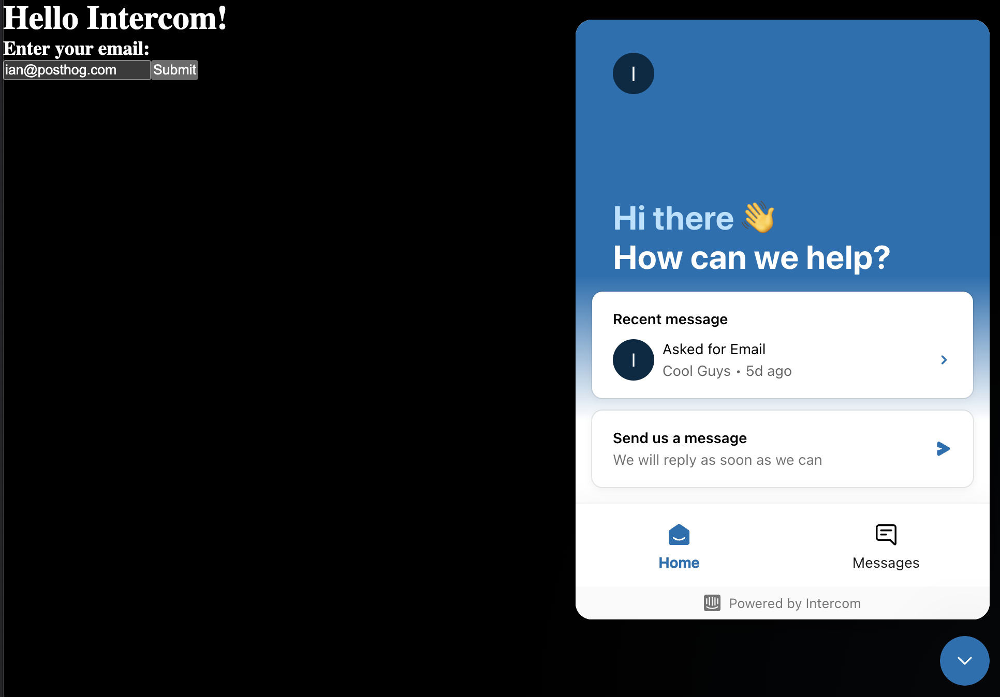
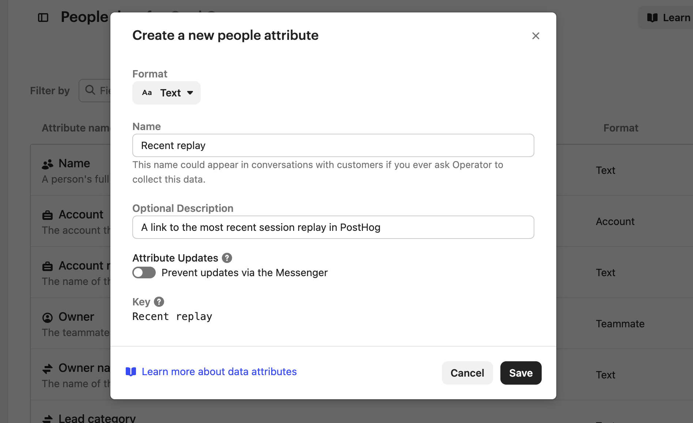
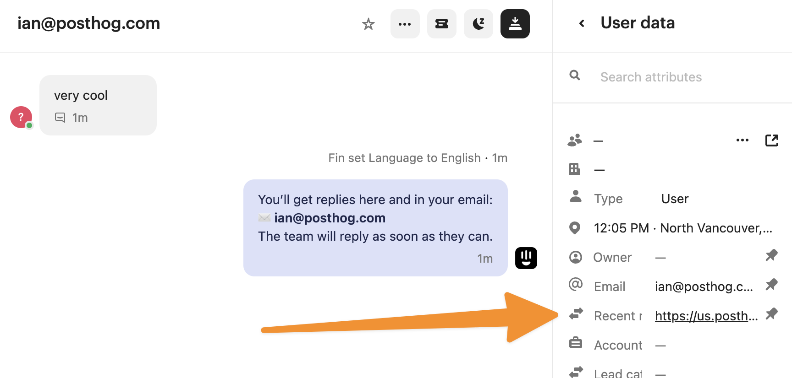
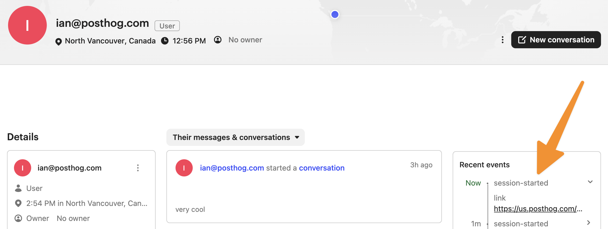

Session replays are a useful support tool for debugging and recreating issues. The errors, console, and network data along with the rest of PostHog's tools make it a powerful support platform.

To get easy access to session replays in Intercom, you can add them as either user data or events. To show you how to do this, we build a basic Next.js app, add PostHog, add Intercom, and set up the session replay link to show in both places in Intercom.

## 1. Create a basic Next.js app

First, make sure [Node is installed](https://nodejs.dev/en/learn/how-to-install-nodejs/) (18.17 or newer), and then create a Next.js app:

```bash
npx create-next-app@latest intercom-sessions
```

Select **No** for TypeScript, **Yes** for `use app router`, and the defaults for every other option. Once created, go into your `app/page.js` file and add a basic page with a spot for users to enter their email.

```js
// app/page.js
"use client"
import { useState } from 'react';

export default function Home() {
	const [email, setEmail] = useState('');

  return (
     <main>
      <h1>Hello Intercom!</h1>
      <h3>Enter your email:</h3>
      <input 
        value={email} 
        onChange={(e) => setEmail(e.target.value)} 
      />
    </main>
  );
}

```

Once done, run `npm run dev` and go `http://localhost:3000`  to see your app.



## 2. Add PostHog

To set up session replays, we install PostHog in our app. If you don't have a PostHog instance, you can [sign up for free](https://us.posthog.com/signup).

> **Important:** Make sure to enable "Record user sessions" in [your project settings](https://us.posthog.com/project/settings/project-replay).

After doing this, install the `[posthog-js](https://www.posthog.com/docs/libraries/js)` SDK:

```bash
npm i posthog-js
```

Next, create a `providers.js`  file in your `app`  folder. In it, initialize PostHog with your project API key and instance address (from [your project settings](https://us.posthog.com/project/settings/project-details)) and export a provider component. If you use a US Cloud instance, also make sure your `ui_host` config option is set to `https://us.posthog.com`.

```js
// app/providers.js
'use client'
import posthog from 'posthog-js'
import { PostHogProvider } from 'posthog-js/react'

if (typeof window !== 'undefined') {
  posthog.init('<ph_project_api_key>', {
    api_host: '<ph_instance_address>',
    ui_host: 'https://us.posthog.com' // remove if EU
 })
}

export function PHProvider({ children }) {
  return <PostHogProvider client={posthog}>{children}</PostHogProvider>
}
```

Once created, you can import `PHProvider` into your `layout.js` file and wrap your app in it:

```js
import "./globals.css";
import { PHProvider } from './providers'

export default function RootLayout({ children }) {
  return (
    <html lang="en">
      <PHProvider>
        <body>{children}</body>
      </PHProvider>
    </html>
  );
}
```

## 3. Add Intercom

Start by going to your [installation settings page](https://app.intercom.com/a/apps/_/settings/web). Once there, enable "Install Messenger on your site or web app," choose the "Install with code snippet" tab, and then choose "Single-page apps." 

To install Intercom in the `app/page.js` file, we:

1. Set `APP_ID` as a variable, but you can use the pre-filled URL Intercom provides as well. 
2. Add the first script to a `useEffect` to run on load.
3. Add the `boot` call to the `handleSubmit` function where the email is available.

Altogether, this looks like this:

```js
// app/page.js
"use client"
import { useEffect, useState } from 'react';

export default function Home() {
	const [email, setEmail] = useState('');
  const APP_ID = "q0wg4mi9"; // replace this

  useEffect(() => {
    (function(){var w=window;var ic=w.Intercom;if(typeof ic==="function"){ic('reattach_activator');ic('update',w.intercomSettings);}else{var d=document;var i=function(){i.c(arguments);};i.q=[];i.c=function(args){i.q.push(args);};w.Intercom=i;var l=function(){var s=d.createElement('script');s.type='text/javascript';s.async=true;s.src='https://widget.intercom.io/widget/'+APP_ID;var x=d.getElementsByTagName('script')[0];x.parentNode.insertBefore(s,x);};if(document.readyState==='complete'){l();}else if(w.attachEvent){w.attachEvent('onload',l);}else{w.addEventListener('load',l,false);}}})();
  }, []);

  const handleSubmit = (e) => {
    e.preventDefault();
    console.log(e)
    window.Intercom("boot", {
      api_base: "https://api-iam.intercom.io",
      app_id: APP_ID,
      email: email
    });
  }

  return (
     <main>
      <h1>Hello Intercom!</h1>
      <h3>Enter your email:</h3>
      <form onSubmit={handleSubmit}>
        <input 
          type="email"
          value={email} 
          onChange={(e) => setEmail(e.target.value)} 
        />
        <button type="submit">Submit</button>
      </form>
    </main>
  );
}
```

Now when you submit an email, Intercom launches with your email connected.



## 4. Adding session replays to Intercom

The final piece is adding PostHog's session replays to Intercom. Since PostHog automatically captures session replay, all that is left to do is get the link and add it somewhere in Intercom. There are two spots we can add it.

### Recent session replay as people data attribute

The first way is to add the session replay link is as a people data attribute. To do this, go to the [people data settings](https://app.intercom.com/a/apps/_/settings/people-data) and click "Create attribute." Name the attribute "Recent replay," click the toggle to enable updates via the Messenger, and click "Save."



Back in your app, add PostHog to your component in `app/page.js`, call the `[get_session_replay_url()](/docs/libraries/js#session-replay)` method, and add the link as `recent_replay` in your `boot` call like this:

```js
// app/page.js
"use client"
import { useEffect, useState } from 'react';
import { usePostHog } from 'posthog-js/react';

export default function Home() {
	const [email, setEmail] = useState('');
  const APP_ID = "q0wg4mi8";
  const posthog = usePostHog();

  useEffect(() => {
    (function(){var w=window;var ic=w.Intercom;if(typeof ic==="function"){ic('reattach_activator');ic('update',w.intercomSettings);}else{var d=document;var i=function(){i.c(arguments);};i.q=[];i.c=function(args){i.q.push(args);};w.Intercom=i;var l=function(){var s=d.createElement('script');s.type='text/javascript';s.async=true;s.src='https://widget.intercom.io/widget/'+APP_ID;var x=d.getElementsByTagName('script')[0];x.parentNode.insertBefore(s,x);};if(document.readyState==='complete'){l();}else if(w.attachEvent){w.attachEvent('onload',l);}else{w.addEventListener('load',l,false);}}})();
  }, []);

  const handleSubmit = (e) => {
    e.preventDefault();
    console.log(e)
    window.Intercom("boot", {
      api_base: "https://api-iam.intercom.io",
      app_id: APP_ID,
      email: email,
      recent_replay: posthog.get_session_replay_url()
    });
  }
//... rest of your code
```

Now, when a user sends a message, you can see a link to their most recent replay in PostHog.



The only downside with this method is that it will only show the most recent replay. You lose the history of replays across sessions you might need for solving older issues.

### Adding a session replay event

The second way lets us capture a history of session replays in Intercom. We do this by setting up a basic Intercom event with the session replay link. To do this, use the Intercom `trackEvent` to capture a `session-started` event like this:

```js
//... rest of your code
const handleSubmit = (e) => {
    e.preventDefault();
    console.log(e)
    window.Intercom("boot", {
      api_base: "https://api-iam.intercom.io",
      app_id: APP_ID,
      email: email,
      recent_replay: posthog.get_session_replay_url()
    });

    const metadata = {
      link: posthog.get_session_replay_url()
    };
    window.Intercom('trackEvent', 'session-started', metadata);
  }
//... rest of your code
```

After running this, when you go to the user in Intercom, you see events connected to them with links to different sessions. 



> **Bonus:** Beyond a session replay link, you can add information like:
> - User ID (with `posthog.get_distinct_id()`)
> - Report event ID
> - Admin links
> - Target area (like onboarding, dashboard, features)
> As an example, you can see [what we add in GitHub](https://github.com/PostHog/posthog/blob/b817a1bc4af92ac5691921c4d1995c17311a8a9d/frontend/src/lib/components/Support/supportLogic.ts#L223C9-L223C28).

## Further reading

- [How to add session replays to Zendesk](/tutorials/zendesk-session-replays)
- [How to use session replays to improve your support experience](/tutorials/session-recordings-for-support)
- [How to use filters + session replays to understand user friction](/tutorials/filter-session-recordings)