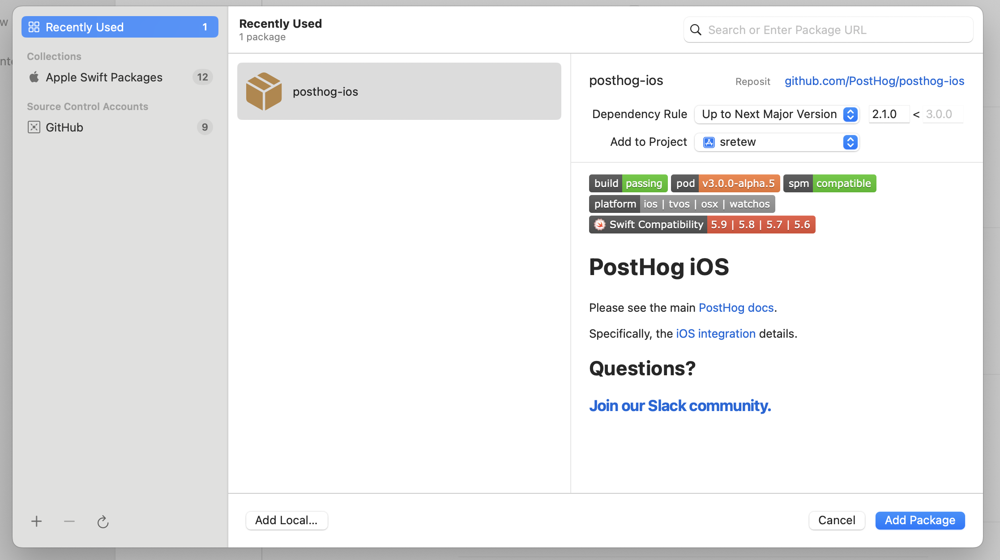
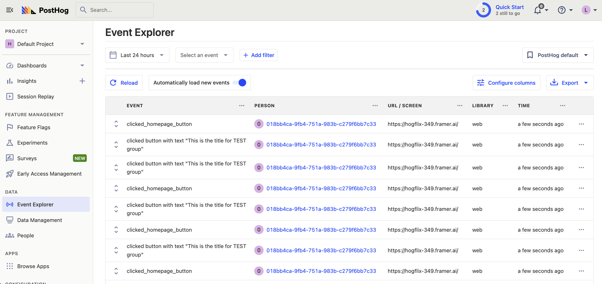
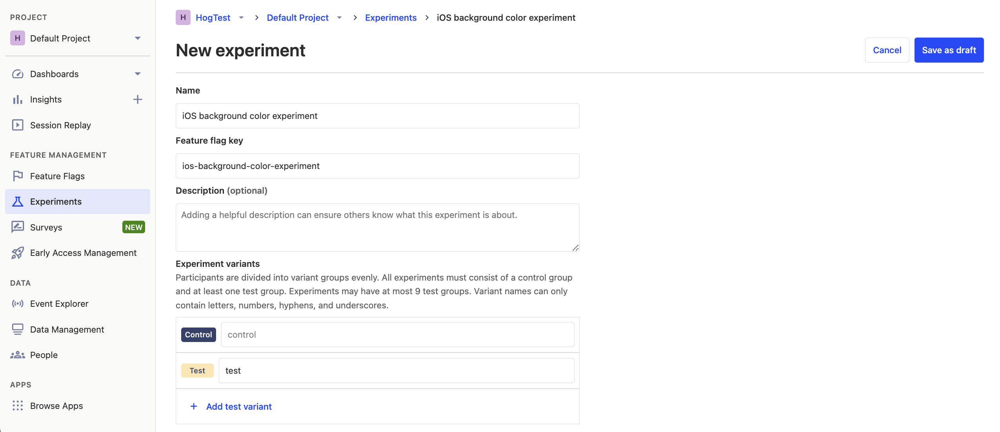

[A/B tests](/ab-testing) help you make your iOS app better by comparing the impact of changes on key metrics. 

PostHog makes [A/B testing on iOS](/docs/experiments/installation?tab=iOS) simple. To show you how, this tutorial will guide you on how to add PostHog to your iOS app and run an A/B test. We'll create a basic A/B test to see how the background color of a screen affects the click-through rate of a button. 

## Creating a new iOS app

Our app will have two screens. The first screen will have a button which will take you to a second screen. The second screen will either have a `red` or `green` background color depending on if the user is in the `control` or `test` group. The second screen will also have a button which captures an event when it's pressed. We'll use this event as our goal metric for our test.

The first step is to create a new app. Open XCode and click "Create new project". Select iOS as your platform, then "App" and press next. Give your app a name, select `SwiftUI` as the interface, and the defaults for everything else. Click next and then "Create".

Then, replace your code in `ContentView` with the following:

```swift
// in ContentView.swift
import SwiftUI

struct ContentView: View {
    @State private var navigateToFeatureScreen = false

    var body: some View {
        NavigationStack {
            VStack {
                Image(systemName: "globe")
                    .imageScale(.large)
                    .foregroundStyle(.tint)
                Text("Hello, world!")

                Button("Go to Next Screen") {
                    navigateToFeatureScreen = true
                }
                .padding()
                .background(Color.blue)
                .foregroundColor(.white)
                .cornerRadius(10)
            }
            .padding()
            .navigationDestination(isPresented: $navigateToFeatureScreen) {
                FeatureScreenView(isTestVariant: false) // We'll update this later
            }
        }
    }
}
```

Then, create a new SwiftUI View called `FeatureScreenView`. Replace the default code in the new file with the following:

```swift
// in FeatureScreenView.swift
import SwiftUI

struct FeatureScreenView: View {
    var isTestVariant: Bool

    var body: some View {
        ZStack {
            Color(isTestVariant ? .green : .red)
                .edgesIgnoringSafeArea(.all)

            Button("Click Me!") {
            }
            .padding()
            .background(Color.blue)
            .foregroundColor(.white)
            .cornerRadius(10)
        }
    }
}
```

Our basic set up is now complete. Build and run your app to test that it's working.


## Adding PostHog to your iOS app

First, add [posthog-ios](https://github.com/PostHog/posthog-ios) as a dependency to your app using [Swift Package Manager](https://developer.apple.com/documentation/xcode/adding-package-dependencies-to-your-app) (or if you prefer, you can use [CocoaPods](/docs/libraries/ios#cocoapods) or [Carthage](/docs/libraries/ios#carthage)). To add the package dependency to your Xcode project, select File > Add Package Dependency and enter the URL `https://github.com/PostHog/posthog-ios.git`. Select `posthog-ios` and click Add Package.

Note that for this tutorial we use version `3.1.0` of the SDK.



Next, configure your PostHog instance in your `App.swift` struct initializer:

```swift
// in App.swift
import SwiftUI
import PostHog

@main
struct App: App {
    init() {
        let POSTHOG_API_KEY = "<ph_project_api_key>"
        let POSTHOG_HOST = "<ph_instance_address>" // usually 'https://app.posthog.com' or 'https://eu.posthog.com'
        let configuration = PostHogConfig(apiKey: POSTHOG_API_KEY, host: POSTHOG_HOST) 
        PostHogSDK.shared.setup(configuration)
    }
    
    var body: some Scene {
        WindowGroup {
            ContentView()
        }
    }
}
```

To get your PostHog API key and host, [sign up to PostHog](https://app.posthog.com/signup). Then, you can find your API key and host in your [project settings](https://app.posthog.com/settings/project). Replace the strings `<ph_project_api_key>` and `<ph_instance_address>` with your API key and host.

Finally, [capture a custom event](/docs/libraries/ios#capturing-events) when the button on `FeatureScreenView` is clicked. We'll use this event as our goal metric in our A/B test.

```swift
// in FeatureScreenView.swift
import PostHog

// ...rest of code

Button("Click Me!") {
    PostHogSDK.shared.capture("feature_button_clicked")
}

// ...rest of code
```

To check your setup, build and run your app. Click your button a few times. You should start seeing events in the [activity tab](https://app.posthog.com/events).



## Create an A/B test in PostHog

The next step is to set up an A/B test (we call them experiments in PostHog).

Go to the [Experiments tab](https://app.posthog.com/experiments) in PostHog and click "New experiment". Add the following details to your experiment:

1. Name it "iOS background color experiment".
2. Set "Feature flag key" to `ios-background-color-experiment`.
3. Under the experiment goal, select the `feature_button_clicked` we created in the previous step.
4. Use the default values for all other fields.

Click "Save as draft" and then click "Launch".



## Implement the A/B test in Xcode

The final step is to add the experiment code. We'll add code that does the following:

1. Fetch the `ios-background-color-experiment` flag.
2. Change the background color of `FeatureScreenView` based on the value of the flag (`control` or `test`).

To do this, update the code in `ContentView.swift` with the following:

```swift
// in ContentView.swift
import SwiftUI
import PostHog

// ...

    @State private var isTestVariant = false

// ...
    var body: some View {
        NavigationStack {
            VStack {
                Image(systemName: "globe")
                    .imageScale(.large)
                    .foregroundStyle(.tint)
                Text("Hello, world!")

               Button("Go to Next Screen") {
                    // Fetch feature flag here
                    let flagValue = PostHogSDK.shared.getFeatureFlag("ios-background-color-experiment") as? String
                    if flagValue == "test" {
                        isTestVariant = true
                    }
                    navigateToFeatureScreen = true
                }

// ...

            .navigationDestination(isPresented: $navigateToFeatureScreen) {
                FeatureScreenView(isTestVariant: isTestVariant)
            }
        }
    }
}
```

That's it! Your A/B test is now ready. When you run your app, you see either green or red as the background color of `FeatureScreenView` and PostHog will capture button clicks for each variant to calculate if changing the color has a statistically significant impact.

If you want to test both variants of your experiment to make sure they are working correctly, you can add an [optional override](/docs/feature-flags/testing#method-1-assign-a-user-a-specific-flag-value) to your feature flag.

Lastly, you can [view your test results](/docs/experiments/testing-and-launching#viewing-experiment-results) on the experiment page.

## Further reading

- [A software engineer's guide to A/B testing](/product-engineers/ab-testing-guide-for-engineers)
- [How to set up analytics in iOS](/tutorials/ios-analytics)
- [How to set up feature flags in iOS](/tutorials/ios-feature-flags)
