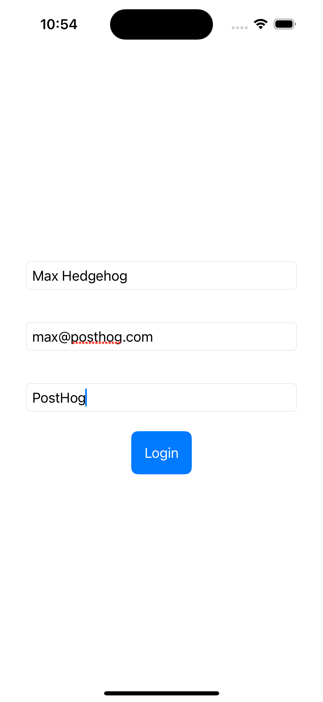
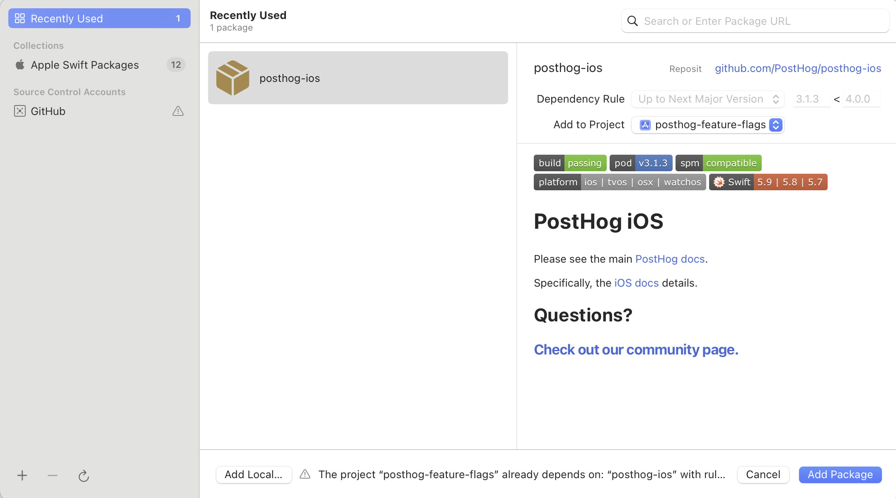

import { ProductScreenshot } from 'components/ProductScreenshot'
import EventsInPostHogLight from '../images/tutorials/ios-analytics/events-light.png'
import EventsInPostHogDark from '../images/tutorials/ios-analytics/events-dark.png'
import IdentifyLight from '../images/tutorials/ios-analytics/identify-light.png'
import IdentifyDark from '../images/tutorials/ios-analytics/identify-dark.png'
import InsightLight from '../images/tutorials/ios-analytics/create-insights-light.png'
import InsightsDark from '../images/tutorials/ios-analytics/create-insights-dark.png'

[Product analytics](/product-analytics) enable you to gather and analyze data about how users interact with your iOS app. To show you how to set up analytics, in this tutorial we create a basic iOS app, add PostHog, and use it to [capture events](/docs/product-analytics/capture-events) and [create insights](/docs/product-analytics/insights).

## 1. Create a new iOS app

Our app will have two screens:

- a `login` screen with a form to enter in your name, email, and company name.
- a `home` screen with submit button, toggle, and logout button.

The first step is to create a new app. Open Xcode and click "Create new project". Select iOS as your platform, then "App" and press next. Give your app a name (we chose `ios_analytics`), select `SwiftUI` as the interface, and the defaults for everything else. Click next and then "Create".

Then, replace your code in `ContentView.swift` with the following:

```swift file=ContentView.swift
import SwiftUI

struct ContentView: View {
    @AppStorage("isAuthenticated") private var isAuthenticated: Bool = false

    var body: some View {
        NavigationView {
            if isAuthenticated {
                HomeView(isAuthenticated: $isAuthenticated)
            } else {
                LoginView(isAuthenticated: $isAuthenticated)
            }
        }
    }
}

struct LoginView: View {
    @Binding var isAuthenticated: Bool
    @State private var name: String = ""
    @State private var email: String = ""
    @State private var companyName: String = ""

    var body: some View {
        VStack {
            TextField("Name", text: $name)
                .padding()
                .textFieldStyle(RoundedBorderTextFieldStyle())
            TextField("Email", text: $email)
                .padding()
                .textFieldStyle(RoundedBorderTextFieldStyle())
            TextField("Company Name", text: $companyName)
                .padding()
                .textFieldStyle(RoundedBorderTextFieldStyle())
            Button("Login") {
                isAuthenticated = true
            }
            .padding()
            .foregroundColor(.white)
            .background(Color.blue)
            .cornerRadius(8)
        }
        .padding()
    }
}

struct HomeView: View {
    @Binding var isAuthenticated: Bool
    @State private var isToggleOn: Bool = false

    var body: some View {
        VStack {
            Spacer()

            Button("Submit") {
                // We add code later here
            }
            .padding()
            .foregroundColor(.white)
            .background(Color.green)
            .cornerRadius(8)

            Toggle("Toggle", isOn: $isToggleOn)
                .padding()

            Spacer()
            
            Button("Logout") {
                isAuthenticated = false
            }
            .padding()
            .foregroundColor(.white)
            .background(Color.red)
            .cornerRadius(8)
        }
        .padding()
    }
}

#Preview {
    ContentView()
}
```

Our basic set up is now complete. Build and run your app to see it in action.



## 2. Add PostHog to your app

With our app set up, it’s time to install and set up PostHog. If you don't have a PostHog instance, you can [sign up for free](https://us.posthog.com/signup).

First, add [`posthog-ios`](/docs/libraries/ios) as a dependency to your app using [Swift Package Manager](https://developer.apple.com/documentation/xcode/adding-package-dependencies-to-your-app) (or if you prefer, you can use [CocoaPods](/docs/libraries/ios#cocoapods)).

To add the package dependency to your Xcode project, select `File > Add Package Dependency` and enter the URL `https://github.com/PostHog/posthog-ios.git`. Select `posthog-ios` and click Add Package.

Note that for this tutorial we use version `3.1.3` of the SDK.



Next, configure your PostHog instance in `App.swift` using your project API key and instance address (you can find these in [your project settings](https://us.posthog.com/project/settings)):

```swift file=App.swift
import SwiftUI
import PostHog

@main
struct ios_analyticsApp: App {
    init() {
        let POSTHOG_API_KEY = "<ph_project_api_key>"
        let POSTHOG_HOST = "<ph_instance_address>" // usually 'https://us.i.posthog.com' or 'https://eu.i.posthog.com'
        let configuration = PostHogConfig(apiKey: POSTHOG_API_KEY, host: POSTHOG_HOST)
        PostHogSDK.shared.setup(configuration)
    }
    
    var body: some Scene {
        WindowGroup {
            ContentView()
        }
    }
}
```

To check your setup, build and run your app. You should start seeing events in the [activity tab](https://us.posthog.com/events).

<ProductScreenshot
  imageLight={EventsInPostHogLight} 
  imageDark={EventsInPostHogDark} 
  alt="Events captured in PostHog" 
  classes="rounded"
/>

## 3. Implement the event capture code

To show how to capture events with PostHog, we capture an event when the submit button on the home page is clicked. To do this, we call [PostHogSDK.shared.capture()](/docs/libraries/ios#capturing-events):

```swift file=ContentView.swift
import SwiftUI
import PostHog

// ...

struct HomeView: View {
            // ...

            Button("Submit") {
                PostHogSDK.shared.capture("home_button_clicked")
            }

            // ...
```

Refresh your app and click the button on the home page a few times. You should now see the captured event in your [PostHog activity tab](https://us.posthog.com/events).

### Setting event properties

When capturing events, you can optionally include additional information by setting the `properties` argument. This is helpful for breaking down or filtering events when creating [insights](/docs/product-analytics/insights).

As an example, we add the value of the toggle as an event property:

```swift file=ContentView.swift
struct HomeView: View {
            // ...

            Button("Submit") {
                PostHogSDK.shared.capture("home_button_clicked", properties: [
                    "is_toggled_enabled": isToggleOn
                ])
            }

            // ...
```

### Identifying users

Linking events to specific users enables you to build a full picture of how they're using your product across different sessions, devices, and platforms. To link events from anonymous to specific users, we call [`PostHogSDK.shared.identify()`](/docs/libraries/ios#identify) with a `distinctId` argument. The `distinctId` must be a unique identifier for the user – usually their email or database ID.

To show you an example, update the code for the login button to the following:

```swift file=ContentView.swift
struct LoginView: View {
            // ...

            Button("Login") {
                isAuthenticated = true
                PostHogSDK.shared.identify($email.wrappedValue)
            }

            // ...
```

Any past or future events captured after calling `identify` will now be associated with the email you provided. 

To test this, press logout, fill the form in and press login. Then, in the home page, press the submit button to capture the `home_button_clicked` event. You should now see the email in the **Person** column in your [activity tab]((https://us.posthog.com/events)).

<ProductScreenshot
  imageLight={IdentifyLight} 
  imageDark={IdentifyDark} 
  alt="Identified events captured in PostHog" 
  classes="rounded"
/>

Lastly, when the user logs out, you should call [`PostHogSDK.shared.reset()`](https://posthog.com/docs/libraries/ios#reset). This resets the PostHog ID and ensures that events are associated to the correct user.
```swift file=ContentView.swift
     Button("Logout") {
                isAuthenticated = false
                PostHogSDK.shared.reset()
            }
```

### Capturing group analytics

[Groups](/docs/product-analytics/group-analytics) are a powerful feature in PostHog that aggregate events based on entities, such as organizations or companies. This is especially helpful for B2B SaaS apps, where often you want to view insights such as `number of active companies` or `company churn rate`.

To enable group analytics, you'll need to [upgrade](https://us.posthog.com/organization/billing) your PostHog account to include them. This requires entering your credit card, but don't worry, we have a [generous free tier](/pricing) of 1 million events per month – so you won't be charged anything yet.

To create groups in PostHog, simply include them in your code by calling [`PostHogSDK.shared.group()`](/docs/libraries/ios#group-analytics):

```swift file=ContentView.swift
struct LoginView: View {
            // ...

            Button("Login") {
                isAuthenticated = true
                PostHogSDK.shared.identify($email.wrappedValue)
                PostHogSDK.shared.group(type: "company", key: $companyName.wrappedValue)
            }

            // ...
```

In the above example, we create a group type `company`, and then set the value as the unique identifier for that specific company. Any future events that are captured will now be associated with this company.

## 4. Create an insight in PostHog

Restart your app and capture events using different inputs in the `login` screen. This will capture events for different users and companies and enable us to show the power of PostHog insights.

Next, go to the [Product analytics](https://us.posthog.com/insights) tab in PostHog and click the **+ New insight** button. PostHog supports many different types of insights, such as [trends](/docs/user-guides/trends), [funnels](/docs/user-guides/funnels), [paths](/docs/user-guides/paths) and more.

In this tutorial, we create a simple trend insight:

1. Select the **Trends** tab.
2. Under the **Series** header select the `home_button_clicked` event. 
3. Click the **Total count** dropdown to change how events are aggregated. You can choose options such as `Count per user`, `Unique users`, `Unique company(s)`, and more. You can also add filters or breakdown based on properties. 

For example, in the image below we set our insight to show number of unique users that captured the `home_button_clicked` event where the toggled is enabed:

<ProductScreenshot
  imageLight={InsightLight} 
  imageDark={InsightDark} 
  alt="Insight created in PostHog" 
  classes="rounded"
/>

That's it! Feel free to play around in your dashboard and explore the different kinds of insights you can create in PostHog.

## Further reading

- [How to run A/B tests in iOS](/tutorials/ios-ab-tests)
- [How to set up feature flags in iOS](/tutorials/ios-feature-flags)
- [How to run A/B tests in Android](/tutorials/android-ab-tests)
