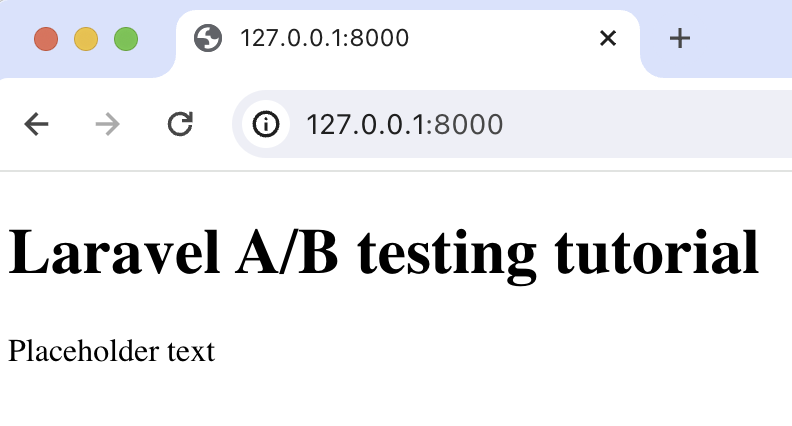

import { ProductScreenshot } from 'components/ProductScreenshot'
export const EventsInPostHogLight = "https://res.cloudinary.com/dmukukwp6/image/upload/posthog.com/contents/images/tutorials/laravel-ab-tests/events-light.png"
export const EventsInPostHogDark = "https://res.cloudinary.com/dmukukwp6/image/upload/posthog.com/contents/images/tutorials/laravel-ab-tests/events-dark.png"
export const TestSetupLight = "https://res.cloudinary.com/dmukukwp6/image/upload/posthog.com/contents/images/tutorials/laravel-ab-tests/experiment-setup-light.png"
export const TestSetupDark = "https://res.cloudinary.com/dmukukwp6/image/upload/posthog.com/contents/images/tutorials/laravel-ab-tests/experiment-setup-dark.png"
export const ResultsLight = "https://res.cloudinary.com/dmukukwp6/image/upload/posthog.com/contents/images/tutorials/laravel-ab-tests/results-light.png"
export const ResultsDark = "https://res.cloudinary.com/dmukukwp6/image/upload/posthog.com/contents/images/tutorials/laravel-ab-tests/results-dark.png"

A/B tests help you improve your Laravel app by enabling you to compare the impact of changes on key metrics. To show you how to set one up, we create a basic Laravel app, add PostHog, create an A/B test, and implement the code for it.

## 1. Create a basic Laravel app

First, ensure [PHP](https://www.php.net/manual/en/install.php) and [Composer](https://getcomposer.org/) are installed. Then, create a new Laravel project called `laravel-ab-tests`:

```bash
composer create-project laravel/laravel laravel-ab-tests
cd laravel-ab-tests
```

Next, replace the code in `resources/views/welcome.blade.php` with a simple heading and paragraph:

```php file=resources/views/welcome.blade.php
<!DOCTYPE html>
<html>
<body>
  <h1>Laravel A/B testing tutorial</h1>
  <p>{{ $paragraphText }}</p>
</body>
</html>
```

Replace the code in `routes/web.php` with a route to return our view:

```php file=routes/web.php
<?php

use Illuminate\Support\Facades\Route;

Route::get('/', function () {
    $paragraphText = 'Placeholder text';
    return view('welcome', ['paragraphText' => $paragraphText]);
});
```

Run `php artisan serve` and navigate to `http://127.0.0.1:8000` to see our app in action.



## 2. Add PostHog to your app

With our app set up, it’s time to install and set up PostHog. If you don't have a PostHog instance, you can [sign up for free](https://us.posthog.com/signup).

To start, run `composer require posthog/posthog-php` to install [PostHog’s PHP SDK](/docs/libraries/php).

Next, we initialize PostHog in the `boot` method of `app/Providers/AppServiceProvider.php`. Replace the existing code in that file with the following:

```php file=app/Providers/AppServiceProvider.php
<?php

namespace App\Providers;

use Illuminate\Support\ServiceProvider;
use PostHog\PostHog;

class AppServiceProvider extends ServiceProvider
{
    public function boot(): void
    {
        PostHog::init(
            '<ph_project_api_key>',
            [
                'host' => '<ph_instance_address>'
            ]
        );
    }
}
```

You can find your project API key and instance address in [your project settings](https://us.posthog.com/project/settings). 

Lastly, we [capture](/docs/product-analytics/capture-events) a `$pageview` event with PostHog in our route: 

```php file=routes/web.php
<?php

use Illuminate\Support\Facades\Route;
use PostHog\PostHog;

Route::get('/', function () {
    $paragraphText = 'Placeholder text';
    $distinctId = 'placeholder-user-id'; 

    PostHog::capture([
        'distinctId' => $distinctId,
        'event' => '$pageview'
    ]);

    return view('welcome', ['paragraphText' => $paragraphText]);
});
```

With this set up, restart your app and then refresh your browser a few times. You should now see the captured event in your [PostHog activity tab](https://us.posthog.com/events).

<ProductScreenshot
  imageLight={EventsInPostHogLight} 
  imageDark={EventsInPostHogDark} 
  alt="Events captured in PostHog" 
  classes="rounded"
/>

## 3. Create an A/B test in PostHog

If you haven't done so already, you'll need to [upgrade](https://us.posthog.com/organization/billing) your PostHog account to include A/B testing. This requires entering your credit card, but don't worry, we have a [generous free tier](/pricing) of 1 million requests per month – so you won't be charged anything yet.

Next, go to the [A/B testing tab](https://us.posthog.com/experiments) and create an A/B test by clicking the **New experiment** button. Add the following details to your experiment:

1. Name it "My cool experiment".
2. Set "Feature flag key" to `my-cool-experiment`.
3. Under the experiment goal, select the `pageview` event we captured in the previous step.
4. Use the default values for all other fields.

Click "Save as draft" and then click "Launch".

<ProductScreenshot
  imageLight={TestSetupLight} 
  imageDark={TestSetupDark} 
  alt="Experiment setup in PostHog" 
  classes="rounded"
/>

## 4. Implement the A/B test code

To implement the A/B test, we: 

1. Fetch the `my-cool-experiment` flag using [`PostHog::getFeatureFlag()`](/docs/libraries/php#feature-flags). 
2. Update the paragraph text based on whether the user is in the `control` or `test` variant of the experiment.

```php file=routes/web.php
// rest of your code

Route::get('/', function () {
    $paragraphText = 'Placeholder text';
    $distinctId = 'placeholder-user-id'; 

    $enabledVariant = PostHog::getFeatureFlag(
        'my-cool-experiment',
        $distinctId
    );
    if ($enabledVariant === "control") {
        $paragraphText = "Control variant!";
    } else if ($enabledVariant === "test") {
        $paragraphText = "Test variant!";
    }

    // rest of your code

});
```

When you restart your app and refresh the page, you should see the text updated to either `Control variant!` or `Test variant!`. 

> **💡 Setting the correct `distinctId`:**
> 
> You may notice that we set `distinctId = 'placeholder-user-id'` in our flag call above. In production apps, to ensure you fetch the correct flag value for your user, `distinctId` should be set to their unique ID. 
> 
> For logged-in users, you typically use their email or user ID as their `distinctId`. For logged-out users, assuming they made their request from a browser, you can use values from their request cookies. See an example of this in our [Nuxt feature flags tutorial](/tutorials/nuxt-feature-flags#setting-the-correct-distinctid).

## 5. Include the feature flag when capturing your event

To ensure our goal metric is correctly calculated for each experiment variant, we need to include our feature flag information when capturing our `$pageview` event.

To do this, we add the [`$feature/my-cool-experiment`](/docs/libraries/php#step-2-include-feature-flag-information-when-capturing-events) key to our event properties:

```php file=routes/web.php
// rest of your code

Route::get('/', function () {

    // rest of your code

    PostHog::capture([
        'distinctId' => $distinctId,
        'event' => '$pageview',
        'properties' => [
            '$feature/my-cool-experiment' => $enabledVariant
        ]
    ]);

    return view('welcome', ['paragraphText' => $paragraphText]);
});
```

Now PostHog is able to calculate our goal metric for our experiment results.

<ProductScreenshot
  imageLight={ResultsLight} 
  imageDark={ResultsDark} 
  alt="Experiment results in PostHog" 
  classes="rounded"
/>

## Further reading

- [A software engineer's guide to A/B testing](/product-engineers/ab-testing-guide-for-engineers)
- [How to set up feature flags in Laravel](/tutorials/laravel-feature-flags)
- [How to set up analytics in Laravel](/tutorials/laravel-analytics)
