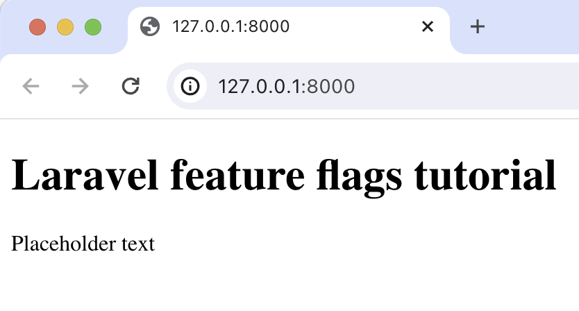

import { ProductScreenshot } from 'components/ProductScreenshot'
import EventsInPostHogLight from '../images/tutorials/laravel-feature-flags/events-light.png'
import EventsInPostHogDark from '../images/tutorials/laravel-feature-flags/events-dark.png'
import CreateFlagLight from '../images/tutorials/laravel-feature-flags/create-flag-light.png'
import CreateFlagDark from '../images/tutorials/laravel-feature-flags/create-flag-dark.png'
import FlagCaptureLight from '../images/tutorials/laravel-feature-flags/flag-capture-light.png'
import FlagCaptureDark from '../images/tutorials/laravel-feature-flags/flag-capture-dark.png'

[Feature flags](/feature-flags) help you conditionally roll out and release features safely. This tutorial shows you how integrate them in Laravel using PostHog. 

We'll create a basic Laravel app, add PostHog, create a feature flag, and then implement the flag to control content in our app.

## 1. Create a basic Laravel app

First, ensure [PHP](https://www.php.net/manual/en/install.php) and [Composer](https://getcomposer.org/) are installed. Then, create a new Laravel project called `laravel-feature-flags`:

```bash
composer create-project laravel/laravel laravel-feature-flags
cd laravel-feature-flags
```

Next, replace the code in `resources/views/welcome.blade.php` with a simple heading and paragraph:

```php file=resources/views/welcome.blade.php
<!DOCTYPE html>
<html>
<body>
  <h1>Laravel feature flags tutorial</h1>
  <p>{{ $paragraphText }}</p>
</body>
</html>
```

Replace the code in `routes/web.php` with a route to return our view:

```php file=routes/web.php
<?php

use Illuminate\Support\Facades\Route;

Route::get('/', function () {
    $paragraphText = 'Placeholder text';
    return view('welcome', ['paragraphText' => $paragraphText]);
});
```

Run `php artisan serve` and navigate to `http://127.0.0.1:8000` to see our app in action.



## 2. Add PostHog to your app

With our app set up, it’s time to install and set up PostHog. If you don't have a PostHog instance, you can [sign up for free](https://us.posthog.com/signup).

To start, run `composer require posthog/posthog-php` to install [PostHog’s PHP SDK](/docs/libraries/php).

Next, we initialize PostHog in the `boot` method of `app/Providers/AppServiceProvider.php`. Replace the existing code in that file with the following:

```php file=app/Providers/AppServiceProvider.php
<?php

namespace App\Providers;

use Illuminate\Support\ServiceProvider;
use PostHog\PostHog;

class AppServiceProvider extends ServiceProvider
{
    public function boot(): void
    {
        PostHog::init(
            '<ph_project_api_key>',
            [
                'host' => '<ph_instance_address>'
            ]
        );
    }
}
```

You can find your project API key and instance address in [your project settings](https://us.posthog.com/project/settings). 

Lastly, we [capture](/docs/product-analytics/capture-events) a `$pageview` event with PostHog in our route: 

```php file=routes/web.php
<?php

use Illuminate\Support\Facades\Route;
use PostHog\PostHog;

Route::get('/', function () {
    $paragraphText = 'Placeholder text';
    $distinctId = 'placeholder-user-id'; 

    PostHog::capture([
        'distinctId' => $distinctId,
        'event' => '$pageview'
    ]);

    return view('welcome', ['paragraphText' => $paragraphText]);
});
```

With this set up, restart your app and then refresh your browser a few times. You should now see the captured event in your [PostHog activity tab](https://us.posthog.com/events).

<ProductScreenshot
  imageLight={EventsInPostHogLight} 
  imageDark={EventsInPostHogDark} 
  alt="Events captured in PostHog" 
  classes="rounded"
/>

## 3. Create a feature flag in PostHog

With PostHog set up, your app is ready for feature flags. To create one, go to the [feature flags tab](https://us.posthog.com/feature_flags) in PostHog and click **New feature flag**. Enter a flag key (like `my-cool-flag`), set the release condition to roll out to 100% of users, and press "Save."

<ProductScreenshot
  imageLight={CreateFlagLight} 
  imageDark={CreateFlagDark} 
  alt="Feature flag created in PostHog" 
  classes="rounded"
/>

You can customize your [release conditions](/docs/feature-flags/creating-feature-flags#release-conditions) with rollout percentages, and [user](/docs/product-analytics/user-properties) or [group properties](/docs/product-analytics/group-analytics) to fit your needs.

## 4. Implement the flag code

To implement the feature flag, we: 

1. Fetch the `my-cool-flag` flag using [`PostHog::isFeatureEnabled()`](/docs/libraries/php#feature-flags). 
2. Update the paragraph text based on whether the flag is enabled or not.

```php file=routes/web.php
// rest of your code

Route::get('/', function () {
    $paragraphText = 'Placeholder text';
    $distinctId = 'placeholder-user-id'; 

    $isFlagEnabled = PostHog::isFeatureEnabled(
        'my-cool-flag',
        $distinctId,
    );
    if ($isFlagEnabled) {
        $paragraphText = "Flag enabled!";
    } else {
        $paragraphText = "Flag disabled!";
    }

    // rest of your code
});
```

When you restart your app and refresh the page, you should see the text updated to `Flag enabled!`. 

> **💡 Setting the correct `distinctId`:**
> 
> You may notice that we set `$distinctId = 'placeholder-user-id'` in our flag call above. In production apps, to ensure you fetch the correct flag value for your user, `distinctId` should be set to their unique ID. 
> 
> For logged-in users, you typically use their email or user ID as their `distinctId`. For logged-out users, assuming they made their request from a browser, you can use values from their request cookies. See an example of this in our [Nuxt feature flags tutorial](/tutorials/nuxt-feature-flags#setting-the-correct-distinctid).

## 5. Include the flag when capturing your event

To ensure any captured events are associated with the correct flag value, we need to include our flag information when capturing them. This enables us to breakdown [insights](/docs/product-analytics/insights) by feature flag value.

To do this for our `$pageview` event, we add the [`$feature/my-cool-flag`](/docs/libraries/php#step-2-include-feature-flag-information-when-capturing-events) key to our event properties when capturing:

```php file=routes/web.php
// rest of your code

Route::get('/', function () {

    // rest of your code

    PostHog::capture([
        'distinctId' => $distinctId,
        'event' => '$pageview',
        'properties' => [
            '$feature/my-cool-flag' => $isFlagEnabled
        ]
    ]);

    return view('welcome', ['paragraphText' => $paragraphText]);
});
```

Now when your event is captured, you should see the flag value in the event details in PostHog:

<ProductScreenshot
  imageLight={FlagCaptureLight} 
  imageDark={FlagCaptureDark} 
  alt="Flag details in event in PostHog" 
  classes="rounded"
/>

## Further reading

- [How to set up one-time feature flags](/tutorials/one-time-feature-flags)
- [How to set up A/B tests in Laravel](/tutorials/laravel-ab-tests)