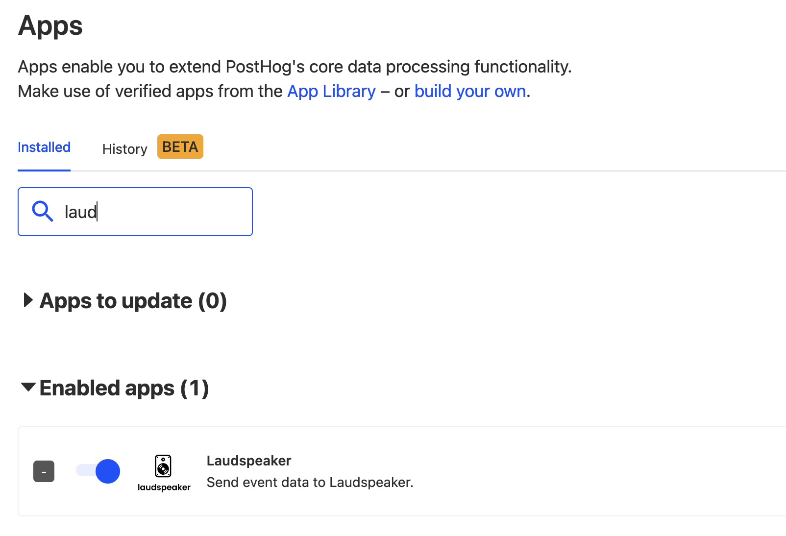
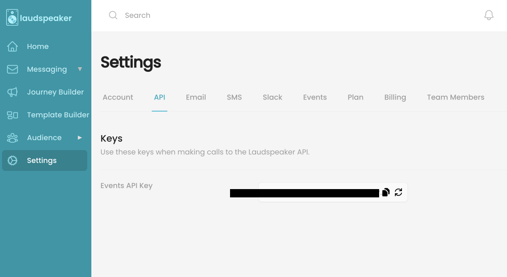
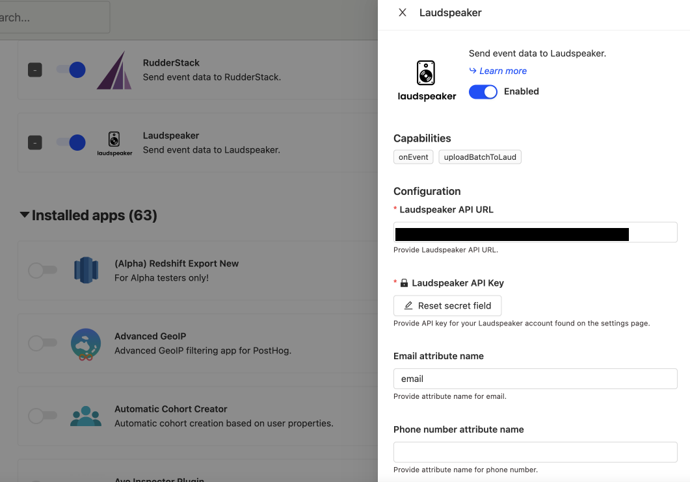
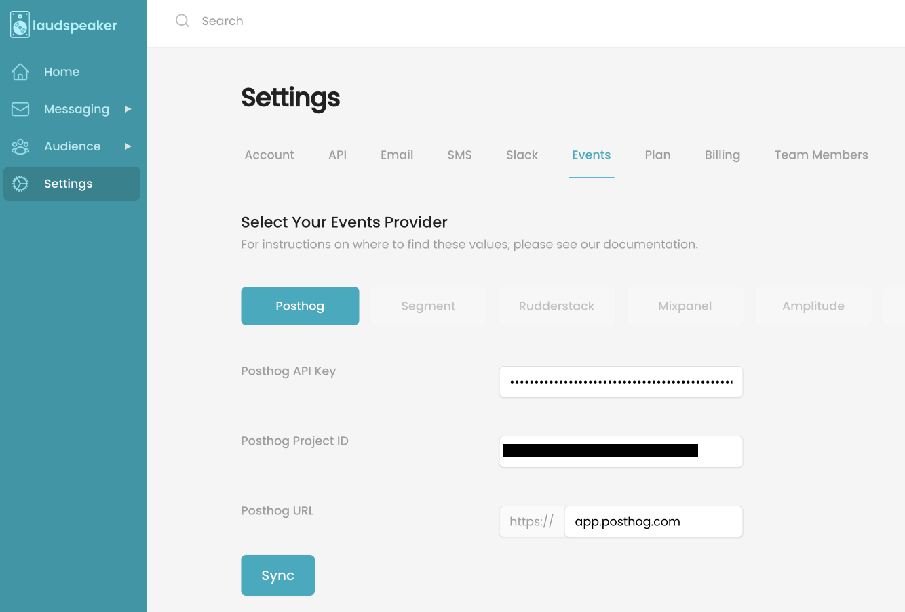
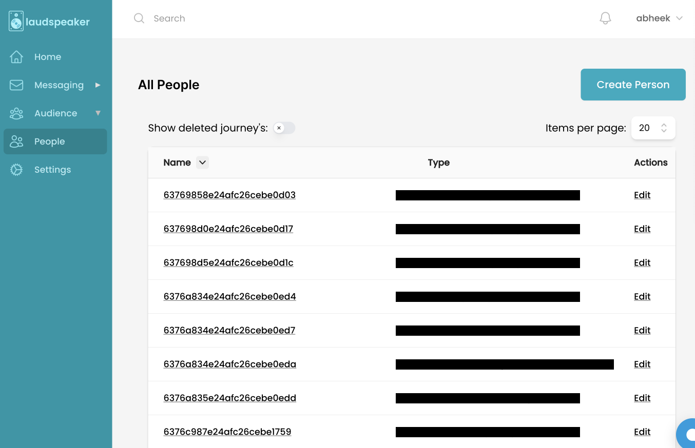
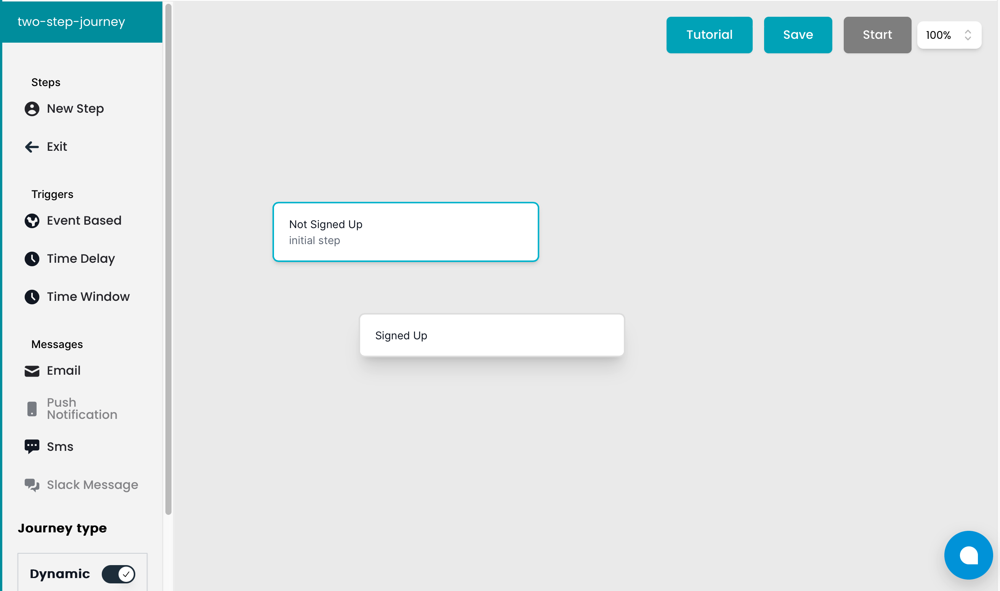
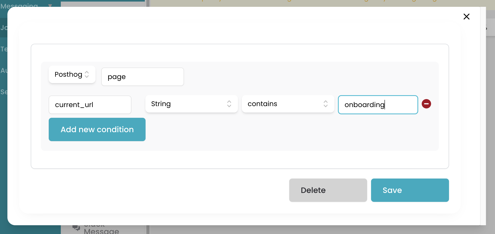
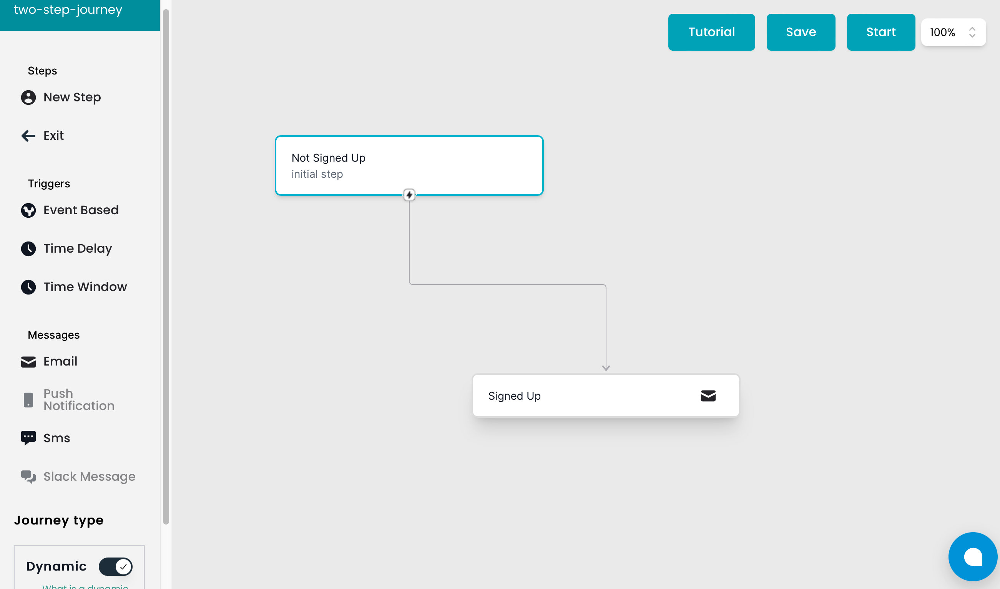

> 
Open this tutorial in PostHog and follow along step-by-step!
 <CallToAction href="https://app.posthog.com/#panel=docs:/tutorials/laudspeaker-posthog" size="sm" className="mt-auto self-start sm:w-auto !w-full">Launch tutorial</CallToAction>

Laudspeaker is a cross-channel customer messaging platform and an open source alternative to platforms such as Customer.io, Braze, or Iterable. It enables you to create automated customer journeys so your users receive messages when they complete specific actions on your site. 

Given that Laudspeaker and PostHog are both open source, and both track events across your product, integrating them can be especially powerful. Using the [Laudspeaker Connector](/apps/laudspeaker-connector), you can trigger a wide variety of customer journeys based on PostHog events including:

- Automated onboarding flows triggered by sign-up events
- Ecommerce re-engagement journeys based on incomplete purchases
- Renewal journeys when a users' subscription or trial is coming to an end

In this tutorial we explain how to connect PostHog and Laudspeaker to create a simple customer journey. To get started you need a Laudspeaker account and a PostHog instance.

## Connecting PostHog and Laudspeaker

### Step 1: Install the Laudspeaker connector

To start, go to the Apps section of your PostHog instance, search for and install the Laudspeaker Connector. 

To configure the connector correctly, you need to supply the Laudspeaker endpoint. If you are self-hosting Laudspeaker, this is under your domain, otherwise it is `app.laudspeaker.com/events/posthog`.

You also need to enter a Laudspeaker API key, which can be found in your Laudspeaker settings:

Finally, you need to supply the name of your email property in PostHog, so Laudspeaker knows what a users' email address is. Typically, this is saved under property names such as `email`, `$email`, or `Email`. 

### Step 2: Import your customers to Laudspeaker

If you'd like to import your existing users into Laudspeaker, go to your Settings and navigate to PostHog. You can optionally skip this step, if you prefer.

You need to add your PostHog API key and project ID, both of which can be found in PostHog's settings page. Once added, click Sync.

Once Laudspeaker and PostHog are synced, users in PostHog become available in Laudspeaker and are visible under the People page. 

## Creating your first journey

Laudspeaker makes it simple to create new customer journeys via the Journey Builder. There are existing templates to work with, or you can start from scratch. 

All Laudspeaker journeys are composed of three parts: steps, triggers, and messages. A simple example is a welcome email sent to new users when PostHog captures a signup event.

### Step 1: Create steps

In Laudspeaker, create two steps for your users:

- `Not signed up`, to be used before a user signs up
- `Signed up`, to be used once a user has signed up

### Step 2: Configure triggers

Next, connect a trigger to to the `Not signed up` step and configure it so that users receive a welcome message when they sign up. We assume this event is sent when users view the `/onboarding` page for the first time.

- Click the first step, then select an event-based trigger
- Select PostHog, then the `pageview` event
- Add conditions to the event and specify that the `current_url` string contains `/onboarding`

Now, when a user navigates to a page with `/onboarding` in its URL for the first time, that user moves from the `Not Signed Up` step to the `Signed up` step in this journey. 

Add an email template to the `signed up` step and Laudspeaker sends that email when the step is triggered. Hit Save then Start to activate the journey. 

PostHog can track many more events, including custom-defined actions. Laudspeaker supports these too, enabling you to create a wide range of customer journeys. Check [the official Laudspeaker website](https://laudspeaker.com/) for more information about what's possible, or [ask a question via the PostHog community](/questions).
