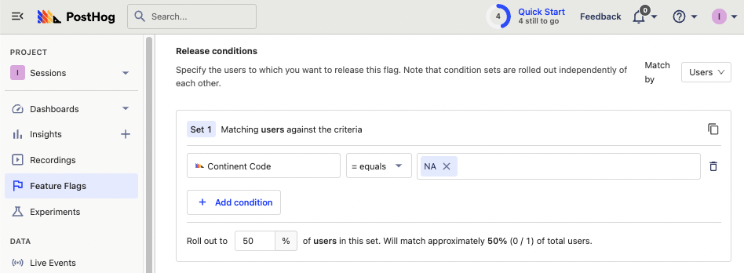
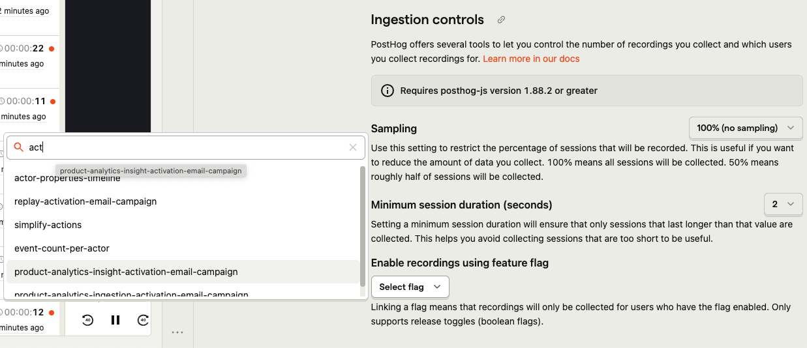
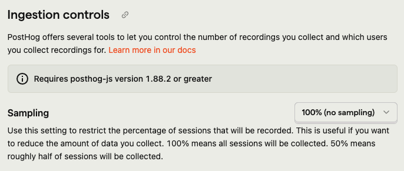
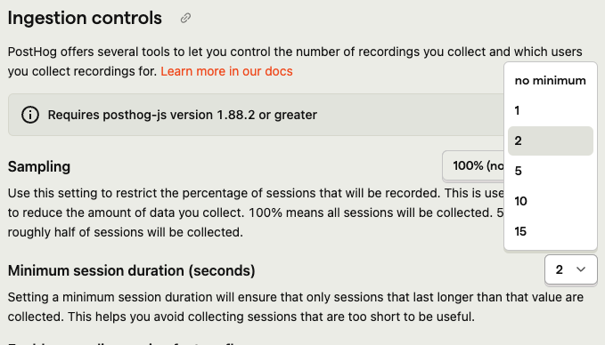

Session replays help you get a deep understanding of how users are using your product. We strongly recommend them for [early-stage startups](/blog/early-stage-analytics), but as you scale, the number of recordings can go beyond what you need.

Instead of turning session replays off entirely, you can use PostHog’s configuration options to only record the sessions you want. This tutorial shows you three ways to do this. 

## Configuration and basic session replay controls

In order to follow this tutorial, you need to set `disable_session_recording` to `true` in PostHog's initialization. For example, in a Next.js app, this looks like this:

```js
// pages/_app.js
import posthog from "posthog-js"
import { PostHogProvider } from 'posthog-js/react'

if (typeof window !== 'undefined') {
  posthog.init('<ph_project_api_key>', {
    api_host: '<ph_instance_address>',
    disable_session_recording: true,
  })
}

export default function App({ Component, pageProps }) {
  return (
    <>
      <PostHogProvider client={posthog}>
        <Component {...pageProps} />
      </PostHogProvider>
    </>
  )
}
```

You can then use PostHog’s `startSessionRecording()` method to trigger a session replay at the right moment. As a basic example, we can use the initialization `loaded` method to start a session replay when the environment isn’t set to `development`.

```js
//...
if (typeof window !== 'undefined') {
  posthog.init('<ph_project_api_key>', {
    api_host: '<ph_instance_address>',
    disable_session_recording: true,
    loaded: (posthog) => {
      if (process.env.NODE_ENV != 'development') posthog.startSessionRecording()
    }
  })
}
//...
```

## Control recordings with feature flags

Alternatively, you can use feature flags to control what sessions you record. This enables you to control the recording of sessions based on: 

- people properties
- group properties
- cohorts
- percentages of each of these (or all users)

For example, if you only want to record 50% of sessions for North American users, set up a feature flag where the continent code equals "NA" and roll it out to 50% of matching users like this:



### Using linked feature flags

You can then set this flag to enable recordings in your [replay ingestion settings]( https://us.posthog.com/settings/project-replay#replay-ingestion).



Recordings buffer on the client until the decide response is received. It only continues recording if the flag is enabled. This means that if the flag is disabled, the recording stops and no recording data leaves the client's device.

### Manually in your code

You can alternatively check this flag after you initialize PostHog, and start a recording if it is active for the current user. To ensure the correct user and flag details, you can use the `usePostHog` and `useFeatureFlagEnabled` hooks from `posthog-js/react` in a component like this:

```js
import { useFeatureFlagEnabled, usePostHog } from 'posthog-js/react'

export default function Home() {
  const posthog = usePostHog()
  
  if (useFeatureFlagEnabled('record-na')) {
    posthog.startSessionRecording()
  }

  return (
    <>
      <p>Record this page</p>
    </>
  )
}
```

### Evaluating the flag on load

If you want to evaluate flags as soon as PostHog loads, you can use the `loaded` method in the initialization options. Make sure to use the `onFeatureFlags` method to ensure flags are loaded before evaluating it.

```js
// pages/_app.js
if (typeof window !== 'undefined') {
  posthog.init('<ph_project_api_key>', {
    api_host: '<ph_instance_address>',
    disable_session_recording: true,
    loaded: (posthog) => {
      posthog.onFeatureFlags((flags) => {
        if (posthog.isFeatureEnabled('record-na')) posthog.startSessionRecording()
      })
    }
  })
}
//...
```

> **Note:** When evaluating flags for a new user, person properties won't be available until ingestion. This means flags depending on person properties won't evaluate correctly if done in the `loaded` method. GeoIP properties (like continent code, country, and city name) will work because they don't depend on ingestion. To make flags with person properties work here, use bootstrapping.

## Record on specific pages

You can start recordings on specific pages by calling `startSessionRecording()` when those pages first load.

Using the router, you can check which page users are going to and set session replays to start once they route to the page you want.

```js
import { useEffect } from "react"
import { usePostHog } from "posthog-js/react"

export default function About() {
  const posthog = usePostHog()

  useEffect(() => {
    posthog.startSessionRecording()
  }, []);

  return (
    <>
      <p>Record this page</p>
    </>
  )
}
```

> **Note:** you could use the router, but `next/router` (and others) don’t trigger on the initial page load. The recording would trigger when a user goes to the page through the router, but not if they go to the page directly.

## Record after specific user behavior

Finally, you can have recordings start on any user action, such as button clicks, inputs, hovers, and even scrolling. This is as simple as calling `startSessionRecording()` when a user completes those actions.

```js
import { usePostHog } from 'posthog-js/react'

export default function Home() {
  const posthog = usePostHog()

  return (
    <>
      <p>Record this page</p>
      <button onClick={() => posthog.startSessionRecording()}>
        Start recording
      </button>
    </>
  )
```

This is useful if you want to record specific parts or paths on a page such as:

- signup, checkout funnels
- new or updated features
- smaller, specific components within a larger component.

# Sampling

You can configure sampling to limit the number of sessions you record for each user. This is useful if you want to record a percentage of sessions for all users. Sampling helps reduce the number of sessions you record, but it doesn’t let you control which sessions are included.

Our recommendation is to start with no sampling (e.g. 100% - the default) or a low sampling rate (e.g. 90% or 95%) and increase it as needed. This helps you get a sense of how many sessions you’re recording and how much data you’re collecting.




Whenever a new session starts after you have selected a collection below 100% the browser will generate a random number between 0 and 1. If the number is less than the sampling rate (e.g. 0.9 when set to 90%), the session will be recorded. If it is greater than the sampling rate, the session will not be recorded.

# Minimum duration

You can also set a minimum duration for sessions to be recorded. This is useful if you want to exclude sessions that are too short to be useful. For example, you might want to exclude sessions that are less than 2 seconds long to avoid recording sessions where users quickly bounce off your site.



The minimum duration is set in seconds. Whenever a new session starts, the browser records the start time. When deciding whether to send recording data to the backend if the minimum duration has passed since the start time, the session data will be sent. If it hasn't, the session will continue to be buffered in-memory. 

### Limitations

This means that if you set a high minimum duration and your user visits multiple pages each for a short time you will still record the session but will miss the beginning. If the user leaves the site before the minimum duration has passed, the session will not be recorded.

If you find you are missing the beginning of sessions, you can reduce the minimum duration or use one of our other methods to reduce the number of sessions you record.

## Further reading

- [How to capture fewer unwanted events](/tutorials/fewer-unwanted-events)
- [How to use session replays to get a deeper understanding of user behavior](/tutorials/explore-insights-session-recordings)
- [How to use session replays to improve your support experience](/tutorials/session-recordings-for-support)