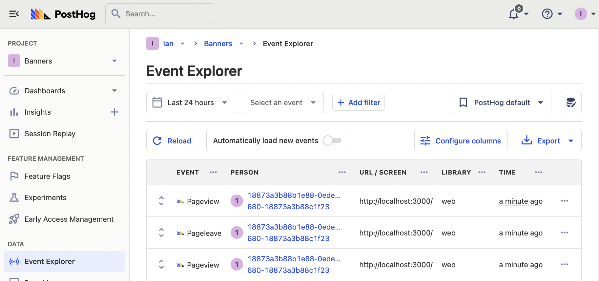
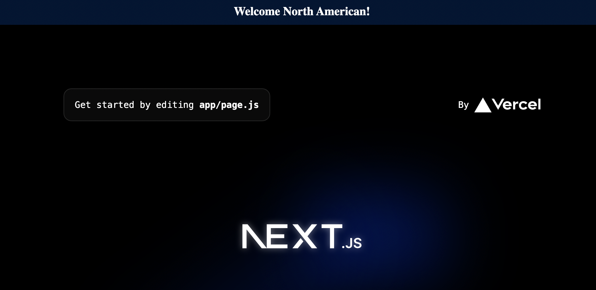

Many sites want to set up banners to display information for different users, such as regional announcements or country-based alerts. Doing this with [feature flags](/docs/feature-flags) is simple and this tutorial shows you how to set it up for a Next.js app (but it can be done with any framework).

## Create a Next.js app

The first step is creating a basic app, which we Next.js to do. Run the script below, choose no to using TypeScript, yes to using the app router, and the defaults for everything else.

```bash
npx create-next-app@latest banner
```

Next, go into your `banner` folder and install `posthog-js`.

```bash
cd banner
npm i posthog-js
```

After installing PostHog, create a `providers.js` file in the `app` folder which contains the PostHog initialization with your project API key and instance address (you can get both in [your project settings](https://app.posthog.com/project/settings))

```js
// app/providers.js
'use client'
import posthog from 'posthog-js'
import { PostHogProvider } from 'posthog-js/react'

if (typeof window !== 'undefined') {
  posthog.init(
    '<ph_project_api_key>',{
      api_host:'<ph_client_api_host>'
    }
  )
}

export default function PHProvider({ children }) {
  return <PostHogProvider client={posthog}>{children}</PostHogProvider>
}

```

Once we created the provider, we can add it to our `layout.js` file.

```js
// app/layout.js
import './globals.css'
import Providers from './providers'

export default function RootLayout({ children }) {
  return (
    <html lang="en">
      <Providers>
        <body>{children}</body>
      </Providers>
    </html>
  )
}
```

Finally, we can run the app with `npm run dev`. When we go to the page running locally, we see events captured into our PostHog instance.



## Set up the banner feature flag

First, make sure that the [GeoIP app](https://app.posthog.com/project/apps?name=geoip) is enabled (it should be by default).

Once you have confirmed that, we can create our feature flag controlling the site banner. Go to [feature flags](https://app.posthog.com/feature_flags), click "Create new flag," and name the key as "site-banner." For release conditions, match users where the continent code equals NA (or whichever geography you want), roll out to 100% of users, and press save.


### Adding a flag payload

Optionally, we can edit the flag to add a payload with content and a link. We can then access this payload when we implement the banner.

```json
{
   "title": "Greetings North American",
   "link": "http://posthog.com/"
}
```

This enables us to change the banner content without rewriting any code, just editing the flag payload in PostHog.

## Implementing the banner in our app

With our flag created, we can go back into our app and implement our banner. To do this, create a `banner.js` file in the `app` folder. In this file, import `useFeatureFlagEnabled` from `posthog-js/react`, use it to check the `site-banner` flag, and set up your banner to conditionally show if the flag is true. With some banner styling, this looks like this:

```js
// app/banner.js
'use client'
import { useFeatureFlagEnabled } from 'posthog-js/react'

export default function Banner() {

  const flagEnabled = useFeatureFlagEnabled('site-banner')

  return (
    <>
      {flagEnabled && (
        <div style={{ 
          backgroundColor: '#0071ff33',
          color: '#ffffff',
          textAlign: 'center',
          padding: '10px',
        }}>
          <p style={{
            fontSize: '18px',
            fontWeight: 'bold',
          }}>
            Welcome North American!
          </p>
        </div>
      )}
    </>
  )
}
```

With the banner set up, we import and add it to our `layout.js` file.

```js
// app/layout.js
import './globals.css'
import Providers from './providers'
import Banner from './banner'

export default function RootLayout({ children }) {
  return (
    <html lang="en">
      <Providers>
        <Banner />
        <body>{children}</body>
      </Providers>
    </html>
  )
}
```

When we go to our locally running site now, we should see our new banner at the top of our page.



### Handling the flag payload

If you added a payload to your flag, you can set up your banner to handle it. We must change `useFeatureFlagEnabled` for `useFeatureFlagPayload`, and then add the variables you get from the payload to your component.

```js
// app/banner.js
'use client'
import Link from 'next/link'
import { useFeatureFlagPayload } from 'posthog-js/react'

export default function Banner() {

  const flagPayload = useFeatureFlagPayload('site-banner')

  return (
    <>
      {flagPayload && (
        <div style={{ 
          backgroundColor: '#0071ff33',
          color: '#ffffff',
          textAlign: 'center',
          padding: '10px',
        }}>
          <p style={{
            fontSize: '18px',
            fontWeight: 'bold',
          }}>
            <Link href={flagPayload.link}>
              {flagPayload.title}
            </Link>
          </p>
        </div>
      )}
    </>
  )
}
```

With this, we have full control of the visibility and content of our site banner from the feature flag in PostHog.

## Further reading

- [How to set up one-time feature flags](/tutorials/one-time-feature-flags)
- [How to bootstrap feature flags in React and Express](/tutorials/bootstrap-feature-flags-react)
- [How to add popups to your React app with feature flags](/tutorials/react-popups)
