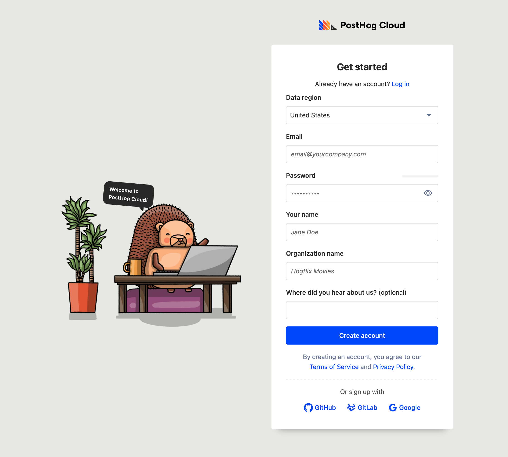

import MigratingEvents from "../docs/migrate/snippets/migrating-events.mdx"

> **Warning:** Migrating event data to PostHog's EU Cloud is a time-consuming process, likely to take several days or weeks. We strongly recommend users with a large amount of event data begin by setting up and connecting a new EU cloud instance and migrating data later, if needed.

For many companies, teams, and products, keeping customer data within the EU is critical for compliance with regulations such as GDPR. To help them with this, we’ve created an EU Cloud hosting option. It includes all the features of PostHog, with data being hosted in the EU (specifically Germany).

Why this matters is that the EU has stricter data privacy laws than other areas. In the EU, there are often stricter requirements for what companies can and can’t do with customer data. For example, there is less regulation in the US on data privacy. To understand how this applies to your company and data, you should check with a legal professional.

For this tutorial, we will go over how to migrate from US Cloud or self-hosting to EU Cloud. This process might take a while.

## Signing up for EU Cloud

The first step in migrating to EU Cloud is having an EU Cloud PostHog instance. Even if you have an existing PostHog Cloud instance, you need to create a new one. It is not possible (right now) to change your account between US Cloud (all cloud instances before this launch) or self-hosting and EU Cloud. Instead, you must create a new account and then migrate data to the new account.

> **Note:** If you are migrating from a Cloud instance, you'll need to manually recreate your insights, dashboards, feature flags, and other non-event data in EU Cloud. These won’t be migrated over from your US Cloud instance. Only events, persons, and other data derived from events are migrated through this process. Self-hosted instance users can use the [migrate metadata script](https://github.com/PostHog/posthog-migrate-meta) to migrate this data into EU Cloud.

To start with EU Cloud, you can go to the [cloud signup page](https://app.posthog.com/signup), enter your details, and be sure to select European Union as your data region.

## Migrating events using the Replicator Plugin

<MigratingEvents/>

## Finished complete migration

Once the Replicator is set up, you’ll have your data and events in your new EU Cloud instance. To complete your migration, follow the steps below.

1. Ensure the events you want are there. Check that EU Cloud data (events, persons, and other data derived from events) matches your self-hosting or US Cloud instance.
2. Switch your project key and host to your EU Cloud information. The Replicator app will continue to run, and replicating events over with a delay, but changing your project key and host is better and faster.
3. Recreate your insights, dashboards, feature flags, and other non-events data in EU Cloud (run the [metadata migrator app](https://github.com/PostHog/posthog-migrate-meta)).
4. If necessary for compliance, delete data from your US Cloud or self-hosted PostHog instance.

Once all these are completed, you’ll be fully migrated to EU Cloud.
