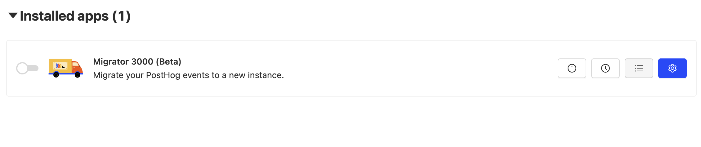
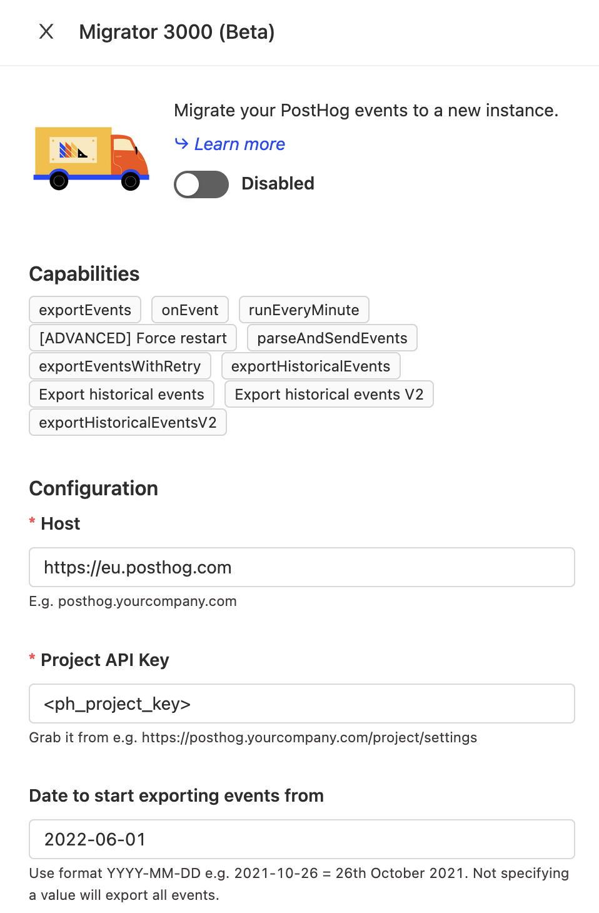

> **Warning:** Migrating event data to PostHog's EU Cloud is a time consuming process, likely to take several days or weeks, and there is currently no way to migrate insights or dashboards. We strongly recommend that users with a large amount of event data begin by creating a new EU cloud instance and migrate data at a later point, if strictly needed. 

For many companies, teams, and products, keeping customer data within the EU is critical for compliance with regulations such as GDPR. To help them with this, we’ve created an EU Cloud hosting option. It includes all the features of PostHog, with data being hosted in the EU (specifically Germany).

Why this matters is that the EU has stricter data privacy laws than other areas. In the EU, there are often stricter requirements for what companies can and can’t do with customer data. For example, there is less regulation in the US on data privacy. To understand how this applies to your company and data, you should check with a legal professional.

For this tutorial, we will go over how to move data you currently have in either US Cloud or self-hosting to EU Cloud. This process might take a while.

## Signing up for EU Cloud

The first step in migrating to EU Cloud is having an EU Cloud PostHog instance. Even if you have an existing PostHog Cloud instance, you need to create a new one. It is not possible (right now) to change your account between US Cloud (all cloud instances before this launch) or self-hosting and EU Cloud. Instead, you must create a new account and then migrate data to the new account.

> **Note:** You'll need to manually recreate your insights, dashboards, and feature flags in EU Cloud. These won’t be migrated over from your US Cloud or self-hosted instance. Only events, persons, and other data drived from events is migrated through this process.

To start with EU Cloud, you can go to the [cloud signup page](https://app.posthog.com/signup), enter your details, and be sure to select European Union as your data region.

## Using Migrator 3000

Once you’ve created your EU Cloud account, you can immediately start migrating data there. To do this, in your original PostHog instance (either Cloud or self-hosted), go to Apps and search for the [Migrator 3000 app](/docs/apps/migrator-3000). This app moves data from one PostHog instance to another. Once you've found and added it, click the blue “Configure” button to start.

In the configuration menu, enter the project key and host (`eu.posthog.com`) from your EU Cloud instance settings. If you don’t want to import all the events, you can also set a date limit.

After clicking save, the Migrator 3000 app will start running. You can view its progress in Logs (three points icon). This will take a while, so be prepared to wait.

## Finished complete migration

Once the Migrator 3000 is finished, you’ll have your data and events in your new EU Cloud instance. To complete your migration, follow the steps below. 

1. Ensure the events you want are there. Check that EU Cloud data (events, persons, and other data drived from events) matches your self-hosting or US Cloud instance.
2. Switch your project key and host to your EU Cloud information. The migrator app will continue to run, and bring events over with a delay, but changing your project key and host is better and faster.
3. Recreate your insights, dashboards, and feature flags in EU Cloud. These won’t be migrated over from your US Cloud or self-hosted instance.
4. If necessary for compliance, delete data from your US Cloud or self-hosted PostHog instance.

Once all these are completed, you’ll be fully migrated to EU Cloud.

## Further reading

For more information about migration, check out our [docs](/docs/migrate/migrate-between-cloud-and-self-hosted).
