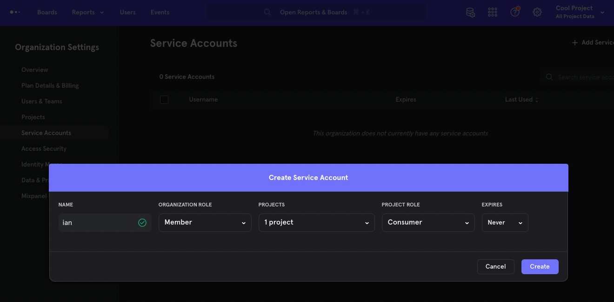
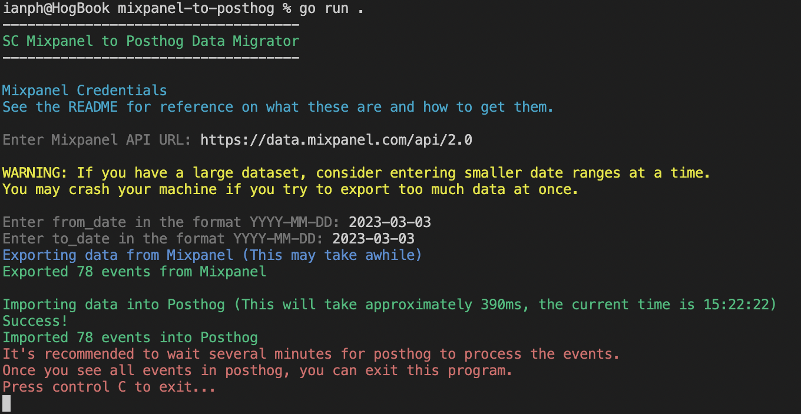
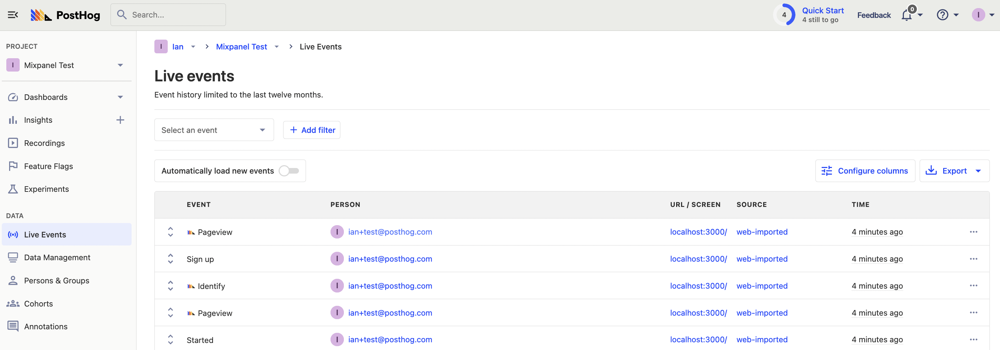

PostHog is a great [alternative to Mixpanel](/blog/best-mixpanel-alternatives), especially if you want to replace other tools for session replay and A/B testing.

In this tutorial, we'll walk through how to pull, format, and ingest data from Mixpanel into PostHog.

> Curious about the similarities and differences between the two platforms? Read our comparison of [PostHog vs Mixpanel](/blog/posthog-vs-mixpanel).

To get started, you'll need both a Mixpanel account with data and a PostHog instance. We will use [a tool](https://github.com/stablecog/mixpanel-to-posthog), built by the team at [Stablecog](https://stablecog.com/), to migrate the data and users over.

## Gathering details

To start with, log in to Mixpanel and go to the project with the data you want to migrate. 

1. Create a service account. Go to "Organization Settings," click the "Service Accounts" tab, click the "Add Service Account" button, enter a name, then click "Create."
2. Hold on to the **username** and **secret** for now. 
3. You also need your **Project ID** which you can get from your "Project Settings."



Next, get the details for PostHog. 

1. Get your **project API key** from the getting started flow or your project settings. 
2. Create a **personal API key**. Go to your account settings (click the photo in the top right corner, then the gear next to your email), click the "Create personal API key" button, add a name, and press save.
3. Finally, note your **instance address** (either `https://app.posthog.com` or `https://eu.posthog.com` or a custom domain)

With all this, we are ready to set up the migration tool.

## Setting up the script

> **Note:** The Mixpanel to PostHog migration tool is a community-built tool. Test for yourself and use at your own risk.

Go to the [Mixpanel to Posthog Data Migrator repository](https://github.com/stablecog/mixpanel-to-posthog) and [clone the repo](https://docs.github.com/en/repositories/creating-and-managing-repositories/cloning-a-repository). Once done, go to the newly created `mixpanel-to-posthog` folder, create a `.env` file, and add the details you collected.

In our example, that is:
```
MIXPANEL_USERNAME=ian.a2b789.mp-service-account
MIXPANEL_PASSWORD=fCPFrpZYdzB9nlZ9kqabZcXuxSLKhjld
MIXPANEL_PROJECT_ID=2880604
POSTHOG_PROJECT_KEY=<ph_project_api_key>
POSTHOG_API_KEY=phx_lz19ZGZWrVcwZol6qLmIvHBBHzc9lQbvN8b3U2zVufZ
POSTHOG_ENDPOINT=<ph_instance_address>
```

Next, in the terminal, make sure you have [installed Go](https://go.dev/doc/install), then run the tool in the folder location.

```bash
go run .
```

This triggers some prompts about Mixpanel’s API URL, dates (to avoid rate limits and system crashes), and any data you missed. This should look like this:



Once successful, you can find your new data in your PostHog instance.



## What the tool is doing

If you are interested in writing your own script, or just want to learn more about how Mixpanel and PostHog work, here is what the tool is doing:

1. Load the details from the `.env` file and prompt for any missing details (like date range).
2. Make `GET` requests to the Mixpanel API using the details. 
3. Decode and format the response data from Mixpanel to one for PostHog. For example, change `Pageview` to `$pageview` and parse the properties. 
4. Return a "[slice](https://go.dev/tour/moretypes/7)" of formatted `MixpanelDataLine` instances. Basically, a list of formatted event objects ready to import into PostHog.
5. Loop through the "slice" of formatted `MixpanelDataLine` instances and use the PostHog Client (set up with the `.env` details) to capture events. 

## Further reading

- [What to do after installing PostHog in 5 steps](/tutorials/next-steps-after-installing)
- [Calculating average session duration, time on site, and other session-based metrics](/tutorials/session-metrics)
- [Get feedback and book user interviews with site apps](/tutorials/feedback-interviews-site-apps)