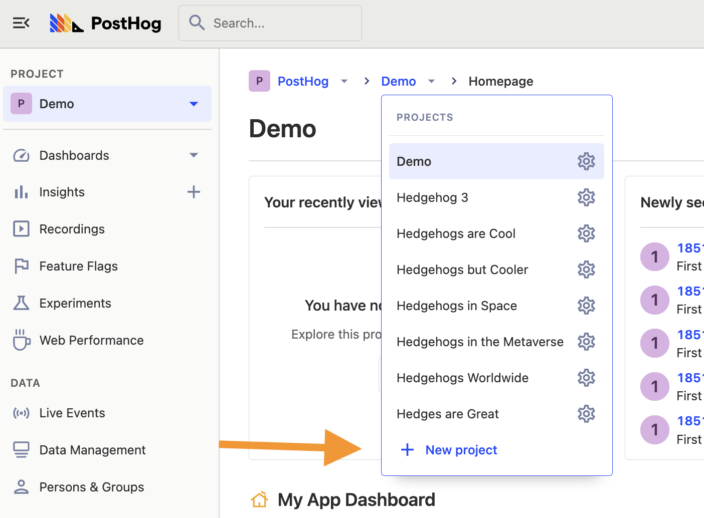
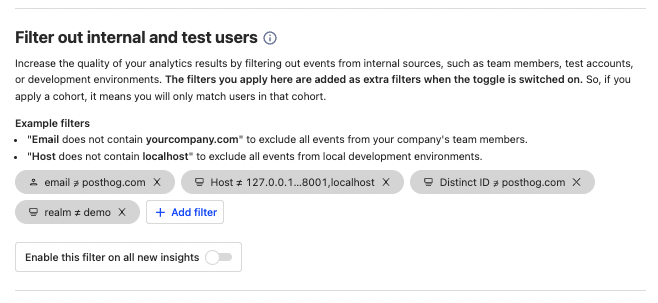

Many software development teams use environments to split up their code, such as development, staging, and production. This ensures changes in development don’t affect production, helps teams test before release, and increases the quality of code that reaches end users.

Using multiple environments requires splitting the data from each of them. If not, development and staging data combine with production data and can cause inaccuracy and issues. This tutorial goes over how to prevent those issues by setting up PostHog for use in multiple environments.

## Using multiple projects

The best practice for using PostHog with multiple environments is using multiple projects. This enables developers to test event capture and tools without ruining the data in production.

Creating new projects in PostHog is simple. In your instance, click your project name and then the “New project” button. Be sure to name your project to make it clear it is not production, like “development” or “staging.”



This takes you through the project setup flow again and gives you a new project API key. You can keep your old key for production, and replace it with the new one in the relevant environment. You'll likely need environment variables for this (like a `.env` file) if you haven't set those up. Doing this connects each of your environments to a different PostHog project.

The downside of using multiple projects is you cannot directly copy actions, dashboards, insights, experiments, feature flags, and other data created in PostHog between them. This means manually recreating them in each project if needed.

*Have strong opinions about how we handle environments? We’d love to get your support and feedback in the [relevant issue](https://github.com/PostHog/posthog/issues/13418).*

### Feature flags with multiple projects

Development and staging environments help test feature flags, but you must recreate the flags in each project to use them in separate environments. 

Luckily, creating a new flag is relatively simple. Make sure to use the same flag keys and variants between the projects, and they work the same. You also don’t have to worry about rollout percentages for test or staging environments (you can roll out to everyone on your team).

*We’re also gathering feedback on how to use feature flags with multiple projects. Leave your support and feedback in [the issue here](https://github.com/PostHog/posthog/issues/13160).*

## Conditional initialization

Another way to split up projects is by changing how you initialize PostHog based on the environment. For example, if you didn’t want to track your staging environment at all, initialize PostHog without a token and opt out of capturing immediately. This is what we do in our development environment.

```js
posthog.init(
    'fake token',
    {
      autocapture: false,
      loaded: function (ph) {
          ph.opt_out_capturing()
      }, 
    }
  )
```

The loaded method lets you run whatever checks you want, making it useful for changing PostHog's behavior between environments. You can see the full list of config options in [our JavaScript docs](/docs/integrate/client/js#config).

Another popular option is checking if the URL includes `localhost` or `127.0.0.1` (local IP) and opting out of capturing if so. If you were using the HTML snippet, this looks like:

```html
<script>
	  !function(t,e){var o,n,p,r;e.__SV||(window.posthog=e,e._i=[],e.init=function(i,s,a){function g(t,e){var o=e.split(".");2==o.length&&(t=t[o[0]],e=o[1]),t[e]=function(){t.push([e].concat(Array.prototype.slice.call(arguments,0)))}}(p=t.createElement("script")).type="text/javascript",p.async=!0,p.src=s.api_host+"/static/array.js",(r=t.getElementsByTagName("script")[0]).parentNode.insertBefore(p,r);var u=e;for(void 0!==a?u=e[a]=[]:a="posthog",u.people=u.people||[],u.toString=function(t){var e="posthog";return"posthog"!==a&&(e+="."+a),t||(e+=" (stub)"),e},u.people.toString=function(){return u.toString(1)+".people (stub)"},o="capture identify alias people.set people.set_once set_config register register_once unregister opt_out_capturing has_opted_out_capturing opt_in_capturing reset isFeatureEnabled onFeatureFlags".split(" "),n=0;n<o.length;n++)g(u,o[n]);e._i.push([i,s,a])},e.__SV=1)}(document,window.posthog||[]);
	  posthog.init('<ph_project_api_key>',{api_host:'<ph_instance_address>'})
	  if (location.hostname === "localhost" || location.hostname === "127.0.0.1") {
	    posthog.opt_out_capturing()
	  }
</script>
```

Setting this up correctly prevents capturing event data in non-production instances. It enables you to continue using the same insights, feature flags, and other PostHog tools in development and staging because you only use a single project for all your data.

> **Note:** If you are using multiple projects, be careful not opt out of capture unnecessarily. You can instead check for the environment and tune autocapture to capture the right data. You can learn about autocapture tuning in [our docs](https://posthog.com/docs/integrate/client/js#tuning-autocapture).

## Filtering internal and test users

The previous options capture data to separate projects or don’t capture data at all, but there is another option. This is to capture data normally and filter internal users from your analysis.

PostHog provides a toggle to filter internal users (as defined by you) from your analysis and visualization. To set up what users or events get filtered, go to project settings, scroll down to “Filter out internal and test users,” and add filters removing your internal users and events. This could include `distinct ID does not contain your domain`, `host is not local hosts`, and `environment is not development`. 

As an example, here’s what our filters look like at PostHog:



You can automatically enable filtering in all new insights with the toggle at the bottom, or enable it on insights manually each time.

> **Note:** Filtering internal and test users does not prevent the capture of data from these users (it still shows up in the event’s list for example).

## Further reading

- [How to capture fewer unwanted events](/fewer-unwanted-events)
- [What to do after installing PostHog in 5 steps](/next-steps-after-installing)
- [Setting up Django analytics, feature flags, and more with PostHog](/django-analytics)
