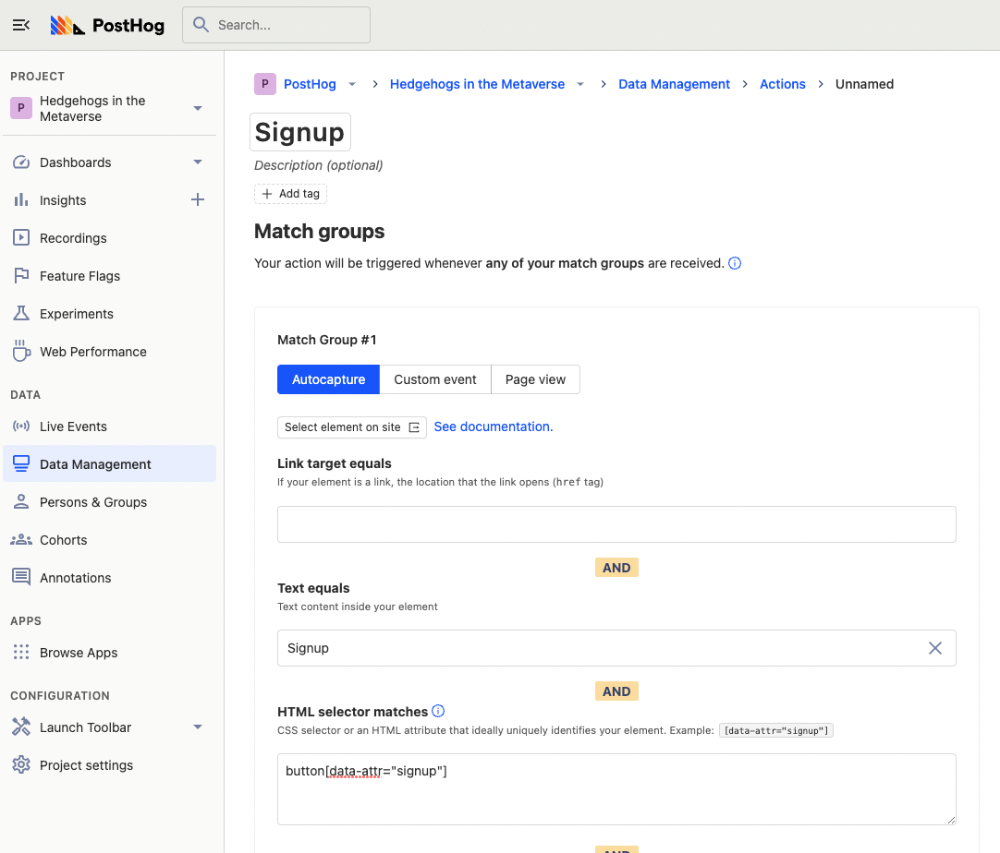
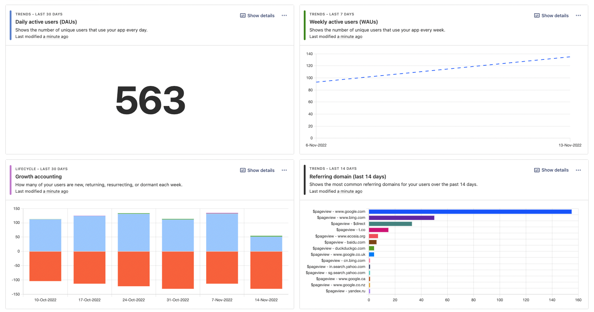
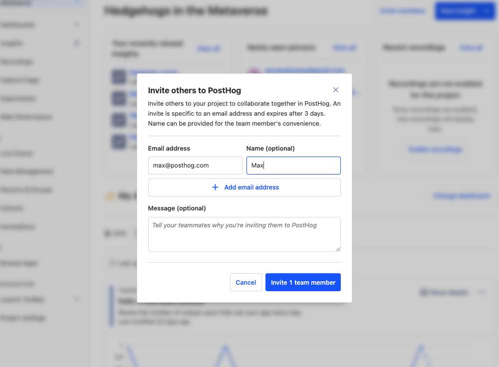
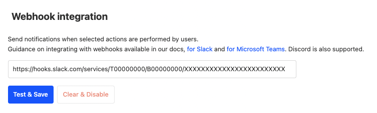
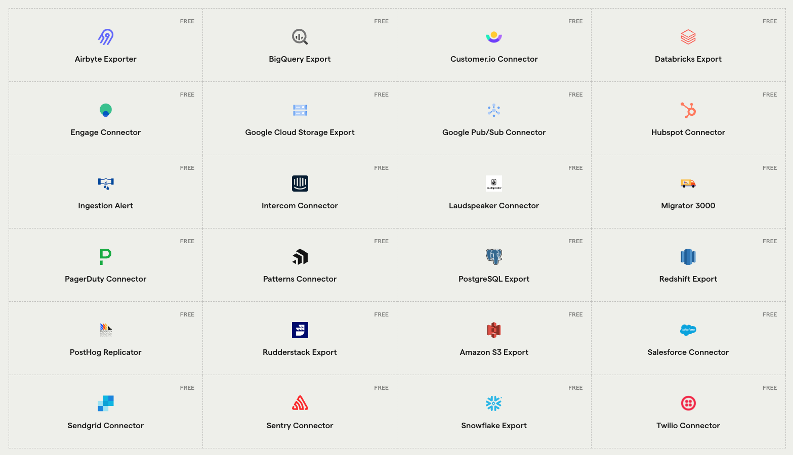
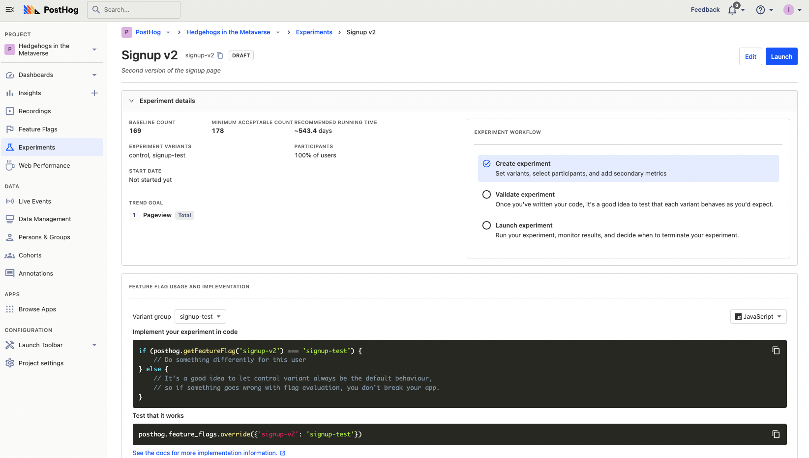

> <p align="center">Open this tutorial in PostHog and follow along step-by-step!</p> <CallToAction href="https://app.posthog.com/#panel=docs:/tutorials/next-steps-after-installing" size="sm" className="mt-auto self-start sm:w-auto !w-full">Launch tutorial</CallToAction>

You created a PostHog account and installed it on your site, but what’s next? This tutorial goes over what to do after signing up and installing PostHog (we are assuming you’ve done both).

## 1. Configure event capture

To get the best possible understanding of your product, you need as much data as possible. Capturing the most possible events helps you do this. PostHog makes it easy.

Autocapture is enabled by default if you've installed either [the PostHog snippet](/docs/integrate#snippet) or [`posthog-js`](/docs/integrate/client/js). That means your product will send pageviews, button clicks, inputs, and more to PostHog automatically. 

> With either of these installed, you can also **enable session recordings** in “Project Settings”, under "Recordings.”

If you are using [a different library](/docs/integrate#libraries) or the [API](/docs/api), you’ll need to implement event capture yourself. Luckily, our libraries make this easy, just a single call. Event capture calls look like this:

<MultiLanguage>

```js
posthog.capture(
  'movie_played', 
  { 
    movie_id: 'Return of the Hedgehogs', 
    category: 'thriller' 
  }
);
```

```php
PostHog::capture(array(
  'distinctId' => 'ian@posthog.com',
  'event' => 'movie_played',
  'properties' => array(
    'movie_id' => 'Return of the Hedgehogs',
    'category' => 'thriller'
  )
));
```

```ruby
posthog.capture({
  distinct_id: 'ian@posthog.com',
  event: 'movie_played',
  properties: {
    movie_id: 'Return of the Hedgehogs',
    category: 'thriller'
  }
})
```

```node
client.capture({
  distinctId: 'ian@posthog.com',
  event: 'movie_played',
  properties: {
      movie_id: 'Return of the Hedgehogs',
      category: 'thriller',
  },
})
```

```python
posthog.capture(
  'ian@posthog.com', 
  'movie_played', 
  {
    'movie_id': 'Return of the Hedgehogs',
    'category': 'thriller'
  }
)
```

```go
client.Enqueue(posthog.Capture{
  DistinctId: "ian@posthog.com",
  Event:      "movie played",
  Properties: posthog.NewProperties().
    Set("movie_id", "Return of the Hedgehogs").
    Set("category", "thriller"),
})
```

</MultiLanguage>

To figure out which events you should capture, think about which areas have the biggest impact on your product or [north star metrics](/blog/north-star-metrics). As a minimum, we recommend capturing events such as: 

- signups
- logins
- purchases and subscriptions
- feature usage
- page and component views

Once you've started capturing events, you can create actions (a combination of one or more events) to better represent user behavior. Actions are created in the “Data Management” section of the sidebar or interactively using the toolbar (click “Launch Toolbar” on the sidebar).



Be sure to add properties to your events to better capture variables such as the value, type, or version. For example, you might want to know which version of the product someone is using or if they are a customer or not. Properties can help you here, and you can set them for users as well. 

Finally, you may also want to connect to external services like [Stripe](/tutorials/stripe-payment-data) or [HubSpot](/apps/hubspot-connector) to get data. You can do that using [apps](/apps). To install an app, search for it in “browse apps,” then configure and activate it.

## 2. Build a dashboard

Once you’ve got events flowing in, you’ll want to use that data to better understand your product. Our insight tools like trends, retention, and funnels help you do this.

We recommend creating a dashboard of insights, instead of creating them one at a time. This allows you to get a better overall understanding of your product.

> As you create your dashboard, keep in mind what data you are capturing. If you are missing something, you can go to your product and add it.

Some recommendations include:

- Key product analytics: usage trends, feature conversion, daily/weekly active users, retention
- Website traffic: overall traffic, top-performing pages, traffic breakdowns, sources
- AARRR: signup trends, usage trends, customer retention, revenue growth trends, attribution table
- Company scorecard: key metric trends, signups, success rate trends, conversion funnels, revenue

> Want to create dashboards quickly? PostHog offers several templates to cover common areas of interest, such as website traffic. To use a template, select an option from the "Template" dropdown when creating a new dashboard.



Creating a dashboard will give you an understanding of the different types of insights you can create, from trends to retention. It will also help you refine the events you capture to better match what you want in your dashboard.

## 3. Invite your team

Now that you’ve set up PostHog with data and dashboards, your teammates can benefit from all your hard work. Inviting your teammates to PostHog allows you to share data, insights, and dashboards. Engineers, product managers, data analysts, markets, and executives can all benefit from this. It also helps in collaboration using our tools to improve your product.

To invite your teammates, go to your instance homepage, click the "Invite" button, and add their email. This will add them to your organization with access to all your projects.



To make sure they don’t mess up all your hard work, you can change their access levels in your organization settings. Setting them to “Member” will prevent them from deleting or changing the settings in your project or instances. You can also set up projects you don’t want others to access as private in the project settings. 

When working with others, you likely will want to [filter out](/tutorials/filter-internal-users) events they trigger when doing analysis. To set this up, go to ”Project Settings”, scroll down to “filter out internal and test users”  and add filters such as host does not include local development addresses and email does not include your company’s domain.


## 4. Create subscriptions to important events, actions, and dashboards

Once everyone’s onboard with PostHog, you'll want to keep data and insights top of mind to help you improve your product. To do this, you can send data and dashboards to your email, Slack, and other apps using webhooks and subscriptions.

If there are key events or actions you want to track, such as a potential customer visiting your pricing page, you can have it trigger a webhook. This requires setting up the webhook in the service of your choice (like [Slack](/docs/integrate/webhooks/slack), [Teams](/docs/integrate/webhooks/microsoft-teams), [Zapier](/tutorials/how-to-connect-posthog-and-notion-with-zapier), or [Discord](/docs/integrate/webhooks/discord)). You can then add the webhook to your PostHog instance in “Project Settings” under “webhook integration.” Finally, go to data management, create or select an action, then enable “post to webhook when this action is triggered.”



You can also subscribe to dashboards in Slack or via email. Just go to your dashboard, click the three dots to the left of share, click “subscribe,” and “new subscription.” If you want to send dashboards to Slack, you’ll need to configure our [Slack integration](/docs/libraries/slack). If you want dashboards by email, just fill in the details like the name, email, and recurrence, then click “create subscription.” 

Finally, if you want your data backed up or sent to an external service such as [BigQuery](/apps/bigquery-export), [S3](/apps/s3-export), or [Snowflake](/apps/snowflake-export), you can use one of our many [“data-out” apps](/apps). Just go to “browse apps,” search for the one you want, configure it, and start sending the data to the other places you want it.



## 5. Experiment to improve your product

Once you have some data, and you’ve had a chance to gain some insights from it, it’s time to start using those insights to improve your product. A great way to do this is with Experiments.

Experiments in PostHog help you test if changes improve your product in the ways you care about. They provide structure for your tests by requiring variants, participants (like [new users](/tutorials/new-user-experiments)), and goals.



Once created, PostHog creates feature flags for each variant (or you can run [experiments without them](/docs/experiments/running-experiments-without-feature-flags)). Once implemented and launched, PostHog will continuously analyze related event data to tell you if the changes are making a difference. At the end of the test, PostHog helps you decide if the experiment was successful and you can use feature flags to it roll out.

Read more about setting up and using experiments in [our product manual](/manual/experimentation).

## Further reading

- [The full documentation on the PostHog JavaScript SDK](/docs/integrate/client/js)
- [How to set up Next.js analytics, feature flags, and more](/tutorials/nextjs-analytics)
- [Complete guide to event tracking](/tutorials/event-tracking-guide)
- [Calculating average session duration, time on site, and other session-based metrics](/tutorials/session-metrics)
