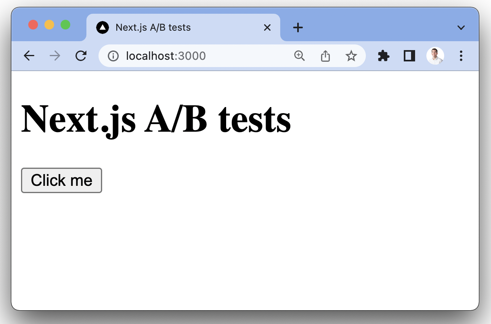
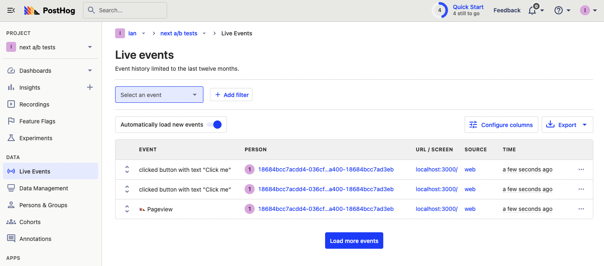
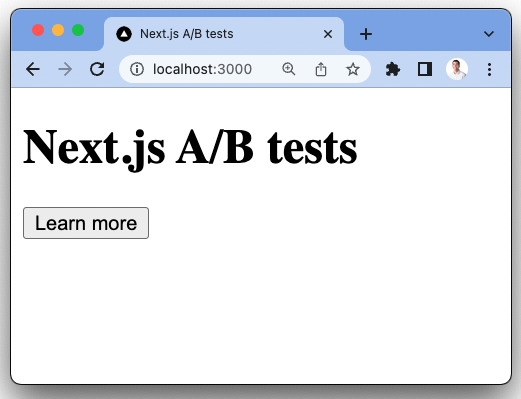

Many of the features of Next.js optimize for creating the best possible user experience. It automates and abstracts functionality like static page generation, image loading optimization, and optional server-side rendering, allowing you to focus on the content of your app.

A/B tests are a way to make sure this content performs as well as possible. A/B tests involve comparing two or more variations against a goal. The winner is the one which achieves the goal best and is then used to improve everyone's experience.

PostHog’s experimentation tool makes this entire process simple. This tutorial shows you how to build a basic Next.js app, add PostHog to it, and finally set up and run an A/B test experiment.

> Already have a Next.js app? [Skip to adding PostHog and setting up the A/B test](#adding-posthog).

## Creating a Next.js app

We will create a basic Next.js app with a simple button to run our test on. Check out [our full Next.js tutorial](/tutorials/nextjs-analytics) if you’re looking for more details on building a multi-page app with authentication, user identification, event capture, and more.

First, make sure [Node is installed](https://nodejs.dev/en/learn/how-to-install-nodejs/) (14.6.0 or newer), then create a Next.js app:

```bash
npx create-next-app@latest
```

Name it whatever you like (we call ours `next-ab`), select `No` for TypeScript, `No` for using the app router, and the defaults for the rest of the options.

Once created, go into the `next-ab` folder it creates, then go to `pages/index.js` and replace the code with just a heading and a button (which our A/B test runs on). 

```js
// pages/index.js
import Head from 'next/head'

export default function Home() {
  return (
    <>
      <Head>
        <title>Next.js A/B tests</title>
        <meta name="viewport" content="width=device-width, initial-scale=1" />
        <link rel="icon" href="/favicon.ico" />
      </Head>
      <main>
        <h1>Next.js A/B tests</h1>
        <button id="main-cta">Click me</button>
      </main>
    </>
  )
}
```

After doing this, delete the default CSS in the `styles` folder and run `npm run dev` to get an extremely basic Next.js app we can run our A/B tests on. 



## Adding PostHog

Now, we can add PostHog (if you don't have a PostHog instance, you can [sign up for free here](https://app.posthog.com/signup)). To do this, first, install `posthog-js` .

```bash
npm install posthog-js
```

In `_app.js`, we can then initialize PostHog and set up a provider that provides access to PostHog throughout our app. 

```js
// pages/_app.js
import { PostHogProvider } from 'posthog-js/react'
import posthog from 'posthog-js'

if (typeof window !== 'undefined') {
  posthog.init('<ph_project_api_key>', 
  { 
    api_host: '<ph_instance_address>'
  })
}

export default function App({ Component, pageProps }) {
  return (
    <PostHogProvider client={posthog}>
      <Component {...pageProps} />
    </PostHogProvider>
  )
}
```

Once you’ve done this, reload your app and click the button a few times. You should see this being captured in PostHog.



## Creating an action for our experiment goal

The first part of setting up our experiment in PostHog is setting up the goal. In this case, it is clicks of the main call to action button which has varying content.

To measure this, we can set up an [action](/manual/actions) using the PostHog toolbar. To enable and launch the toolbar, go to the "Launch Toolbar" tab in PostHog, add `http://localhost:3000/` as an authorized URL, then click launch. This brings you to your app with a PostHog icon hovering on your screen.

To create an action with the toolbar, click:

1. the PostHog icon
2. "Inspect" 
3. the "Click Me" button, 
4. "Create New Action" in the modal. 

Name the action "Clicked Main CTA" and unselect the text match (because it changes), then scroll to the bottom of the modal to create an action.


## Creating an experiment

With our Next.js app, PostHog, and our experiment goal set up, we can go into PostHog, and create a new experiment.

> Experimentation is a paid feature in PostHog, but is free to use up to 1M events and 15k session recordings per month.

In your PostHog instance, go to the experiments tab, click create a new experiment, and enter a name and key. We keep the defaults for variants and not use any filters (which means 100% of users see the experiment). Use the action we created earlier as our experiment goal. 


> **Note:** There must be at least one occurrence of the action for it to show as a goal, so make sure to click the button after creating the action.

Once we create the experiment, we can start to implement it. Come back and launch it later.

## Implementing our experiment

When it comes to implementing our experiment and its associated feature flags, there are a few options we can choose:

1. Bootstrap feature flags by using [`getInitialProps`](https://nextjs.org/docs/api-reference/data-fetching/get-initial-props) in `_app.js`
2. Server-side render feature flags in `index.js` using `posthog-node`.
3. Client-side render feature flags in `index.js`.

Because `getInitialProps` disables [Automatic Static Optimization](https://nextjs.org/docs/advanced-features/automatic-static-optimization) for the entire app (one of the main benefits of Next.js), we aren’t going to bootstrap feature flags (option 1). Instead, we use a combination of server-side and client-side rendering. This ensures the flags' accuracy and speed while still leveraging the unique benefits of Next.js.

### Client-side rendering feature flags

To client-side render the experiment using feature flags, we can use the `PostHogProvider` we set up earlier. This ensures PostHog is loaded when we check the flags.

In `index.js`, set up a state for the call to action button and a `useEffect()` to check the flag when the page loads.

To check the flag, import `useFeatureFlagEnabled` from `posthog-js/react`, use it to call the flag name (`main-cta`), and change the state of the button text to "Learn more" if `true`.

> **Note:** Use `posthog.featureFlags.override({'main-cta': 'test'})` to make sure it is working, but remove it when we go to release.

```js
// pages/index.js
import Head from 'next/head'
import { useEffect, useState } from 'react'
import { usePostHog, useFeatureFlagEnabled } from 'posthog-js/react'

export default function Home() {

  const [ ctaState, setCtaState ] = useState('Click me')
  const posthog = usePostHog()
  posthog.featureFlags.override({'main-cta': 'test'})
  const ctaVariant = useFeatureFlagVariantKey('main-cta')

  useEffect(() => {
    if (ctaVariant === 'test') {
      setCtaState('Learn more')
    }
  }, [ctaVariant])

  return (
    <>
      <Head>
        <title>Next.js A/B tests</title>
        <meta name="viewport" content="width=device-width, initial-scale=1" />
        <link rel="icon" href="/favicon.ico" />
      </Head>
      <main>
        <h1>Next.js A/B tests</h1>
        <button id="main-cta">{ctaState}</button>
      </main>
    </>
  )
}
```

If you’ve set everything up correctly, this changes the call to action to "Learn more"



With this you’re ready to launch your experiment, but make sure to remove your override.

### Server-side rendering

Notice when you refresh the call to action that it flickers between "Click me" and "Learn more." This is because it takes time for React and PostHog to load. 

Server-side rendering the feature flag is a way to limit this. This gets the data about the feature flag before the client loads, so the call to action only requires React to load on the client-side.

To set this up, first, we must install and use PostHog’s Node library (because we are making server-side requests).

```bash
npm i posthog-node
```

In `index.js` below our `Home()` function, use the `getServerSideProps` method that Next.js automatically provides to get the data for the feature flags for the experiment. Make sure to go back into PostHog and launch your experiment if you haven’t already. In our `getServerSideProps` method, we need:

- to check that cookies exist
- the user’s distinct ID which we can get from the cookies sent in the request
- their related feature flag data which we can get by calling the `posthog-node` `getAllFlags()`  method

```js
// pages/index.js
import { PostHog } from 'posthog-node'

//... rest of imports and Home() function

export async function getServerSideProps(ctx) {

  if (Object.keys(ctx.req.cookies).length === 0) {
    return {
      props: {
        flags: null
      },
    }
  }

  const ph_project_api_key = '<ph_project_api_key>'

  const user_id = JSON.parse(ctx.req.cookies[`ph_${ph_project_api_key}_posthog`]).distinct_id

  const client = new PostHog(
    ph_project_api_key,
    {
      api_host: '<ph_instance_address>',
    }
  )
  const flags = await client.getAllFlags(user_id);

  return {
    props: {
      flags
    },
  }
}
```

If the `flags` props is available and the `main-cta` flag is set to `test`, we set the `ctaState` to "Learn more." 

Make sure to keep the other `useEffect()` call for client-side rendering to ensure flags are accurate and work on the first visit.

```js
// pages/index.js
//... imports

export default function Home({ flags }) {

  const [ ctaState, setCtaState ] = useState('Click me')
  const ctaVariant = useFeatureFlagVariantKey('main-cta')

  useEffect(() => {
    if (flags && flags['main-cta'] === 'test') {
      setCtaState('Learn more')
    }
  }, [])

//... rest of Home() and getServerSideProps()
```

Now, when you refresh the page, the call to action loads faster. 

> **Note:** This only works on subsequence visits to your app where the PostHog cookie is set. Using this method still requires waiting for PostHog and feature flags to load on the first visit.

## Further reading

- [How to set up Next.js 13 app directory analytics, feature flags, and more](/tutorials/nextjs-app-directory-analytics)
- [How to set up Next.js analytics, feature flags, and more](/tutorials/nextjs-analytics)
- [How to run Experiments without feature flags](/docs/experiments/running-experiments-without-feature-flags)