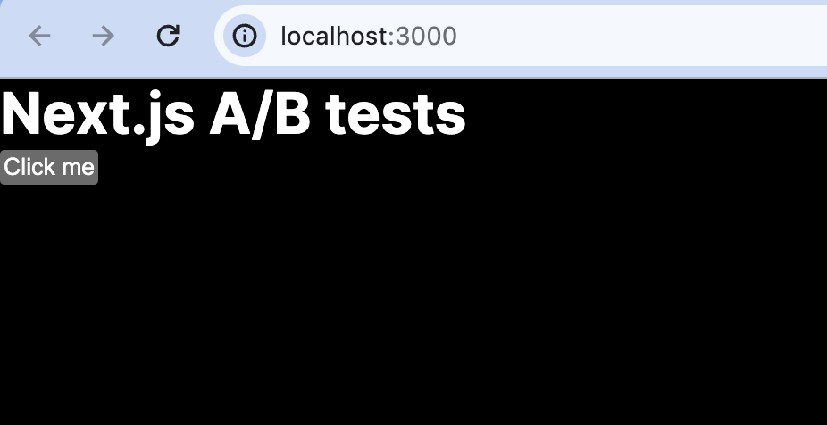
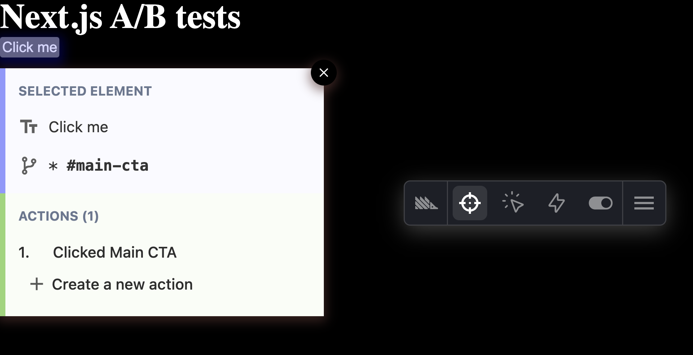

[A/B tests](/ab-testing) are a way to make sure the content of your Next.js app performs as well as possible. They compare two or more variations on their impact on a goal.

PostHog's experimentation tool makes it easy to set up A/B tests. This tutorial shows you how to build a basic Next.js app (with the app router), add PostHog to it, bootstrap feature flag data, and set up the A/B test in the app.

## 1. Create a Next.js app

We will create a basic Next.js app with a simple button to run our test on. First, make sure [Node is installed](https://nodejs.dev/en/learn/how-to-install-nodejs/) (18.17 or newer), then create a Next.js app:

```js
npx create-next-app@latest next-ab
```

Select `No` for TypeScript, `Yes` for `use app router`, and the defaults for the rest of the options. Once created, go to your `app/page.js` file and set up a basic page with a heading and a button.

```js
// app/page.js

export default function Home() {
  return (
    <main>
      <h1>Next.js A/B tests</h1>
			<button id="main-cta">Click me</button>
    </main>
  );
}
```

Once done, run `npm run dev` and go `http://localhost:3000` to see your app.



## 2. Add PostHog

To track our app and set up an A/B test, we install PostHog. If you don't have a PostHog instance already, you can [sign up for free](https://us.posthog.com/signup). 

Start by installing the `posthog-js` SDK:

```bash
npm i posthog-js
```

Next, create a `providers.js` file in your `app` folder. In it, initialize PostHog with your project API key and instance address and export a provider component.

```js
// app/providers.js
'use client'
import posthog from 'posthog-js'
import { PostHogProvider } from 'posthog-js/react'

export function PHProvider({ children }) {
	if (typeof window !== 'undefined') {
	  posthog.init('<ph_project_api_key>', {
	    api_host: '<ph_instance_address>'
	  })
	}

  return <PostHogProvider client={posthog}>{children}</PostHogProvider>
}
```

Once created, you can import `PHProvider` into your `layout.js` file and wrap your app in it:

```js
import "./globals.css";
import { PHProvider } from './providers'

export default function RootLayout({ children }) {
  return (
    <html lang="en">
      <PHProvider>
        <body>{children}</body>
      </PHProvider>
    </html>
  );
}
```

When you reload your app, you should see events captured in [your activity tab](https://us.posthog.com/events) in PostHog.

## 3. Creating an action for our experiment goal

To measure the impact of our change, we need a goal metric. To set this up, we can create an [action](/docs/data/actions) from the events PostHog [autocaptures](/docs/product-analytics/autocapture) using the toolbar.

To enable and launch the toolbar, go to the "[Launch toolbar](https://us.posthog.com/toolbar)" tab, add `http://localhost:3000/` as an authorized URL, then click launch. To create an action with the toolbar, click:

1. The target icon (inspector) in the toolbar
2. The "Click me" button
3. "Create new action" in the modal

Name the action "Clicked Main CTA" and then click "Create action."



> **Note:** You can also use a custom event as a goal metric. See our [full Next.js analytics tutorial](/tutorials/nextjs-app-directory-analytics#capturing-custom-events) for how to set up custom event capture.

## 4. Creating an experiment

With PostHog installed and our action set up, we're ready to create our experiment. To do so, go to the [A/B testing tab](https://us.posthog.com/experiments) in PostHog, click "New experiment," and then: 

1. Name your A/B test.
2. Set your feature flag key to something like `main-cta`.
3. Choose the "Clicked Main CTA" action as your experiment goal. You may need to refresh for it to show up.
4. Click "Save as draft" and then "Launch."

Once done, you're ready to go back to your app to start implementing it.

## 5. Bootstrapping feature flags

A/B testing in PostHog relies on feature flag data. To ensure that feature flag data is available as soon as possible, we make a server-side request for it and then pass it to the client-side initialization of PostHog (known as [bootstrapping](/docs/feature-flags/bootstrapping)).

Set up a function in `layout.js` that:

1. Checks for the user `distinct_id` in the cookies.
2. If it doesn't exist, creates one using [`uuidv7`](https://github.com/LiosK/uuidv7).
3. Uses the [`posthog-node`](/docs/libraries/node) library and the `distinct_id` to [`getAllFlags`](https://posthog.com/docs/libraries/node#fetching-all-flags-for-a-user).
4. Passes the flags and `distinct_id` to the `PHProvider`.

Start by installing `uuidv7` and `posthog-node`:

```bash
npm i uuidv7 posthog-node
```

Next, create a `utils` folder and create a folder named `gen-id.js`. In this file, we use React's cache feature to generate an ID once and return the same value if we call it again.

```js
// app/utils/gen-id.js
import { cache } from 'react'
import { uuidv7 } from "uuidv7";
 
export const generateId = cache(() => {
  const id = uuidv7()
  return id 
})
```

After this, we are ready to set up the `getBootstrapData` function in `layout.js`:

1. Import PostHog (from Node), the Next `cookies` function, and the `generateId` utility.
2. Add the `getBootstrapData` function and logic.
3. Call it from the `RootLayout`.
4. Pass the data to the `PHProvider`.

```js
// app/layout.js
import './globals.css'
import PHProvider from "./providers";
import { PostHog } from 'posthog-node'
import { cookies } from 'next/headers'
import { generateId } from './utils/gen-id'

export default async function RootLayout({ children }) {
  const bootstrapData = await getBootstrapData()

  return (
    <html lang="en">
      <PHProvider bootstrapData={bootstrapData}>
        <body>{children}</body>
      </PHProvider>
    </html>
  )
}

export async function getBootstrapData() {
  let distinct_id = ''
  const phProjectAPIKey = '<ph_project_api_key>'
  const phCookieName = `ph_${phProjectAPIKey}_posthog`
  const cookieStore = cookies()
  const phCookie = cookieStore.get(phCookieName)

  if (phCookie) {
    const phCookieParsed = JSON.parse(phCookie.value);
    distinct_id = phCookieParsed.distinct_id;
  }
  if (!distinct_id) {
    distinct_id = generateId()
  }

  const client = new PostHog(
    phProjectAPIKey,
    { host: "<ph_instance_address>" })
  const flags = await client.getAllFlags(distinct_id)
  const bootstrap = {
    distinctID: distinct_id,
    featureFlags: flags
  }

  return bootstrap
}
```

Finally, in `providers.js`, we handle the `bootstrapData` and add it to the PostHog initialization.

```js
// app/providers.js
'use client'
import posthog from 'posthog-js'
import { PostHogProvider } from 'posthog-js/react'

export default function PHProvider({ children, bootstrapData }) {
  if (typeof window !== 'undefined') {
    posthog.init("<ph_project_api_key>", {
      api_host: "<ph_instance_address>",
      bootstrap: bootstrapData
    })
  }

  return <PostHogProvider client={posthog}>{children}</PostHogProvider>
}
```

Now, feature flag data is available as soon as PostHog loads. Bootstrapping flags like this ensures a user's experience is consistent and you track them accurately. 

## 6. Implementing our A/B test

The final part is to implement the A/B test in our component. There are two ways to do this:

1. A client-side implementation where we wait for PostHog to load and use it to control display logic.
2. A server-side implementation where we use the bootstrap data directly.

### Client-side implementation

To set up our A/B test in `app/page.js`:

1. Change it to a client-side rendered component.
2. Set up PostHog using the `usePostHog` hook.
3. Use a `useEffect` to check the feature flag.
4. Change the button text based on the flag value.

```js
// app/page.js
'use client'
import { usePostHog } from 'posthog-js/react'
import { useEffect, useState } from 'react'

export default function Home() {
  const posthog = usePostHog()
  const [text, setText] = useState('')

  useEffect(() => {
    const flag = posthog.getFeatureFlag('main-cta')
    setText(flag === 'test' ? 'Click this button for free money' : 'Click me');
  }, [])

  return (
    <main>
      <h1>Next.js A/B tests</h1>
      <button id="main-cta">{text}</button>
    </main>
  )
}
```

When you reload the app, you see our app still needs to wait for PostHog to load even though we are loading flags as fast as possible with bootstrapping. This causes the "flicker," but is solvable if we server-render the component.

### Server-side implementation

We can use the same `getBootstrapData` function in a server-rendered page and access the data directly. Next.js [caches the response](https://nextjs.org/docs/app/building-your-application/data-fetching/fetching-caching-and-revalidating#caching-data), meaning it is consistent with the bootstrapped data.

To set up the A/B test, we change the `app/page.js` component to be server-rendered and await the `bootstrapData` then use it to control the button text.

```js
// app/page.js
import { getBootstrapData } from "./layout"

export default async function Home() {
  const bootstrapData = await getBootstrapData()
  const flag = bootstrapData.featureFlags['main-cta']
  const buttonText = flag === "test" ? "Click this button for free money" : "Click me";

  return (
    <main>
      <h1>Next.js A/B tests</h1>
			<button id="main-cta">{buttonText}</button>
    </main>
  );
}
```

This shows your updated button text immediately on load. This method still uses the client-side for tracking, and this works because we bootstrap the distinct ID from the server-side to the client.

## Further reading

- [How, when, and where to run your first A/B test](/product-engineers/how-to-do-ab-testing)
- [10 things we've learned about A/B testing for startups](/newsletter/what-we've-learned-about-ab-testing)
- [How to set up Next.js app router analytics, feature flags, and more](/tutorials/nextjs-app-directory-analytics)