Next.js is a popular web framework built on React. It provides optimizations and abstractions to help developers build fast and performant apps and sites.

In this tutorial, we will:

1. build a basic Next.js blog with user authentication
2. add PostHog to it
3. set up the features of PostHog like custom event capture, user identification, and feature flags

> Already know how to build a Next.js app? [Click here to skip to the PostHog installation](#adding-posthog).

## Creating our Next.js app

First, [install Node](https://nodejs.dev/en/learn/how-to-install-nodejs/) (14.6.0 or newer) and then run:

```bash
npx create-next-app@latest
```

Press "y" to install `create-next-app` if needed, name your app (I chose `tutorial`), select "No" for using TypeScript using the arrow keys, select "No" for using the app router, and then press enter to select the defaults for the rest. 

> If you want to use the latest version of Next.js with the app router, check out "[How to set up Next.js 13 app directory analytics, feature flags, and more](/tutorials/nextjs-app-directory-analytics)."

Once installed and created, use the terminal go into the new folder with the app name you chose (mine is `tutorial`) and start the server:

```bash
cd tutorial
npm run dev
```

At your [localhost](http://localhost:3000/), you should see a basic webpage like this:

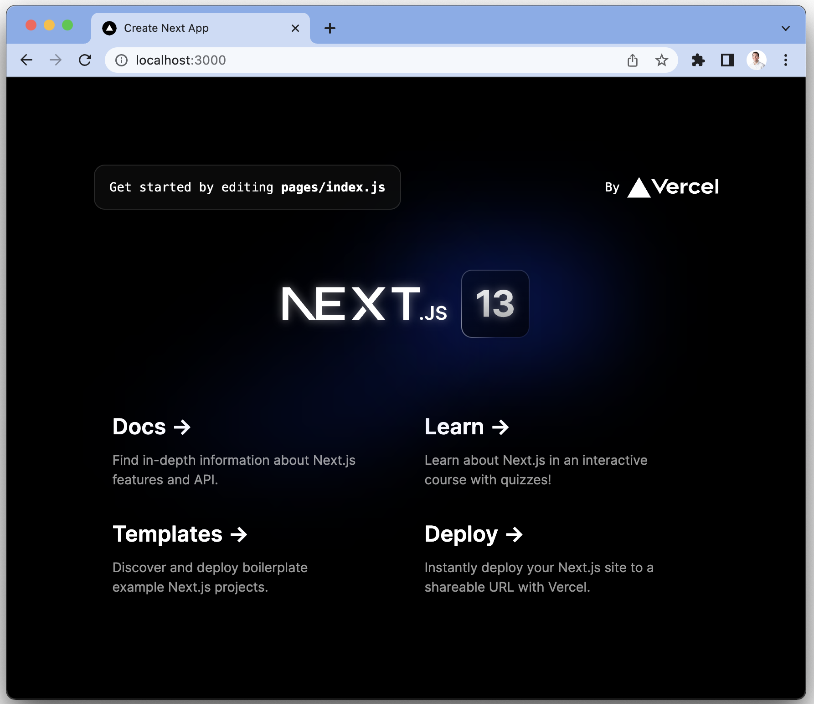

## Adding blog functionality to our Next.js app

The structure of our blog will be:

- An index home page showing all the blog posts.
- Detail pages for each of the posts

The blog posts are a static JSON file that we can fetch. To do this, create a `blog.json` file in the main app (`tutorial`) folder and add the details of your blog. We need an `id`, `title`, `content`, and `author`. You can customize or add details to this if you want.

```json
{
  "posts": [
    {
      "id": 1,
      "title": "Hello World",
      "content": "This is my first post",
      "author": "Ian Vanagas"
    },
    {
      "id": 2,
      "title": "PostHog is awesome",
      "content": "PostHog is so cool",
      "author": "Ian Vanagas"
    }
  ]
}
```

Next, the main app (`tutorial`) folder, remove all the existing code in the `page/index.js` file, all the CSS in the `styles` folder, and the `styles/globals.css` import in `_app.js`. 

In `pages/index.js`, use the `getStaticProps()` method that Next.js automatically provides to get the posts from the `blog.json` file, then use `map()` to loop through, show details, and link to them. Like this:

```js
// pages/index.js
import Head from 'next/head'
import Link from 'next/link'

export default function Home({ posts }) {
  return (
    <>
      <Head>
        <title>My blog</title>
        <meta name="viewport" content="width=device-width, initial-scale=1" />
        <link rel="icon" href="/favicon.ico" />
      </Head>
      <main>
        <h1>Welcome to my blog</h1>
        <ul>
          {posts.map((post) => (
            <li key={post.id}>
              <Link href={`/posts/${post.id}`}>
                <p>{post.title}</p>
              </Link>
            </li>
          ))}
        </ul>
      </main>
    </>
  )
}

export async function getStaticProps() {
  const { posts } = await import('../blog.json')
  return {
    props: {
      posts,
    },
  }
}
```

This gives us a basic page that looks like this:

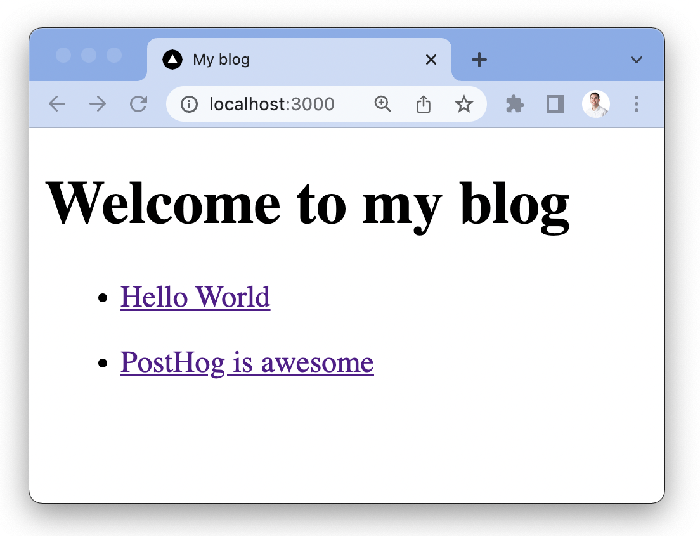

We also need the pages for the posts. In the `pages` folder, create another folder named `posts` and create a file named `[id].js`. Next.js automatically uses this to create routes to our posts.

Our `[id].js` is similar to our `index.js` file, but we want individual blog posts. To make this happen, we must:

1. handle the paths by calling the `getStaticPaths()` method, 
2. pass the ID as a string to `getStaticProps()` to get the right blog for the route
3. pass the post data to the component and render the data in HTML

Like this:

```js
// pages/posts/[id].js
export default function Post({ post }) {
  return (
    <div>
      <h1>{post.title}</h1>
      <p>By: {post.author}</p>
      <p>{post.content}</p>
    </div>
  )
}

export async function getStaticPaths() {
  const { posts } = await import('../../blog.json')

  const paths = posts.map((post) => ({
    params: { id: post.id.toString() },
  }))
  return {
    paths,
    fallback: false,
  }
}

export async function getStaticProps({ params }) {
  const { posts } = await import('../../blog.json')
  const post = posts.find((post) => post.id.toString() === params.id)
  return {
    props: {
      post,
    },
  }
}
```

Going back to our app, clicking on the links now brings us to a page that looks like this:

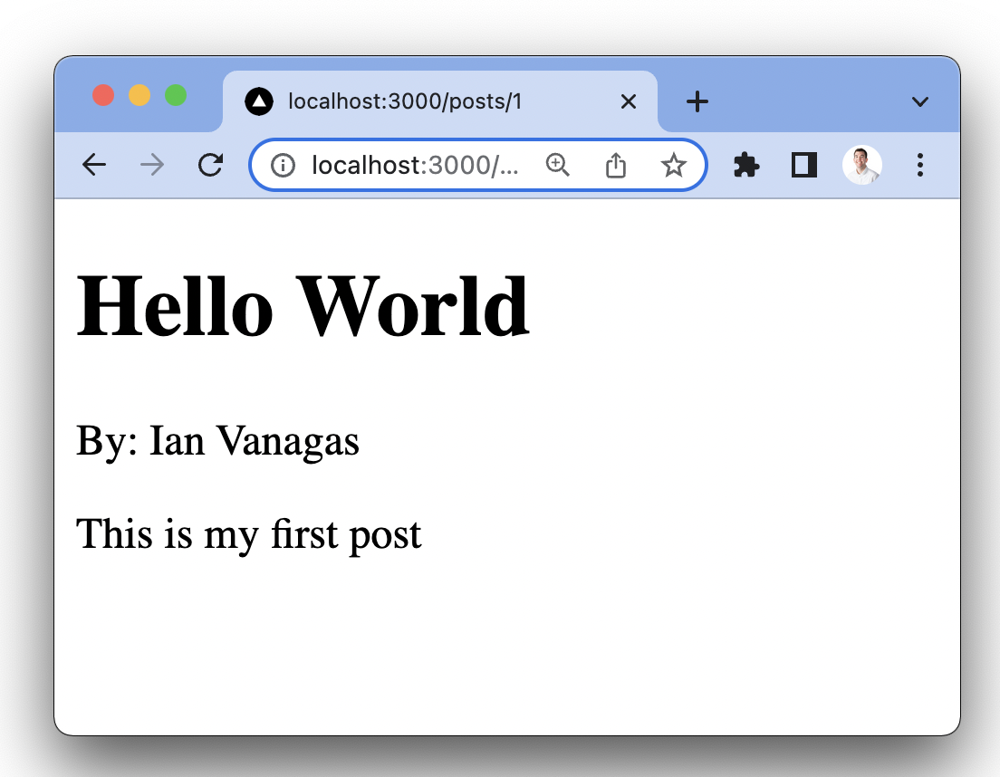

## Adding authentication

Next, we want to add user authentication with a basic login and logout. This provides us information on users so we can identify and connect events to them with PostHog later. 

[NextAuth](https://next-auth.js.org/) makes it easy to set up authentication with a provider like GitHub. To do so, first, install `next-auth`:

```bash
npm i next-auth
```

Next, create an API route for `next-auth` to use. To do this, in our `pages/api` folder, create a folder named `auth`, then a file named `[...nextauth].js` inside it. Inside the file, set up the GitHub provider like this:

```js
// pages/api/auth/[...nextauth].js
import NextAuth from "next-auth"
import GithubProvider from "next-auth/providers/github"

export default NextAuth({
  providers: [
    GithubProvider({
      clientId: process.env.GITHUB_ID,
      clientSecret: process.env.GITHUB_SECRET,
    })
  ],
	secret: process.env.NEXTAUTH_SECRET
})
```

Next, get these details from GitHub by going to [developer settings](https://github.com/settings/developers). Create a new OAuth app and get the client ID and client secret. Set the homepage URL to `http://localhost:3000` and the authorization callback URL to `http://localhost:3000/api/auth/callback/github`.

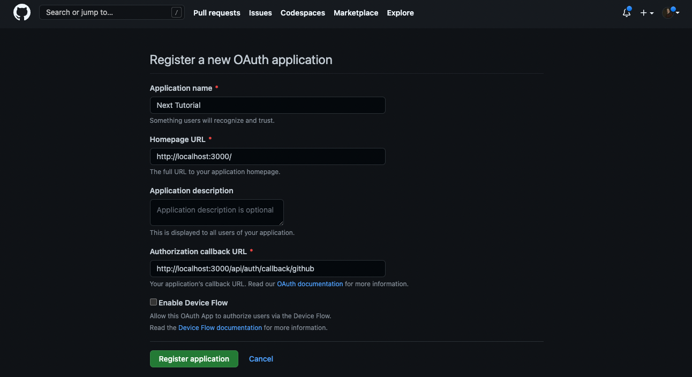

With these, create a `.env.local` file in the main app (`tutorial`) folder and include the `NEXTAUTH_URL` ([`http://localhost:3000/`](http://localhost:3000/) for now) and a `NEXTAUTH_SECRET` (which you can generate on [this site](https://generate-secret.vercel.app/32) or by creating a random 32-character string).

```bash
GITHUB_ID=<github_client_id>
GITHUB_SECRET=<github_client_secret>

NEXTAUTH_URL=http://localhost:3000
NEXTAUTH_SECRET=<random_32_character_string>
```

### Setting up sessions

With NextAuth and GitHub set up, we now have the infrastructure to authenticate users. Now we can implement user sessions to let them log in and out as well as get their details. The first step to doing this is adding a `SessionProvider` from `next-auth` to `_app.js` like this:

```js
// pages/_app.js
import { SessionProvider } from "next-auth/react"

export default function App(
  { Component, pageProps: { session, ...pageProps } }
) {
  return (
    <SessionProvider session={session}>
      <Component {...pageProps} />
    </SessionProvider>
  )
}
```

Next, add the session details, and the ability to sign in and out to our `index.js` page. We can do this with the `next-auth` `useSession()` hook. `next-auth` also provides methods for signing in and out. 

If there is a session, show details about the user and a button to sign out. If there isn’t a session, show a button to sign in. Together, it looks like this:

```js
// pages/index.js
import Head from 'next/head'
import Link from 'next/link'
import { useSession, signIn, signOut } from "next-auth/react";

export default function Home({ posts }) {
  const { data: session } = useSession();
  return (
    <>
      <Head>
        <title>My blog</title>
        <meta name="viewport" content="width=device-width, initial-scale=1" />
        <link rel="icon" href="/favicon.ico" />
      </Head>
      <main>
        <h1>Welcome to my blog</h1>
        {!session ? (
          <button onClick={() => signIn()}>Sign in</button>
        ) : (
          <div>
            <p>Welcome {session.user.name}</p>
            <button onClick={() => signOut()}>Sign out</button>
          </div>
        )}
//... posts map and getStaticProps
```

When you click sign in, you go through the sign in flow with GitHub, and get redirected back to the app with an active session.

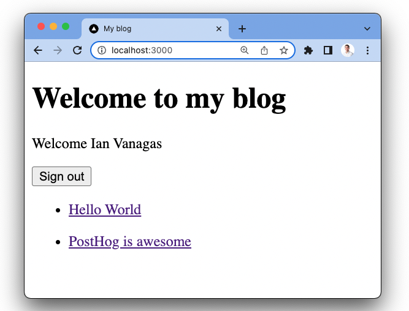

Once this is working, we have all the functionality we want in our Next.js app and it’s time to add PostHog.

## Adding PostHog

At this point, you need a PostHog instance ([signup for free](https://app.posthog.com/signup)). Once created, get your PostHog API key which is found in the getting started flow or your project settings and add it to your `.env.local` file and Next.js environment variables.

```shell file=.env.local
NEXT_PUBLIC_POSTHOG_KEY=<ph_project_api_key>
NEXT_PUBLIC_POSTHOG_HOST=<ph_instance_address>
```

Next, install [posthog-js](https://github.com/posthog/posthog-js):

```shell
npm install --save posthog-js
```

Now we will set up the `PostHogProvider` for our app. This enables you to access PostHog and its methods from anywhere in your app.

```js
// pages/_app.js
import { SessionProvider } from "next-auth/react"
import posthog from "posthog-js"
import { PostHogProvider } from 'posthog-js/react'

// Check that PostHog is client-side
if (typeof window !== 'undefined') {
  posthog.init(process.env.NEXT_PUBLIC_POSTHOG_KEY, {
    api_host: process.env.NEXT_PUBLIC_POSTHOG_HOST || 'https://app.posthog.com',
    // Enable debug mode in development
    loaded: (posthog) => {
      if (process.env.NODE_ENV === 'development') posthog.debug()
    }
  })
}

export default function App(
  { Component, pageProps: { session, ...pageProps } }
) {
  return (
    <>
      <PostHogProvider client={posthog}>
        <SessionProvider session={session}>
          <Component {...pageProps} />
        </SessionProvider>
      </PostHogProvider>
    </>
  )
}
```

Once saved, go back to your app and click around, you should see events start to populate in your PostHog instance.

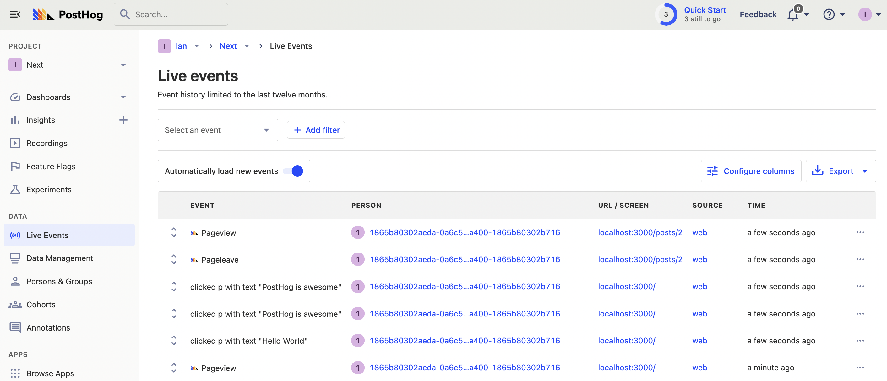

The library autocaptures clicks, inputs, session recordings (if enabled), pageviews (for single pages, we'll fix this next) and more. It also provides access to the all the features of [`posthog-js`](/docs/integrate/client/js) which we will set up during the rest of this tutorial.

## Capturing pageviews in Next.js

When testing PostHog, you might notice pageview events aren’t captured when you move between pages. This is because Next.js acts as a [single page app](/tutorials/single-page-app-pageviews). The app does not reload when moving between pageviews which does not trigger PostHog to capture a pageview.

To solve this, we can capture a custom event when the route changes using `next/router` in `_app.js` with `useEffect`. It looks like this:

```js
// pages/_app.js
import { SessionProvider } from "next-auth/react"
import { useRouter } from "next/router"
import { useEffect } from "react"
import posthog from "posthog-js"
import { PostHogProvider } from "posthog-js/react"

export default function App(
  { Component, pageProps: { session, ...pageProps } }
) {
  const router = useRouter()
  useEffect(() => {
    // Track page views
    const handleRouteChange = () => posthog.capture('$pageview')
    router.events.on('routeChangeComplete', handleRouteChange)

    return () => {
        router.events.off('routeChangeComplete', handleRouteChange)
    }
  }, [])
//... the rest of the code you wrote earlier
```

Once you set this up, navigating between pages captures pageviews for each. The routes show up in the `URL/Screen` column in PostHog as well.

> **Note**: when in React strict mode, `useEffect` runs twice: once to mount and again to remount. This means pageviews trigger twice. When you deploy and run an app in production, this doesn’t happen. To turn off strict mode in development, go to `next.config.js` and set `reactStrictMode` to `false`. Find more details about strict mode in [the React documentation](https://beta.reactjs.org/learn/synchronizing-with-effects#sending-analytics).

## Capturing custom events

You can use the same `posthog.capture` call to capture custom events in your other components.

For example, in `posts/[id].js` we can add a "like" button that includes the article details as properties. To do this, create a button and connect it to a function that captures a `post liked` event with the post title and author. This looks like this:

```js
// pages/posts/[id].js
import { usePostHog } from 'posthog-js/react'

export default function Post({ post }) {
  const posthog = usePostHog()
  
  function likePost() {
    posthog.capture(
      'post_liked',
      {
        post: post.title,
        author: post.author,
      })
  }

  return (
    <div>
      <h1>{post.title}</h1>
      <p>By: {post.author}</p>
      <p>{post.content}</p>
      <button onClick={likePost}>Like</button>
    </div>
  )
}
//...
```

Go to a post, click "like," then check your PostHog instance to see the custom event show up.

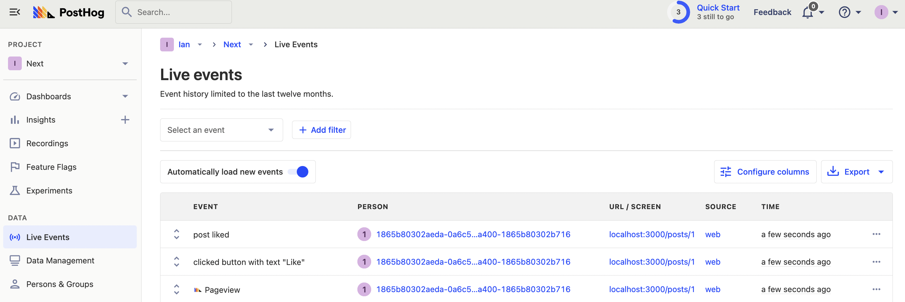

## Identifying users

Even though you are logged in, you are still treated as an anonymous user by PostHog. This is because we haven’t set up user identification yet. 

To connect anonymous user IDs with logged in user IDs, use an `identify` call with the email from their session. To do this, we must do a few things:

1. Add a param to the `signIn` method to redirect back to a URL with a param telling us the user just signed in.
2. Check for that param using the router.
3. Identify using `posthog.identify` with `session.user.email`
4. Clear the params from the URL

Once we implement these changes, our `index.js` file now looks like this:

```js
// pages/index.js
import Head from 'next/head'
import Link from 'next/link'
import { useSession, signIn, signOut } from "next-auth/react";
import { useRouter } from 'next/router';
import { usePostHog } from 'posthog-js/react'

export default function Home({ posts }) {
  const { data: session } = useSession();
  const posthog = usePostHog()

  const router = useRouter()
  const newLoginState = router.query.loginState
  if (newloginState == 'signedIn' && session) {
    posthog.identify(session.user.email);
    router.replace('/', undefined, { shallow: true });
  }

  return (
    <>
      <Head>
        <title>My blog</title>
        <meta name="viewport" content="width=device-width, initial-scale=1" />
        <link rel="icon" href="/favicon.ico" />
      </Head>
      <main>
        <h1>Welcome to my blog</h1>
        {!session ? (
					<button 
            onClick={() => signIn(
              'github', { callbackUrl: '/?loginState=signedIn'}
            )}>
              Sign in
          </button>        
				) : (
          <div>
            <p>Welcome {session.user.name}</p>
            <button onClick={() => signOut()}>Sign out</button>
          </div>
        )}
//...
```

Now, when you sign in, this triggers an `identify` event in PostHog and events from the anonymous user connect with the identified person.

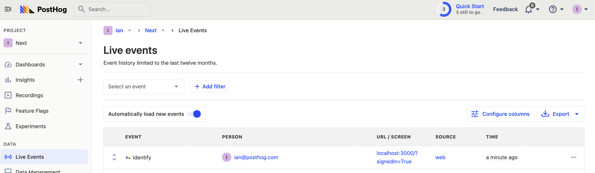

### Resetting identification

Because of how identification in PostHog works, logging out in our app does not automatically disconnect the person events are connected to. Events sent after you log out are still connected to your identified user, even if you log in as a new one. To reset identification, we must call `reset()` when a user logs out.

To set this up, we do something similar to what we did with user identification. We redirect to a URL with a `signedIn=False` param and then call reset if that param exists. This looks like this:

```js
// pages/index.js
//...
const router = useRouter()
const posthog = usePostHog()

const newLoginState = router.query.loginState
if (newLoginState) {
  if (newLoginState === 'signedIn' && session)) {
    posthog.identify(session.user.email);
  }
  if (newLoginState === 'signedOut') {
    posthog.reset();
  }
  router.replace('/', undefined, { shallow: true });
}

return (
  <>
    <Head>
      <title>My blog</title>
      <meta name="viewport" content="width=device-width, initial-scale=1" />
      <link rel="icon" href="/favicon.ico" />
    </Head>
    <main>
      <h1>Welcome to my blog</h1>
      {!session ? (
        <button 
          onClick={() => signIn(
            'github', { callbackUrl: '/?loginState=signedIn'}
          )}>
            Sign in
        </button>
      ) : (
        <div>
          <p>Welcome {session.user.name}</p>
          <button onClick={() => signOut(
            { callbackUrl: '/?loginState=signedOut' }
          )}>
            Sign out
          </button>
        </div>
      )}
//...
```

When you log out now, PostHog creates and connects events to a new anonymous person when you next load the page. This person is disconnected from your old anonymous and identified person.

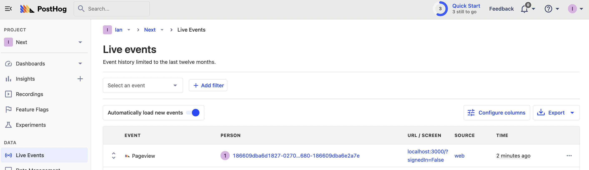

> **Note:** Be careful to only reset when a user logs out, **not** on every request. If you reset on every request, you create an excess of new anonymous users and new session recordings.

## Setting up and using feature flags

The last feature of PostHog we are going to set up in our Next.js app is feature flags. There are multiple ways to implement feature flags in Next.js. We’re going to cover the two most important ways here: client-side rendering and server-side rendering.

For both, use them to show a call to action on our blog pages.

To start, create a feature flag in your PostHog instance. Go to the "Feature Flags" tab, click the "New feature flag" button, enter `blog-cta` as the key, set "Release conditions" to 100% of users, and press save.

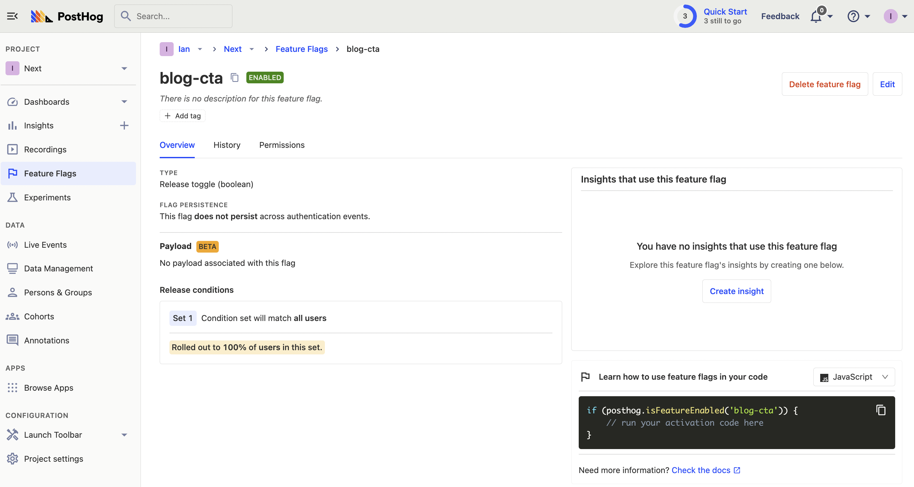

This gives us a basic flag to add to our app.

### Client-side rendering feature flags

The PostHog provider gives you hooks to work with feature flags in your client side app. Here's an example of how to use them:

```js
// pages/posts/[id].js
import { useFeatureFlagEnabled } from 'posthog-js/react'
 
export default function Post({ post }) {

  const ctaState = useFeatureFlagEnabled('blog-cta')

  return (
    <div>
      <h1>{post.title}</h1>
      <p>By: {post.author}</p>
      <p>{post.content}</p>
      {ctaState && 
        <p><a href="http://posthog.com/">Go to PostHog</a></p>
      }
      <button onClick={likePost}>Like</button>
    </div>
  )
}
//...
```

Then create a feature flag called `blog-cta` and set it to 100% of users.

You should see a call to action on your blog page.

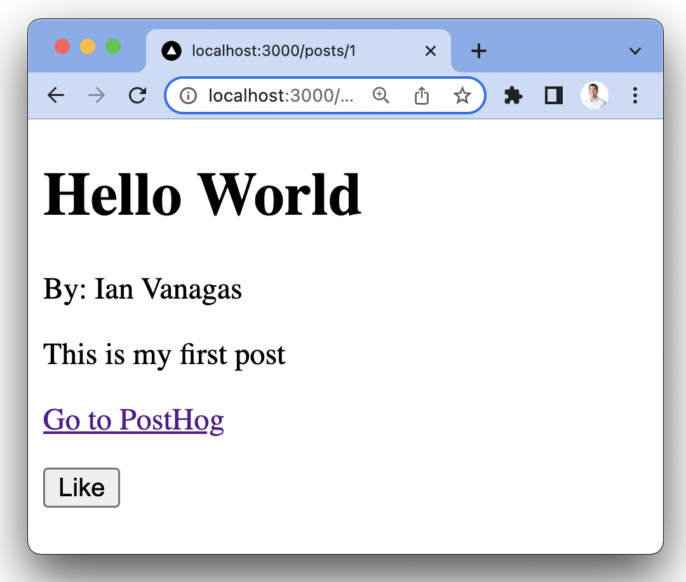

### Server-side rendering feature flags

When you reload the page, you might see that the CTA takes time to load. This is because it takes time:

1. for PostHog load 
2. to request and evaluate the feature flags 
3. to update the client

The code we wrote in the client-side rendering section did all of this after the page initially loads. There is a way to remove client-side rendering and have CTA display immediately on page load. 

A core benefit of Next.js is the automatic page load optimizations. Right now, our `[id].js` is using the `getStaticProps` method to load the data for the page, but we can use `getServerSideProps` instead.
Using `getServerSideProps` enables us to evaluate the feature flags before the page loads, using the PostHog Node library and the `next-auth` session.

First, install the `posthog-node` library:

```bash
npm i posthog-node
```

Then, rewrite our post component to use `getServerSideProps` and evaluate feature flags. We can use `posthog-node` to create a client that we use to `getAllFlags` for the user. Once that completes, pass that flag data to the component so it is ready before the client loads. 

> We can still use the client-side rendering as a fallback, such as for new users without PostHog IDs or users without sessions.

This looks like this:

```js
// pages/posts/[id].js
import { useEffect, useState } from 'react'
import { getServerSession } from "next-auth/next"
import { PostHog } from 'posthog-node'

export default function Post({ post, flags }) {
  const [ctaState, setCtaState] = useState(false);

  useEffect(() => {
    if (flags) {
      setCtaState(flags['blog-cta'])
    }
  })

  return (
    <div>
      <h1>{post.title}</h1>
      <p>By: {post.author}</p>
      <p>{post.content}</p>
      {ctaState && 
        <p><a href="http://posthog.com/">Go to PostHog</a></p>
      }
      <button onClick={likePost}>Like</button>
    </div>
  )
}

export async function getServerSideProps(ctx) {

  const session = await getServerSession(ctx.req, ctx.res)
  let flags = null

  if (session) {
    const client = new PostHog(
      process.env.NEXT_PUBLIC_POSTHOG_KEY,
      {
        host: process.env.NEXT_PUBLIC_POSTHOG_HOST,
      }
    )
    flags = await client.getAllFlags(session.user.email);
  }
  
  const { posts } = await import('../../blog.json')
  const post = posts.find((post) => post.id.toString() === ctx.params.id)
  return {
    props: {
      post,
      flags
    },
  }
}
```

Now, when you go to reload your post page (while signed in), the CTA loads right away.

You now have a basic Next.js app with user authentication and many of the features of PostHog set up. You’re ready to customize your app or add more of PostHog’s features like [group analytics](/manual/group-analytics) or [experiments](/manual/experimentation). 

## Further reading

- [How to set up Next.js 13 app directory analytics, feature flags, and more](/tutorials/nextjs-app-directory-analytics)
- [How to set up Next.js A/B tests](/tutorials/nextjs-ab-tests)
- [An introductory guide to identifying users in PostHog](/tutorials/identifying-users-guide)
