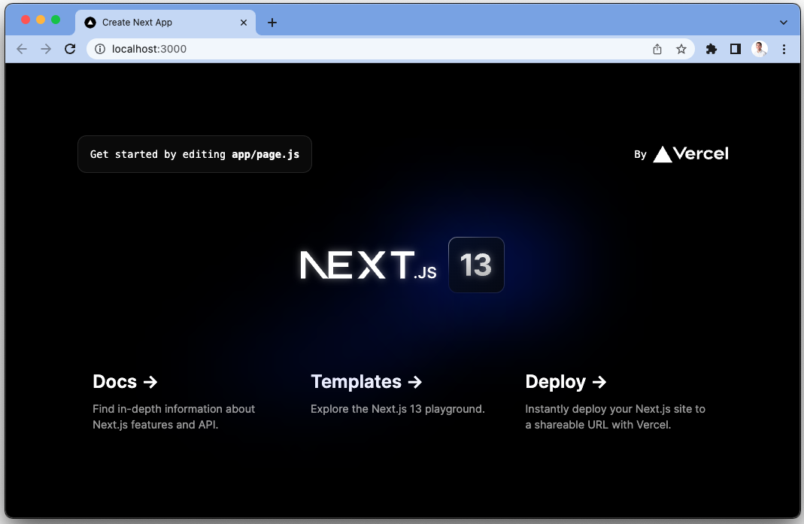
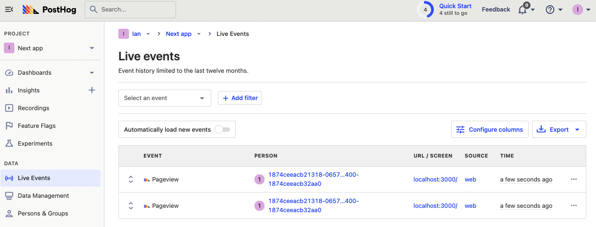
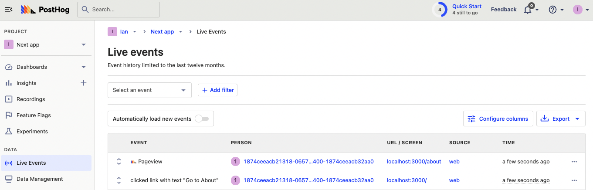

Next.js release 13 added many improvements including the Turbopack bundler, an improved `next/image` component, changes to the `Link` component, and more. One of the big ones was the move from the `pages` to the `app` directory and router.

The `app` directory and router includes support for layouts, server components, streaming, and component-level data fetching. These are all upgrades to the Next.js `pages` directory, but change the implementation of a Next.js app, including setting up PostHog. This tutorial goes over how to implement PostHog on the client and server side when using the Next.js 13 app directory. 

> For a more detailed implementation tutorial for Next.js 13 using the **pages** directory and router, check out our [Next.js analytics tutorial](/tutorials/nextjs-analytics).

## Creating a Next.js 13 app with the app directory

First, once [Node is installed](https://nodejs.dev/en/learn/how-to-install-nodejs/), create a Next.js 13 app. Select **No** for TypeScript, **Yes** for `use app router`, and the defaults for every other option.

```bash
npx create-next-app@latest next-app
```

We name our app `next-app` and can go into the newly created folder to run it.

```bash
cd next-app
npm run dev
```

This opens a new page showing we are running Next.js 13.



## Setting up PostHog on the client side

First, we need a PostHog instance ([signup for free](https://app.posthog.com/signup)). From this instance, we need a project API key, which is in project settings, and an instance address (`http://app.posthog.com`, `http://eu.posthog.com`, or a custom address). Add both of these to a `.env.local` file in our base directory.

```
NEXT_PUBLIC_POSTHOG_KEY=<ph_project_api_key>
NEXT_PUBLIC_POSTHOG_HOST=<ph_instance_address>
```

Using the Next.js 13 app directory requires us to initialize PostHog differently than with the [pages directory](/tutorials/nextjs-analytics). Specifically, the app directory server-side renders components by default, and the `posthog-js` library is a client-side library. To make these work together, create a `providers.js` file and set up the `PostHogProvider` with the `'use client'`  directive.

```js
// app/providers.js
'use client'
import posthog from 'posthog-js'
import { PostHogProvider } from 'posthog-js/react'

if (typeof window !== 'undefined') {
  posthog.init(process.env.NEXT_PUBLIC_POSTHOG_KEY, {
    api_host: process.env.NEXT_PUBLIC_POSTHOG_HOST
  })
}

export function PHProvider({ children }) {
  return <PostHogProvider client={posthog}>{children}</PostHogProvider>
}
```

Once we do this, we can then import the `provider.js` file in our `app/layout.js` file, and wrap our app in the PostHog provider. 

```js
// app/layout.js
import './globals.css'
import { PHProvider } from './providers'

export const metadata = {
  title: 'Create Next App',
  description: 'Generated by create next app',
}

export default function RootLayout({ children }) {
  return (
    <html lang="en">
      <PHProvider>
        <body>{children}</body>
      </PHProvider>
    </html>
  )
}
```

After setting this up, events start being autocaptured into your PostHog instance. This also means you can use the PostHog on the client side in all your client-side rendered Next.js components (the ones with the `"use client"` directive).



> **Note:** if you don’t use the `"use client"` directive, Next.js assumes your page is server-side rendered. This means the client hooks like `usePostHog` cause errors. To interact with PostHog on the server side, use the [PostHog Node SDK](/docs/libraries/node) (which we show [later](#using-posthog-with-server-rendered-components)).

## Capturing pageviews on the client side

When used with the app directory, Next.js 13 replaces `next/router` with `next/navigation.` This means we need a new implementation for capturing pageviews beyond the first-page load because Next.js acts as a [single-page app](/tutorials/single-page-app-pageviews). Luckily, we can add the code to handle this into our `provider.js` file.

To start, we need another page to navigate to. In the app folder, create a new folder named `about` and create a `page.js` file inside with a basic component.

```js
// app/about/page.js
import Link from 'next/link'

export default function About() {
  return (
    <main>
      <h1>About</h1>
      <Link href="/">Go home</Link>
    </main>
  )
}
```

Change our app `page.js` file to a title and a link to the new `about` page.

```js
// app/page.js
import styles from './page.module.css'
import Link from 'next/link'

export default function Home() {
  return (
    <main className={styles.main}>
      <h1>Home</h1>
      <Link href="/about">Go to About</Link>
    </main>
  )
}
```

Once this is set up, we use the `usePathname` and `useSearchParams` client-side hooks from `next/navigation` to check when the URL changes and then capture a custom `$pageview` event. We use the data from the pathname and search params to accurately create string for the `$current_url` property too.

Because [`useSearchParams`](https://nextjs.org/docs/app/api-reference/functions/use-search-params) will [deopt](https://nextjs.org/docs/messages/deopted-into-client-rendering) the entire app into client-side rendering, we need to export this as its own `PostHogPageview` component and wrap it in a `<Suspense>` later.

This looks like this:

```js
// app/providers.js
'use client'
import posthog from 'posthog-js'
import { PostHogProvider } from 'posthog-js/react'
import { usePathname, useSearchParams } from "next/navigation";
import { useEffect } from "react";

if (typeof window !== 'undefined') {
  posthog.init(process.env.NEXT_PUBLIC_POSTHOG_KEY, {
    api_host: process.env.NEXT_PUBLIC_POSTHOG_HOST
  })
}

export function PostHogPageview() {
  const pathname = usePathname();
  const searchParams = useSearchParams();

  useEffect(() => {
    if (pathname) {
      let url = window.origin + pathname
      if (searchParams.toString()) {
        url = url + `?${searchParams.toString()}`
      }
      posthog.capture(
        '$pageview',
        {
          '$current_url': url,
        }
      )
    }
  }, [pathname, searchParams])
}

export function PHProvider({ children }) {
  return <PostHogProvider client={posthog}>{children}</PostHogProvider>
}
```

Finally, we will set up the `PostHogPageview` component in `layout.js` wrapped in a `<Suspense>` component.

```js
// app/layout.js
import './globals.css'
import { PHProvider, PostHogPageview } from './providers'
import { Suspense } from 'react'

export const metadata = {
  title: 'Create Next App',
  description: 'Generated by create next app',
}

export default function RootLayout({ children }) {
  return (
    <html lang="en">
      <Suspense>
        <PostHogPageview />
      </Suspense>
      <PHProvider>
        <body>{children}</body>
      </PHProvider>
    </html>
  )
}
```

Once done, you should see pageview events for individual pages in your PostHog instance.



## Using PostHog with server-rendered components

Next.js 13 with the app directory also added support for server-rendered components, they are the default. `getServerProps` is not used anymore. This means if we want server-side rendered feature flags or get other data from PostHog, we must use the [PostHog Node SDK](/docs/libraries/node).

To set this up, create a `posthog.js` file in the app folder that returns a PostHog Node client:

```js
// app/posthog.js
import { PostHog } from 'posthog-node'

export default function PostHogClient() {
  const posthogClient = new PostHog(process.env.NEXT_PUBLIC_POSTHOG_KEY, {
    host: process.env.NEXT_PUBLIC_POSTHOG_HOST,
  })
  return posthogClient
}
```

We can then use this function to get access to the Node client in our server components.

### Capturing custom events

As a basic example of what you can do on the server side, we can capture custom events as long as we have a `distinctId`. To do this, get the `PostHogClient` from the `posthog.js` file, then call `posthog.capture()` like this:

```js
// app/about/page.js
import Link from 'next/link'
import PostHogClient from '../posthog'

export default function About() {

  const posthog = PostHogClient()

  posthog.capture({
    distinctId: 'ian@posthog.com', // replace with a user's distinct ID
    event: 'server-side event'
  })

  return (
    <main>
      <h1>About</h1>
      <Link href="/">Go home</Link>
    </main>
  )
}
```

### Setting up feature flags

We can create a server-side function along with the PostHog Node client to get data about a user’s feature flags, then use that data to conditionally render a part of the component.

To do this, create a feature flag in PostHog with the key `main-cta` , roll it out to 100% of users, and then add the code to check it in a function (in the example below, we name it `getData()`). Because you are awaiting the posthog request now, make sure to add `async` to the main `About()` function as well.

> The feature flag does require a distinct user ID, which we hardcoded for now, but you could also set up [authentication as we’ve shown in the Next.js analytics tutoria](/tutorials/nextjs-analytics#adding-authentication)l or cookies (using the [Cookies function](https://beta.nextjs.org/docs/api-reference/cookies)) as we showed in the [Next.js A/B test tutorial](/tutorials/nextjs-ab-tests).

```js
import Link from 'next/link'
import PostHogClient from '../posthog'

export default async function About() {

  const flags = await getData();

  return (
    <main>
      <h1>About</h1>
      <Link href="/">Go home</Link>
      { flags['main-cta'] &&
        <Link href="http://posthog.com/">Go to PostHog</Link>
      }
    </main>
  )
}

async function getData() {
  const posthog = PostHogClient()
  const flags = await posthog.getAllFlags(
    'ian@posthog.com' // replace with a user's distinct ID
  );
  return flags
}
```

With this, you have the basics of PostHog set up on both the client and server side with Next.js 13 and the app directory. 

## Further reading

- [How to set up Next.js analytics, feature flags, and more](/tutorials/nextjs-analytics)
- [How to set up Next.js A/B tests](/tutorials/nextjs-ab-tests)
- [An introductory guide to identifying users in PostHog](/tutorials/identifying-users-guide)