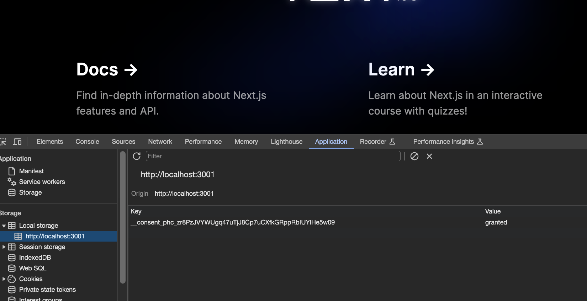
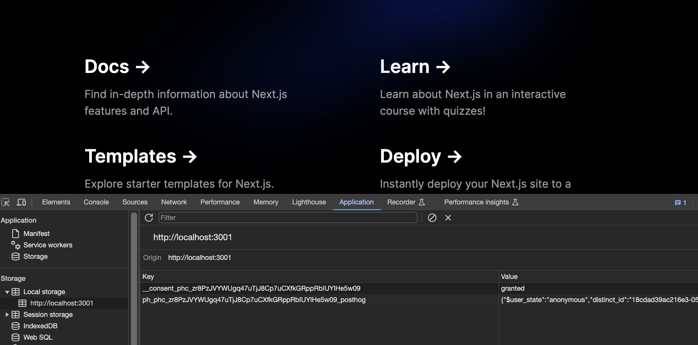

To ensure compliance with privacy regulations like GDPR, you may need to ask for consent from users to track them using cookies. PostHog enables you to track users with or without cookies, but you need to set up the logic to ensure you are compliant both ways.

In this tutorial, we build a basic Next.js app, set up PostHog, build a cookie consent banner, and add the logic for users to opt-in or out of tracking cookies.

> Don't want to bother with cookies at all? Here's [how to use PostHog without cookie banners](/tutorials/cookieless-tracking).

## Create a Next.js app and add PostHog

First, once [Node is installed](https://nodejs.dev/en/learn/how-to-install-nodejs/), create a Next.js app. Run the command below, select **No** for TypeScript, **Yes** for `use app router`, and the defaults for every other option.

```bash
npx create-next-app@latest cookie-banner
```

To add PostHog to our app, go into your `app` folder and create a `providers.js` file. Here we create a client-side PostHog provider that initializes in a `useEffect` using the project API key and instance address (get them from your [project settings](https://app.posthog.com/project/settings)). Make sure to include the `use client` directive and the `phInstance` state (for future use). Altogether, this looks like this:

```js
// app/providers.js
'use client'
import posthog from 'posthog-js'
import { PostHogProvider } from 'posthog-js/react'
import { useEffect, useState } from 'react'

const ph_project_api_key = '<ph_project_api_key>'

export function PHProvider({ children }) {
  const [phInstance, setPhInstance] = useState(null);

  useEffect(() => {
    const ph = posthog.init(
      ph_project_api_key,
      {
        api_host: '<ph_instance_address>',
      }
    );
    setPhInstance(ph || null);
  }, []);

  return <PostHogProvider client={posthog}>{children}</PostHogProvider>;
}
```

We can then import the `PHProvider` component from the `provider.js` file in our `app/layout.js` file, and wrap our app in it.

```js
// app/layout.js
import { PHProvider } from './providers'

export default function RootLayout({ children }) {
  return (
    <html lang="en">
      <PHProvider>
        <body>{children}</body>
      </PHProvider>
    </html>
  )
}
```

After setting this up and running `npm run dev`, PostHog starts autocapturing events, but a PostHog-related cookie is set for the user without their consent.


## Creating a cookie banner

Create another file in the `app` folder named `banner.js` for the banner component with a bit of text explaining cookies and buttons to accept or decline.

Importantly, to avoid a hydration error, we must check if the frontend has mounted and only show the component if so. We can use `useState` and `useEffect` to do this. Together, this looks like this:

```js
// app/banner.js
'use client';
import { useEffect, useState } from "react";

export function Banner() {
  const [showBanner, setShowBanner] = useState(false);

  useEffect(() => {
    setShowBanner(true);
  }, []);

  return (
    <div>
      <p>
        We use tracking cookies to understand how you use 
        the product and help us improve it.
        Please accept cookies to help us improve.
      </p>
      <button type="button">Accept cookies</button>
      <span> </span>
      <button type="button">Decline cookies</button>
    </div>
  )
}
```

After creating this, we import the component into `layout.js` and set it up inside our `PHProvider` and `body` components:

```js
import './globals.css'
import { PHProvider } from './providers'
import Banner from './banner'

export default function RootLayout({ children }) {
  return (
    <html lang="en">
      <PHProvider>
        <body>
          {children}
          <Banner />
        </body>
      </PHProvider>
    </html>
  )
}
```

This creates an ugly but functional cookie banner at the bottom of our site. You can customize and style it how you want.


## Adding the consent context

Next, we set up the logic to manage the consent state. To do this, we create a `consent.js` file in the `app` folder and set up a context using `createContext` and `useContext`.

```js
// app/consent.js
'use client'
import { createContext, useContext } from 'react'

const ConsentContext = createContext(undefined);

export const useConsent = () => {
  const context = useContext(ConsentContext);
  if (context === undefined) {
    throw new Error('useConsent must be used within a ConsentProvider');
  }
  return context;
};
```

After doing this, we can set up a provider to pass this context to the rest of the app. This provider also includes a way to update the consent state, which our banner uses. Doing this requires setting up a context `useState`, a `useEffect` to set the initial state, and `localStorage` calls to get and save the state. Altogether, this looks like this:

```js
// app/consent.js
'use client'
import { useEffect, useState, createContext, useContext } from 'react'

const ph_project_api_key = '<ph_project_api_key>'
const consentKey = `__consent_${ph_project_api_key}`;

const ConsentContext = createContext(undefined);

export const useConsent = () => {
  const context = useContext(ConsentContext);
  if (context === undefined) {
    throw new Error('useConsent must be used within a ConsentProvider');
  }
  return context;
};

export const ConsentProvider = ({ children }) => {
  const [consent, setConsent] = useState('initiating');

  useEffect(() => {
    // Access localStorage only after the component mounts, i.e., on the client side
    const storedConsent = localStorage.getItem(consentKey);
    if (storedConsent) {
      setConsent(storedConsent);
    }
  }, []);

  const updateConsent = (newConsent) => {
    // Only update consent if the user hasn't made a decision yet
    if (['granted', 'denied'].includes(consent)) {
      return;
    }
    setConsent(newConsent);
    if (typeof window !== 'undefined') {
      localStorage.setItem(consentKey, newConsent);
    }
  };

  return (
    <ConsentContext.Provider value={{ consent, updateConsent, setConsent }}>
      {children}
    </ConsentContext.Provider>
  );
};
```

Finally, we add the consent provider to our `layout.js` file and wrap our app in it.

```js
import './globals.css'
import { PHProvider } from './providers'
import { ConsentProvider } from './consent'
import Banner from './banner'

export default function RootLayout({ children }) {
  return (
    <html lang="en">
      <ConsentProvider>
        <PHProvider>
          <body>
            {children}
            <Banner />
          </body>
        </PHProvider>
      </ConsentProvider>
    </html>
  )
}
```

## Setting the consent state with the cookie banner

We want the cookie banner to control the consent state so we can use it to initialize PostHog either with or without cookies. We also want to use it to hide the banner when the user makes a decision.

To do this:

1. In `banner.js`, import the `useConsent` hook from `consent.js` and add it to the component.

2. Modify the `useEffect` to update consent state to `undecided` on load and only show the banner if the user hasn't made a decision yet.

3. Return `null` if the `showBanner` state is false.

4. Set up click handlers for the accept and decline buttons that call the `updateConsent` function and hide the banner.

Together, this looks like this:

```js
// app/banner.js
'use client';
import { useEffect, useState } from "react";
import { useConsent } from "./consent";

export function Banner() {
  const [showBanner, setShowBanner] = useState(false);
  const { consent, updateConsent, setConsent } = useConsent();

  useEffect(() => {

    if (consent === 'granted' || consent === 'denied') {
      setShowBanner(false);
      return
    }

    if (consent === 'undecided') {
      setShowBanner(true);
      return
    }

    // Once loaded and consent is 'initiating', 
    // set consent to 'undecided'
    if (consent === 'initiating') {
      setConsent('undecided');
    }
  }, [consent]);

  if (!showBanner) return null;

  const acceptCookies = () => { 
    updateConsent('granted');
    setShowBanner(false);
  };

  const declineCookies = () => {
    updateConsent('denied');
    setShowBanner(false);
  };

  return (
    <div>
      <p>
        We use tracking cookies to understand how you use 
        the product and help us improve it.
        Please accept cookies to help us improve.
      </p>
      <button type="button" onClick={acceptCookies}>
        Accept cookies
      </button>
      <span> </span>
      <button type="button" onClick={declineCookies}>
        Decline cookies
      </button>
    </div>
  )
}
```

Once done, the banner hides when a user makes a decision and their consent state is saved in local storage.



## Initializing PostHog based on consent state

The last thing we want to do is control how we initialize PostHog based on the consent state. The two ways we want to initialize PostHog are:

1. If the consent state is undecided or denied, initialize PostHog without cookies (memory).

2. If the consent state is granted, initialize PostHog with cookies and local storage.

To do this, we go back to our `providers.js` file, import `useConsent` and handle the possible states in our `useEffect` call. We also want to bootstrap the user `distinct_id` when we go from undecided to granted to ensure the same user is tracked consistently. Altogether, this looks like this:

```js
// app/providers.js
'use client'
import posthog from 'posthog-js'
import { PostHogProvider } from 'posthog-js/react'
import { useEffect, useState } from 'react'
import { useConsent } from './consent'

export function PHProvider({ children }) {
  const { consent } = useConsent();
  const [phInstance, setPhInstance] = useState(null);

  useEffect(() => {
    const initPostHog = (mode) => {
      const ph = posthog.init(
        '<ph_project_api_key>',
        {
          persistence: mode === 'memory' ? 'memory' : 'localStorage+cookie',
          api_host: '<ph_instance_address>',
          ...(mode !== 'memory' && { bootstrap: { distinctID: phInstance?.get_distinct_id() } }),
        },
        mode
      );
      setPhInstance(ph || null);
    };

    if (consent === 'initiating' || (phInstance && consent !== 'granted')) {
      return;
    }
    if (consent === 'undecided' || consent === 'denied') {
      initPostHog('memory');
    } else if (consent === 'granted') {
      initPostHog('cookie');
    }
  }, [consent]);

  return <PostHogProvider client={posthog}>{children}</PostHogProvider>;
}
```

Now, when users accept cookies, PostHog is initialized with data in cookies and local storage. When they decline, it is initialized without cookies (memory).



## Further reading

- [How to use PostHog without cookie banners](/tutorials/cookieless-tracking)
- [How to set up Next.js A/B tests](/tutorials/nextjs-ab-tests)
- [How to set up Next.js app router analytics, feature flags, and more](/tutorials/nextjs-app-directory-analytics)
