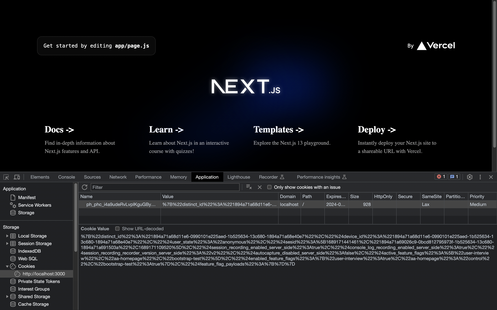
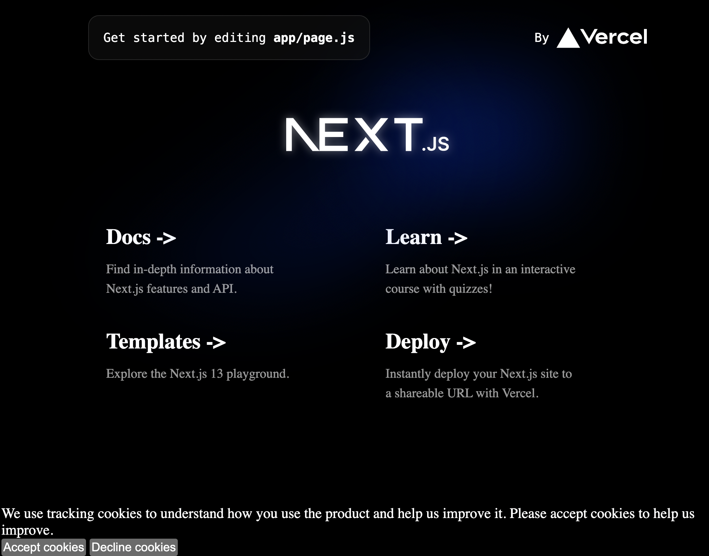
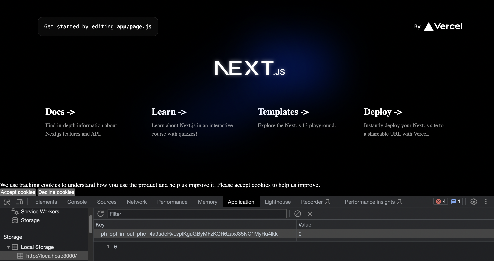

To ensure compliance with privacy regulations like GDPR, you may need to ask for content from users to track them using cookies. PostHog has tools to help you give users the ability to opt-in or out. 

In this tutorial, we build a basic Next.js app, set up PostHog, build a cookie consent banner, and connect it to PostHog’s tracking and cookie management.

> Don't want cookies? Here's [how to use PostHog without cookie banners](/tutorials/cookieless-tracking).

## Create a Next.js app and add PostHog

First, once [Node is installed](https://nodejs.dev/en/learn/how-to-install-nodejs/), create a Next.js app. Run the command below, select **No** for TypeScript, **Yes** for `use app router`, and the defaults for every other option.

```bash
npx create-next-app@latest cookie-banner
```

To add PostHog to our app, go into your `app` folder and create a `providers.js` file. Here we create a client-side PostHog initialization using the project API key and instance address (you  get them from your [project settings](https://app.posthog.com/project/settings)). Make sure to include the`use client` directive as well as a check for the window as initializing PostHog needs to happen on the client-side. Altogether, this looks like this:

```js
// app/providers.js
'use client'
import posthog from 'posthog-js'
import { PostHogProvider } from 'posthog-js/react'
if (typeof window !== 'undefined') {
  posthog.init('<ph_project_api_key>', {
    api_host: '<ph_instance_address>'
  })
}
export function PHProvider({ children }) {
  return <PostHogProvider client={posthog}>{children}</PostHogProvider>
}
```

We can then import the `PHProvider` component from the`provider.js` file in our `app/layout.js` file, and wrap our app in it.

```js
// app/layout.js
import { PHProvider } from './providers'

export default function RootLayout({ children }) {
  return (
    <html lang="en">
      <PHProvider>
        <body>{children}</body>
      </PHProvider>
    </html>
  )
}
```

After setting this up and running `npm run dev`, PostHog starts autocapturing events, but a PostHog-related cookie is set for the user without their consent. So, let's set up a cookie consent banner!



## Creating a cookie banner

Create another file in the `app` folder named `banner.js`for the banner component with a bit of text explaining cookies and buttons to accept or decline.

Importantly, to avoid a hydration error, we must check if the frontend has mounted and only show the component if so. We can use `useState` and `useEffect` to do this. Together, this looks like this:

```js
// app/banner.js
'use client';
import { useEffect, useState } from "react";

export default function Banner() {
  const [showBanner, setShowBanner] = useState(false);

  useEffect(() => {
    setShowBanner(true);
  }, []);

  if (!showBanner) {
    return null;
  }

  return (
    <div>
      <p>
        We use tracking cookies to understand how you use 
        the product and help us improve it.
        Please accept cookies to help us improve.
      </p>
      <button type="button">Accept cookies</button>
      <span> </span>
      <button type="button">Decline cookies</button>
    </div>
  )
}
```

After creating this, we import the component into `layout.js` and set it up inside our `PHProvider` component:

```js
import './globals.css'
import { PHProvider } from './providers'
import Banner from './banner.js'

export default function RootLayout({ children }) {
  return (
    <html lang="en">
      <PHProvider>
        <body>{children}</body>
	      <Banner />
      </PHProvider>
    </html>
  )
}
```

This creates an ugly but functional cookie banner at the bottom of our site you can customize and style how you want.



## Adding the opt-in and out logic

To make this cookie banner control the cookies, we add PostHog and use it to opt-in or out of tracking cookies. Import the `usePostHog` hook and set up functions to either trigger the PostHog methods `opt_in_capturing()` or `opt_out_capturing()` depending on what button they click.

```js
// app/banner.js
'use client';
import { useEffect, useState } from "react";
import { usePostHog } from "posthog-js/react";

export default function Banner() {

  const posthog = usePostHog();
  const [showBanner, setShowBanner] = useState(false);

  useEffect(() => {
    setShowBanner(true);
  }, []);

  if (!showBanner) {
    return null;
  }

  const acceptCookies = () => { 
    posthog.opt_in_capturing(); // new
  };

  const declineCookies = () => {
    posthog.opt_out_capturing(); // new
  };

  return (
    <div>
      <p>
        We use tracking cookies to understand how you use
        the product and help us improve it.
        Please accept cookies to help us improve.
      </p>
      <button type="button" onClick={acceptCookies}>
        Accept cookies
      </button>
      <span> </span>
      <button type="button" onClick={declineCookies}>
        Decline cookies
      </button>
    </div>
  )
}
```

Now when we click these buttons, they set a value in local storage saying whether the user has opted in or out. If they opt-out, it also removes the set cookies.



## Conditionally rendering the banner

Lastly, we need the banner to disappear when the user has opted in or out and not show up on future visits if so. To do this, we can check the methods `has_opted_out_capturing` and `has_opted_in_capturing`, and if either is true, return `null` (like we do before the frontend has mounted). Our `useEffect` call now looks like this:

```js
useEffect(() => {
  if (!(posthog.has_opted_in_capturing() || posthog.has_opted_out_capturing())) {
    setShowBanner(true);
  }
}, []);
```

This hides the banner on future visits, but we also want to hide it right away when they click the button. To do this, we call `setShowBannner(false)` when users click either of the cookie buttons like this:

```js
const acceptCookies = () => { 
  posthog.opt_in_capturing();
  setShowBanner(false);
};

const declineCookies = () => {
  posthog.opt_out_capturing();
  setShowBanner(false);
};
```

Now we have a banner controlling tracking cookies for our app that renders conditionally based on if they accepted cookies or not.

## Further reading

- [How to use PostHog without cookie banners](/tutorials/cookieless-tracking)
- [How to set up Next.js A/B tests](/tutorials/nextjs-ab-tests)
- [How to set up Next.js 13 app directory analytics, feature flags, and more](/tutorials/nextjs-app-directory-analytics)