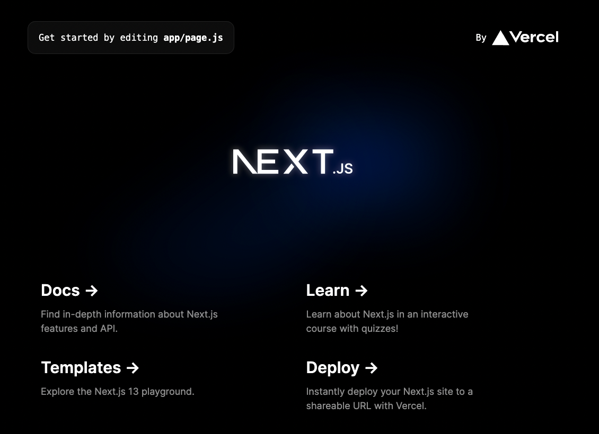
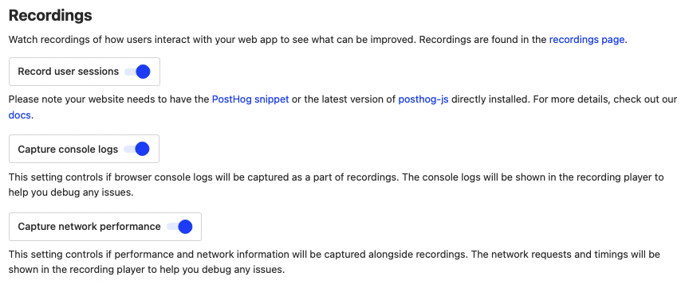
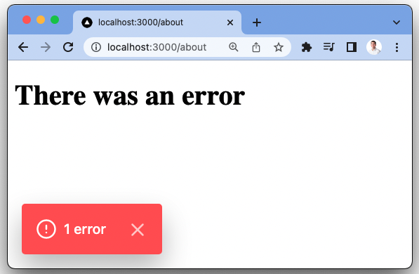
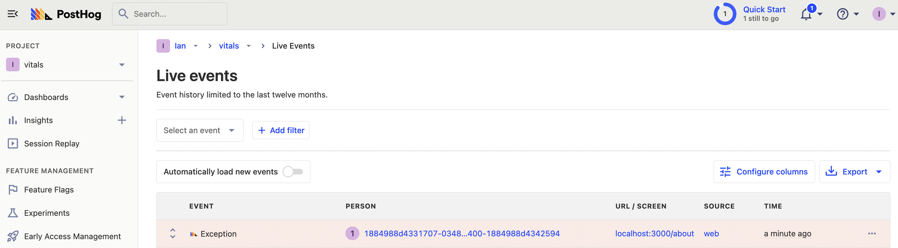
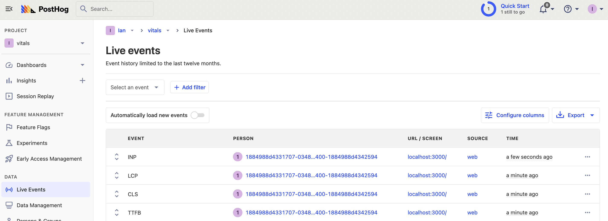
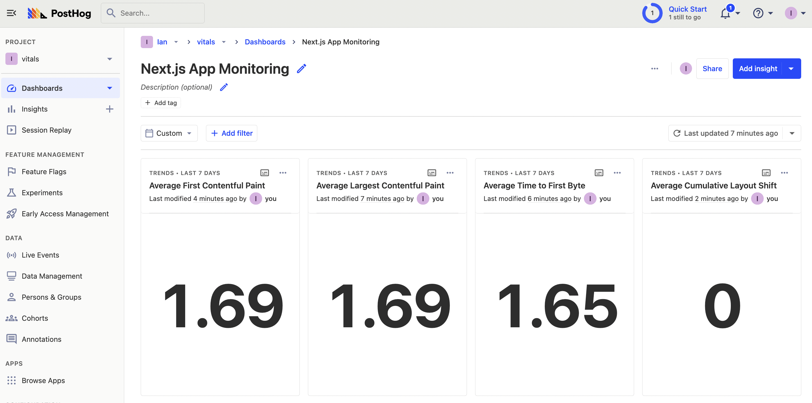
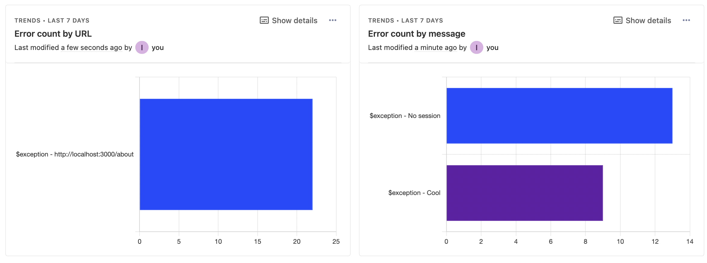

Monitoring a Next.js app for performance regressions, loading speed, and errors helps you be confident your app is providing the best possible experience. [Real user monitoring](/blog/real-user-monitoring) is a best practice for apps looking to optimize their user experience.

In this tutorial, we'll create a basic Next.js app, setup PostHog to monitor errors and performance, and then build a dashboard to analyze this information.

> Already have a Next.js app? [Click here to skip to the PostHog installation](#set-up-posthog).

## Create a Next.js app

To create a Next.js app, run the following command, choose **not** to use TypeScript, and the defaults for all the other options (including using the app router).

```bash
npx create-next-app@latest monitor
```

After installing and creating all the files, go into your newly created `monitor` folder and start the server.

```bash
cd monitor
npm run dev
```

This starts up your Next.js site, which we can now add PostHog to set up monitoring.



## Set up PostHog

To add PostHog, install [`posthog-js`](/docs/libraries/js). 

```bash
npm i posthog-js
```

After this, create a `providers.js` file in your `app` folder. In this file, set up PostHog for the client using the `PostHogProvider` component as well as your project API key and instance address, which you can get from the getting started flow or [your project settings](https://app.posthog.com/project/settings).

```js
// app/provider.js
'use client'
import posthog from 'posthog-js'
import { PostHogProvider } from 'posthog-js/react'

if (typeof window !== 'undefined') {
  posthog.init('<ph_project_api_key>', {
    api_host: '<ph_client_api_host>'
  })
}

export default function PHProvider({ children }) {
  return <PostHogProvider client={posthog}>{children}</PostHogProvider>
}
```

Once created, import and add the provider to your `layout.js` file. 

```js
// app/layout.js
import './globals.css'
import Providers from './providers'

export default function RootLayout({ children }) {
  return (
    <html lang="en">
      <Providers>
        <body>{children}</body>
      </Providers>
    </html>
  )
}
```

Once this is set up, go to your [project settings](https://app.posthog.com/project/settings), and make sure:

- [Autocapture](/docs/data/autocapture) is enabled
- Under [recordings](https://app.posthog.com/project/settings#recordings), record user sessions, capture console logs, and capture network performance are all enabled.



Enabling these provides the key monitoring tools including performance monitoring, app usage, and session replays. It also enables capturing custom events which we use for errors and more performance data next.

## Custom error capture

Error capture gives you insights into the errors your users experience. There are two ways to set this up with PostHog:

1. You could set up and use our [Sentry integration](/docs/libraries/sentry). 
2. Alternatively, you could set up custom error capture (shown below).

To set up custom error capturing, we can create a [React error boundary](https://nextjs.org/docs/pages/building-your-application/configuring/error-handling#handling-client-errors):

1. In the `app` folder, create a file named `error.js`. 
2. In this file, set up a basic component that uses `usePostHog` to capture an `$exception` event and returns an error page. 

It should look like this:

```js
'use client'
import { usePostHog } from 'posthog-js/react'

export default function Error({ error }) {
  const posthog = usePostHog()
  posthog?.capture('$exception', {
    message: error.message,
  })
  
  return (
    <div>
      <h1>There was an error</h1>
    </div>
  )
}
```

Now, in your `app` folder, create a new folder named `about` and add a file named `page.js`. In this file, set up a component that throws an error:

```js
// app/about/page.js
const session = null

export default function About() {

  if (!session) {
    throw new Error('No session')
  }

  return (
    <h1>Home</h1>
  )
}
```

When you go to `http://localhost:3000/about`, you'll see the error page.



This also captures an `exception` event in PostHog with details like the current URL, OS, browser, time, and more.



This will capture errors thrown in your app (wherever they happen) into PostHog.

## Custom performance capture

Another key part of monitoring your Next.js app is performance monitoring. Session replays track performance metrics like First Contentful Paint, DOM interactive, and page loaded times at a session level. If you want these values in the aggregate, we can capture them using `useReportWebVitals`.

To set this up, create a new file in your `app` folder named `web-vitals.js`. In this file, import `useReportWebVitals` and `usePostHog`, then export a function that captures an event with the same name as the metric with all the metric details as properties.

```js
// app/web-vitals.js
'use client'
import { useReportWebVitals } from 'next/web-vitals';
import { usePostHog } from 'posthog-js/react' 
 
export function WebVitals() {
  const posthog = usePostHog()

  useReportWebVitals((metric) => {
    posthog.capture(metric.name, metric)
  });
}
```

Once created, add your `WebVitals` component to your `layout.js` file.

```js
// app/layout.js
import Providers from './providers'
import { WebVitals } from './web-vitals'

export default function RootLayout({ children }) {
  return (
    <html lang="en">
      <Providers>
        <body>
          <WebVitals />
          {children}
        </body>
      </Providers>
    </html>
  )
}
```

Once done, you'll start to see performance metrics in your PostHog instance.



> **Note:** you might want to filter for specific web vital events by checking their name or sample using specific criteria as this method generates **a lot of events** for each pageview.

## Creating a monitoring dashboard

With everything set up for monitoring our Next.js app, we can create a dashboard that gives us a complete overview. On this dashboard, we will create insights for page load, time to first byte, first contentful paint, cumulative layout shift, and errors.

To start, go to the [dashboards tab](https://app.posthog.com/dashboard), click new dashboard, choose blank dashboard, and then add an insight. 

We start with averages for our page load metrics. Select `LCP` as your series, then aggregate by average property value, select value as your property, enable formula mode, and divide `A` by 1000 to get seconds. Both the trend and number chart type work well for this. Once done, click "Save & add to dashboard." 


Afterward, you can create similar insights the other performance metrics like TTFB, FCP, and CLS. Your dashboard will look like this:



Next, we can analyze our errors. We can create insights for errors broken down by current URL and message. Use the `Exception` event as the series, aggregate by total count, break down by current URL, and choose the total value bar chart. You can duplicate the insight, change the breakdown to `message`, and add both to your dashboard.



This gives you a base dashboard to monitor your Next.js application. Some more insights you could add to your monitoring dashboard include:

- 90, 95, 99% percentile values for performance metrics.
- Exceptions broken down by users.
- User path to exception.
- Total rageclicks broken down by URLs.

For all of these insights, you can click the visualization to list the users and sessions that make up the data. From the modal that pops up, you can go to related replays and see all the details, including the events, console, and performance.


## Further reading

- [Calculating average session duration, time on site, and other session-based metrics](/tutorials/session-metrics)
- [What is real user monitoring (and how to set it up)](/blog/real-user-monitoring)
- [How to improve web app performance using PostHog session replays](/tutorials/performance-metrics)