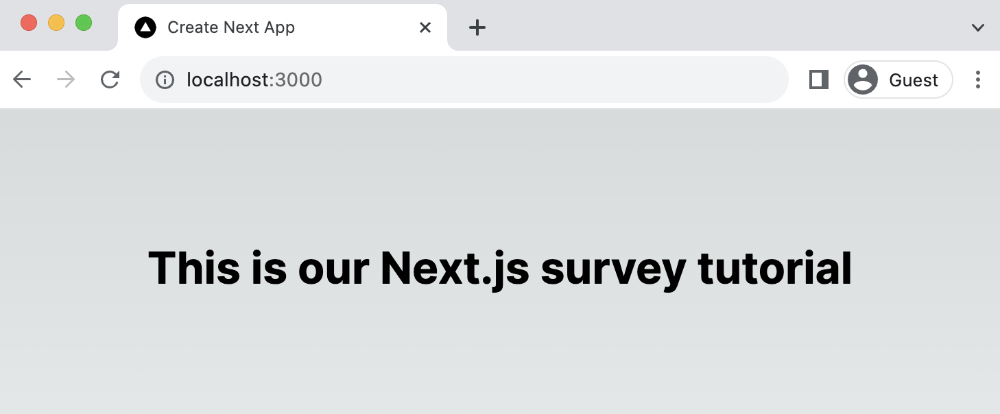
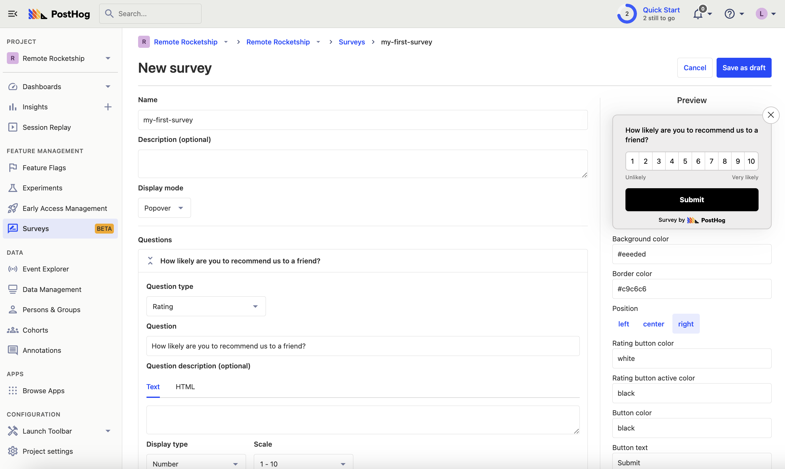
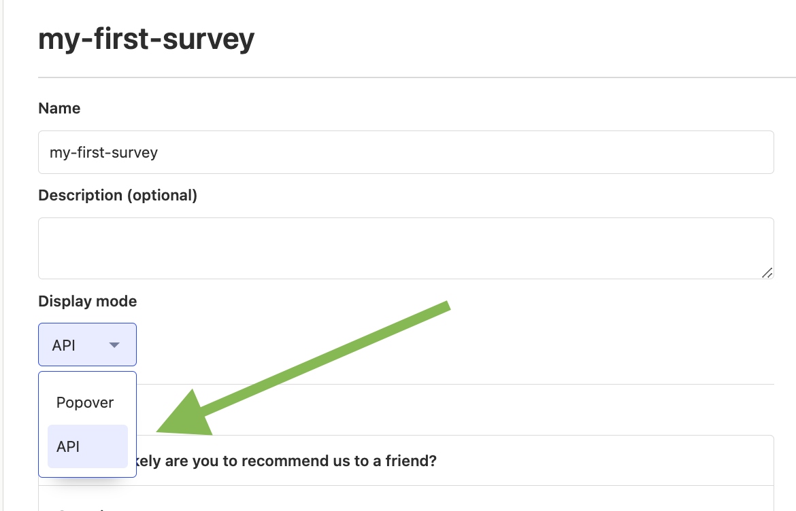
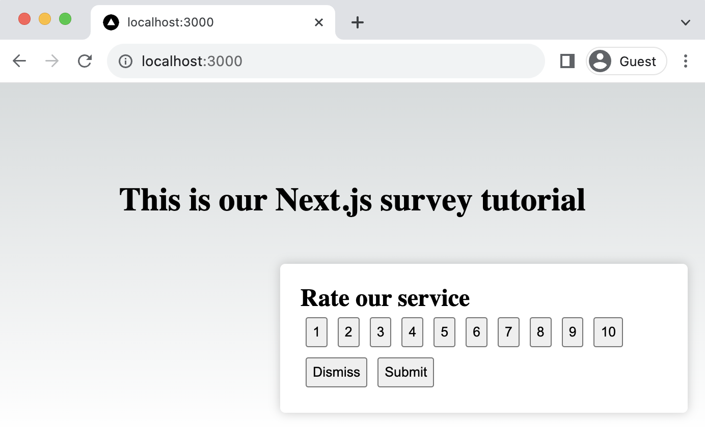
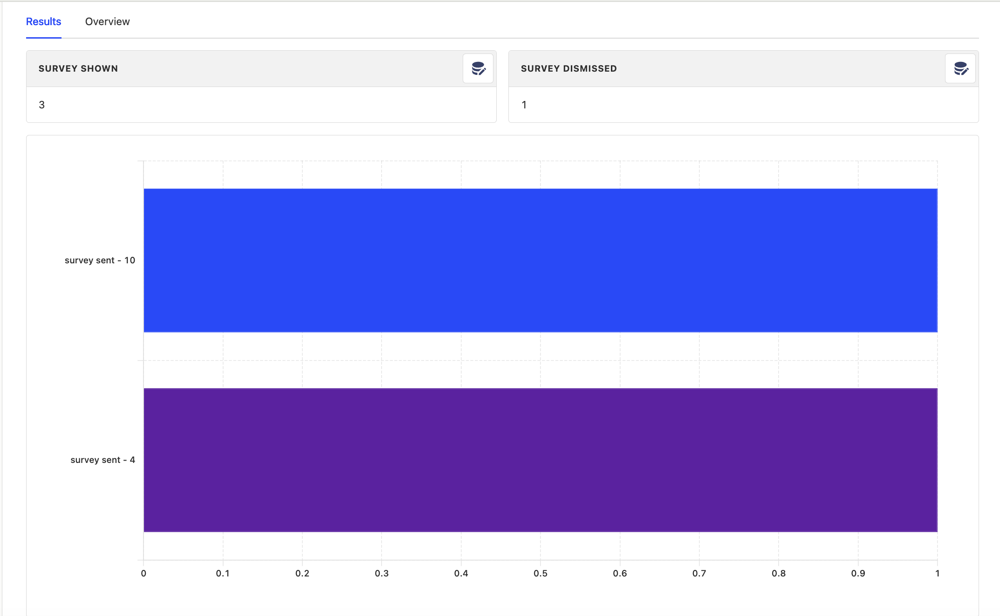

[Surveys](/docs/surveys) are an excellent way to get feedback from your users. In this guide, we show you how to add a survey to your Next.js app.

We'll create a basic Next.js app, add PostHog, create a survey, and then show you how to display the survey in the app and get responses.

> Already have a Next.js app? [Skip to adding PostHog](#adding-posthog).

## Creating a Next.js app

First, make sure [Node is installed](https://nodejs.dev/en/learn/how-to-install-nodejs/) (14.6.0 or newer). Then create a Next.js app:

```bash
npx create-next-app@latest
```

Name it whatever you like (we call ours `next-surveys`). Select **No** for TypeScript, **Yes** for `use app router`, **No** for Tailwind CSS and the defaults for every other option.

Next, replace the placeholder code in `app/page.js` with the following:

```js
// app/page.js
'use client'

import styles from './page.module.css'

export default function Home() {
  return (
    <main className={styles.main}>
      <div className="App">
        <h1>This is our Next.js survey tutorial</h1>
      </div>
    </main>
  )
}
```

Finally, run `npm run dev` and go to `http://localhost:3000` to see our new homepage.



## Adding PostHog

We'll use PostHog to create and control our survey as well as monitor results. If you don't have a PostHog instance, you can [sign up for free here](https://app.posthog.com/signup). 

First, set up PostHog for use on the [client-side](/docs/libraries/next-js#app-router) by installing the [JavaScript React SDK](/docs/libraries/react):

```bash
npm install posthog-js
```

Then integrate PostHog by creating a `providers.js` file in your app folder and exporting a `PHProvider` component:

```js-web
// app/providers.js
'use client'

import posthog from 'posthog-js'
import { PostHogProvider } from 'posthog-js/react'

if (typeof window !== 'undefined') {
  posthog.init("<ph_project_api_key>", {
    api_host: "<ph_instance_address>", // usually 'https://app.posthog.com' or 'https://eu.posthog.com'
  })
}

export function PHProvider({ children }) {
  return <PostHogProvider client={posthog}>{children}</PostHogProvider>
}
```

Once created, you can import `PHProvider` into your `layout.js` file and wrap your app with it:

```js-web
// app/layout.js
import './globals.css'
import { PHProvider } from './providers'

export default function RootLayout({ children }) {
  return (
    <html lang="en">
      <PHProvider>
        <body>{children}</body>
      </PHProvider>
    </html>
  )
}
```

To test everything has been set up correctly, you can use `useEffect` and the `usePostHog` hook to capture an event:

```js-web
// app/page.js
'use client'

import { usePostHog } from 'posthog-js/react'
import { useEffect } from 'react'
import styles from './page.module.css'

export default function Home() {
  const posthog = usePostHog()
  useEffect(() => {
    if (posthog) {
      posthog.capture('successfully_setup');
    }
  }, [posthog]); // posthog may be undefined until it initializes, hence using it as a dependency for useEffect

  return (
    <main className={styles.main}>
      <div className="App">
        <h1>This is our Next.js survey tutorial</h1>
      </div>
    </main>
  )
}
```

After reloading `localhost:3000`, you should see events appear in your [PostHog events explorer](https://app.posthog.com/events).


## Creating a survey

There are two options for displaying a survey using PostHog:

1. Use PostHog's prebuilt survey UI.
2. Implement your own survey UI.

This tutorial will cover how to implement both options:

### Option 1: Use PostHog's prebuilt survey UI

This is the simplest option. PostHog has a variety of [survey types](/docs/surveys/creating-surveys#question-type) to choose from, and handles all the display logic and event capture for you.
 
To create a survey with a prebuilt UI, go to the [surveys tab](https://app.posthog.com/surveys), click "New survey," and then set up your survey with the following settings:

1. Add a name (like `my-first-survey`).
2. Set the display mode to `Popover`.
3. Select the `Rating` question type. Set the question title to `How likely are you to recommend us to a friend?`, display type to `number` and scale to `1-10`.
4. Leave the remaining optional properties blank (such as `Targeting` or `Thank you message`).
5. Click "Save as draft" and then on the next screen click "Launch". 



That's it! Your survey is now live and you should see it in your app. After submitting responses, you can [view results in PostHog](#viewing-results).


### Option 2: Implement your own survey UI

First, create a survey in PostHog like in option 1 above, except set the display mode to `API`.



Then, there are three parts to adding code for our custom survey:

1. Create the survey UI.
2. Add the logic for displaying it.
3. Capture interactions from it.

#### 1. Create the survey UI

We've created a sample survey UI for this tutorial. To use it, create a new file in `app` folder called `Survey.js` and paste the following code:

```react
// app/Survey.js
import { useState } from "react";

function Survey({ title, onDismiss, onSubmit }) {
  const [selectedValue, setSelectedValue] = useState(null);

  const handleSelect = (value) => {
    setSelectedValue(value);
  }

  const handleSubmit = () => {
    onSubmit(selectedValue);
  }

  return (
    <div className="survey-popup">
      <h2>{title}</h2>
      <div>
        {[...Array(10)].map((_, i) => (
          <button key={i + 1} onClick={() => handleSelect(i + 1)}>{i + 1}</button>
        ))}
      </div>
      <div>
        <button onClick={onDismiss}>Dismiss</button>
        <button onClick={handleSubmit}>Submit</button>
      </div>
    </div>
  );
}

export default Survey;
```

Then, add the following CSS styles to your `page.module.css` file:

```css
.survey {
  position: fixed;
  bottom: 20px;
  right: 20px;
  width: 400px;
  padding: 20px;
  background-color: #ffffff;
  box-shadow: 0px 0px 10px rgba(0, 0, 0, 0.2);
  border-radius: 5px;
  z-index: 1000;
}

.button {
  margin: 5px;
  padding: 5px;
}
```

Finally, integrate the component into `page.js`:

```react
// app/page.js
'use client'

import { useState } from 'react'
import styles from './page.module.css'
import Survey from './Survey';

export default function Home() {
  const [showSurvey, setShowSurvey] = useState(true);

  const handleDismiss = () => {
    setShowSurvey(false);
    console.log("Survey dismissed!");
  };

  const handleSubmit = (value) => {
    setShowSurvey(false);
    console.log("User submitted:", value);
  };

  return (
    <main className={styles.main}>
      <div className="App">
        <h1>This is our Next.js survey tutorial</h1>
        {showSurvey && (
        <Survey
          title={"Rate our service"}
          onDismiss={handleDismiss}
          onSubmit={handleSubmit}
        />)}
      </div>
    </main>
  )
}
```

This shows a survey popup every time you visit your app's homepage.



#### 2. Add the logic for displaying it.

The first part of handling our display logic is fetching the survey from PostHog. PostHog keeps track of all active surveys for a user (this is especially helpful if you have set up [custom targeting options](/docs/surveys/creating-surveys#targeting)). 

To fetch the active surveys, we use the `usePostHog` hook to call `posthog.getActiveMatchingSurveys()` using `useEffect()`:

```react
// app/page.js
'use client'

import { useState, useEffect } from 'react'
import styles from './page.module.css'
import Survey from './Survey';
import { usePostHog } from 'posthog-js/react';

export default function Home() {
  // ... rest of your code ...

  const posthog = usePostHog()
  useEffect(() => {
    posthog.getActiveMatchingSurveys((surveys) => {
    }); 
  }, [posthog]);
  
  // ... rest of your code ...
}
```

`posthog.getActiveMatchingSurveys()` returns a surveys object that looks like this:

```JSON
[
   {
      "id":"018ad0e0-0de6-0000-6a56-033975bd0c68",
      "name":"my-first-survey",
      "description":"",
      "type":"api",
      "questions":[
         {
            "type":"rating",
            "scale":10,
            "display":"number",
            "question":"How likely are you to recommend us to a friend?",
            "description":"",
            "lowerBoundLabel":"Unlikely",
            "upperBoundLabel":"Very likely"
         }
      ],
      "conditions":null,
      "appearance":{
         "textColor":"black",
         "whiteLabel":false,
         "backgroundColor":"white",
         "submitButtonText":"Submit",
         "ratingButtonColor":"#e0e2e8",
         "submitButtonColor":"#2c2c2c",
         "descriptionTextColor":"#4b4b52",
         "thankYouMessageHeader":"Thank you for your feedback!",
         "displayThankYouMessage":true
      },
      "start_date":"2023-09-26T09:44:31.844000Z",
      "end_date":null
   }
]
```

We can use this survey object to configure our `Survey` component:

```react
  // ... rest of your code ...

  const [surveyTitle, setSurveyTitle] = useState(false);
  const [surveyID, setSurveyID] = useState(false);

  useEffect(() => {
    posthog.getActiveMatchingSurveys((surveys) => {
      if (surveys.length > 0) {
        const survey = surveys[0];
        setSurveyID(survey.id);
        setSurveyTitle(survey.questions[0].question)
      }
    }); 
  }, [posthog])
  
  // ... rest of your code ...

  return (
    <main className={styles.main}>
      <div className="App">
        <h1>This is our Next.js survey tutorial</h1>
        {showSurvey && (
        <Survey
          title={surveyTitle}
          onDismiss={handleDismiss}
          onSubmit={handleSubmit}
        />)}
      </div>
    </main>
  )
```

Finally, we want to make sure we don't show the survey again to users who have either submitted or dismissed it. 

We use [`localStorage`](https://developer.mozilla.org/en-US/docs/Web/API/Window/localStorage) to store this data. We add a check to show the survey based on whether the user has already interacted with it or not:

```react
  // ... rest of your code ...

  const [showSurvey, setShowSurvey] = useState(true);

  useEffect(() => {
    // Check local storage to see if the user has already seen this particular survey
    const hasInteractedWithSurvey = localStorage.getItem(`hasInteractedWithSurvey_${surveyID}`);
    setShowSurvey(!hasInteractedWithSurvey);
  }, [surveyID]);

  const handleDismiss = () => {
    setShowSurvey(false);
    console.log("Survey dismissed!");
    localStorage.setItem(`hasInteractedWithSurvey_${surveyID}`, 'true');
  };

  const handleSubmit = (value) => {
    setShowSurvey(false);
    console.log("User submitted:", value);
    localStorage.setItem(`hasInteractedWithSurvey_${surveyID}`, 'true');  
  };

  // ... rest of your code ...
```

#### 3. Capture interactions from it.

The final step in setting up our survey is capturing interactions. This enables us to analyze the results in PostHog. 

There are 3 events to capture:

1. `"survey shown"`
2. `"survey dismissed"`
3. `"survey sent"` (for responses)

You can capture these events using `posthog.capture()`:

```react
  // ... rest of your code ...

  const handleDismiss = () => {
    setShowSurvey(false);
    console.log("Survey dismissed!");
    localStorage.setItem(`hasInteractedWithSurvey_${surveyID}`, 'true');
    posthog.capture("survey dismissed", {
      $survey_id: surveyID // required
    })
  };

  const handleSubmit = (value) => {
    setShowSurvey(false);
    console.log("User submitted:", value);
    localStorage.setItem(`hasInteractedWithSurvey_${surveyID}`, 'true');  
    posthog.capture("survey sent", {
      $survey_id: surveyID, // required
      $survey_response: value // required
    })
  };

  useEffect(() => {
    if (posthog && surveyID && showSurvey) {
      posthog.capture("survey seen", {
        $survey_id: surveyID // required
      })
    }
  }, [showSurvey, surveyID, posthog])

 // ... rest of your code ...
```

Altogether, your code should look like this:

```react
// app/page.js
'use client'

import { useState, useEffect } from 'react'
import styles from './page.module.css'
import Survey from './Survey';
import { usePostHog } from 'posthog-js/react';

export default function Home() {
  const [showSurvey, setShowSurvey] = useState(true);
  const [surveyTitle, setSurveyTitle] = useState(false);
  const [surveyID, setSurveyID] = useState(false);
  const posthog = usePostHog()

  useEffect(() => {
    posthog.getActiveMatchingSurveys((surveys) => {
      if (surveys.length > 0) {
        const survey = surveys[0];
        setSurveyID(survey.id);
        setSurveyTitle(survey.questions[0].question)
      }
    }); 
  }, [posthog])

  const handleDismiss = () => {
    setShowSurvey(false);
    localStorage.setItem(`hasInteractedWithSurvey_${surveyID}`, 'true');
    posthog.capture("survey dismissed", {
      $survey_id: surveyID // required
    })
  };

  const handleSubmit = (value) => {
    setShowSurvey(false);
    localStorage.setItem(`hasInteractedWithSurvey_${surveyID}`, 'true');  
    posthog.capture("survey sent", {
      $survey_id: surveyID, // required
      $survey_response: value // required
    })
  };

  useEffect(() => {
    if (posthog && surveyID && showSurvey) {
      posthog.capture("survey seen", {
        $survey_id: surveyID // required
      })
    }
  }, [showSurvey, surveyID, posthog])

  return (
    <main className={styles.main}>
      <div className="App">
        <h1>This is our Next.js survey tutorial</h1>
        {showSurvey && (
        <Survey
          title={surveyTitle}
          onDismiss={handleDismiss}
          onSubmit={handleSubmit}
        />)}
      </div>
    </main>
  )
}
```

Our survey is now ready to go! The next step is to submit responses and view your results.

## Viewing results

After interacting with your survey, you can view results by selecting the survey from the [surveys tab](https://app.posthog.com/surveys). You'll see data on:

- How many users have seen the survey.
- How many users have dismissed the survey.
- Responses.

You can also filter these results based on [user properties](/docs/product-analytics/user-properties), [cohorts](/docs/data/cohorts), [feature flags](/docs/feature-flags/creating-feature-flags) and more.



## Further reading

- [How to write great product survey questions (with examples)](/blog/product-survey-questions)
- [Get feedback and book user interviews with surveys](/tutorials/feedback-interviews-site-apps)
- [How to measure your NPS score in PostHog](/tutorials/nps-survey)