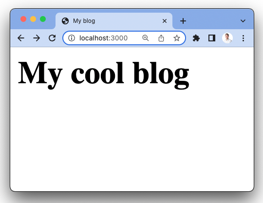
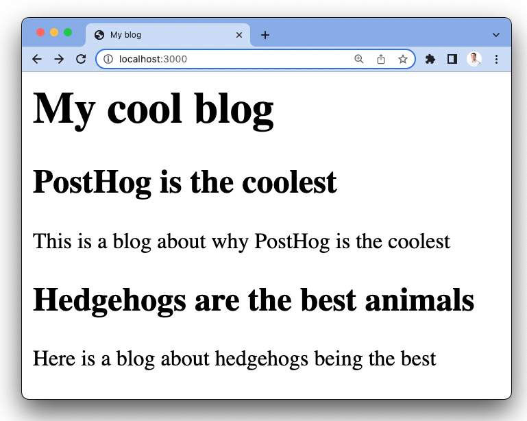
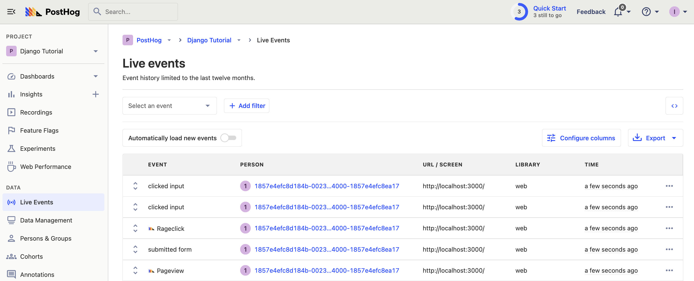
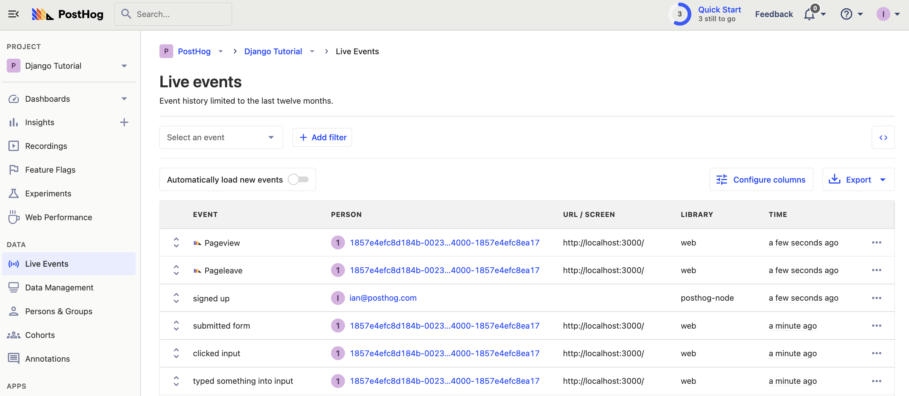
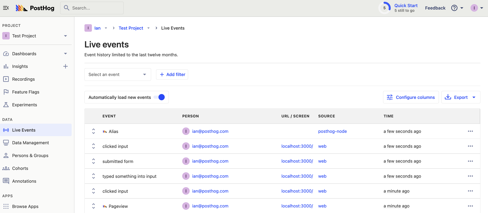
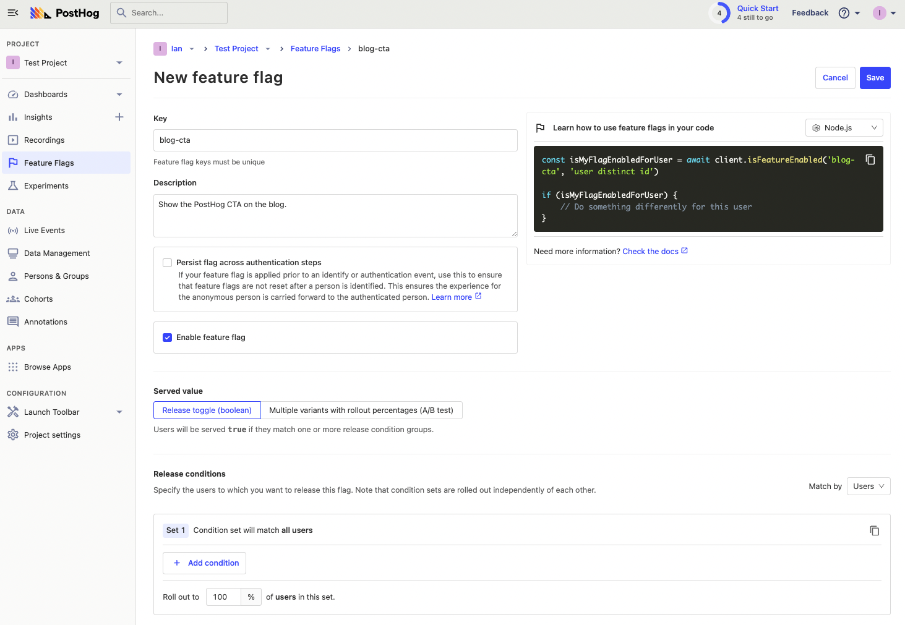
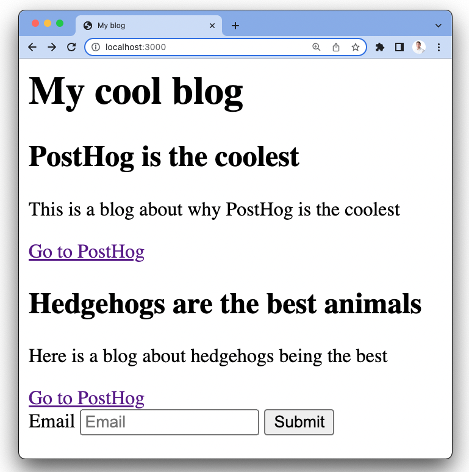

> <p align="center">Open this tutorial in PostHog and follow along step-by-step!</p> <CallToAction href="https://app.posthog.com/#panel=docs:/tutorials/node-express-analytics" size="sm" className="mt-auto self-start sm:w-auto !w-full">Launch tutorial</CallToAction>

Node.js is a JavaScript runtime and server environment. Express.js is a web application framework for Node.js. Express is the most popular backend JavaScript framework and one of the most popular web frameworks across all languages.

This tutorial covers installing Node and Express, building a basic app with them, adding PostHog, and setting up all the tools PostHog offers. This includes feature flags, session recordings, event capture, user identification, and more.

> Already know how to set up an Express app? [Skip the app setup and go straight to the PostHog setup](#3-adding-posthog-to-our-app).

## 1. Setting up a basic Express app

Installing [Node.js](https://nodejs.org/en/) is the first requirement if you haven’t done it. After installing Node, go into your command line, and create a folder for our app. In the folder, install Express, `ejs` (which serves HTML templates), and create a file (named `server.js`) for our app.

```bash
mkdir express-tutorial
cd express-tutorial
npm i express
npm i ejs
touch server.js
```

Create a folder for our `ejs` pages to live in. This requires creating a `views` folder and an `index.ejs` file.

```bash
mkdir views
cd views
touch index.ejs
```

In that `index.ejs` file, we create a basic HTML page with only a head and body for now.

```html
<html>
    <head>
        <title>My blog</title>
    </head>
    <body>
        <h1>My cool blog</h1>
    </body>
</html>
```

Back in `server.js`, add the basic parts of an Express app needed to get a basic homepage up.

```js
const express = require('express');
const app = express();
const port = 3000;

app.set('view engine', 'ejs');

app.get('/', (req, res) => {
    res.render('index')
})

app.listen(port, () => {
    console.log(`Example app listening on port ${port}`)
})
```

This is enough for a basic HTML page. After this, you can run `node server.js` in the terminal to start the server. Going to `http://localhost:3000/` gives you a basic page like this:



This is a great start, but we want something with *pizazz.*

## 2. Building out our Express app

We want this blog to show some posts. To mimic a database connection, add a couple of posts as a constant to our code. We then pass them as an argument while rendering our `index.ejs` file and handle them there.

```js
const express = require('express');
const app = express();
const port = 3000;

const posts = [
    {
        title: 'PostHog is the coolest',
        content: 'This is a blog about why PostHog is the coolest'

    },
    {
        title: 'Hedgehogs are the best animals',
        content: 'Here is a blog about hedgehogs being the best'
    }
]

app.set('view engine', 'ejs');

app.get('/', (req, res) => {
    res.render('index', {
        posts: posts // new
    })
})

app.listen(port, () => {
    console.log(`Example app listening on port ${port}`)
})
```

In our `index.ejs` file, loop through the posts and display the title and content for each of them. `ejs` is nice because it can use normal JavaScript and HTML in the template.

```js
<html>
    <head>
        <title>My blog</title>
    </head>
    <body>
        <h1>My cool blog</h1>
        <% for (var i = 0; i < posts.length; i++) { %>
            <h2><%= posts[i].title %></h2>
            <p><%= posts[i].content %></p>
        <% } %>
    </body>
</html>
```

This gives us a page like this:



### Adding a form

With the blog part finished, we want to add a form so people can submit their emails. This mimics a login for us and is useful for showcasing PostHog’s functionality. Of course, you could set up a full authentication flow or a library like [Passport](https://www.passportjs.org/), but we focus on PostHog here.

In the `index.ejs` file, add a simple form that posts to `/email/`.

```js
<html>
    <head>
        <title>My blog</title>
    </head>
    <body>
        <h1>My cool blog</h1>
        <% for (var i = 0; i < posts.length; i++) { %>
            <h2><%= posts[i].title %></h2>
            <p><%= posts[i].content %></p>
        <% } %>
        <form method="post" action="/email/">
            <label for="email">Email</label>
            <input type="text" name="email" id="email" placeholder="Email">
            <input type="submit" value="Submit">
        </form>
    </body>
</html>
```

In `server.js`, we need to set up the `/email` route. This requires setting the `urlencoded` middleware to handle post requests and adding the route as an `app.post`. We just `console.log` the response for now. This looks like this:

```js
//
// ...

app.set('view engine', 'ejs');
app.use(express.urlencoded({ extended: false })) // new

app.get('/', (req, res) => {
    res.render('index', {
        posts: posts
    })
})

app.post('/email', (req, res) => { // new
    console.log(req.body.email)
})

app.listen(port, () => {
    console.log(`Example app listening on port ${port}`)
})

```

Now, you have a basic blog that enables us to setup the features of PostHog in Node and Express.

## 3. Adding PostHog to our app

With our Express app all setup, we can add PostHog. There are two ways to do this, with the snippet and with the Node library.

### Install the PostHog script snippet

The snippet is a quick way to set up PostHog and begin capturing data. It automatically captures events like pageviews, clicks, inputs, and more. It also records sessions (if you turn that on in your Project settings). 

You can find your snippet when you start a new project or in your project settings. Copy it and add it to the header of your `index.ejs` file. 

```html
<head>
    <title>My blog</title>
    <script>
        !function(t,e){var o,n,p,r;e.__SV||(window.posthog=e,e._i=[],e.init=function(i,s,a){function g(t,e){var o=e.split(".");2==o.length&&(t=t[o[0]],e=o[1]),t[e]=function(){t.push([e].concat(Array.prototype.slice.call(arguments,0)))}}(p=t.createElement("script")).type="text/javascript",p.async=!0,p.src=s.api_host+"/static/array.js",(r=t.getElementsByTagName("script")[0]).parentNode.insertBefore(p,r);var u=e;for(void 0!==a?u=e[a]=[]:a="posthog",u.people=u.people||[],u.toString=function(t){var e="posthog";return"posthog"!==a&&(e+="."+a),t||(e+=" (stub)"),e},u.people.toString=function(){return u.toString(1)+".people (stub)"},o="capture identify alias people.set people.set_once set_config register register_once unregister opt_out_capturing has_opted_out_capturing opt_in_capturing reset isFeatureEnabled onFeatureFlags getFeatureFlag getFeatureFlagPayload reloadFeatureFlags group updateEarlyAccessFeatureEnrollment getEarlyAccessFeatures getActiveMatchingSurveys getSurveys".split(" "),n=0;n<o.length;n++)g(u,o[n]);e._i.push([i,s,a])},e.__SV=1)}(document,window.posthog||[]);
        posthog.init('<ph_project_api_key>',{api_host:'<ph_instance_address>'})
    </script>
</head>
<html>
    <body>
        <h1>My cool blog</h1>
        <% for (var i = 0; i < posts.length; i++) { %>
            <h2><%= posts[i].title %></h2>
            <p><%= posts[i].content %></p>
        <% } %>
        <form method="post" action="/email/">
            <label for="email">Email</label>
            <input type="text" name="email" id="email" placeholder="Email">
            <input type="submit" value="Submit">
        </form>
    </body>
</html>
```

Reload the page, click around, and you should start to see some events in your PostHog instance.



> If you have multiple pages (others besides `index.ejs`), use partials or `include`. This adds the header on every page so that the PostHog snippet loads everywhere. 

### Installing the PostHog Node.js library

The snippet is great for autocapture, session recordings, and the basics. If you want all the features PostHog provides and more customizability, install the PostHog Node library. To do this, run:

```bash
npm i posthog-node
```

Next, add PostHog to the `server.js` file.

```js
// ...

const { PostHog } = require('posthog-node') // new
const ph_project_api_key = '<ph_project_api_key>'
const client = new PostHog(
    ph_project_api_key,
    { host: '<ph_instance_address>'}
)

app.set('view engine', 'ejs');
app.use(express.urlencoded({ extended: false }))

app.get('/', (req, res) => {
    res.render('index', {
        posts: posts
    })
})

app.post('/email', (req, res) => {
    console.log(req.body.email)
})

app.listen(port, () => {
    console.log(`Example app listening on port ${port}`)
})

client.shutdown() // new
```

You can install the Node library alongside the snippet to capture the most amount of data and get access to all the tools. Once done, we can start to set up more of PostHog’s features.

## 4. Setting up event capture, identification, and feature flags

Now that we’ve installed the library, we have access to all the features of PostHog. This section shows you how to set up custom event capture, user identification, and feature flags. For more features, see our [Node.js documentation](/docs/integrate/server/node).

### Custom event capture

First, let’s set up custom event capture. We’ll capture an event when the user submits their email. To do this, replace the `console.log` with a `client.capture` call with the user and event details. If you set up PostHog in the previous section, all you need to do is change `app.post`.

```js
app.post('/email', (req, res) => {
    client.capture({
        distinctId: req.body.email,
        event: 'signed_up',
        properties: {
            email: req.body.email
        }
    })
})
```

Submit an email to the form in your app and it shows up as an event in PostHog (see that it comes from the `posthog-node` library).



> Add the `groups` param to a capture call, like `groups: { company: 'posthog' }`), to add a user to a group.

### Combining (aliasing) frontend and backend identities

The problem with this is, right now, we have two different identities for the same person. There is an anonymous ID generated by the client and the email they submitted and used to capture events on the backend. We can combine events from these two using an alias call.

To do this, check the cookies for the user’s frontend distinct ID and call `client.alias`. First, install `cookie-parser`.

```bash
npm i cookie-parser
```

Next, add it to our code and activate it.

```js
// ...
const cookieParser = require('cookie-parser')

app.set('view engine', 'ejs');
app.use(express.urlencoded({ extended: false }))
app.use(cookieParser());
// ...
```

Finally, use the cookie parser, along with a JSON parse to get the cookie object and a distinct ID from that object. Alias that value with the email to combine the two. Our `app.post` route looks like this:

```js
app.post('/email', (req, res) => {
    client.capture({
        distinctId: req.body.email,
        event: 'signed_up',
        properties: {
            email: req.body.email
        }
    })
    
    const anonId = JSON.parse(req.cookies[`ph_${ph_project_api_key}_posthog`])['distinct_id']
    client.alias({
        distinctId: req.body.email,
        alias: anonId
    })
})
```

This shows up as an alias event in PostHog and you should see the two persons combined into one, under the same email.



From here, you can use `client.identify` to add details about the person. You can do this whenever you want, but now that you combined the person, it is a good time.

```js
client.identify({
    distinctId: req.body.email,
    properties: {
        beta_user: true,
        billing: 'free',
    }
})
```

### Setting up feature flags

The final tool to implement is feature flags. This feature flag shows a call-to-action (CTA) to go to the PostHog site below each blog post. To do this, start by creating a feature flag in PostHog named “blog-cta” and set the release condition to 100% for testing.



Once done, we can copy the Node code PostHog provides and add it to our `app.get` route. In `server.js`, get the distinct ID from cookies again to evaluate the flag. Make the route `async` so we can `await` the feature flag evaluation. Finally, enable the CTA if the feature flag evaluates to `true`. With these changes, the `app.get` route looks like this:

```js
app.get('/', async (req, res) => { // new

    let enableCta = false
    let cookies = req.cookies[`ph_${ph_project_api_key}_posthog`];

    if (cookies) {
        const distinctId = JSON.parse(cookies)['distinct_id'];
        enableCta = await client.isFeatureEnabled('blog-cta', distinctId);
    }

    res.render('index', {
        posts: posts,
        enableCta: enableCta // new
    })
})
```

Finally, in `index.ejs`, add the code to show the CTA that activates when the feature flag is active.

```js
<html>
    <body>
        <h1>My cool blog</h1>
        <% for (var i = 0; i < posts.length; i++) { %>
            <h2><%= posts[i].title %></h2>
            <p><%= posts[i].content %></p>
            <% if (enableCta) { %>
                <a href="http://posthog.com/">Go to PostHog</a>
            <% } %>
        <% } %>
        <form method="post" action="/email/">
            <label for="email">Email</label>
            <input type="text" name="email" id="email" placeholder="Email">
            <input type="submit" value="Submit">
        </form>
    </body>
</html>
```

Once saved, reload the server and webpage. You see an extra CTA pointing to the site.



The CTA should disappear if you turn the feature flag off or clear your cookies (but the site will still work). 

Once confirming this works, you’ve got a basic Express app working with the key tools of PostHog set up. You can add more functionality and dive deeper into PostHog.

## Further reading

- [PostHog Node.js docs](/docs/integrate/server/node)
- [How to set up A/B tests in Node.js (Express)](/tutorials/frontend-vs-backend-group-analytics)
- [What to do after installing PostHog](/tutorials/next-steps-after-installing)
