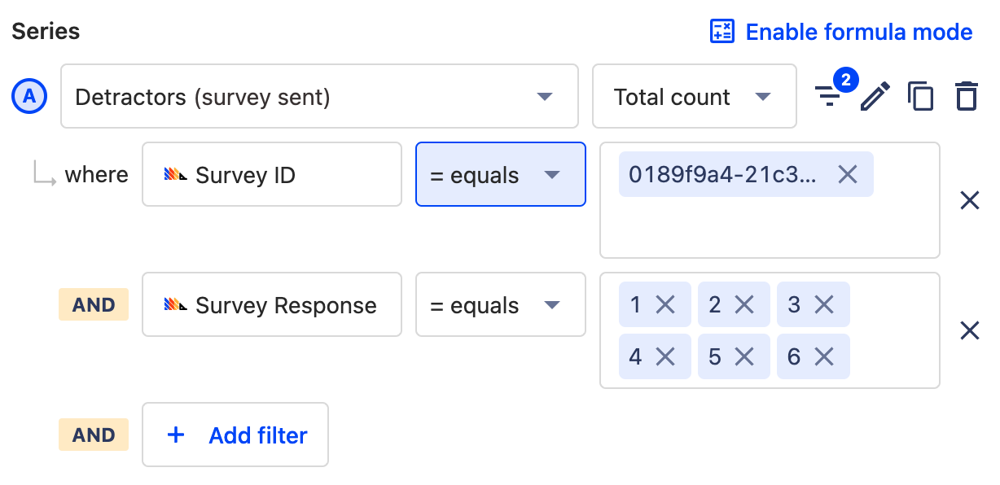
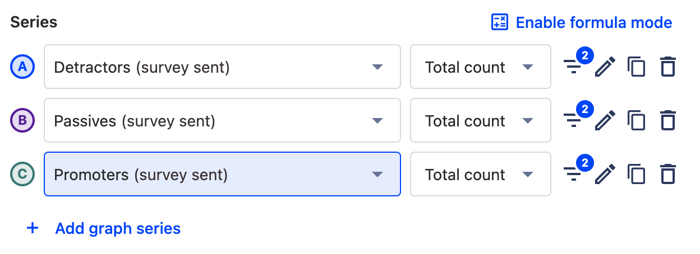

One of the most well-known and useful types of survey for businesses is a Net Promoter Score ([NPS](https://en.wikipedia.org/wiki/Net_promoter_score_)). It acts as a metric for user satisfaction and growth. In its simplest form, it involves asking users likely they are to recommend your product or service, so you can gauge [product-market fit](/blog/measure-product-market-fit). 

This may seem straightforward, but it’s important to follow the methodology and phrasing precisely to collect a valid result. 

In this tutorial, we’ll explain how to measure NPS in PostHog using the surveys tool and how to interpret results. 

### How does NPS work?
Simply put, you ask your users how likely they are to recommend your product to others, on a scale of 0 (unlikely) to 10 (likely). You then group the responses as follows:

- **1 - 6**: Detractors. These users are unlikely to recommend your product and may damage your growth.
- **7 - 8** Passives. These users don't care about your product and are unlikely to contribute to growth.
- **9 - 10** Promoters. These users love your product and actively contribute to growth. 

Obviously, the more promoters you have, the better! 

After running the survey, apply the following calculation: `NPS = % OF PROMOTERS - % DETRACTORS`.

This calculation returns a result ranging from -100 to +100. The higher the score, the better. 

### Creating an NPS survey in PostHog
The first step is to [create a new survey in PostHog](https://app.posthog.com/surveys/new), using the Surveys tool. If it isn’t already selected, set the Display Mode to ‘Popover’.

You can name the survey whatever you want, but it’s important that the customer-facing element asks the question in the same way as any other NPS survey.

To do this, enter **‘How likely are you to recommend this product to a friend?’** in the Question field. Leave the optional description blank. 

NPS surveys collect responses on a scale of 1-10, so set the Question Type to ‘Rating’. Change the Display Type to ‘Number’, and the Scale to ‘1 - 10’. 

We want to make sure that users understand what each number means, so set the Lower Bound Label to ‘Unlikely’ and the Upper Bound Label to ‘Likely’. You should now see a complete NPS survey in the live preview, and can tailor the appearance to match your brand. 

### Targeting your NPS survey
The default behaviour for surveys is to target all users. You can choose to override this and target users based on the URL they are on, user properties, or use a particular feature flag. 

To collect a valid result, you need at least 100 responses, so it’s important not to target too narrowly. However, you _also_ want to target users who are familiar with your product to get a meaningful result. Good options for striking a balance include…

- Using ‘URL contains’ to target users who view a particular page, such as a checkout confirmation page. 

- Using ‘User properties’ to target users in a particular geographical area, or in a dynamic cohort of users that have performed an action (such as completing a purchase).

- Using a linked feature flag to target users who have been trialing a new feature or UI rollout

If you set targeting options for your survey, you also need to decide the release conditions within that target. That is: what percentage of that defined audience will see the survey? The default is 0%, so make sure to set it to a higher value. 

Next, you can save your survey and press Launch to start collecting responses. 

### Calculating your NPS score in PostHog
Once you’ve launched your survey, the next step is to wait for some responses. After that, it’s time to analyze the results!

Start by taking note of the survey ID for your NPS survey, which you can find in the URL of the results page.

> **Can't I use `Survey Name` instead?** Technically, yes. However because it's possible to create surveys with similar names or to rename your survey, the survey ID is a more stable option.

Next, head to the Insights section and [create a new Trends insight](https://app.posthog.com/insights/new). Set the first series event as ‘Survey sent’ and create a filter to specify the Survey ID. Duplicate this series three times.

Next, we start grouping results into Detractors, Passives and Promoters. For the first series, add an additional filter which uses the 'Survey Response' event and filters so that that event is equal to 1, 2, 3, 4, 5, and 6. This is your Detractor cohort. 

Repeat this step for the subsequent series, using the values 7, and 8. These are your Passives. 

Repeat it once more for the final series, using the values 9, and 10. These are your Promoters. 

You can rename series for clarity using the pencil icon. 

Define your time period (typically you’d want to cover at least a few weeks), and the table below will tell you how many users are in each segment. 

Next, it’s time to apply the NPS calculation. You could do this manually outside of PostHog, but it’s better to do it in PostHog using the Formula mode. This way, you can return to the insight whenever you want to get an accurate, rolling read of your NPS. 

Select 'Enable Formula Mode' about the event series to get started, and enter the following formula:

`(C / (A+B+C) * 100) - (A / (A+B+C)* 100)`

> This formula assumes that A is your Detractors series, B is your Passives series, and C is your Promoters series. If they are not, you'll need to tailor the formula to match.

Save your insight and the resulting figure is your NPS score. 

### What is a good NPS score?
NPS scores range from -100 to +100. 

Anything above 0 is good and means you have more promoters than passives or detractors. 

Anything below 0 indicates users are unhappy with your product and your growth may be in decline. Market-leading companies generally score +70 upwards. 

## Further reading
- [How to create custom surveys](/tutorials/survey)
- [How to calculate bounce rate](/tutorials/bounce-rate)
- [How to create a broken link (404) checker](/tutorials/broken-link-checker)
