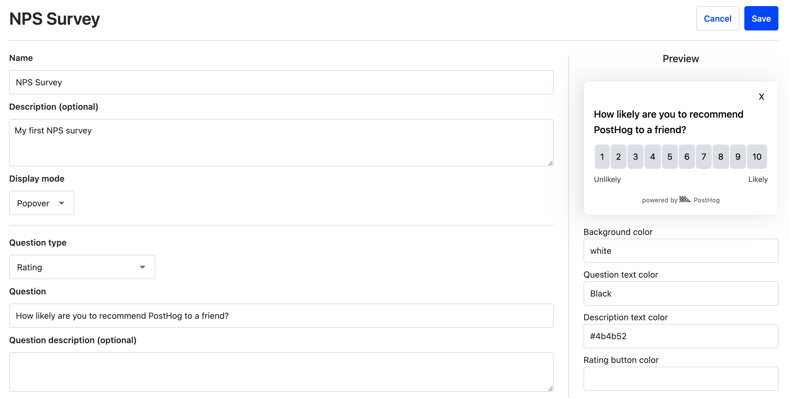
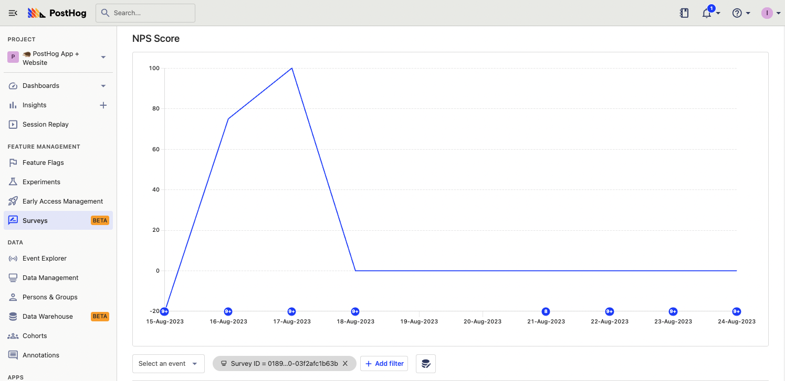
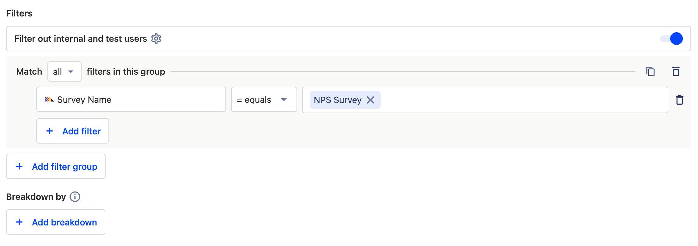
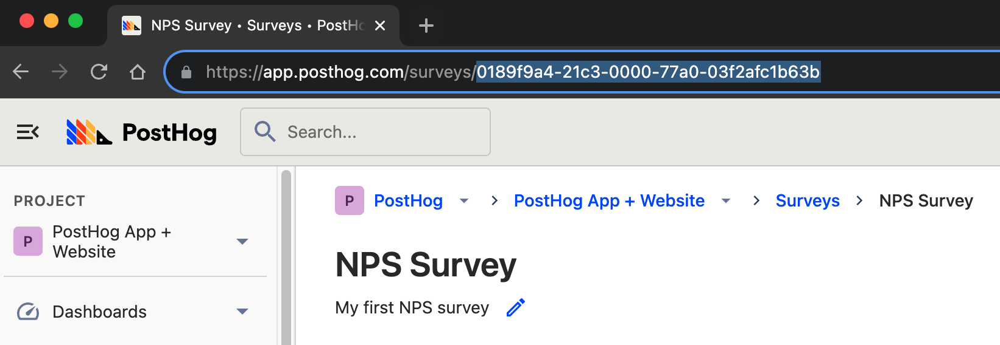
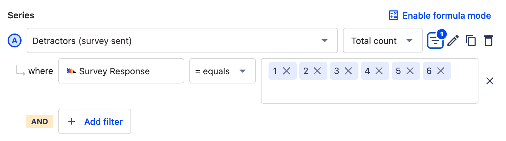
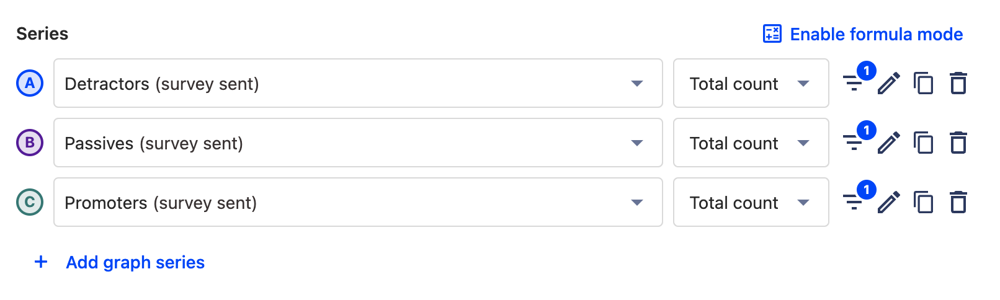

One of the most well-known and useful types of survey for businesses is a Net Promoter Score ([NPS](https://en.wikipedia.org/wiki/Net_promoter_score_)). It acts as a metric for user satisfaction and growth. In its simplest form, it involves asking users how likely they are to recommend your product or service, so you can gauge [product-market fit](/blog/measure-product-market-fit). 

This may seem straightforward, but it’s important to follow the methodology and phrasing precisely to collect a valid result. 

In this tutorial, we’ll explain how to measure NPS in PostHog using the surveys tool and how to interpret results. 

### How does NPS work?

Simply put, you ask your users how likely they are to recommend your product to others, on a scale of 0 (unlikely) to 10 (likely). You then group the responses as follows:

- **1 - 6**: Detractors. These users are unlikely to recommend your product and may damage your growth.
- **7 - 8** Passives. These users don't care about your product and are unlikely to contribute to growth.
- **9 - 10** Promoters. These users love your product and actively contribute to growth. 

Obviously, the more promoters you have, the better! 

After running the survey, apply the following calculation: `NPS = % OF PROMOTERS - % DETRACTORS`.

This calculation returns a result ranging from -100 to +100. The higher the score, the better - and anything above +70 is indicative of a market-leading product.

### Creating an NPS survey in PostHog

The first step is to install PostHog's [snippet](/docs/getting-started/install?tab=snippet) or [JavaScript Web SDK](/docs/libraries/js), and make sure survey popups are enabled in the configuration on the [survey tab](https://app.posthog.com/surveys).

Next, [create a new survey in PostHog](https://app.posthog.com/surveys/new), using the Surveys tool. If it isn’t already selected, set the Display Mode to ‘Popover’.

You can name the survey whatever you want, but it’s important that the customer-facing element asks the question in the same way as any other NPS survey.

To do this, enter **‘How likely are you to recommend this product to a friend?’** in the Question field. Leave the optional description blank. 

NPS surveys collect responses on a scale of 1-10, so set the Question Type to ‘Rating’. Change the Display Type to ‘Number’, and the Scale to ‘1 - 10’.

We want to make sure that users understand what each number means, so set the Lower Bound Label to ‘Unlikely’ and the Upper Bound Label to ‘Very Likely’. You should now see a complete NPS survey in the live preview, and can tailor the appearance to match your brand. 

### Targeting your NPS survey

The default behaviour for surveys is to target all users. You can choose to override this and target users based on the URL they are on, user properties, or use a particular feature flag. 

To collect a valid result, you need at least 100 responses, so it’s important not to target too narrowly. However, you _also_ want to target users who are familiar with your product to get a meaningful result. Good options for striking a balance include…

- Using ‘URL contains’ to target users who view a particular page, such as a checkout confirmation page. 

- Using ‘User properties’ to target users in a particular geographical area, or in a dynamic cohort of users that have performed an action (such as completing a purchase).

- Using a linked feature flag to target users who have been trialing a new feature or UI rollout

If you set targeting options for your survey, you also need to decide the release conditions within that target. That is: what percentage of that defined audience will see the survey? The default is 0%, so make sure to set it to a higher value. 

Next, you can save your survey and press Launch to start collecting responses. 

### Calculating your NPS score in PostHog

Once you’ve launched your survey, the next step is to wait for some responses. After that, it’s time to analyze the results!

Search for and click on your survey in the [Surveys tab](https://app.posthog.com/surveys), and you see the results. This includes surveys shown, dismissed, a chart of responses, and a graph of the NPS score. PostHog automatically creates and calculates NPS score for you when you select the "Rating" survey type.

### Digging deeper into your NPS score

You can also do custom analysis of your responses and NPS score in insights. Start by [creating a new Trends insight](https://app.posthog.com/insights/new). Create a global filter using the 'Survey name' property to match your NPS survey, so that we're only judging results from the NPS survey specifically.

Next, set the first series event as ‘Survey sent’. Duplicate this series three times and rename each series for clarity by clicking the pencil icon. We'll label series A, B, and C as Detractors, Passives, and Promoters respectively.

> **💡 Tip: Specifying surveys using Survey ID**
>
> If you have multiple surveys with a similar name, you may not want to use the 'Survey Name' property. In such a case, you can use 'Survey ID' to specify a survey instead. IDs are listed in the URL for each survey. 
>
> 

Now it's time to start grouping results. For the first series, add a filter which uses the 'Survey Response' event and filters so that that event is equal to 1, 2, 3, 4, 5, or 6. This is your Detractor cohort. 

Repeat this step for the subsequent series, using the values 7, and 8. These are your Passives. 

Repeat it once more for the final series, using the values 9, and 10. These are your Promoters. 

Define your time period (typically you’d want to cover at least a few weeks), and the table below will tell you how many users are in each segment. 

Next, it’s time to apply the NPS calculation. You could do this manually outside of PostHog, but it’s better to do it in PostHog using the Formula mode. This way, you can return to the insight whenever you want to get an accurate read of your NPS over any time period.

Select 'Enable Formula Mode' to get started, and enter the following formula:

`(C / (A+B+C) * 100) - (A / (A+B+C)* 100)`

> **⚠️ Important**
> 
> This formula assumes that A is your Detractors series, B is your Passives series, and C is your Promoters series. If they are not, you'll need to tailor the formula to match, or reconfigure your insight.

Save your insight. The resulting figure is your NPS score! 

### What is a good NPS score?

NPS scores can range from -100 to +100. Anything above 0 is good and means you have more promoters than passives or detractors. Anything below 0 indicates users are unhappy with your product and your growth may be in decline. 

Benchmark NPS scores can vary by industry. When comparing your NPS score to a benchmark, it's important to compare yourself to direct competitors, rather than different industries or leading brands that compete at a different level. B2B software products typically have an NPS of +40, for example, while telecom providers have an average NPS of +30, and healthcare providers have an average of +50. Market-leading companies within an industry will generally score +60 to +70.

Typically you want to aim for a _minimum_ NPS score of +50. If you have a score that's below +50 then we'd recommend running further surveys and speaking to your users directly in order to understand their concerns, so you can make product improvements. 

## Further reading
- [How to create custom surveys](/tutorials/survey)
- [How to calculate bounce rate](/tutorials/bounce-rate)
- [How to create a broken link (404) checker](/tutorials/broken-link-checker)
