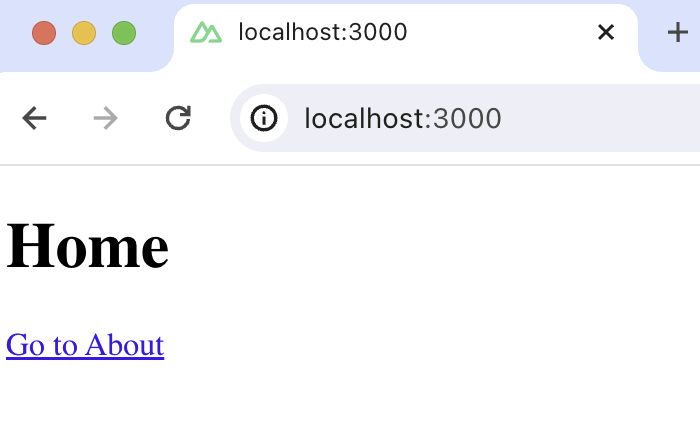

import { ProductScreenshot } from 'components/ProductScreenshot'
import EventsLight from '../images/tutorials/nuxt-surveys/events-light.png'
import EventsDark from '../images/tutorials/nuxt-surveys/events-dark.png'

[Product analytics](/product-analytics) enable you to gather and analyze data about how users interact with your Nuxt.js app. To show you how to set up analytics, in this tutorial we create a basic Nuxt app, add PostHog on both the client and server, and show you have to capture pageviews and custom events.

## Creating a Nuxt app

To demonstrate the basics of PostHog analytics, we create a simple Nuxt 3 app with two pages and a link to navigate between them.

First, ensure [Node.js is installed](https://nodejs.dev/en/learn/how-to-install-nodejs/) (version 18.0.0 or newer). Then run the following command:

```bash
npx nuxi@latest init <project-name>
```

Name it whatever you like (we call ours `nuxt-analytics`), select `npm` as the package manager, and use the defaults for the remaining options.

### Adding pages

Next, create a new directory `pages` and two new files `index.vue` and `about.vue` in it:

```bash
cd ./nuxt-analytics # replace "nuxt-analytics" with your project name
mkdir pages
cd ./pages
touch index.vue
touch about.vue
```

In `index.vue`, add the following the code:

```vue file=pages/index.vue
<template>
  <div>
    <h1>Home</h1>
    <NuxtLink to="/about">Go to About</NuxtLink>
  </div>
</template>
```

In `about.vue`, add the following the code:

```vue file=pages/about.vue
<template>
  <div>
    <h1>About</h1>
    <NuxtLink to="/">Back Home</NuxtLink>
  </div>
</template>
```

Lastly, replace the code in `app.vue` with:

```vue file=app.vue
<template>
  <div>
    <NuxtLayout>
      <NuxtPage/>
    </NuxtLayout>
  </div>
</template>
```

The basic setup is now complete. Run `npm run dev` to see your app.



## Adding PostHog on the client side

> This tutorial shows how to integrate PostHog with `Nuxt 3`. If you're using `Nuxt 2`, see [our Nuxt docs](/docs/libraries/nuxt-js) for how to integrate.

With our app set up, it’s time to install and set up PostHog. If you don't have a PostHog instance, you can [sign up for free](https://app.posthog.com/signup). 

First install `posthog-js`:

```bash
npm install posthog-js
```

Then, add your PostHog API key and host to your `nuxt.config.ts` file. You can find your project API key in your [PostHog project settings](https://app.posthog.com/settings/project)

```ts file=nuxt.config.ts
export default defineNuxtConfig({
  // ...rest of your config
  
  runtimeConfig: {
    public: {
      posthogPublicKey: '<ph_project_api_key>',
      posthogHost: '<ph_instance_address>'
    }
  }
})
```

Create a new [plugin](https://nuxt.com/docs/guide/directory-structure/plugins) by creating a new folder called `plugins` in your base directory and then a new file `posthog.client.js`:

```bash
mkdir plugins
cd plugins 
touch posthog.client.js
```

Add the following code to your `posthog.client.js` file:

```js file=plugins/posthog.client.js
import { defineNuxtPlugin } from '#app'
import posthog from 'posthog-js'

export default defineNuxtPlugin(nuxtApp => {
  const runtimeConfig = useRuntimeConfig();
  const posthogClient = posthog.init(runtimeConfig.public.posthogPublicKey, {
    api_host: runtimeConfig.public.posthogHost,
  })
  
  return {
    provide: {
      posthog: () => posthogClient
    }
  }
})
```

Once you’ve done this, reload your app. You should begin seeing events in the [PostHog events explorer](https://us.posthog.com/events).

<ProductScreenshot
  imageLight={EventsLight} 
  imageDark={EventsDark} 
  alt="Events in PostHog" 
  classes="rounded"
/>

### Capturing pageviews

You might notice that moving between pages only captures a single pageview event. This is because PostHog only captures pageview events when [page load](https://developer.mozilla.org/en-US/docs/Web/API/Window/load_event) is fired. Since Nuxt creates a single-page app, this only happens once, and the Nuxt router handles subsequent page changes.

If we want to capture every route change, we must write code to capture pageviews that integrates with the router.

In `posthog.client.js`, set up PostHog to capture pageviews in the `router.afterEach` function. Additionally, you can use `nextTick` so that the capture event fires only after the page is mounted.

```js plugins/posthog.client.js
import { defineNuxtPlugin } from '#app'
import posthog from 'posthog-js'

export default defineNuxtPlugin(nuxtApp => {
  const runtimeConfig = useRuntimeConfig();
  const posthogClient = posthog.init(runtimeConfig.public.posthogPublicKey, {
    api_host: runtimeConfig.public.posthogHost,
    capture_pageview: false // set this to false since we manually capture pageviews in router.afterEach
  })

  const router = useRouter();
  router.afterEach((to) => {
    nextTick(() => {
      posthog.capture('$pageview', {
        current_url: to.fullPath
      });
    });
  });

  // rest of your code
})

```

Make sure to set `capture_pageview` in the PostHog initialization config to `false`. This turns off autocaptured pageviews and ensures you won’t double-capture pageviews on the first load.

### Capturing custom events

Beyond pageviews, there might be more events you want to capture. You can do this by capturing custom events with PostHog. 

To showcase this, we add a button to the home page and capture a custom event whenever it is clicked. Update the code in `index.vue`:

```vue file=HomePage.vue
<template>
  <div>
    <h1>Home</h1>
    <NuxtLink to="/about">Go to About</NuxtLink>
    <button @click="captureCustomEvent">Click Me</button>
  </div>
</template>

<script setup>
import { usePostHog } from 'path-to-your-posthog-plugin';

const postHog = usePostHog();

const captureCustomEvent = () => {
  postHog.capture('home_button_clicked', {
    'user_name': 'Max the Hedgehog' 
  });
};
</script>
```

Now when you click the button, PostHog captures the custom `home_button_clicked` event. Notice that we also added a property `user_name` to the event. This is helpful for filtering events in the PostHog dashboard.

## Adding PostHog on the server side

Nuxt is a full stack framework, parts of it run on both the client and server side. So far, we’ve only used PostHog on the client side and the [`posthog-js` library](/docs/libraries/js) we installed won’t work on the server side. Instead, we must use the [`posthog-node` SDK](/docs/libraries/node). We can start by installing it:

```bash
npm install posthog-node
```

Next, initialize `posthog-node` wherever you'd like to capture events server-side, such as in your [server routes](https://nuxt.com/docs/guide/directory-structure/server) or in the [middleware](https://nuxt.com/docs/guide/directory-structure/server#server-middleware). For this tutorial, we'll show you how to capture an event in the middleware:

Create a folder `middleware` in `server` directory and then a new file `analytics.js` in it:

```bash
cd ./server
mkdir middleware
cd ./middleware
touch analytics.js
```

Inside `analytics.js`, create a middleware function. Initialize PostHog in it and capture an event:

```js file=server/middleware/analytics.js
import { PostHog } from 'posthog-node';

export default defineEventHandler(async (event) => {
  const runtimeConfig = useRuntimeConfig();
  const posthog = new PostHog(
    runtimeConfig.public.posthogPublicKey,
    { host: runtimeConfig.public.posthogHost }
  );

  posthog.capture({
    distinctId: 'placeholder_distinct_id_of_the_user', 
    event: 'in_the_middleware',
  });
  await posthog.shutdownAsync()  
});
```

> **Note**: Make sure to _always_ call `posthog.shutdownAsync()` after capturing events from the server-side.
> PostHog queues events into larger batches, and this call forces all batched events to be flushed immediately.

If you run your app again, you should begin to see `in_the_middleware` events in PostHog.

### Handling `distinctId` on the server

You may have noticed that we set `distinctId: placeholder_distinct_id_of_the_user` in our event above. To attribute events to the correct user, `distinctId` should be set to your user's unique id. For logged-in users, we typically use their email as their `distinctId`. However, for logged-out users, you can use the `distinct_id` property from their PostHog cookie:

```js file=server/middleware/analytics.js
import { PostHog } from 'posthog-node';

export default defineEventHandler(async (event) => {
  const cookieString = event.req.headers.cookie || '';  
  const cookieName =`ph_${runtimeConfig.public.posthogPublicKey}_posthog`;
  const cookieMatch = cookieString.match(new RegExp(cookieName + '=([^;]+)'));
  
  let distinctId;
  if (cookieMatch) {
    const parsedValue = JSON.parse(decodeURIComponent(cookieMatch[1]));
    if (parsedValue && parsedValue.distinct_id) {
      distinctId = parsedValue.distinct_id;
      const runtimeConfig = useRuntimeConfig();
      const posthog = new PostHog(
        runtimeConfig.public.posthogPublicKey,
        { host: runtimeConfig.public.posthogHost }
      );
      posthog.capture({
        distinctId: distinctId, 
        event: 'in_the_middleware',
      });
      await posthog.shutdownAsync()
    } 
  }
});
```

## Further reading

- [PostHog Nuxt.js docs](/docs/libraries/nuxt-js)
- [How to set up A/B tests in Nuxt](/tutorials/nuxtjs-ab-tests)
- [How to set up surveys in Nuxt](/tutorials/nuxt-surveys)