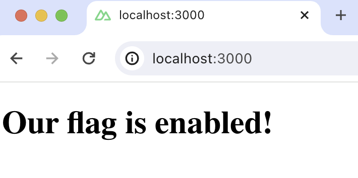

import { ProductScreenshot } from 'components/ProductScreenshot'
import EventsLight from '../images/tutorials/nuxt-feature-flags/events-light.png'
import EventsDark from '../images/tutorials/nuxt-feature-flags/events-dark.png'
import CreateFlagLight from '../images/tutorials/nuxt-feature-flags/create-flag-light.png'
import CreateFlagDark from '../images/tutorials/nuxt-feature-flags/create-flag-dark.png'

[Feature flags](/feature-flags) help you release features and conditionally show content. This tutorial shows you how integrate them in your Nuxt.js app using PostHog. 

We'll create a basic Nuxt app, add PostHog, create a feature flag, and then implement the flag to control content in our app.

## Create your Nuxt app

For this tutorial, we create a basic `Nuxt 3` app. First, ensure [Node.js is installed](https://nodejs.dev/en/learn/how-to-install-nodejs/) (version 18.0.0 or newer). Then run the following command:

```bash
npx nuxi@latest init <project-name>
```

Name it whatever you like (we call ours `nuxt-feature-flags`), select `npm` as the package manager, and use the defaults for the remaining options.

Replace the code in `app.vue` with a simple heading:

```vue file=app.vue
<template>
  <main>
    <h1>Nuxt.js 3 feature flags</h1>
  </main>
</template>
```

Run `npm run dev` to start your app.


## Adding PostHog on the client side

> This tutorial shows how to integrate PostHog with `Nuxt 3`. If you're using `Nuxt 2`, see [our Nuxt docs](/docs/libraries/nuxt-js) for how to integrate PostHog.

Since PostHog handles the management and evaluation of feature flags, we must set it up in our app. If you don't have a PostHog instance, you can [sign up for free here](https://us.posthog.com/signup). 

Start by installing the `posthog-js` library to get access to the [JavaScript Web SDK](/docs/libraries/js).

```bash
npm install posthog-js
```

Then, add your PostHog API key and host to your `nuxt.config.ts` file. You can find your project API key in your [PostHog project settings](https://app.posthog.com/settings/project)

```ts file=nuxt.config.ts
export default defineNuxtConfig({
 devtools: { enabled: true },
  runtimeConfig: {
    public: {
      posthogPublicKey: '<ph_project_api_key>',
      posthogHost: '<ph_instance_address>'
    }
  }
})
```

Create a new [plugin](https://nuxt.com/docs/guide/directory-structure/plugins) by creating a new folder called `plugins` in your base directory and then a new file `posthog.client.js`:

```bash
mkdir plugins
cd plugins 
touch posthog.client.js
```

Add the following code to your `posthog.client.js` file:

```js file=plugins/posthog.client.js
import { defineNuxtPlugin } from '#app'
import posthog from 'posthog-js'

export default defineNuxtPlugin(nuxtApp => {
  const runtimeConfig = useRuntimeConfig();
  const posthogClient = posthog.init(runtimeConfig.public.posthogPublicKey, {
    api_host: runtimeConfig.public.posthogHost,
  })
  
  return {
    provide: {
      posthog: () => posthogClient
    }
  }
})
```

Once you’ve done this, reload your app. You should begin seeing events in the [PostHog events explorer](https://us.posthog.com/events).

<ProductScreenshot
  imageLight={EventsLight} 
  imageDark={EventsDark} 
  alt="Events in PostHog" 
  classes="rounded"
/>

## Creating a feature flag

With PostHog set up, your app is ready for feature flags. To create one, go to the [feature flags tab](https://us.posthog.com/feature_flags) in PostHog and click "New feature flag." Enter a flag key (like `my-cool-flag`), set the release condition to roll out to 100% of users, and press "Save."

<ProductScreenshot
  imageLight={CreateFlagLight} 
  imageDark={CreateFlagDark} 
  alt="Feature flag created in PostHog" 
  classes="rounded"
/>

You can customize your [release conditions](/docs/feature-flags/creating-feature-flags#release-conditions) with rollout percentages, and [user](/docs/product-analytics/user-properties) or [group properties](/docs/product-analytics/group-analytics) to fit your needs.

## Implementing feature flag code on the client side

Once created, we can add our feature flag to our app. We do this using the [`posthog.onFeatureFlags`](/docs/libraries/js#ensuring-flags-are-loaded-before-usage) callback.

In our example, we fetch our feature flag and update the text on the page based on its value:

```vue file=app.vue
<template>
  <main>
    <h1>{{ title }}</h1>
  </main>
</template>

<script setup>

const title = ref('No variant');
onMounted(() => {
  const { $posthog } = useNuxtApp()
  if ($posthog) {
    const posthog = $posthog()
    if (posthog.isFeatureEnabled('my-cool-flag')) {
      title.value = 'Our flag is enabled!';
    } else {
      title.value = 'Our flag is disabled!';
    }
  }
});

</script>
```

When you run your app now, you should see the updated text.



## Adding PostHog on the server side feature flags

You may notice the text flickers when you load your app. This is because PostHog is making a request on the client side to fetch the flag value. To prevent this, there are two alternatives:

1. Fetch the flag on the server side.
2. [Bootstrap](/docs/feature-flags/bootstrapping) PostHog on the client side (not covered in this tutorial).

We'll show you how to fetch the flag on the server side. First, install the [`posthog-node` SDK](/docs/libraries/node):

```bash
npm install posthog-node
```

Then, we use the PostHog Node library to fetch the feature flag using [`useAsyncData`](https://nuxt.com/docs/api/composables/use-async-data). Replace the code in `app.vue` with the following:

```vue file=app.vue
<template>
  <main>
    <h1>{{ title }}</h1>
  </main>
</template>

<script setup>
import { useAsyncData, useRuntimeConfig } from 'nuxt/app';
import { PostHog } from 'posthog-node';

const { data: titleData, error } = await useAsyncData('titleData', async () => {
  const runtimeConfig = useRuntimeConfig();
  const posthog = new PostHog(
    runtimeConfig.public.posthogPublicKey,
    { host: runtimeConfig.public.posthogHost }
  );

  let returnedValue = '';
  const distinctId = 'placeholder-user-id'
  const isFlagEnabled = await posthog.isFeatureEnabled('my-cool-flag', distinctId);
  if (isFlagEnabled) {
    returnedValue = 'Our flag is enabled!';
  } else {
    returnedValue = 'Our flag is disabled!'
  }
  return returnedValue;
});
const title = computed(() => titleData.value);

</script>
```

Now when you reload your app, the flicker is gone. 

### Setting the correct `distinctId`

You may have noticed that we set `distinctId = 'placeholder-user-id'` in our flag call above. In production apps, to ensure you fetch the correct flag value for your user, `distinctId` should be set to their unique ID. 

For logged-in users, you typically use their email as their `distinctId`. However, for logged-out users, you can use the `distinct_id` property from their PostHog cookie:

```vue file=app.vue
<!-- rest of your code -->

<script setup>
import { useAsyncData, useRuntimeConfig, useCookie } from 'nuxt/app';
import { PostHog } from 'posthog-node';

const { data: titleData, error } = await useAsyncData('titleData', async () => {
  const runtimeConfig = useRuntimeConfig();
  const posthog = new PostHog(
    runtimeConfig.public.posthogPublicKey,
    { host: runtimeConfig.public.posthogHost }
  );
  let returnedValue = '';

  const cookies = useCookie(`ph_${runtimeConfig.public.posthogPublicKey}_posthog`);
  if (cookies && cookies.value) {
    const distinctId = cookies.value.distinct_id;
    const isFlagEnabled = await posthog.isFeatureEnabled('my-cool-flag', distinctId);
    if (isFlagEnabled) {
      returnedValue = 'Our flag is enabled!';
    } else {
      returnedValue = 'Our flag is disabled!';
    }
  }
  return returnedValue;
});
const title = computed(() => titleData.value);

</script>
```

## Further reading

- [How to set up analytics in Nuxt](/tutorials/nuxt-analytics)
- [How to set up A/B tests in Nuxt](/tutorials/nuxtjs-ab-tests)
- [How to set up surveys in Nuxt](/tutorials/nuxt-surveys)