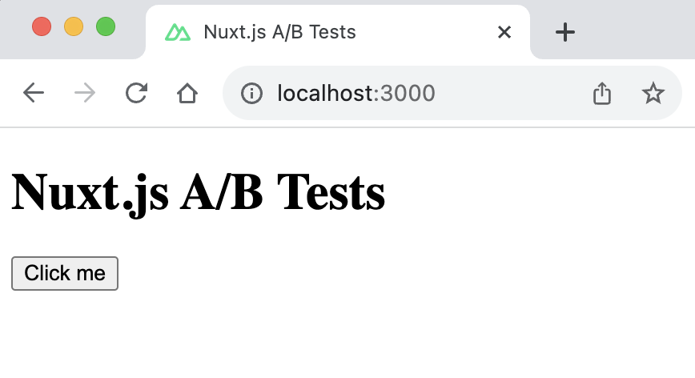
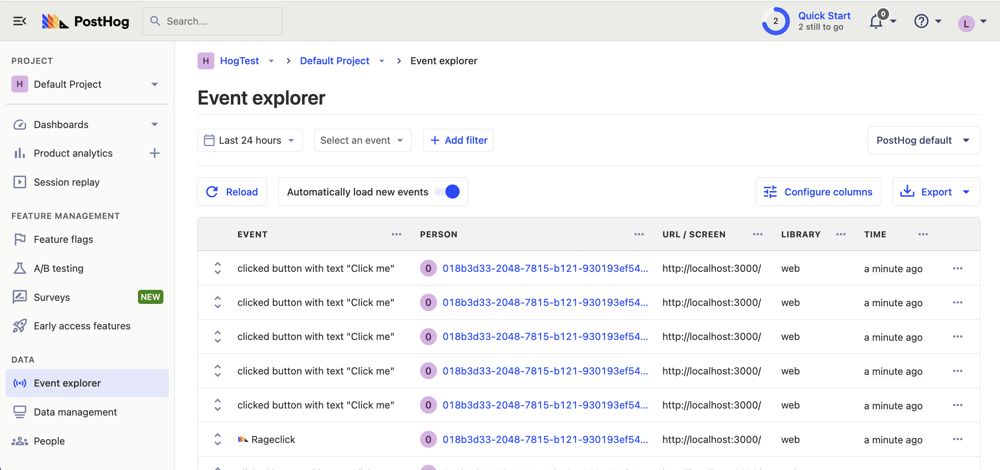
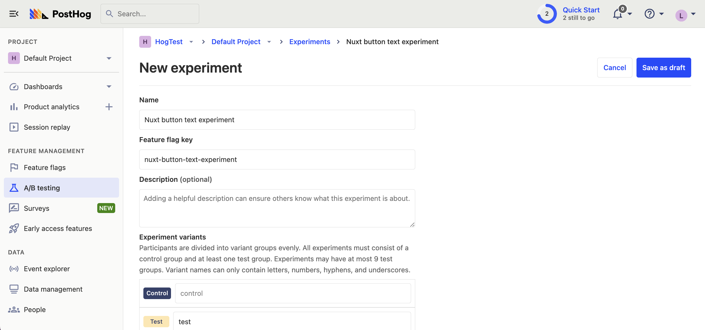

A/B tests are crucial for optimizing your Nuxt.js app. PostHog's experimentation tool simplifies this process. This tutorial will show you how to set up and run an A/B test in Nuxt using PostHog.

We'll cover creating a basic Nuxt.js app, integrating PostHog, and setting up the A/B test.

## Creating a Nuxt.js app

> Already have a Nuxt.js app? [Skip to adding PostHog and setting up the A/B test](#adding-posthog).

For this tutorial, we create a basic `Nuxt 3` app with a simple button to run our test on. 

First, ensure [Node.js is installed](https://nodejs.dev/en/learn/how-to-install-nodejs/) (version 14.6.0 or newer). Then create a Nuxt.js app:

```bash
npx nuxi@latest init <project-name>
```

Name it whatever you like (we call ours `nuxt-ab-test`), select `npm` as the package manager, and use the defaults for the remaining options.

Replace the code in `app.vue` with a simple heading and button:

```vue file=app.vue
<template>
  <main>
    <h1>Nuxt.js 3 A/B Tests</h1>
    <button id="main-cta">Click me</button>
  </main>
</template>
```

Run `npm run dev` to start your app.



## Adding PostHog

Next we add PostHog (if you don't have a PostHog instance, you can [sign up for free](https://app.posthog.com/signup)). To do this, first install `posthog-js` .

```bash
npm install posthog-js
```

Then, add your PostHog API key and host to your `nuxt.config.ts` file. You can find your project API key in your [PostHog project settings](https://app.posthog.com/settings/project)

```ts file=nuxt.config.ts
export default defineNuxtConfig({
  // ...rest of your config
  
  runtimeConfig: {
    public: {
      posthogPublicKey: '<ph_project_api_key>',
      posthogHost: '<ph_instance_address>'
    }
  }
})
```

Create a new [plugin](https://nuxt.com/docs/guide/directory-structure/plugins) by first creating a new folder called `plugins` and then a new file `posthog.client.js` with the following code:

```js file=plugins/posthog.client.js
import { defineNuxtPlugin } from '#app'
import posthog from 'posthog-js'

export default defineNuxtPlugin(nuxtApp => {
  const runtimeConfig = useRuntimeConfig();
  const posthogClient = posthog.init(runtimeConfig.public.posthogPublicKey, {
    api_host: runtimeConfig.public.posthogHost || 'https://app.posthog.com',
  })

  // Make sure that pageviews are captured with each route change
  const router = useRouter();
  router.afterEach((to) => {
    posthog.capture('$pageview', {
      current_url: to.fullPath
    });
  });
  
  return {
    provide: {
      posthog: () => posthogClient
    }
  }
})
```

Once you’ve done this, reload your app and click the button a few times. You should see events appearing in the [PostHog events explorer](https://app.posthog.com/events).



## Creating a custom event for our A/B test goal

The first part of setting up our A/B test in PostHog is setting up the goal. We'll use the number of clicks on the button as our goal.

To measure this, we [capture a custom event](/docs/product-analytics/capture-events) `home_button_clicked` when the button is clicked. To do this, update the code in `app.vue` to the following:

```vue file=app.vue
<template>
  <main>
    <h1>Nuxt.js 3 A/B Tests</h1>
    <button id="main-cta" @click="captureEventInPostHog">Click me</button>
  </main>
</template>

<script setup>
const captureEventInPostHog = () => {
  const { $posthog } = useNuxtApp()
   if ($posthog) {
      const posthog = $posthog()
      posthog.capture('home_button_click')
   }
};
</script>
```

## Creating an A/B test in PostHog

The next step is to set up an A/B test (we call them experiments in PostHog).

Go to the [Experiments tab](https://app.posthog.com/experiments) in PostHog and click "New experiment". Add the following details to your experiment:

1. Name it "Nuxt button text experiment".
2. Set "Feature flag key" to `nuxt-button-text-experiment`.
3. Under the experiment goal, select the `home_button_clicked` event we created in the previous step.
4. Use the default values for all other fields.

Click "Save as draft" and then click "Launch".



## Implementing the A/B test code

When it comes to implementing our experiment code, there are two options:

1. Client-side rendering in `app.vue`.
2. Server-side rendering in `app.vue` using [`posthog-node`](/docs/libraries/node).

We'll show you how to implement both options.

### Client-side rendering

To render experiment from the client, we use the `posthog.client.js` plugin we created earlier to fetch the experiment feature flag when the component is mounted. 

Update your code in `app.vue` to the following:

```vue file=app.vue
<template>
  <main>
    <h1>Nuxt.js 3 A/B Tests</h1>
    <button id="main-cta" @click="captureEventInPostHog">{{ctaText}}</button>
  </main>
</template>

<script setup>
const ctaText = ref('No variant');
onMounted(() => {
  const { $posthog } = useNuxtApp()
  if ($posthog) {
    const posthog = $posthog()
    if (posthog.getFeatureFlag('nuxt-button-text-experiment') === 'control') {
      ctaText.value = 'Control variant';
    } else if (posthog.getFeatureFlag('nuxt-button-text-experiment') === 'test') {
      ctaText.value = 'Test variant';
    }
  }
});

const captureEventInPostHog = () => {
  // ...rest of code
};
</script>
```

Now if you refresh your app, you should see the button text updated to either `Control variant` or `Test variant`. 

You can also test either variant by adding an override in `posthog.client.js`:

```js file=plugins/posthog.client.js
import { defineNuxtPlugin } from '#app'
import posthog from 'posthog-js'

export default defineNuxtPlugin(nuxtApp => {
  // ... your existing code
  
  posthogClient.featureFlags.override({'nuxt-button-text-experiment': 'test'});
  return {
    provide: {
      posthog: () => posthogClient
    }
  }
})
```

With this, you’re ready to launch your experiment, but make sure to remove your override!

### Server-side rendering

Notice that when you refresh the page, the button text flickers between `No variant` and `Control/Test variant`. This is because it takes time for PostHog to load and make the feature flag request.

Server-side rendering is a way to avoid this. This fetches the feature flag before the page loads on the client.

To set this up, we must install and use [PostHog’s Node library](/libraries/node) (because we are making server-side requests).

```bash
npm install posthog-node
```

Then, we use the PostHog Node library to fetch the feature flag using `useAsyncData` in `app.vue`:

```vue file=app.vue
 <!-- ...rest of code -->

<script setup>
import { useAsyncData, useCookie, useRuntimeConfig } from 'nuxt/app';
import { PostHog } from 'posthog-node';

const { data: ctaData, error } = await useAsyncData('ctaText', async () => {
  let ctaText = 'No Variant';
  const runtimeConfig = useRuntimeConfig();
  const posthog = new PostHog(
    runtimeConfig.public.posthogPublicKey,
    { host: runtimeConfig.public.posthogHost }
  );

  const cookies = useCookie(`ph_${runtimeConfig.public.posthogPublicKey}_posthog`);
  const userId = cookies.value.distinct_id;
  if (userId) {
    try {
      const enabledVariant = await posthog.getFeatureFlag('nuxt-button-text-experiment', userId);
      if (enabledVariant === 'control') {
        ctaText = 'Control Variant';
      } else if (enabledVariant === 'test') {
        ctaText = 'Test Variant'
      }
    } catch (error) {
      console.log(error);
    }
  }
  return ctaText;
});
const ctaText = computed(() => ctaData.value);

const captureEventInPostHog = () => {
  // ... rest of code
};

</script>
```

Now, when you refresh the page, the button text is already set when the page loads. 

> **Note:** This only works on subsequence visits to your app where the PostHog cookie is set. Using this method still requires waiting for PostHog and feature flags to load on the first visit.
> 
> The solution to this is to [`identify`](/docs/product-analytics/identify) your users using a distinct ID which is not cookie-based.

## Further reading

- [PostHog Nuxt.js docs](/docs/libraries/nuxt-js)
- [A software engineer's guide to A/B testing](/product-engineers/ab-testing-guide-for-engineers)
- [8 annoying A/B testing mistakes every engineer should know](/product-engineers/ab-testing-mistakes)
