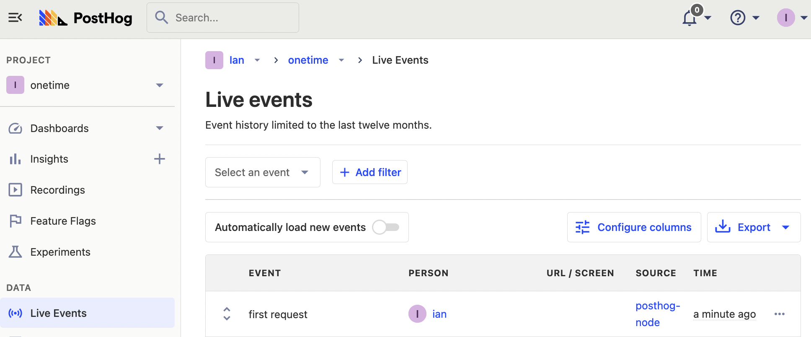
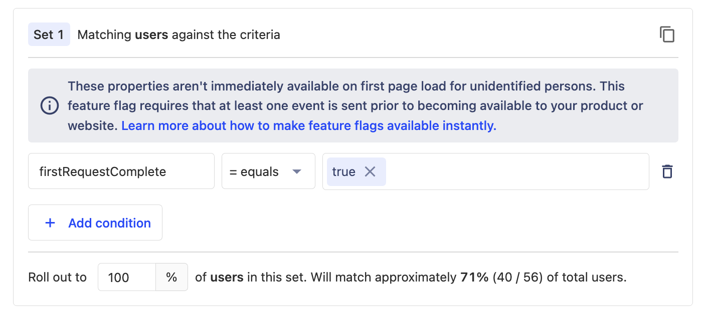

Sometimes you want to show users a component or some content only once. You can use a field in their user model or store it locally, but this gets messy fast. It also might prevent you from changing it remotely. A better way to do this is a feature flag that changes once a user completes what you want.

In this tutorial, we show how to set up a one-time feature flag using PostHog by building a basic Express.js API that provides one response on the first request, and a different one on subsequence requests.

## Creating our Express app

To create our basic Express app, first, install Express.

```bash
npm i express
```

Next, create a basic Express app that returns "Hello World!" on requests to the basic route.

```js
// server.js
const express = require('express');
const app = express();
const port = 3000;

app.get('/', (req, res) => {
  res.send('Hello World!')
})

app.listen(port, () => {
  console.log(`Example app listening on port ${port}`)
})
```

After setting this up, you can run the server.

```bash
node server.js
```

This is the basic app set up to showcase one-time feature flags.

## Setting up PostHog

Next, install PostHog through the [Node SDK](/docs/libraries/node) as Express is a Node framework.

```bash
npm i posthog-node
```

Add `posthog-node` to your Express app and set up the PostHog client with your project API key and instance address. You can find these in the getting started flow or in your [project settings](https://app.posthog.com/project/settings)

```js
// server.js
//...
const { PostHog } = require('posthog-node');
const client = new PostHog(
    '<ph_project_api_key>',
    { host: '<ph_instance_address>'}
)
//...
```

> **Optional:** if you want your flags to evaluate as fast as possible, you can set up local evaluation by including a personal API key in your client initialization. You can create a personal API key in your [account settings](https://app.posthog.com/me/settings).

### Capture the first time event

Once PostHog is set up, create a custom event that triggers when a user makes a request to the base route. Make sure to:

1. Include a user ID in the request. I did so by including an ID param in the URL like `http://localhost:3000/?id=ian` and then retrieving it with `req.query.id`.
2. `$set` a person property in the event capture that says they’ve made a request. Without the person property, you can’t filter this user from the feature flag.

With these, our route now looks like this:

```js
app.get('/', (req, res) => {
  client.capture({
    distinctId: req.query.id,
    event: 'first_request',
    properties: {
      $set: { firstRequestComplete: true },
    },
  });
  res.send('Hello World!')
})
```

After making a request again to this route, we get a `first request` event in our PostHog instance. 



We haven’t set up a way to check if users made their first request. With only this, we treat every request like it’s the first. We can set up a feature flag to change this.

## Creating the one-time feature flag

To create our feature flag, go to the feature flags tab in PostHog, create a new one, set the key as `completed-first-request`, then set the release conditions to 100% of users where `firstRequestComplete` equals `true`, and click save.



Go back to your `server.js` file and implement the flag. Check the `completed-first-request` flag with `client.isFeatureEnabled()`:

- If it is `false`, capture the `first request` event and send "Hello World!"
- If it is `true`, capture a `subsequent request` event and send "Welcome Back!"

```js
app.get('/', async (req, res) => {
  // Check if flag is true
  let completedFirstRequest = await client.isFeatureEnabled(
    'completed-first-request',
    req.query.id,
  )

  // If the flag is false, this is the first request
  if (!completedFirstRequest) {
    client.capture({
      distinctId: req.query.id,
      event: 'first_request',
      properties: {
        $set: { firstRequestComplete: true },
      },
    });
    res.send('Hello World!')
    return
  }

  // Else, it is a subsequent request
  client.capture({
    distinctId: req.query.id,
    event: 'subsequent_request'
  })
  res.send('Welcome Back!')
})
```

The problem now is that it takes time for PostHog to ingest the person properties. Since this flag relies on the `firstRequestComplete` person property, it won’t accurately evaluate until PostHog knows the property is set. Requests sent immediately after the first one might have the wrong feature flag values. To solve this, we can set up a fallback with cookies.

### Using cookies as a fallback

Although we don’t want to rely entirely on cookies, we can use them as a fallback. We can set a cookie on the first request, then check for that cookie if the flag returns `false`. This enables us to capture the first request more accurately while PostHog is ingesting the person properties.

To handle cookies, we install the `cookie-parser` library.

```bash
npm i cookie-parser
```

Once installed, add it to our `server.js` file.

```js
//...
const cookieParser = require('cookie-parser');
app.use(cookieParser());
//...
```

Under our `first request` event capture, set a cookie with the ID to say the first request is complete. Check for this cookie if the flag returns `false`. Together, this looks like this:

```js
// server.js
//...
app.get('/', async (req, res) => {
  // Check if flag is true
  let completedFirstRequest = await client.isFeatureEnabled(
    'completed-first-request',
    req.query.id,
  )

  // If the flag is false, check cookies to see if this is the first request
  if (!completedFirstRequest) {
    if (req.cookies && req.cookies[`firstRequestComplete-${req.query.id}`] == 'true') {
      completedFirstRequest = true
    }
  }

  // If both the flag and cookies are false, this is the first request
  if (!completedFirstRequest) {
    client.capture({
      distinctId: req.query.id,
      event: 'first_request',
      properties: {
        $set: { firstRequestComplete: true },
      },
    });
    res.cookie(`firstRequestComplete-${req.query.id}`, 'true')
    res.send('Hello World!')
    return
  }

  // Else, it is a subsequent request
  client.capture({
    distinctId: req.query.id,
    event: 'subsequent_request'
  })
  res.send('Welcome Back!')
})
//...
```

This provides a robust solution for our one-time flag to make sure "Hello World!" is only returned once. Potential uses for this structure include:

- Displaying information once during signup or onboarding.
- Limiting access to an API route to a single request.
- Showing a message to a user a single time.

## Further reading

- [How to do a canary release with feature flags in PostHog](/tutorials/canary-release)
- [How to bootstrap feature flags in React and Express](/tutorials/bootstrap-feature-flags-react)
- [How to add popups to your React app with feature flags](/tutorials/react-popups)
