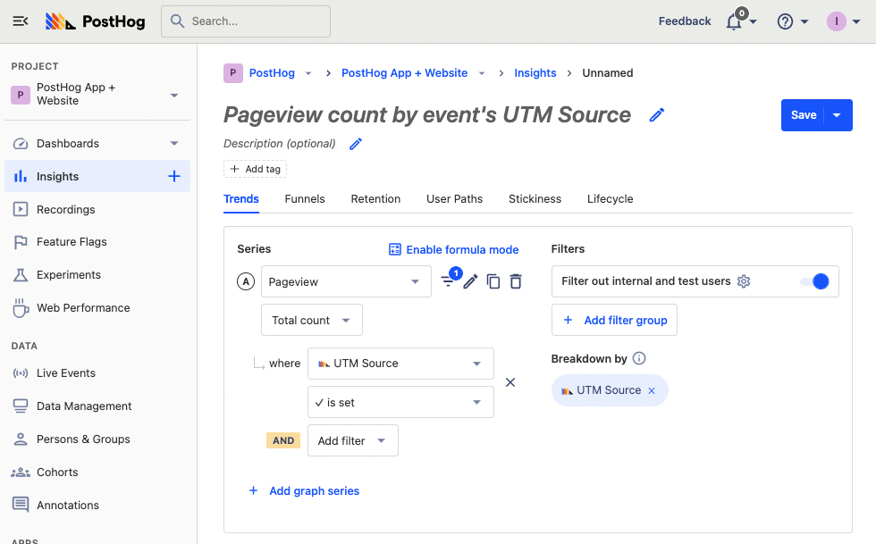
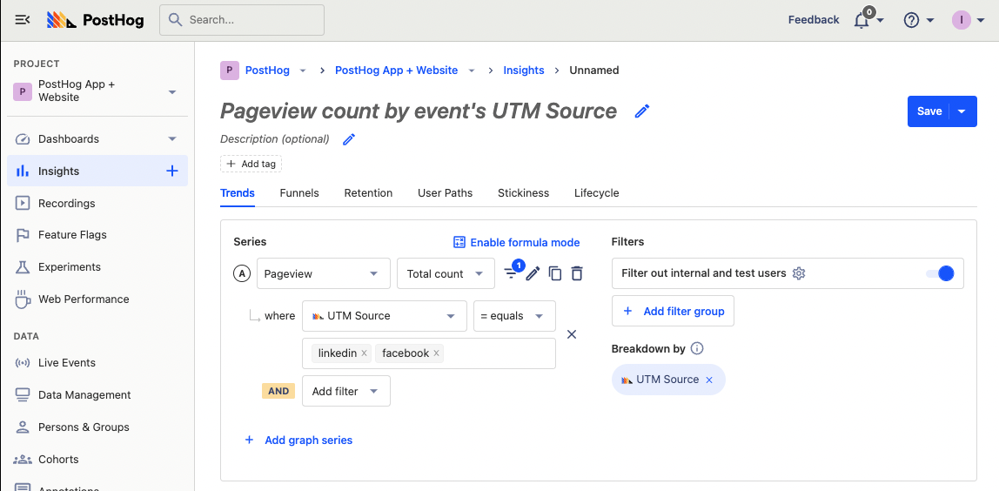
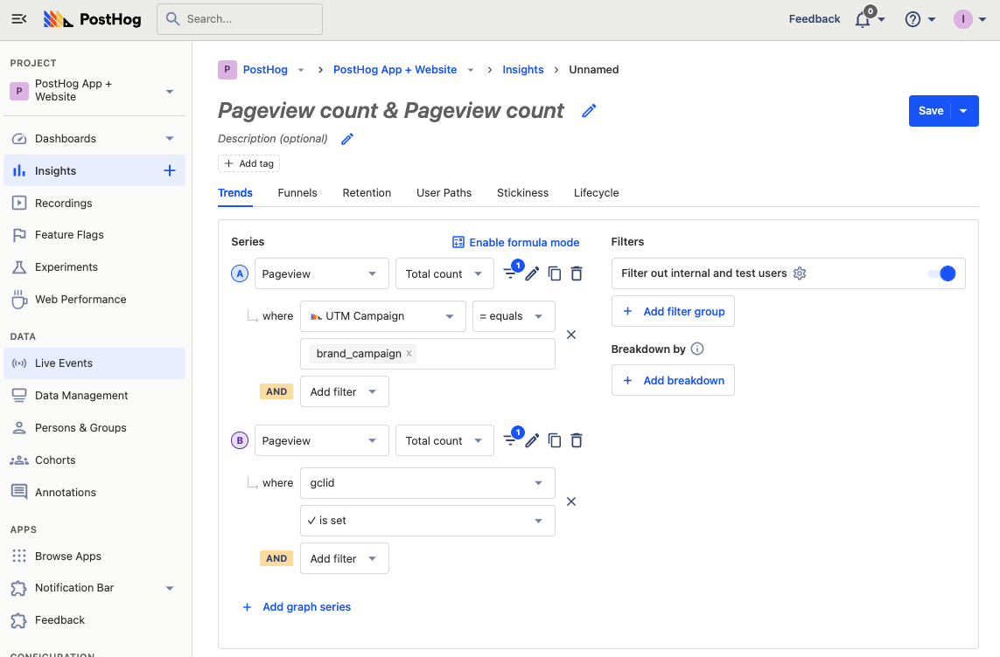
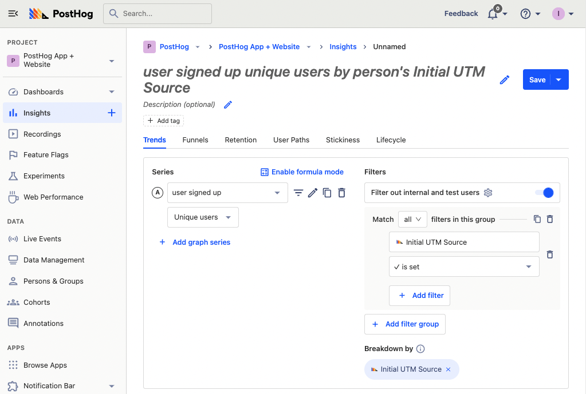
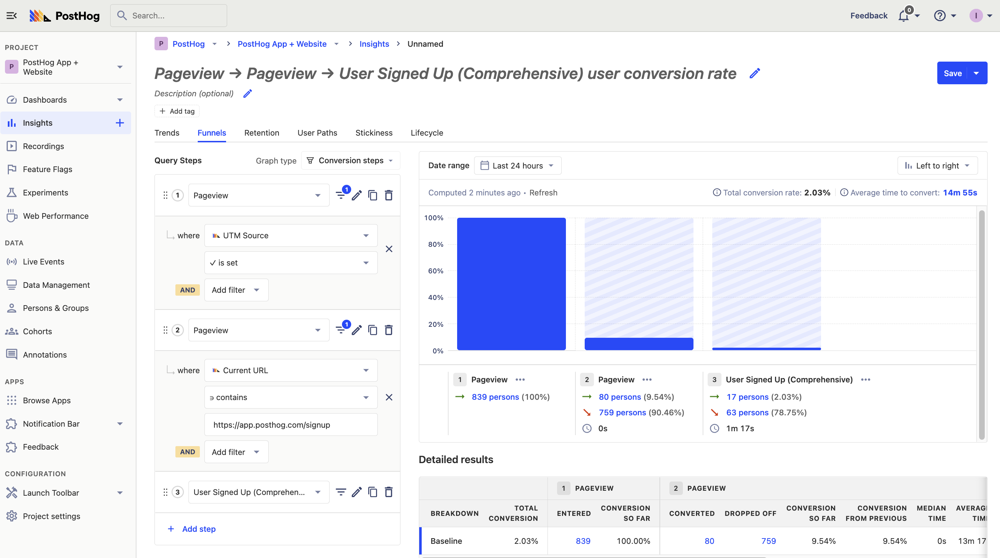
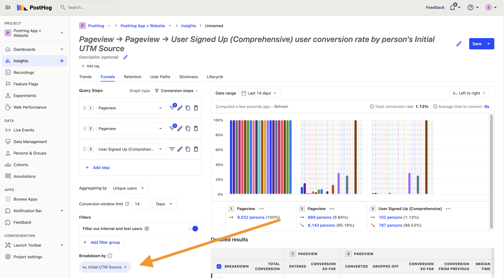
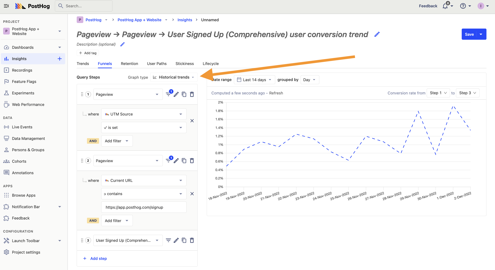

---
title: How to track performance marketing in PostHog
sidebar: Docs
showTitle: true
author: ['ian-vanagas']
date: 2022-12-08
featuredVideo: https://www.youtube-nocookie.com/embed/ExaQmFuaSyo
tags: ['funnels', 'insights', 'product analytics']
--- 

> 
Open this tutorial in PostHog and follow along step-by-step!
 <CallToAction href="https://app.posthog.com/#panel=docs:/tutorials/performance-marketing" size="sm" className="mt-auto self-start sm:w-auto !w-full">Launch tutorial</CallToAction>

Performance marketing is paying for ads, attention, and clicks to your site where you try to convert them into users and customers. Companies use channels like Google, Facebook, other social media, ad networks, and sponsorships to do this. 

In this tutorial, we’ll cover how to track your performance marketing campaigns, channels, traffic, and conversion using PostHog's product analytics suite.

## Tracking performance marketing with UTMs

The first step in performance marketing is ensuring proper tracking. To do this, you must add Urchin Tracking Modules (UTM) to your links in each channel. These are pieces of information in your URL with details about where the user came from. They look like `https://posthog.com/tutorials?utm_source=google&utm_medium=social`.

PostHog automatically captures UTMs via our JavaScript library (and snippet). The ones we support are: 
- `utm_source`: traffic source, like Google or Facebook
- `utm_medium`: traffic medium, like social or paid (ad)
- `utm_campaign`: related campaign, like `brand_awareness` or `holiday_sale`
- `utm_content`: content location, like a specific post, button, image
- `utm_term`: search term, like "analytics" or "product analytics"
- `gclid`: Google click ID for tracking data related to Google Ads
- `fbclid`: Facebook click ID for tracking data related to Facebook Ads
- `msclkid`: Microsoft click ID for tracking data related to Microsoft (Bing) Ads

Pageview events have these added as a property, and users have them added as an person property (both most recent and initial). Many channels allow you to customize your UTMs, and we recommend doing that to get the best data possible.

> **💡 PostHog Tip:** For sponsorships, we create custom URLs like `posthog.com/sponsored` which redirect to URLs with UTMs. This gives us an easy to remember vanity URL and consistent UTM tracking without the need to create dedicated landing pages.

## Tracking traffic from performance marketing

Once you’ve set up UTMs, you can use them to analyze data based on the different sources and channels.

To view pageviews broken down by UTM source, create an insight, filter pageview where `UTM Source` is set, and then breakdown by `UTM Source`. This gives you a breakdown of traffic from specific sources. 

The problem with this is that UTM sources might not be ads you are running. Any site or link can set a UTM source, so you might have sources other than ads.

To fix this, add another filter that explicitly calls out the channels you use. For example, if you run ads on Facebook and LinkedIn, you can set `UTM Source` to equal “facebook” or “linkedin.” 

Even better, use the UTM campaign, content, medium, or check for a specific click ID being set. PostHog captures any Google `gclid`, Facebook `fbclid`, or Microsoft `msclkid` parameters in the URL. Change your filter from UTM source to campaign (or one of the others) and pick your campaign. 

Doing a combination of these to fit the performance marketing you are doing helps you track the total traffic from individual campaigns. 

## Tracking signups from performance marketing

Every company has a goal for its performance marketing. For some, it is activation. For others, it is leads. For us at PostHog, it is signups. In this section, feel free to replace the signup event (in our case, action) with the relevant goal (event or action) for you. 

Tracking signups is relatively similar to tracking traffic, we just replace the pageview event with our signup action. 

To filter, you can again use a UTM attribute. If you included it as a property in your signup event, you can use the event property as a filter. If not, you can use a UTM value (or initial UTM value) in person properties. This option is used more because PostHog automatically adds this value to persons.

> A person has both initial UTM properties and most recent ones. The initial property is the first UTM value set for a person  – i.e. the first time they ever visited your website. The most recent property is the last UTM value set for a person. Events only have a single UTM property for the most recent value. 

In this example, we’ve chosen the unique number of users who completed the “user signed up” event, then filtered the group of users for those with the initial UTM source being set. 

You can use other UTM filters from the prior section to get the signup numbers (or whatever your goal is) from your performance marketing.

> **💡PostHog Tip:** We include a “where did you hear about us” field in our signup flow, which is useful for tracking factors like word of mouth growth. This data is captured for analysis in PostHog. Read [this tutorial about setting up surveys in PostHog](/tutorials/survey) for more information.

## Tracking conversion from traffic to signups

Now that we have information on traffic and our key metric (signups), we can also look at the conversion between the two. We want to make sure the traffic we are paying for converts into signups and customers. To do this, we are going to use the funnel insight.

In insights, go to the funnels tab. We’ll want our first step to be a pageview with a filter of an initial UTM value of some sort (like we’ve done before). Our second step is a visit to our signup page. Our third, and final, step is our key metric (signups). Altogether, this will look something like this:

After creating this funnel, we can change this in a bunch of ways. First, we can break conversion down by our UTM properties to see conversion for different channels, sources, and more.

Second, we can change the graph type to “Historical trends” to give us a better idea of how our conversion is doing over time.

On top of these, there are lots of settings to tweak your funnel such as “Conversion rate calculation,” “Conversion window limit,” and “Date range” to match your desired insights. 

## What are the benefits of measuring your performance marketing?

PostHog's tools for measuring and analyzing performance marketing helps you figure out if it is making a difference in your business, and make changes if not. Here are some recommendations on how you can use them to help make this happen.

- **Compare channels:**  Breaking down by channel enables you to compare and find out which ones are working and which aren’t. This helps improve efficiency and informs future marketing strategy choices.

- **Test new channels:** Without measurement, you won’t know how new channels are doing. This leads to unnecessary waste and inaccurate decisions.

- **Improve existing channels:** Analyzing trends helps you adjust strategies and content in your channels based on what’s currently working.

The ultimate goal of performance marketing is to help you make more money and grow your business. Measuring and tracking performance helps to ensure you’re on the right path toward achieving that goal.

## Further reading

- [Building an AARRR pirate funnel (how and why)](/blog/aarrr-pirate-funnel)
- [How to calculate and lower churn rate](/tutorials/churn-rate)
- [How to build, analyze and optimize conversion funnels](/tutorials/guide-to-funnels)
