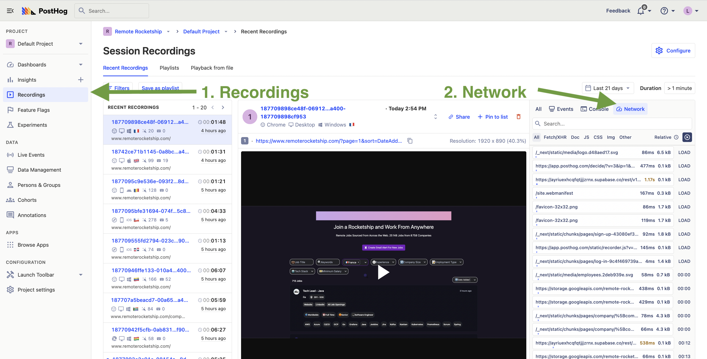
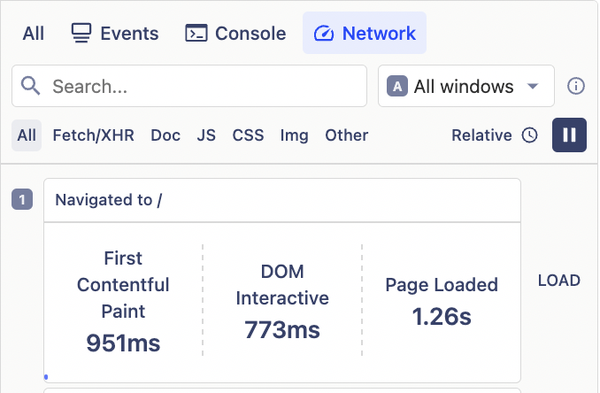
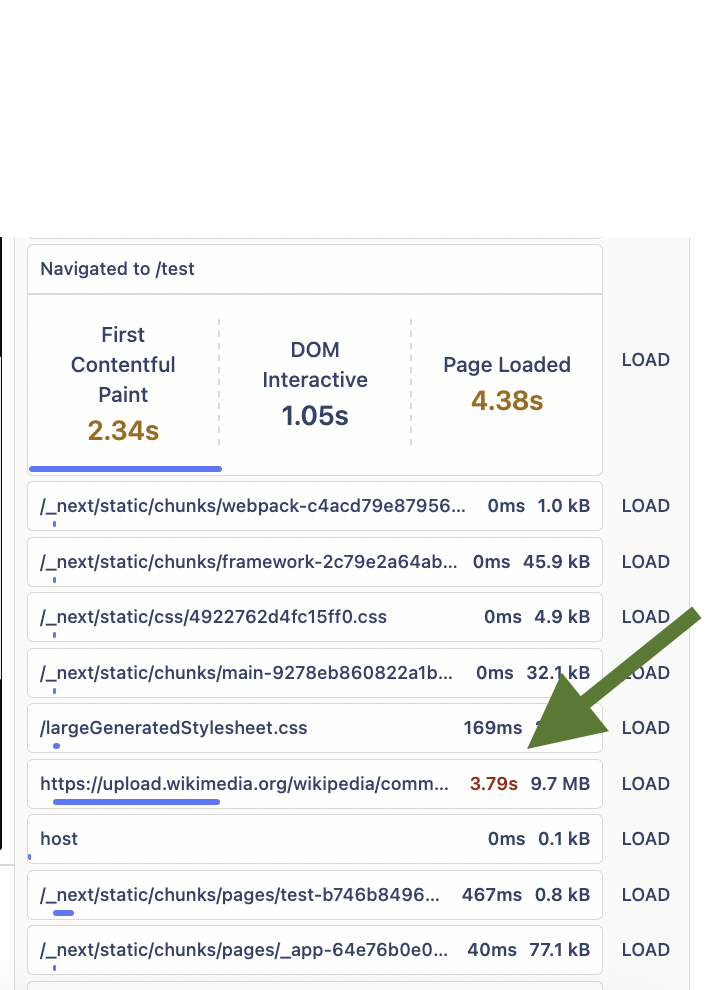
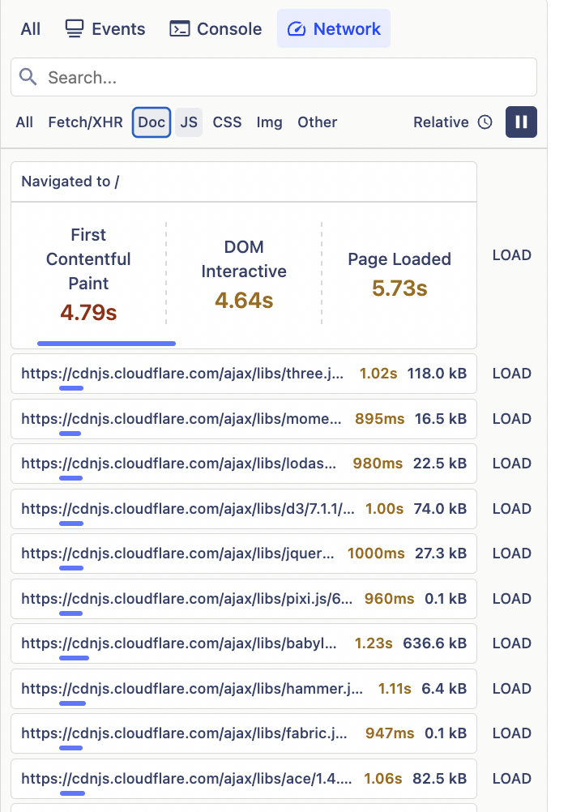
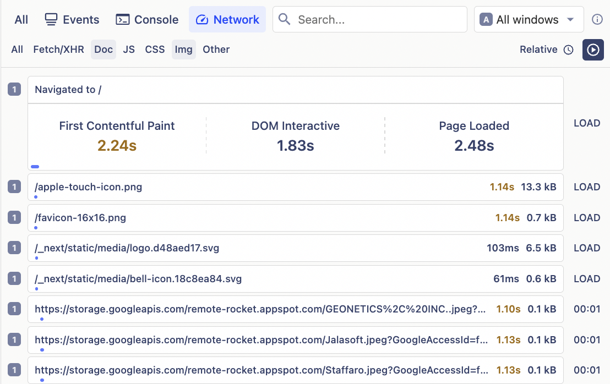
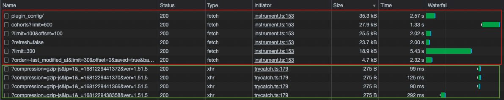

Waiting for slow web apps is like watching paint dry. It's the bane of productivity, the destroyer of efficiency, and a leading cause of [customer churn](/blog/customer-churn-analysis-guide).

In this tutorial, we'll show you:
  * The three most important metrics for measuring page load speed
  * How to identify opportunities to improve performance using PostHog's [session replays](/docs/session-replay)
  * A cheat sheet to help you prioritize the most important areas to focus on.

## Setting up performance monitoring

First, ensure that session replays are [enabled](/docs/session-replay/manual). Next, navigate to the Session Replay tab in PostHog. Finally, click on the Network tab in the sidebar next to or below the replay.

Here you'll see all the network requests that are made during the page load and user session, as well as how long they took. You'll also see the time taken for First Contentful Paint, DOM interactive, and Page Loaded. 

Next, we'll go through what each one of these three metrics mean and how to improve them.

## 1. First Contentful Paint
[First Contentful Paint](https://developer.mozilla.org/en-US/docs/Glossary/First_contentful_paint) (FCP) measures the time from when the page starts loading to when any element of the page's content is rendered on the screen. Note that it does not measure the time it takes the entire page to load.

<Caption>FCP happens in the second frame, as that's when the first text and image elements are rendered to the screen. [Source](https://web.dev/fcp)</Caption>

[According to the Chrome team](https://web.dev/fcp/), a good FCP time is 1.8 seconds while anything above 3 seconds is considered poor. 

Factors that can affect FCP are:
* Page size and complexity
* Server response time ([Time to First Byte](https://web.dev/ttfb/)) 
* JavaScript and other client-side scripts, particularly if they are resource-intensive and take a long time to execute.
* Caching, since it can reduce the time it takes to download and render resources.
*  Network latency

## 2. Dom Interactive
[Dom Interactive](https://developer.mozilla.org/en-US/docs/Web/API/Document/readyState) means that all HTML content on the page has been downloaded and parsed, and is ready to be manipulated by JavaScript code, but sub-resources such as scripts, images, stylesheets and frames are still loading. 

In general, DOM Interactive happens before FCP (since FCP requires the browser to have downloaded and rendered at least some content of the page). Any subsequent changes to the DOM beyond the initial page load also trigger DOM Interactive, and thus it can be called multiple times.

Factors affecting DOM Interactive are:

* Page size and complexity. The larger and more complex a page is, the longer it takes for the browser to parse and process the HTML content, leading to a slower DOM Interactive time.

* Number and size of script. The more scripts a page has and the larger their size, the longer it takes for the browser to download and execute them, which can delay DOM Interactive.

* Server response time. Slow server response times can delay the delivery of the page's resources, including the HTML content, leading to slower DOM Interactive times.

* Third-party scripts.

* Network latency.

## 3. Page Loaded
The whole page has [loaded](https://developer.mozilla.org/en-US/docs/Web/API/Window/load_event) and is ready for the user to interact with it, including all dependent resources such as stylesheets and images. 

While there is no benchmark for what is a good time for Page Loaded, a [good time for Time to Interactive (TTI)]((https://developer.chrome.com/docs/lighthouse/performance/interactive/#how-lighthouse-determines-your-tti-score)), a closely related but more comprehensive metric, is under 3.8 seconds while over 7.3 seconds is considered slow.

## So what's more important? FCP, Dom Interactive, or Page Loaded?
All of them are important for a good user experience! However, you may decide to focus on a specific metric depending on your goal. For example:

- For a B2B SaaS app that involves complex workflows, interactivity and responsiveness are essential to use the application effectively. In this case, DOM Interactive should be prioritized.

- For content-heavy websites like blogs, FCP should be prioritized as it determines the time it takes for readers to see the first piece of content, which can impact their initial impression and the likelihood they'll continue reading.

- For a site whose main goal is to attract SEO traffic and is looking to improve their [PageSpeed Insights performance score](https://pagespeed.web.dev/), then Page Loaded will be the most important since this contributes the most to [Total Blocking Time](https://web.dev/tbt/), which has the [highest weighting](https://developer.chrome.com/docs/lighthouse/performance/performance-scoring/) when calculating the performance score.

- For an e-commerce site with a checkout form with many input fields and complex validation, a high DOM Interactive time means that the form is slow to respond to user input.
 
- For a personal finance app, DOM Interactive ensures that users can quickly navigate and interact with the various financial tools on offer. However, Page Loaded guarantees that all the data visualizations, such as charts and graphs, are fully loaded and functional. 

## Optimization cheat sheet
If you're looking to improve any of the above metrics, here is a handy cheat sheet for where to look for opportunities. Each value in the table indicates how likely the metrics are to be affected.

| What?   | First Contentful Paint  | DOM Interactive | Page Loaded |
|--------|--------|--------|--------|
| Page Size   | 🟢 High  | 🟢 High   | 🟢 High |
| Server Response Time   | 🟢 High  | 🟢 High | 🟢 High |
| Network Latency   | 🟢 High  | 🟢 High | 🟢 High |
| Downloading JavaScript  | 🟡 Medium (only if it blocks rendering) | 🟢 High | 🟢 High |
| Executing JavaScript  | 🟡 Medium (only if it blocks rendering) | 🟢 High | 🟢 High |
|API Requests |	🟡 Medium (only if they block rendering or are critical for initial content) |	🟡 Medium (only if they are for rendering critical content) |	🟢 High |
| CSS Files: Downloading and Parsing  | 🟢 High | 🟡 Medium | 🟡 Medium |
| Images: Downloading and Rendering| 🟡 Medium (only if they are part of the initial content) | 🔴 Low | 🟢 High |
| Fonts: Downloading and Rendering  | 🟡 Medium (only if they are part of the initial content)  | 🔴 Low |  🔴 Low  |

## Identifying opportunities in your own app
PostHog's performance monitoring tool shows you the size and speed of different requests made during page load. You can also filter these by request type, such as API, JS, image, and CSS requests.

Combine this with the cheat sheet above and you'll be able to pinpoint what are the contributing factors to your metric times.

### **Examples**

#### 1. Large Images

Here we see a large image download that is delaying Page Loaded. It may also be delaying FCP if it's part of the initial content.

#### 2. JS requests**

In this example we see high Page Loaded time caused by downloading many JavaScript packages. However, downloading JavaScript may not always impact our three core metrics. Consider the following example: 

Here we see fast times for downloading JavaScript. Expanding into one of the requests, we can also see that the request is not blocking the render of the screen. Thus we can conclude that this JS download is not contributing significantly to any of our metrics.

#### 3. Latency delays

This example shows tiny images that are taking in excess of one second to download. This may be caused by server or network latency.

## Turning opportunities into results

Once you have identified which factors are affected your page load times, here are some actionable next steps to improve them:

### JavaScript
* Optimize the order of files by ensuring that critical scripts load first.

* Defer or asynchronously load non-critical JavaScript.

* Minify files i.e. strip out comments, line breaks and other unnecessary characters. You can use tools such as [Google's Closure Compiler](https://developers.google.com/closure/compiler) or [UglifyJS](https://github.com/mishoo/UglifyJS).

* Remove unnecessary libraries, packages, and dependencies, or switch to less resource-intensive alternatives.

### Images
* Use image compression tools like [TinyPNG](https://tinypng.com/) or [ImageOptim](https://imageoptim.com/) to reduce file sizes without sacrificing quality.

* Choose modern image formats like WebP or AVIF, which offer better compression ratios than traditional formats like JPEG and PNG.

* Implement lazy-loading.

* Serve correctly sized images based on the user's screen size by using responsive images with the `srcset` attribute.

### Server and network latency
* Use a Content Delivery Network (CDN). CDNs cache your static assets across multiple servers around the world, allowing users to access your content from the server closest to them.

* Fine-tune your load balancer and cache control policies to reduce the number of steps between the browser and your source content.

* Minimize your response payloads to return as little data as needed.

* Use compression algorithms like [Gzip](https://www.gnu.org/software/gzip/) or [Brotli](https://www.brotli.org/) to reduce file sizes and API responses.

<Caption>Notice the big difference in time taken between network requests returning uncompressed responses (red) and gzip-compressed responses (green)</Caption>

## Further reading

- [How to use session replays to get a deeper understanding of user behavior](/tutorials/explore-insights-session-recordings)
- [How to use session replays to improve your support experience](/tutorials/session-recordings-for-support)
- [What is real user monitoring (and how to set it up)](/blog/real-user-monitoring)

