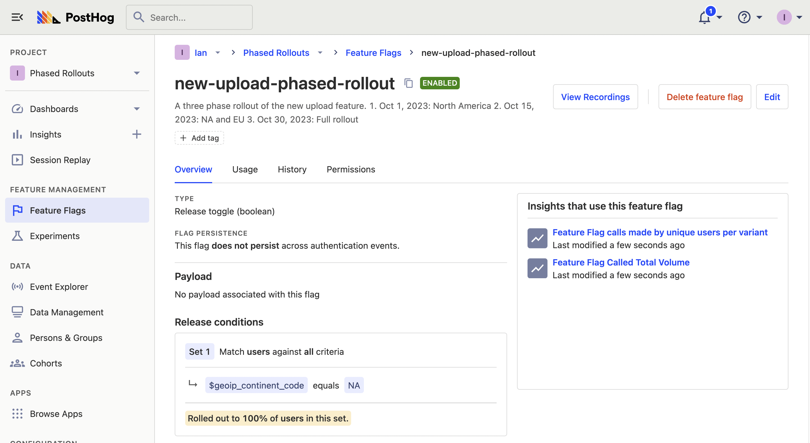
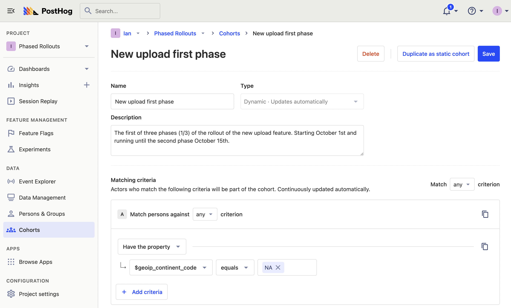

Phased rollouts, also known as phased releases, are a way to roll out new features safely. They are a way to [test a feature works in production](/blog/testing-in-production) with a small group before incrementally moving to progressively bigger (and more important) groups. 

This tutorial shows how to set up a phased rollout using feature flags and cohorts in PostHog.

## Prerequisites for phased rollouts

To get accurate feature flag targeting and user cohorts, we must set up user identification.

Feature flags check the distinct ID of the user to decide if they should return `true` or `false`. This distinct ID connects to person and group properties, which you can set to whatever you like.

The [snippet](/docs/getting-started/install?tab=snippet) or [JavaScript Web SDK](/docs/libraries/js) automatically generates a distinct ID, and PostHog automatically generates some properties like [GeoIP](/docs/product-analytics/user-properties#geoip-properties). You can modify the distinct ID or add properties by [identifying users](/docs/getting-started/identify-users). You can also add users to a group using [the `group()` function](/docs/getting-started/group-analytics). 

## Phased rollout with feature flags

In PostHog, go to the [feature flag tab](https://app.posthog.com/feature_flags) and click New feature flag. To set up this flag effectively, you can:

- Add a key like `phased-rollout`.
- Add the details on the phases of the rollout in the description. The dates and target details are great to add here.
- Set the release condition to the first phase of the rollout. This could be a percentage, group, or property.
- Once done, click "Save."



> **Using experiments:** If you want to track the impact your rollout has on key metrics, you can create an experiment for it. After doing this, you can edit the underlying feature flag to match your first phase like you do in a [holdout test](/tutorials/holdout-testing).

After creating your flag, go to your app to implement it. For example, in a Next.js app, your feature might look like this:

```js
// app/page.js
'use client'
import { usePostHog } from 'posthog-js/react'
import { useEffect, useState } from 'react'

export default function Home() {

  const [flag, setFlag] = useState(false)
  const posthog = usePostHog()

  useEffect(() => {
    const ph_flag = posthog.isFeatureEnabled('phased-rollout') 

    if (typeof ph_flag !== 'undefined') {
      setFlag(ph_flag)
    }
  }, [])

  return (
    <>
      <h1>Phased rollout</h1>
      <h2>{flag ? 'You are in!' : 'Not yet!'}</h2>
    </>
  )
}
```

When it is time for the next phase of the rollout, all you do is update the flag in PostHog with the next rollout phase group (percentage or properties) and press save. The flag then becomes active for the next phase of users.

## Using cohorts for phased rollouts

A good way to organize rollout phases when using feature flags is cohorts. These able you to define all your rollout phases and the beginning of the process and simply swap them in the feature flag. If you repeatedly do phased rollouts, you can also reuse them.

To create a cohort, go to the [cohorts tab](https://app.posthog.com/cohorts) and click "New Cohort." Set up the properties you want the cohorts to have as well as the details on the cohort. Again, it is useful to add details on the group and dates.



Once created, repeat for the rest of your phases. You can then use the cohorts as the release conditions in feature flags and swap them out as the phased rollout progresses.

> **Note:** You cannot use dynamic behavioral or lifecycle cohorts (based on completed events) with feature flags. Read more details in the [feature flag documentation](/docs/feature-flags/common-questions#why-cant-i-use-a-cohort-with-behavioral-filters-in-my-feature-flag).

## Further reading

- [How to do holdout testing](/tutorials/holdout-testing)
- [Running experiments on new users](/tutorials/new-user-experiments)
- [How to do a canary release with feature flags in PostHog](/tutorials/canary-release)