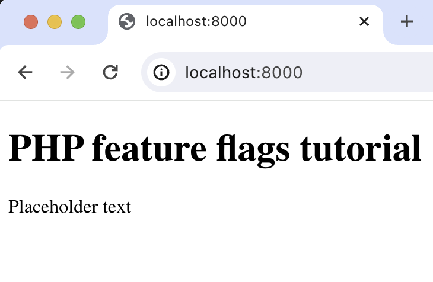

import { ProductScreenshot } from 'components/ProductScreenshot'
export const EventsInPostHogLight = "https://res.cloudinary.com/dmukukwp6/image/upload/v1710055416/posthog.com/contents/images/tutorials/php-feature-flags/events-light.png"
export const EventsInPostHogDark = "https://res.cloudinary.com/dmukukwp6/image/upload/v1710055416/posthog.com/contents/images/tutorials/php-feature-flags/events-dark.png"
export const CreateFlagLight = "https://res.cloudinary.com/dmukukwp6/image/upload/v1710055416/posthog.com/contents/images/tutorials/php-feature-flags/events-light.png"
export const CreateFlagDark = "https://res.cloudinary.com/dmukukwp6/image/upload/v1710055416/posthog.com/contents/images/tutorials/php-feature-flags/events-dark.png"
export const FlagCaptureLight = "https://res.cloudinary.com/dmukukwp6/image/upload/v1710055416/posthog.com/contents/images/tutorials/php-feature-flags/flag-capture-light.png"
export const FlagCaptureDark = "https://res.cloudinary.com/dmukukwp6/image/upload/v1710055416/posthog.com/contents/images/tutorials/php-feature-flags/flag-capture-dark.png"

[Feature flags](/feature-flags) help you conditionally roll out and release features safely. This tutorial shows you how integrate them in PHP using PostHog. 

We'll create a basic PHP app, add PostHog, create a feature flag, and then implement the flag to control content in our app.

## 1. Create a basic PHP app

First, ensure [PHP](https://www.php.net/manual/en/install.php) is installed. Then, create a new folder for your project called `php-feature-flags`. In this folder, create an `index.php` file:

```bash
mkdir php-feature-flags
cd ./php-feature-flags
touch index.php
```

Next, add the following code to `index.php` to set up a basic page with a heading and paragraph:

```php file=index.php
<?php
$paragraphText = 'Placeholder text';
?>

<!DOCTYPE html>
<html>
<body>
  <h1>PHP feature flags tutorial</h1>
  <p><?php echo $paragraphText; ?></p>
</body>
</html>
```

Run `php -S localhost:8000` and navigate to `http://localhost:8000` to see our app in action.



## 2. Add PostHog to your app

With our app set up, it’s time to install and set up PostHog. If you don't have a PostHog instance, you can [sign up for free](https://us.posthog.com/signup).

To start, make sure [Composer](https://getcomposer.org/) is installed. Then run `composer require posthog/posthog-php` to install [PostHog’s PHP SDK](/docs/libraries/php).

Then, initialize PostHog at the top of `index.php` using your project API key and instance address (you can find these in [your project settings](https://us.posthog.com/project/settings)):

```php file=index.php
<?php
require_once __DIR__ . '/vendor/autoload.php';
use PostHog\PostHog;

PostHog::init(
  '<ph_project_api_key>',
  ['host' => '<ph_instance_address>']
);

// rest of your code
```

Lastly, we [capture](/docs/product-analytics/capture-events) a `$pageview` event using `PostHog::capture()`: 

```php file=index.php
<?php
require_once __DIR__ . '/vendor/autoload.php';
use PostHog\PostHog;

PostHog::init(
  '<ph_project_api_key>',
  ['host' => '<ph_instance_address>']
);

$paragraphText = 'Placeholder text';
$distinctId = 'placeholder-user-id';

PostHog::capture([
    'distinctId' => $distinctId,
    'event' => '$pageview'
]);

?>

<!-- your existing html code -->
```

With this set up, restart your app and then refresh your browser a few times. You should now see the captured event in your [PostHog activity tab](https://us.posthog.com/events).

<ProductScreenshot
  imageLight={EventsInPostHogLight} 
  imageDark={EventsInPostHogDark} 
  alt="Events captured in PostHog" 
  classes="rounded"
/>

## 3. Create a feature flag in PostHog

With PostHog set up, your app is ready for feature flags. To create one, go to the [feature flags tab](https://us.posthog.com/feature_flags) in PostHog and click **New feature flag**. Enter a flag key (like `my-cool-flag`), set the release condition to roll out to 100% of users, and press "Save."

<ProductScreenshot
  imageLight={CreateFlagLight} 
  imageDark={CreateFlagDark} 
  alt="Feature flag created in PostHog" 
  classes="rounded"
/>

You can customize your [release conditions](/docs/feature-flags/creating-feature-flags#release-conditions) with rollout percentages, and [user](/docs/product-analytics/user-properties) or [group properties](/docs/product-analytics/group-analytics) to fit your needs.

## 4. Implement the flag code

To implement the feature flag, we: 

1. Fetch the `my-cool-flag` flag using [`PostHog::isFeatureEnabled()`](/docs/libraries/php#feature-flags). 
2. Update the paragraph text based on whether the flag is enabled or not.

```php file=index.php
<?php
require_once __DIR__ . '/vendor/autoload.php';
use PostHog\PostHog;

PostHog::init(
  '<ph_project_api_key>',
  ['host' => '<ph_instance_address>']
);

$paragraphText = 'Placeholder text';
$distinctId = 'placeholder-user-id';

// fetch the feature flag
$isFlagEnabled = PostHog::isFeatureEnabled(
  'my-cool-flag',
  $distinctId
);
if ($isFlagEnabled) {
  $paragraphText = "Flag enabled!";
} else {
  $paragraphText = "Flag disabled!";
}

// rest of your code
```

When you restart your app and refresh the page, you should see the text updated to `Flag enabled!`. 

> **💡 Setting the correct `distinctId`:**
> 
> You may notice that we set `$distinctId = 'placeholder-user-id'` in our flag call above. In production apps, to ensure you fetch the correct flag value for your user, `distinctId` should be set to their unique ID. 
> 
> For logged-in users, you typically use their email or user ID as their `distinctId`. For logged-out users, assuming they made their request from a browser, you can use values from their request cookies. See an example of this in our [Nuxt feature flags tutorial](/tutorials/nuxt-feature-flags#setting-the-correct-distinctid).

## 5. Include the flag when capturing your event

To ensure any captured events are associated with the correct flag value, we need to [include our flag information when capturing](/docs/libraries/php#step-2-include-feature-flag-information-when-capturing-events) them. This enables us to breakdown [insights](/docs/product-analytics/insights) by feature flag value.

To do this for our `$pageview` event, we add the [`$feature/my-cool-flag`](/docs/libraries/php#step-2-include-feature-flag-information-when-capturing-events) key to our event properties when capturing:

```php file=index.php
<?php

// rest of your code

PostHog::capture([
    'distinctId' => $distinctId,
    'event' => '$pageview',
    'properties' => [
      '$feature/my-cool-flag' => $isFlagEnabled
    ]
]);

// rest of your code
```

Now when your event is captured, you should see the flag value in the event details in PostHog:

<ProductScreenshot
  imageLight={FlagCaptureLight} 
  imageDark={FlagCaptureDark} 
  alt="Feature flag details in PostHog events" 
  classes="rounded"
/>

## Further reading

- [How to set up one-time feature flags](/tutorials/one-time-feature-flags)
- [How to set up A/B tests in PHP](/tutorials/php-ab-tests)
- [How to set up analytics in PHP](/tutorials/php-analytics)
