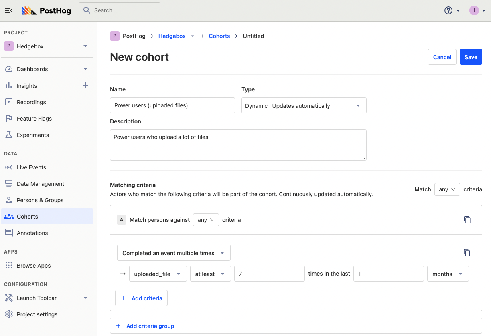
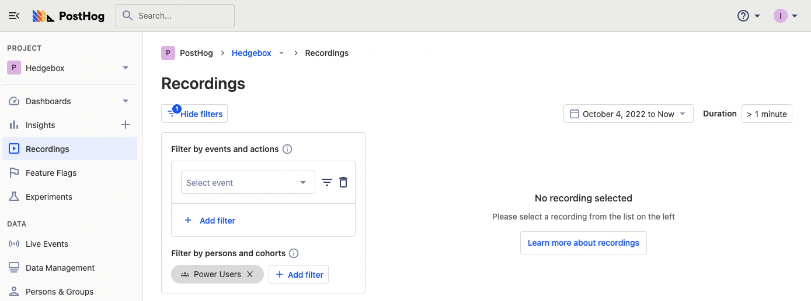
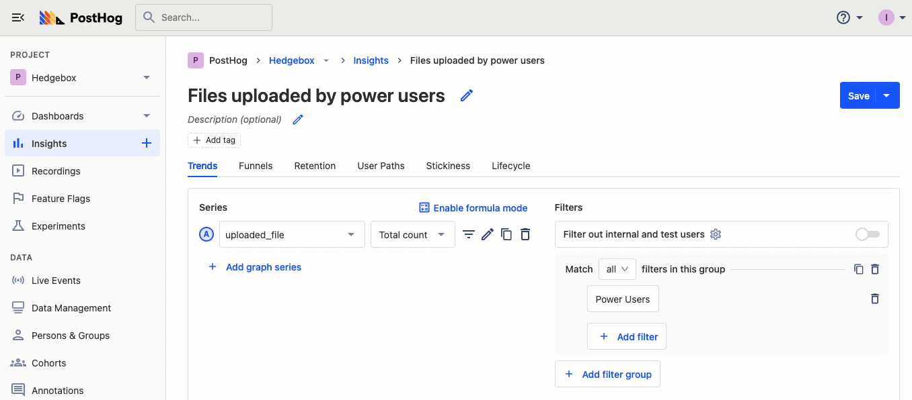
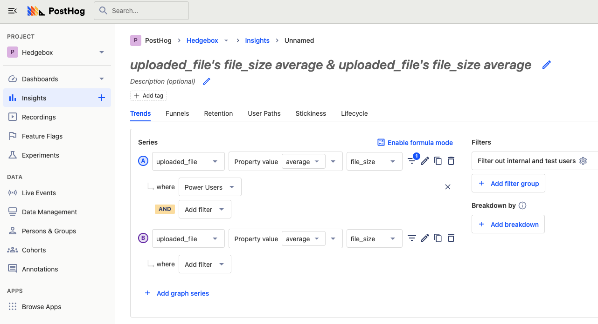

Power users are users who use your product the most, significantly more than the average user. They have different needs and usage patterns than average users. Often, they are a company’s best and most important customers.

Power users are knowledgeable, willing to learn, and likely to give feedback about your product. They care more about new features and upgrades than the average user does. Changes can impact a power user while not impacting an average user. That is why it is important to analyze power users and build for them as a group separately.

Building a better product for power users keeps them happy and helps prevent them from churning. It helps you build a competitive advantage by growing lock-in with these users. It also  encourages average users to increase their usage and become power users.

To create a great product for power users, you must know who they are and how they are using your product. In this tutorial, we’ll cover how to identify and analyze power users. All you need to start is a PostHog instance (and some users).

## Defining your power users

The first step to identifying and analyzing a power user is defining them. There is no one-size-fits-all, every company and product has its own definition. Defining what they do is key to identifying and analyzing them. Ideally, your power users should align with your ideal customer profile and your [key product metrics](/blog/b2b-saas-product-metrics.

One common aspect between definitions of power users is high usage, whether that is visiting every day, using feature lots, or long session times. A power user relies on the product, it is core to their workflow. They also use advanced features more than average.

You can use PostHog to define exactly what a power user looks like. To do so, identify the key features for power users and analyze the events and actions related to those features. Some ideas:

- Compare the retention percentage or returning amounts. Power users have higher retention.

- Compare the stickiness (what events are causing users to come back repeatedly). Power users use features repeatedly.

- Create trends for average user usage vs 90th, 95th, and 99th percentile usage. Power users use features significantly more than average. The larger the gap, the better.

If a feature shows higher retention, repeated use, and a large difference in usage to the average, it is likely valuable to a power user. You can use data related to this feature along with qualitative analysis to solidify the definition of your power user.

## Identifying your power user

Once you’ve decided your definition is a good one, you can use it to create a cohort. To create a power user cohort, we rely on two criteria:

- **Completed an event multiple times**, for power users who have a higher volume of usage
- **Completed an event regularly**, for power users who use advanced features

Both represent power user behavior. When combined with the key events or actions identified earlier, we can create a cohort that matches our definition of a power user.

As an example, we’ll use `uploaded_file` as the power user event we care about. We can then either select “completed an event multiple times” or “completed an event regularly.” Because we care about the high volume of usage, and `uploaded_file` isn’t an advanced feature, we’ll choose “completed an event multiple times.” We’ll then set our usage amounts and regularity (which we can tweak later). Once done, it should look something like this:

Make sure to add the title (that is searchable) and description, then select a type (static vs dynamic). You likely want to make this cohort dynamic to ensure it updates with users matching the criteria now. Finally, we’ll click save to use this power user cohort in analysis.

## Analyzing power users

Once we’ve saved a cohort, we immediately get a list of users who fit our power user criteria. We can start by using this list to check for session recordings. To do so, go to recordings, filter by persons and cohorts, then search for your power user cohort. From there you can filter further by events, date, or duration. Analyzing these recordings gives you insights into how power users use your product, and enables you to build a better one for them.

You can also use your cohort as a base in trends to do all sorts of analysis. In each of the visualizations (except lifecycle), we can use power users as a filter group. Once the power user filter group is set, we can analyze trends in usage, conversion funnels, retention graphs, user paths, and more.

You can also use the power user cohort to compare them against average users. Compare the properties and activity of power users to average users to understand how they differ. For example, we can compare the average file size for power users versus average users, and we might discover average users upload larger files than power users do.

With all that, you’ve set up a power user cohort and begun to do analysis. From here, you can tweak the cohort to better fit your definition and tailor your analysis to your product. You can begin to ask questions about your data to help build a better product for your power users.

## Further reading

- Use your newly created power user cohort to calculate session-based metrics like time on site and pages per session with [help from this tutorial](/tutorials/session-metrics).
- [This tutorial](/tutorials/experiments) teaches you how to run Experiments without feature flags to improve the power user experience.
- Learn how we make something people want (and create power users by doing it) in [this blog post](/blog/making-something-people-want) by our CEO James.

<NewsletterTutorial compact/>
