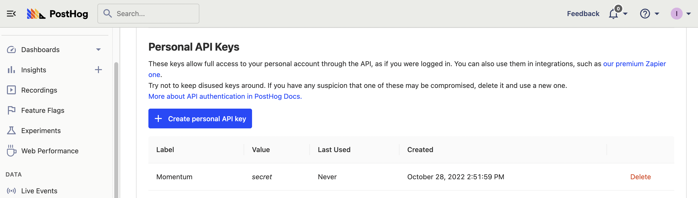
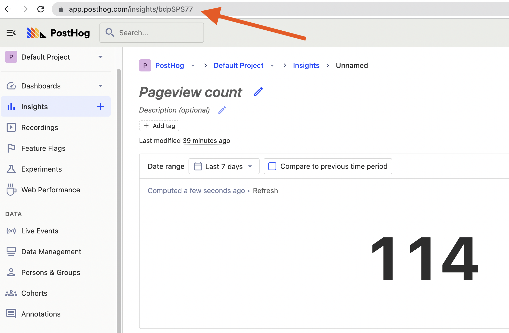
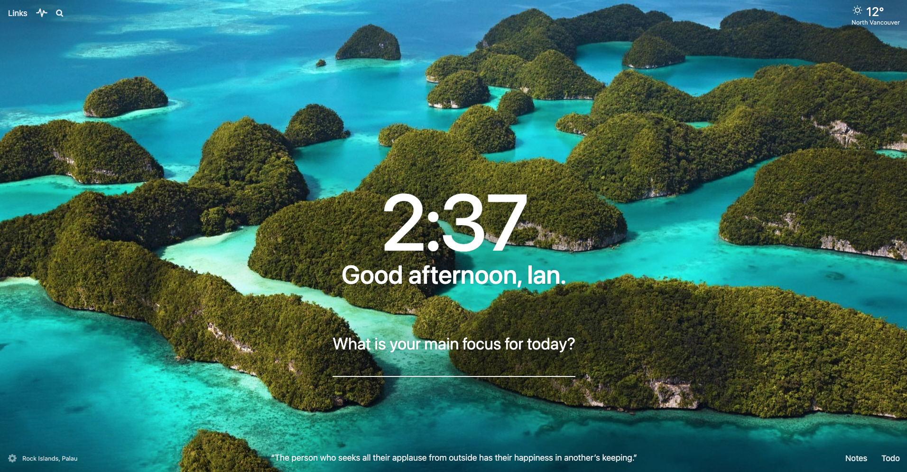
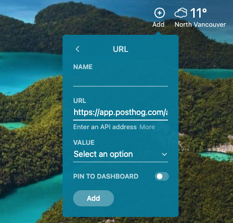
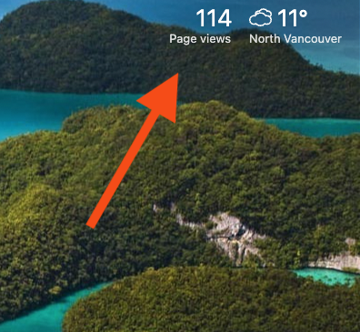

Keeping product analytics top of mind keeps you focused on what matters to your product and customers. It reminds you about the state of the product, and what you need to do to improve it.

When you spend lots of time on a computer, one of the areas you see the most is the new tab page in your browser. There are many extensions for changing and customizing the new tab page, but one of the most popular (and one of our favorites) is [Momentum Dash](https://momentumdash.com/). It transforms the new tab into a focused, productive, and inspiring dashboard. 

In this tutorial, we’re going add key product data from PostHog into Momentum Dash’s new tab dashboard. We’ll show you how to format the API request that Momentum Dash uses to get the information from PostHog. To do this, you need a PostHog instance and a [Momentum Dash Plus](https://momentumdash.com/plus) account.

## Getting the information for the API request in PostHog

To get our PostHog data into Momentum Dash, we need to format an API request that “gets” that metric. Momentum Dash makes this API request every time you open a new tab to fill in the key metric information. We are going to need three pieces of information from PostHog to create an API request.

### 1. A personal (or project) key

We recommend creating a personal API key in PostHog for the API request. To do so, click your account icon in the top right corner, and then the gear next to your account name. In “My settings,” scroll down to “Personal API Keys” and click “Create personal API key.” Name it something like “Momentum.” Once created, make sure you copy and save it because you must create a new one if you lose it.



You can also use the project key (not recommended). You find it in “Project settings” under “Project Variables.”

### 2. A project ID

You find your project ID by clicking “Project settings” in the sidebar, then scrolling down to the “Project Variables” and copying the value for “Project ID.” It should be a series of digits like `12345`. 

### 3. An insight short ID

Next, you need the data you want to show in the new tab. Browse to your insights or dashboards for a metric you want to display. When you find it, click on the insight details (the link from insights or “view” from a dashboard). Once on that screen, copy the unique value in the URL after `<ph_client_api_host>/insights/`.



## Formatting the API request

Once you have all three pieces of information, we are going to use them to format an API request for the data Momentum Dash uses to display it. The API format is:

```bash
https://<ph_app_host>/api/projects/<project_id>/insights/?personal_api_key=<personal_key>&short_id=<insight_short_id>
```

So, if our instance address was `app.posthog.com`, project ID was `12345`, our personal API key was `phx_abcde`, and our insight short ID was `aAbBcC`, our API request would look like:

```bash
https://app.posthog.com/api/projects/12345/insights/?personal_api_key=phx_abcde&short_id=aAbBcC
```

Copy your formatted code and open up a new tab (assuming you have Momentum Dash set up) to move on to the next step.

## Adding your metric to Momentum Dash

Once you’ve signed up for Momentum Dash Plus and added the extension, your new tab page should look like this:



Hover your mouse in the top right corner, and an “add” button appears. Click it and select “Metric.” Next, choose “From a URL” and paste the API request you created in the last section into the URL field. If you formatted the API request properly, a drop-down appears that prompts you to “select an option.” 



When you click the drop-down, you get lots of options, you have to find the one that matches your metric (number) in PostHog. For my number chart, it was `result[0].result[0].aggregated_value` but it might also be `result[0].result[0].count`, or another value. 

> **Note:** It is likely easier to modify the insight in PostHog to provide a single value through a number chart than to reformat your API request to get that value.

Select the option with the right value from the drop-down, add a name, and then click “Add.” Once done, you have an updating metric on your new tab page.



Now, every time you open a new tab, you see product data showing you how you are doing. This value updates every time you open a new tab. You can add more or change them following the same process. These key product metrics provide important reminders every time you open a new tab.

## Further reading

- Deciding what metric to add to your new tab page? Churn rate is a popular one. Here’s [a tutorial on how you calculate (and lower) churn rate](/tutorials/churn-rate).
- Care more about time on site or average session duration? [This tutorial helps you calculate session-based metrics](/tutorials/session-metrics).
- Would rather have product metrics in Slack? See how you can set up [Slack and PostHog in our docs](/docs/integrate/webhooks/slack).
