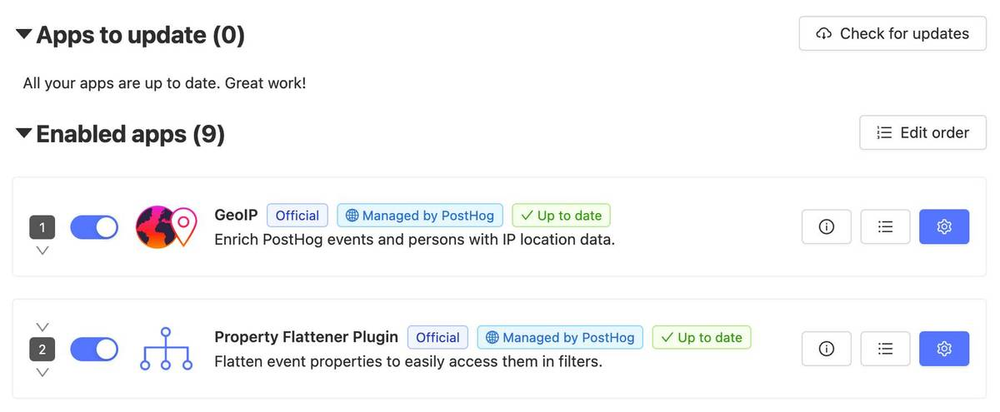
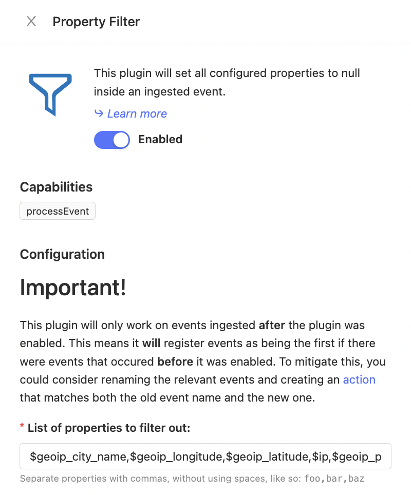

_Estimated reading time: 2 minutes_ ☕

By default, PostHog has the ability to gather IP data on users to determine their location, via the [GeoIP Enricher app](/apps/geoip-enrichment). 

It also has the ability to discard IP data by default. However, if this option is used then the GeoIP Enricher is unable to identify the country of origin for users - either _all_ the data is collected via the GeoIP Enricher, or all of it is discarded. 

That's where the Property Filter, which was created by the team at [Witty Works](https://www.witty.works/), comes in. Witty Works see privacy as a core feature, but also needs to collect some data to develop data-driven solutions. 

For this reason Witty Works created the [Property Filter app](/apps/property-filter) as a way to determine the _country_ from which requests are coming, while discarding all other data to protect users privacy. Here's how!

# 1. Install the Property Filter app

First, install the [Property Filter](/apps/property-filter) to your PostHog instance. You can find it in the Apps Library by following these steps:

- Log in to your PostHog instance
-  Click "[Data pipeline](https://us.posthog.com/apps)" in the left sidebar
- Search for 'Property Filter' press 'Install'

It's important to note that this app effectively removes information from PostHog events by setting properties to null. Apps on PostHog run in sequence, so it usually makes sense to place this app at the end of a sequence. If you are filtering `$ip`, `event.ip` will also be set to `null`.

# 2. Configure the app chain

Apps on PostHog run in a sequential chain and in order for the Property Filter to remove unwanted information, that information first has to be present. In short: Ensure that the Property Filter runs _after_ the GeoIP Enricher. 



You can reorder the app chain simply by selecting 'Edit Order' and dragging the apps to run in any order you want. Apps at the top of the list run first, while those at the bottom run last. 

# 3. Configure the filter to remove selected GeoIP info

This app sets all specified properties on ingested events to `null`, effectively preventing PostHog from collecting information you do not want it to use.

To configure the app to remove selected properties, simply select the blue gear icon and enter the properties you wish to remove. 



## The full list of GeoIP properties

...at time of writing are

* $geoip_city_name
* $geoip_country_name
* $geoip_country_code
* $geoip_continent_name
* $geoip_continent_code
* $geoip_postal_code
* $geoip_latitude
* $geoip_longitude
* $geoip_time_zone
* $geoip_subdivision_1_name
* $geoip_subdivision_1_code
* $geoip_subdivision_2_name
* $geoip_subdivision_2_code
* $geoip_subdivision_3_code
* $geoip_subdivision_3_name

You can [check the current list in the source code for the app.](https://github.com/PostHog/posthog-plugin-geoip)

## Event and Person properties

The GeoIP app sets [person properties using `$set` and `$set_once`](https://posthog.com/docs/integrate/user-properties). If you want to drop those properties prefix the geoip property name with either `$set` or `$set_once`.

For example to ensure `$geoip_cityname` is _never_ stored on either events or persons you would configure:

* $geoip_city_name (the event property)
* $set.$geoip_city_name (the person proprty)
* $set_once.$initial_geoip_city_name (the initial and never updated person property)

## A working example

Below is the full configuration Witty Works uses to filter out unwanted data before it is written to PostHog's event log:

```$geoip_city_name,$geoip_longitude,$geoip_latitude,$ip,$geoip_postal_code,$current_url,$performance_raw,$referrer,$initial_referrer,$pathname```
