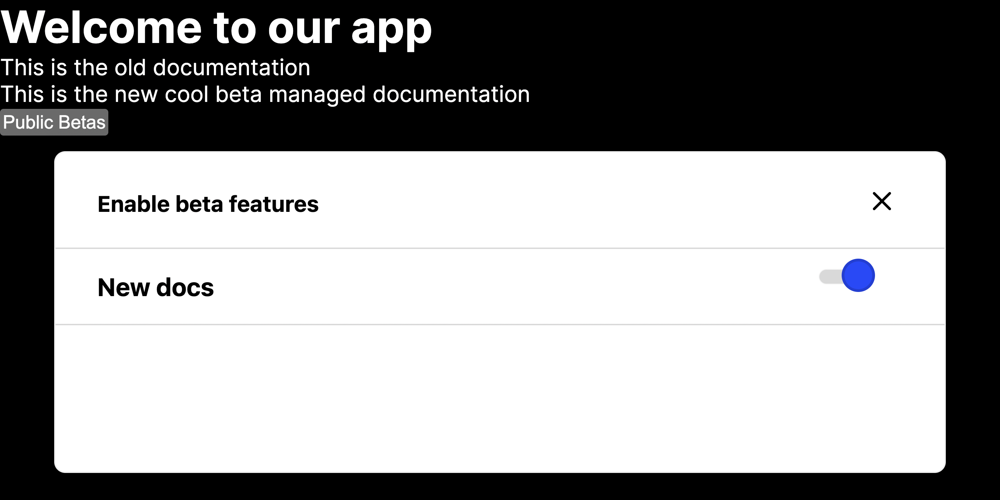
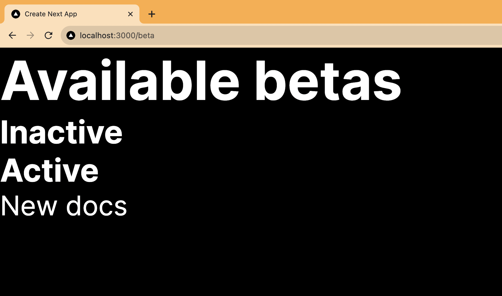

Public betas are a way to get new features into the hands of users and get valuable feedback and analytics. In this tutorial, we show you how to add a basic public beta program to your app with PostHog’s [early access management feature](/docs/feature-flags/early-access-feature-management).

Our example uses Next.js, but this also works for other frameworks and languages.

> Already have an app and PostHog set up? [Skip creating the beta feature](#creating-our-beta-feature-in-posthog).

## Creating a Next.js app and adding PostHog

First, create a Next.js app. To do so, install Node and run the command below. Select **No** for TypeScript, **Yes** for `use app router`, and the defaults for every other option.

```bash
npx create-next-app@latest beta-program
```

Next, we go into our newly created beta-program folder and install PostHog.

```bash
cd beta-program
npm i posthog-js
```

After this, we initialize PostHog. Create a `providers.js` file in the `app` folder, then set up PostHog with your project API key and instance address (which you get from your [project settings](https://app.posthog.com/project/settings)). Make sure to include the `use client` directive, a check for the window, and opt-in to site apps (which we will use later).

```js
// app/providers.js
'use client'
import posthog from 'posthog-js'
import { PostHogProvider } from 'posthog-js/react'

if (typeof window !== 'undefined') {
  posthog.init('<ph_project_api_key>', {
    api_host: '<ph_instance_address>',
    opt_in_site_apps: true
  })
}

export function PHProvider({ children }) {
  return <PostHogProvider client={posthog}>{children}</PostHogProvider>
}
```

We then import the `PHProvider` into `layout.js` and wrap our app in it.

```js
// app/layout.js
import { PHProvider } from './providers'

export default function RootLayout({ children }) {
  return (
    <html lang="en">
      <PHProvider>
        <body>{children}</body>
      </PHProvider>
    </html>
  )
}
```

After setting this all up and running `npm run dev`, we are ready to set up our public beta program.

## Creating our beta feature in PostHog

Next, we create our beta feature in PostHog. As an example, we create a beta for a new set of docs. 

To start, go to the [early access management tab](https://app.posthog.com/early_access_features) in PostHog and click "New public beta." Give your beta a name like "New docs," any other details you want, and click "Save as draft." This automatically creates a feature flag we can use. Finally, click "Release beta."

## Adding our beta functionality

Next, we add our beta functionality. To do this, we check our `new-docs` feature flag with `useFeatureFlagEnabled` to show more documentation on our main `page.js` page.

```js
'use client'
import { useFeatureFlagEnabled } from 'posthog-js/react'

export default function Home() {

  const newDocs = useFeatureFlagEnabled('new-docs')
  
  return (
    <div>
      <h1>Welcome to our app</h1>
      <p>This is the old documentation</p>
      {newDocs && (
        <p>This is the new cool beta managed documentation</p>
      )}
    </div>
  )
}
```

When we run `npm run dev` again and go to our localhost, we see the old documentation because we haven’t joined the beta yet.


## Adding our public beta opt-in to our app

To make this beta a public one, we need a way for people to opt in on our site. The easiest way to do this is using PostHog’s early access modal site app.

To set this up, search for the "Early Access Features App," enable it, set a selector of `#beta-button`, and press save.

Because we set `opt_in_site_apps: true` in config earlier, all we do is add a button to our `page.js` file with the ID of `beta-button`. Clicking this button opens a modal that enables users to opt into public betas for your app.

```js
// app/page.js
'use client'
import { useFeatureFlagEnabled } from 'posthog-js/react'

export default function Home() {

  const newDocs = useFeatureFlagEnabled('new-docs')
  
  return (
    <div>
      <h1>Welcome to our app</h1>
      <p>This is the old documentation</p>
      {newDocs && (
        <p>This is the new cool beta managed documentation</p>
      )}
      <button id="beta-button">Public Betas</button>
    </div>
  )
}
```

When you head back to your browser and click the "Public Betas" button, a modal pops up allowing users to opt into the "New docs" beta. Once they do this, they see the new text we added behind the flag earlier.



This is a simple example of a public beta you can set up. At PostHog, we’ve used early access management to run public betas for full features like surveys, notebooks, and our data warehouse. 

## Creating a beta opt-in page

For full control over our beta opt-in page, we can create a custom page instead of using the modal.

To do this, first, create a new folder named `beta`. In this `beta` folder, create a file named `page.js`. In this file, we will:

1. Check for available betas and active feature flags.
2. Create two lists: currently active betas and currently inactive betas.
3. Display each list on the page with buttons to opt in or out of the beta.
4. Toggle their early access enrollment when they click those buttons.

First, set up a basic page with PostHog, our active flags, states for active and inactive betas, and spots to display both of them.

```js
// app/beta/page.js
'use client'
import { useActiveFeatureFlags, usePostHog } from 'posthog-js/react'
import { useState, useEffect } from 'react'

export default function Beta() {

  const posthog = usePostHog()
  const activeFlags = useActiveFeatureFlags()

  const [activeBetas, setActiveBetas] = useState([])
  const [inactiveBetas, setInactiveBetas] = useState([])
  
  return (
    <div>
      <h1>Available betas</h1>
      <h3>Inactive</h3>
      <h3>Active</h3>
    </div>
  )
}
```

Next, we set up a `useEffect` hook for our key logic. It filters the early access features (from `getEarlyAccessFeatures`) into active and inactive betas depending on if the flag key exists and then sets those two filtered lists in their states. We also just set all betas to inactive if they don’t have any active flags.

```js
// ...
const [inactiveBetas, setInactiveBetas] = useState([])

useEffect(() => {
  posthog.getEarlyAccessFeatures((features) => {

    if (!activeFlags || activeFlags.length === 0) {
      setInactiveBetas(features)
      return
    }

    const activeBetas = features.filter(
			beta => activeFlags.includes(beta.flagKey)
		);
    const inactiveBetas = features.filter(
			beta => !activeFlags.includes(beta.flagKey)
		);
    setActiveBetas(activeBetas)
    setInactiveBetas(inactiveBetas)
  }, true)
}, [activeFlags])

return (
// ...
```

 We then map the active and inactive beta states on our page.

```js
//...
	return (
	  <div>
	    <h1>Available betas</h1>
	    <h3>Inactive</h3>
	    {inactiveBetas.map(beta => (
	      <div key={beta.id}>
	        {beta.name}
	      </div>
	    ))}
	    <h3>Active</h3>
	    {activeBetas.map(beta => (
	      <div key={beta.id}>
	          {beta.name}
	      </div>
	    ))}
	  </div>
	)
}
```

This displays the active and inactive betas (you can create and launch another inactive beta feature to show that it works if you want).



The last piece is adding buttons to let users opt-in and out. To do this, we create a function that checks if the related flag key is in the `activeBetas` state. 

- If the flag key is active, it then calls `updateEarlyAccessFeatureEnrollment` with the key and `false`,  removing them from the beta, and updates the `activeBetas` state.
- If the flag key is inactive, it does the opposite. It calls `updateEarlyAccessFeatureEnrollment` with the key and `true`,and removes them from `inactiveBetas` state.

We also add buttons to call this function and opt in or out.

```js
// ...
const toggleBeta = (betaKey) => {
  if (activeBetas.some(beta => beta.flagKey === betaKey)) {
    posthog.updateEarlyAccessFeatureEnrollment(betaKey, false)
    setActiveBetas(prevActiveBetas => prevActiveBetas.filter(item => item.flagKey !== betaKey));
    return
  }

  posthog.updateEarlyAccessFeatureEnrollment(betaKey, true)
  setInactiveBetas(prevInactiveBetas => prevInactiveBetas.filter(item => item.flagKey !== betaKey));
}

return (
  <div>
    <h1>Available betas</h1>
    <h3>Inactive</h3>
    {inactiveBetas.map(beta => (
      <div key={beta.id}>
        {beta.name} - <button onClick={() => toggleBeta(beta.flagKey)}>Opt In</button>
      </div>
    ))}
    <h3>Active</h3>
    {activeBetas.map(beta => (
      <div key={beta.id}>
          {beta.name} - <button onClick={() => toggleBeta(beta.flagKey)}>Opt Out</button>
      </div>
    ))}
  </div>
)
// ...
```

With this, our beta page is all set up. Users can opt-in and out of betas whenever they want. You can customize it further to your needs.

## Further reading

- [How to create custom surveys](/tutorials/survey)
- [Get feedback and book user interviews with surveys](/tutorials/feedback-interviews-site-apps)
- [How to use Next.js middleware to bootstrap feature flags](/tutorials/nextjs-bootstrap-flags)