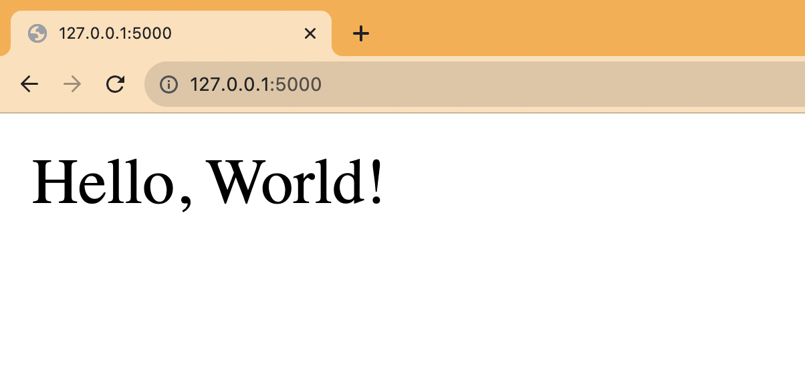
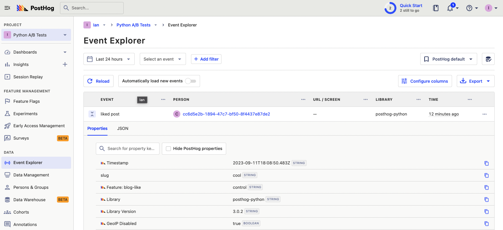
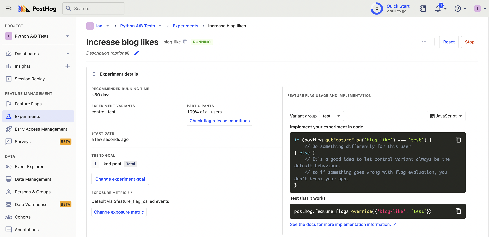
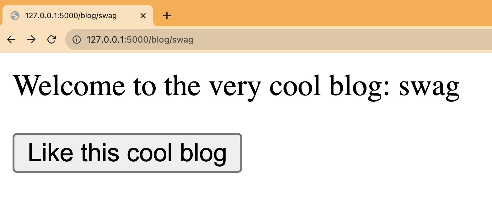

A/B testing enables you to experiment with how changes to your app affect metrics you care about. PostHog makes it easy to set up [A/B tests](/ab-testing) in Python. This tutorial shows you how to create a basic Python app with Flask, add PostHog to it, and then set up an A/B test to compare button variants.

## Creating a basic Flask app

To demonstrate how to implement A/B testing, we'll create an app using [Flask](https://flask.palletsprojects.com/), a Python web framework. 

To start, create a folder for our app named `ab-test-demo` and a file named `hello.py` in that folder.

```bash
mkdir ab-test-demo
cd ab-test-demo
touch hello.py
```

Next, create a virtual environment named `venv` for our app, activate the virtual environment, and install Flask.

```bash
python3 -m venv venv
. venv/bin/activate
pip install Flask
```

In `hello.py`, create a home route returning a basic "Hello, World!"

```python
# ab-test-demo/hello.py
from flask import Flask

app = Flask(__name__)

@app.route("/")
def hello_world():
  return "<p>Hello, World!</p>"
```

Afterward, create a `/blog/<string:slug>` route that returns a response with a "Like" button. Add `POST` handler to the route that returns returns a confirmation when clicked.

```python
# ab-test-demo/hello.py
from flask import Flask, request, make_response

# ... app, hello_world()

@app.route("/blog/<string:slug>", methods=["GET", "POST"])
def blog(slug):

  response = make_response()

  if request.method == "GET":
    response.data = f"""
      <p>Welcome to the blog post: {slug}</p>
      <form method="post" action="/blog/{slug}">
          <input type="submit" value="Like" name="like"/>
      </form>
    """
    return response
  elif request.method == "POST":
    return f"<p>Thanks for liking {slug}</p>"
```

Finally run `flask --app hello run` and go to `http://127.0.0.1:5000` to see your basic app running.



## Setting up PostHog

Next, we install PostHog [Python SDK](/docs/libraries/python) and the `uuid` package to generate user IDs.

```bash
pip install posthog uuid
```

We import both into our `hello.py` file then use your project API key and instance address from [your project settings](https://app.posthog.com/project/settings) to initialize a PostHog client.

```python
# ab-test-demo/hello.py
from flask import Flask, request, make_response
from posthog import Posthog
import uuid

posthog = Posthog(
  '<ph_project_api_key>', 
  host='<ph_instance_address>'
)

# ... app, hello_world(), blog()
```

In our `blog` route, set up a UUID user ID using a cookie. If the user ID doesn't exist, we generate a new one and set it as a cookie. If it does, we get it from the cookie. We use this UUID from the cookie for targeting our A/B test.

With this `user_id` value, we then use PostHog to capture a "liked post" event with a `slug` property.

```python
# ... posthog, app, hello_world()

@app.route("/blog/<string:slug>", methods=["GET", "POST"])
def blog(slug):

  response = make_response()

  if 'user_id' not in request.cookies:
    user_id = str(uuid.uuid4())
    response.set_cookie('user_id', user_id)
  else:
    user_id = request.cookies.get('user_id')

  if request.method == "GET":
    response.data = f"""
      <p>Welcome to the blog post: {slug}</p>
      <form method="post" action="/blog/{slug}">
          <input type="submit" value="Like" name="like"/>
      </form>
    """
    return response
  elif request.method == "POST":
    posthog.capture(
      user_id, 
      "liked_post", 
      {
        'slug': slug
      }
    )
    return f"<p>Thanks for liking {slug}</p>"
```

Rerun your app with `flask --app hello run`, go to a blog route like `http://127.0.0.1:5000/cool`, click the like button, and you see an event captured in PostHog.



## Creating an A/B test

We are now ready to create and set up our A/B test. To do this, go to the [experiments tab](https://app.posthog.com/experiments) in PostHog and click "New experiment." Enter a name, feature flag key (we use `blog-like`), and set the "Experiment goal" to a trend of the "liked post" event. Edit any more details and click "Save as draft." Because we are just testing locally, click "Launch" right away on the next screen. 



## Implementing our A/B test

With the A/B test created, we can now implement it in our Flask app. 

Back in our blog route, add a check with PostHog of the `blog-like` flag using the `user_id`. If it returns `test`, we return a new button component. If not, return the same component as before.

```python
# ab-test-demo/hello.py

# ... posthog, flask, hello_world()

@app.route("/blog/<string:slug>", methods=["GET", "POST"])
def blog(slug):

  response = make_response()

  if 'user_id' not in request.cookies:
    user_id = str(uuid.uuid4())
    response.set_cookie('user_id', user_id)
  else:
    user_id = request.cookies.get('user_id')

	flag_key = "blog-like"
  flag = posthog.get_feature_flag(flag_key, user_id)

  if request.method == "GET":
    if (flag == 'test'):
      response.data = f"""
        <p>Welcome to the very cool blog: {slug}</p>
        <form method="post" action="/blog/{slug}">
            <input type="submit" value="Like this cool blog" name="like"/>
        </form>
      """
      return response

    response.data = f"""
      <p>Welcome to the blog post: {slug}</p>
      <form method="post" action="/blog/{slug}">
          <input type="submit" value="Like" name="like"/>
      </form>
    """
    return response
# ... elif
```

Restart your app and check a few pages for the new component. You can also add an [optional override](/docs/feature-flags/testing#method-1-assign-a-user-a-specific-flag-value) to your feature flag to show a value to users with specific properties (like `intial_slug` if you set that up). 



Lastly, we must capture the experiment details in our event. Do this by adding `$feature/blog-like` with the variant key to the `liked post` event’s properties. This enables us to track and analyze our new button’s impact on our goal metric. 

```python
# ... posthog, flask, hello_world(), blog GET
elif request.method == "POST":
    posthog.capture(
      user_id, 
      "liked_post", 
      {
        'slug': slug,
        f'$feature/{flag_key}': flag
        
      }
    )
    return f"<p>Thanks for liking {slug}</p>"
```

This is a basic implementation of Python A/B testing in Flask set up. From here, you can customize your implementation to your needs and do [experiments without flags](/docs/experiments/running-experiments-without-feature-flags), [A/B/n tests](/tutorials/abn-testing), or [holdout tests](/tutorials/holdout-testing).

## Further reading

- [A software engineer's guide to A/B testing](/blog/ab-testing-guide-for-engineers)
- [How to set up analytics in Python and Flask](/tutorials/python-analytics)
- [How to set up feature flags in Python and Flask](/tutorials/python-feature-flags)

