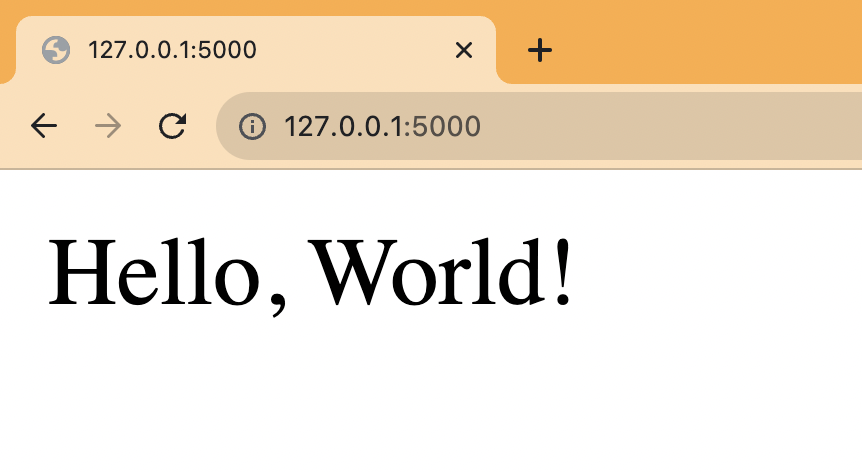
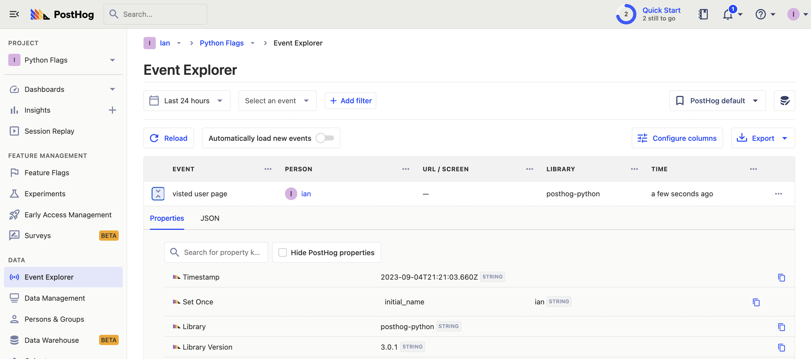
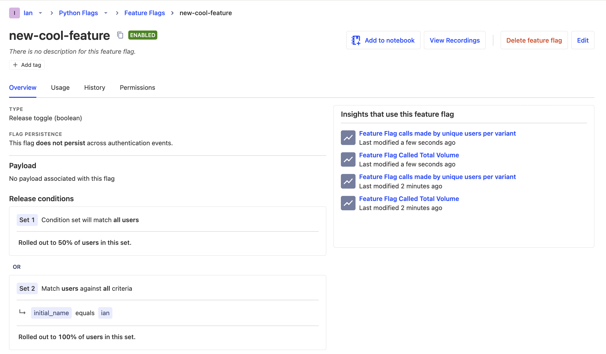

Feature flags make it easy to conditionally run code and show content based on users or conditions. In this tutorial, we show how to create a basic Python Flask app, add PostHog, and set up [feature flags](/feature-flags) to conditionally show content in the app.

## Creating a Flask app and adding PostHog

To showcase feature flags, we use [Flask](https://flask.palletsprojects.com/), a Python web framework, to create an app. To start, we create a folder for our app named `flag-demo` and create a file named `hello.py` in that folder.

```bash
mkdir flag-demo
cd flag-demo
touch hello.py
```

Next, create a virtual environment named `venv` for our app, activate the virtual environment, and install Flask.

```bash
python3 -m venv venv
. venv/bin/activate
pip install Flask
```

In `hello.py`, create a home route that returns a basic "Hello, World!" and a `/user/<string:user>` route that returns the user string:

```python
# flag-demo/hello.py
from flask import Flask

app = Flask(__name__)

@app.route("/")
def hello_world():
  return "<p>Hello, World!</p>"

@app.route("/user/<string:user>")
def show_user(user):
    return f"<p>Hello, {user}!</p>"
```

Finally run `flask --app hello run` and go to `http://127.0.0.1:5000` to see your basic app running.



## Adding PostHog

Next, we install and set up PostHog using the [Python SDK](/docs/libraries/python).

```bash
pip install posthog
```

We initialize PostHog to our `hello.py` file using our project API key and instance address from [your project settings](https://app.posthog.com/project/settings). In our user route, we use PostHog to capture an event using the user string and set a user property of `initial_name` on that user.

```python
# flag-demo/hello.py
from flask import Flask
from posthog import Posthog

posthog = Posthog(
  '<ph_project_api_key>', 
  host='<ph_instance_address>'
)

app = Flask(__name__)

@app.route("/")
def hello_world():
  return "<p>Hello, World!</p>"

@app.route("/user/<string:user>")
def show_user(user):
  posthog.capture(
    user, 
    "visited_user_page", 
    {
      '$set_once': {'initial_name': user} 
    }
  )
  return f"<p>Hello, {user}!</p>"
```

When we rerun `flask --app hello run` and go to the user route such as `http://127.0.0.1:5000/user/ian`, it captures an event in PostHog.



## Creating a feature flag

We are now ready to create and set up our flag. To do this, go to the [feature flag tab](https://app.posthog.com/feature_flags) in PostHog and click "New feature flag." Add a key (we use `new-cool-feature`), set the release condition to 50% of users, and add another condition set where `initial_name` is `ian` (or whatever URL you just visited). Add any other details and press "Save."



The second release condition enables us to test the active flag state by going to the `/user/ian` route first but is optional.

## Adding our feature flag

With our feature flag created in PostHog, it is time to implement it in our Flask app.

Back in our `user` route, we add a check with PostHog of our `new-cool-feature` flag. If it is true, we return a different `<p>` tag. If it isn’t, we return the same value as before. 

```python
# ...

@app.route("/user/<string:user>")
def show_user(user):
  flag_enabled = posthog.feature_enabled(
    'new-cool-feature', 
    user
  )

  posthog.capture(
    user, 
    "visited_user_page", 
    {
      '$set_once': {'initial_name': user}
    }
  )

  if flag_enabled:
    return f"<p>Welcome, {user}! You are on the new cool page</p>"

  return f"<p>Hello, {user}!</p>"
```

Since we visited `/user/ian` first, we get the new variant while 50% of the rest of the pages get it as well. If you want to customize this, edit your feature flag to add more conditions.


Lastly, we must capture the feature flag details in our event. This enables us to do usage analysis related to the flag later.

```python
# ...

@app.route("/user/<string:user>")
def show_user(user):
  flag_enabled = posthog.feature_enabled(
    'new-cool-feature', 
    user
  )

  posthog.capture(
    user, 
    "visited_user_page", 
    {
      '$set_once': {'initial_name': user},
      '$feature/new-cool-feature': flag_enabled
    }
  )

  if flag_enabled:
    return f"<p>Welcome, {user}! You are on the new cool page</p>"
  
  return f"<p>Hello, {user}!</p>"
```

This is the basic implementation of Python feature flags in Flask set up. From here, we can set up [A/B tests](/ab-testing), a [public beta program](/tutorials/public-beta-program), or [canary releases](/tutorials/canary-release). 

## Further reading

- [How to set up A/B/n testing](/tutorials/abn-testing)
- [How to do holdout testing](/tutorials/holdout-testing)
- [How to set up one-time feature flags](/tutorials/one-time-feature-flags)