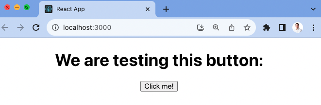
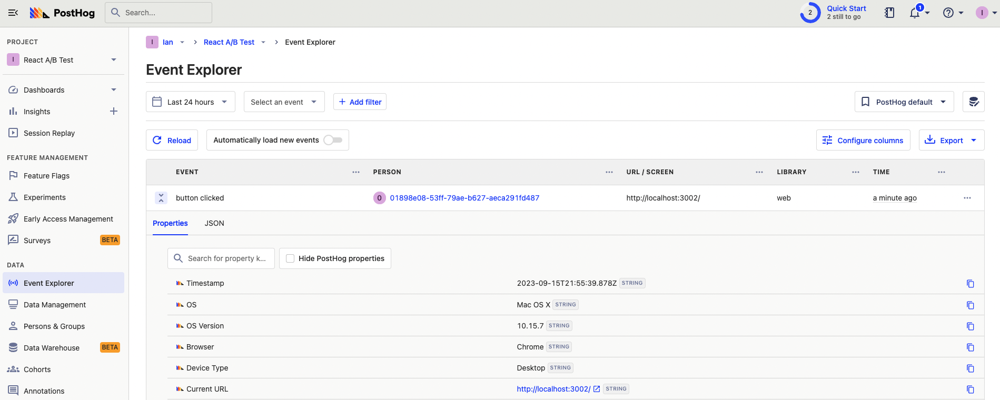
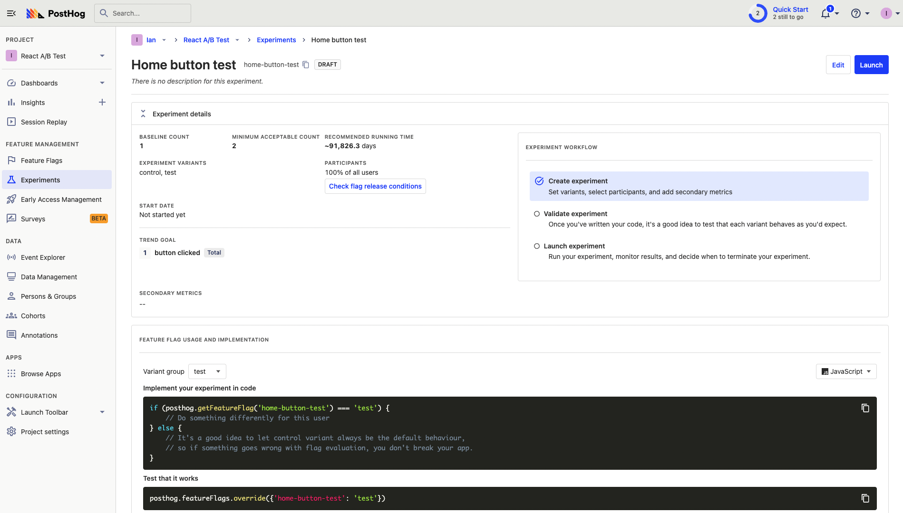

A/B tests help you make your React app better by comparing changes for their impact on key metrics. To show you how to set one up, we will create a basic React app, add PostHog, create an experiment, and implement it to A/B test content in our app.

## Creating a React app

First, create our React app using `create-react-app` and go into the newly created `react-ab-test` folder.

```bash
npx create-react-app react-ab-test
cd react-flags
```

Next, remove the boilerplate code in `src/App.js` to simplify it to only a title and button we encourage users to press.

```js
// src/App.js
import './App.css';

function App() {
  return (
    <div className="App">
      <h1>We are testing this button:</h1>
      <button>Click me!</button>
    </div>
  );
}

export default App;
```

Finally, run `npm start` and go to [http://localhost:3000/](http://localhost:3000/) to see our new homepage.



## Adding PostHog

To use PostHog to manage and track our A/B test, we must install and set it up. We do this by installing the `posthog-js` library to get access to the [React SDK](https://posthog-git-react-feature-flags-post-hog.vercel.app/docs/libraries/react).

```bash
npm install posthog-js
```

Once installed, import PostHog into `src/index.js` and set up a client using our project API key and instance address from [our project settings](https://app.posthog.com/project/settings). We can wrap our app in the React `PostHogProvider` to access PostHog in any component.

```js
import React from 'react';
import ReactDOM from 'react-dom/client';
import './index.css';
import App from './App';
import posthog from 'posthog-js'
import { PostHogProvider } from 'posthog-js/react'

posthog.init('<ph_project_api_key>', {
  api_host: '<ph_instance_address>',
})

const root = ReactDOM.createRoot(document.getElementById('root'));
root.render(
  <React.StrictMode>
    <PostHogProvider client={posthog}>
      <App />
    </PostHogProvider>
  </React.StrictMode>
);
```

Use the React `usePostHog` hook in our `src/index.js` file to capture a custom event when the button is clicked. This will be the goal metric for our A/B test.

```js
// src/App.js
import './App.css';
import { usePostHog } from posthog-js/react

function App() {
	const posthog = usePostHog()

const handleClick = () => {
    posthog.capture('button clicked');
  };

  return (
    <div className="App">
      <h1>We are testing this button:</h1>
      <button onClick={handleClick}>Click me!</button>
    </div>
  );
}

export default App;
```

Once done, go back to your app, click the button, and you should see a `button clicked` event captured into your PostHog instance.



## Creating an experiment

With PostHog set up, your React app is ready for the A/B test. To create one, go to the [experiments tab](https://app.posthog.com/experiments) in PostHog and click "New experiment." Add a name, feature flag key (like `home-button-test`), set your goal type to a trend of the `button clicked` event, and press "Save as draft." 



You can customize it further with a description, secondary metrics, or more variants (for [multivariate testing](/tutorials/abn-testing)). 

## Implementing the experiment

With our experiment created, it’s time to add it to our React app. To do this, check the `home-button-test` flag using the `useFeatureFlagVariantKey` hook and show our changed content if it returns the value "test."

```js
// src/App.js
import './App.css';
import { useFeatureFlagEnabled, PostHogFeature, usePostHog, useFeatureFlagVariantKey } from 'posthog-js/react';

function App() {
  
  const posthog = usePostHog();

  posthog.featureFlags.override('home-button-test', 'test')
  const flagValue = useFeatureFlagVariantKey('home-button-test')

  const handleClick = () => {
    posthog.capture('button clicked');
  };

  return (
    <div className="App">
      <h1>We are testing this button:</h1>
      {flagValue === 'test' ? (
        <button onClick={handleClick}>Sign up for free!</button>
      ) : (
        <button onClick={handleClick}>Click me!</button>
      )}
    </div>
  );
}

export default App;
```

> Alternatively, you can use the **React feature component** as shown in the [How to set up React feature flags](/tutorials/react-feature-flags#using-the-posthog-feature-component) tutorial.

To test that it works, override the feature flag with the test value.

```js
//...
posthog.featureFlags.override({'home-button-test': 'test'})
const flagValue = useFeatureFlagVariantKey('home-button-test')
//...
```

After confirming it works, remove the `featureFlags.override` call, go back to your experiment in PostHog, and click "Launch." The A/B test is then running to get results on which version is best.

## Further reading

- [How to bootstrap feature flags in React and Express](/tutorials/bootstrap-feature-flags-react)
- [How to do holdout testing](/tutorials/holdout-testing)
- [How to set up Next.js A/B tests](/tutorials/nextjs-ab-tests)