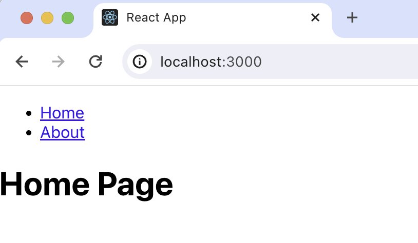

import { ProductScreenshot } from 'components/ProductScreenshot'
import EventsLight from '../images/tutorials/react-analytics/events-light.png'
import EventsDark from '../images/tutorials/react-analytics/events-dark.png'

> <p align="center">Open this tutorial in PostHog and follow along step-by-step!</p> <CallToAction href="https://app.posthog.com/#panel=docs:/tutorials/react-analytics" size="sm" className="mt-auto self-start sm:w-auto !w-full">Launch tutorial</CallToAction>

[Product analytics](/product-analytics) enable you to gather and analyze data about how users interact with your React app. To show you how to set up analytics, in this tutorial we create a basic React app, add PostHog, and use it to capture pageviews and custom events.

## Creating a React app

To demonstrate the basics of PostHog analytics, we'll create a simple app with two pages and a link to navigate between them.

First, ensure [Node.js is installed](https://nodejs.dev/en/learn/how-to-install-nodejs/) (version 18.0 or newer). Then create a new React app:

```bash
npx create-react-app react-analytics
cd react-analytics
```

Next, create two new files `HomePage.js` and `AboutPage.js` in your `src` directory:

```
cd ./src
touch HomePage.js
touch AboutPage.js
```

In `HomePage.js`, add the following the code:

```js file=src/HomePage.js
function HomePage() {
  return <h1>Home Page</h1>;
}

export default HomePage;
```

In `AboutPage.js`, add the following the code:

```js file=src/AboutPage.js
function AboutPage() {
  return <h1>About Page</h1>;
}

export default AboutPage;
```

Next, we set up the routing. First, install React Router in your project:

```bash
npm install react-router-dom
```

Then, set up the router by replacing the code in `App.js` with the following:

```js file=App.js
import React from 'react';
import { BrowserRouter as Router, Route, Link, Routes } from 'react-router-dom';
import HomePage from './HomePage';
import AboutPage from './AboutPage'; 

function App() {
  return (
    <Router>
      <div>
        <nav>
          <ul>
            <li>
              <Link to="/">Home</Link>
            </li>
            <li>
              <Link to="/about">About</Link>
            </li>
          </ul>
        </nav>

        <Routes> 
          <Route path="/about" element={<AboutPage />} />
          <Route path="/" element={<HomePage />} />
        </Routes>
      </div>
    </Router>
  );
}

export default App;
```

The basic setup is now complete. Run `npm start` to see your app in action.



## Adding PostHog

With our app set up, it’s time to install and set up PostHog. If you don't have a PostHog instance, you can [sign up for free](https://us.posthog.com/signup). 

First install `posthog-js`:

```bash
npm install posthog-js
```

Next, import PostHog into `src/index.js` and set up a client using your project API key and instance address. You can find these in [your project settings](https://app.posthog.com/project/settings). Then we wrap our app with `PostHogProvider` to access PostHog in any component.

```js file=src/index.js
import React from 'react';
import ReactDOM from 'react-dom/client';
import './index.css';
import App from './App';
import posthog from 'posthog-js'
import { PostHogProvider } from 'posthog-js/react'

posthog.init('<ph_project_api_key>', {
  api_host: '<ph_instance_address>',
})

const root = ReactDOM.createRoot(document.getElementById('root'));
root.render(
  <React.StrictMode>
    <PostHogProvider client={posthog}>
      <App />
    </PostHogProvider>
  </React.StrictMode>
);
```

Once you’ve done this, reload your app and click the links a few times. You should see events appearing in the [PostHog events explorer](https://us.posthog.com/events).

<ProductScreenshot
  imageLight={EventsLight} 
  imageDark={EventsDark} 
  alt="Events in PostHog" 
  classes="rounded"
/>

## Capturing pageviews

You might notice that moving between pages only captures a single pageview event. This is because PostHog only captures pageview events when a [page load](https://developer.mozilla.org/en-US/docs/Web/API/Window/load_event) is fired. Since React creates a single-page app, this only happens once and the React router handles subsequent page changes.

If we want to capture every route change, we must write code to capture pageviews that integrates with the router.

To do this, we create a new component `PostHogPageviewTracker`. This component combines `useLocation` with `useEffect` to capture a pageview whenever the location changes.

First run `touch PostHogPageviewTracker.js` in your `src` directory to create a new file. Then add the following code to it:

```js src/PostHogPageviewTracker.js
import { useEffect } from 'react';
import { useLocation } from 'react-router-dom';
import { usePostHog } from 'posthog-js/react'

const PostHogPageviewTracker = () => {
  const location = useLocation();
  const posthog = usePostHog()
  useEffect(() => {
    if (posthog) {
      posthog.capture('$pageview')
    }
  }, [location, posthog])

  return null;
};

export default PostHogPageviewTracker;
```

Then include this new component in your `Router` in `App.js`:

```js file=App.js 
// your existing imports
import PostHogPageviewTracker from './PostHogPageviewTracker';

function App() {
  return (
    <Router>
      <PostHogPageviewTracker/>
      {/* rest of your components */}
    </Router>
  );
}

export default App;
```

Now, every time a user moves between pages, PostHog captures a `$pageview` event, not just on the first page load.

Lastly, go back to `src/index.js` and make sure to set `capture_pageview` in the PostHog initialization config to `false`. This turns off autocaptured pageviews and ensures you won’t double-capture pageviews on the first load.

```js file=src/index.js
// your existing imports

posthog.init("<ph_project_api_key>", {
  api_host: "<ph_instance_address>",
  capture_pageview: false
})

// rest of your code
```

## Capturing custom events

Beyond pageviews, there might be more events you want to capture. To do this, you can [capture custom events](/docs/product-analytics/capture-events#squeak-questions) with PostHog. 

To showcase this, update the code in `HomePage.js` to include a button that uses PostHog to capture a `home_button_clicked` event:

```js file=HomePage.js
import { usePostHog } from 'posthog-js/react'

function HomePage() {
  const posthog = usePostHog()
  return (
    <div>
      <h1>Home Page</h1>
      <button 
        onClick={() => {
          posthog.capture('home_button_clicked', {
            'user_name': 'Max the Hedgehog' 
          });
      }}>
        Click Me
      </button>
    </div>
  );
}

export default HomePage;
```

Now when you click the button, PostHog captures the custom `home_button_clicked` event. Notice that we also added a property `user_name` to the event. This is helpful for filtering events in PostHog.

## Further reading

- [How to set up surveys in React](/tutorials/react-surveys)
- [How to set up A/B tests in React](/tutorials/react-ab-testing)
- [How to set up feature flags in React](/tutorials/react-feature-flags)