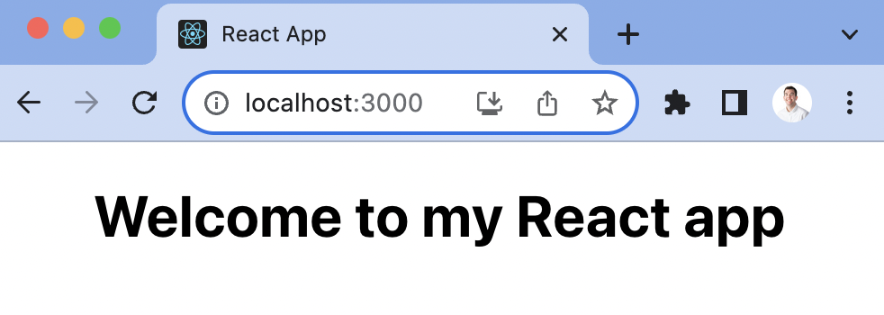
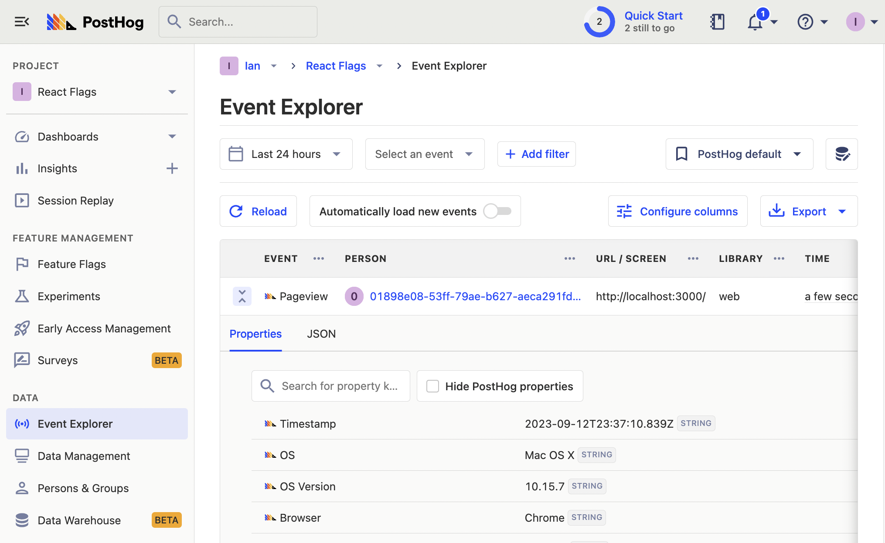
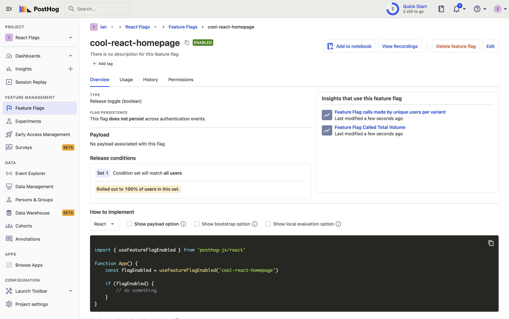
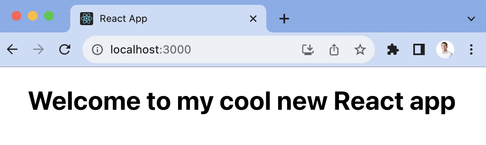

[Feature flags](/docs/feature-flags) help you release features and conditional show content in your React apps. This tutorial shows you how to create a basic React app, add PostHog, create a feature flag, and then implement the flag to control content in your app.

## Create your React app

First, we create our React app using `create-react-app` and go into the newly created `react-flags` folder.

```bash
npx create-react-app react-flags
cd react-flags
```

We then remove the boilerplate code in `src/App.js` to simplify it to just a title.

```js
// src/App.js
import './App.css';

function App() {
  return (
    <div className="App">
      <h1>Welcome to my React app</h1>
    </div>
  );
}

export default App;
```

Finally, run `npm start` and go to [http://localhost:3000/](http://localhost:3000/) to see our new homepage.



## Adding PostHog

Since PostHog handles the management and evaluation of feature flags, we must set it up in our app. To do this, start by installing the `posthog-js` library to get access to the [React SDK](/docs/libraries/react).

```bash
npm install posthog-js
```

Once, installed we can import PostHog into `src/index.js` and set up a client using our project API key and instance address from [our project settings](https://app.posthog.com/project/settings). We can wrap our app in the React `PostHogProvider` to access PostHog in any component.

```js
import React from 'react';
import ReactDOM from 'react-dom/client';
import './index.css';
import App from './App';
import posthog from 'posthog-js'
import { PostHogProvider } from 'posthog-js/react'

posthog.init('<ph_project_api_key>', {
  api_host: '<ph_client_api_host>',
})

const root = ReactDOM.createRoot(document.getElementById('root'));
root.render(
  <React.StrictMode>
    <PostHogProvider client={posthog}>
      <App />
    </PostHogProvider>
  </React.StrictMode>
);
```

Once done, go back to your app running locally, refresh, and you should see an event autocaptured into your PostHog instance.



## Creating a feature flag

With PostHog set up, your React app is ready for feature flags. To create one, go to the [feature flags tab](https://app.posthog.com/feature_flags) in PostHog and click "New feature flag." Enter a flag key (like `cool-react-homepage`), set the release condition to roll out to 100% of users, and press "Save."



You can customize your conditions with percentage and person or group properties to fit your needs.

## Adding our feature flag

Once created, we can add our feature flag to our React app. We do this using the `useFeatureFlagEnabled` hook to conditionally show new content in our component.

```js
// src/App.js
import './App.css';
import { useFeatureFlagEnabled } from 'posthog-js/react';

function App() {
  
  const flagEnabled = useFeatureFlagEnabled('cool-react-homepage');

  return (
    <div className="App">
      {flagEnabled ? 
        <h1>Welcome to my cool new React app</h1> 
        : 
        <h1>Welcome to my React app</h1>
      }
    </div>
  );
}

export default App;
```

With the flag enabled, our app now shows "Welcome to my cool new React app."



> **Want to remove the flicker while loading?** Read our tutorial on [How to bootstrap feature flags in React and Express](/tutorials/bootstrap-feature-flags-react).

### Using the PostHog feature component

An alternate way to implement feature flags is to use the `PostHogFeature` component. This simplifies the logic of using flags as well as captures related usage automatically (such as a `$feature_view` event). We set the old content as the fallback for the component.

```js
// src/App.js
import './App.css';
import { PostHogFeature } from 'posthog-js/react';

function App() {
  
  return (
    <div className="App">
      <PostHogFeature 
        flag='cool-react-homepage' 
        match={true} 
        fallback={<h1>Welcome to my React app</h1>}
      >
        <h1>Welcome to my cool new React app</h1> 
      </PostHogFeature>
    </div>
  );
}

export default App;
```

These are basic implementations of React feature flags setup. From here, you can set up [A/B tests](/ab-testing), a [public beta program](/tutorials/public-beta-program), or [canary releases](/tutorials/canary-release).

## Further reading

- [Testing frontend feature flags with React, Jest, and PostHog](/tutorials/test-frontend-feature-flags)
- [How to add popups to your React app with feature flags](/tutorials/react-popups)
- [How to set up analytics in React](/tutorials/react-analytics)
