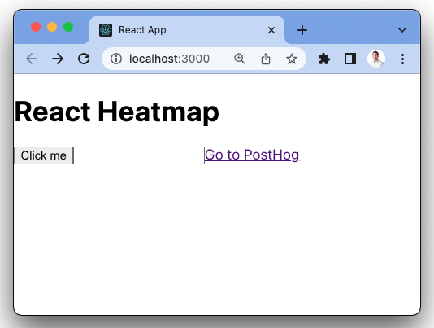
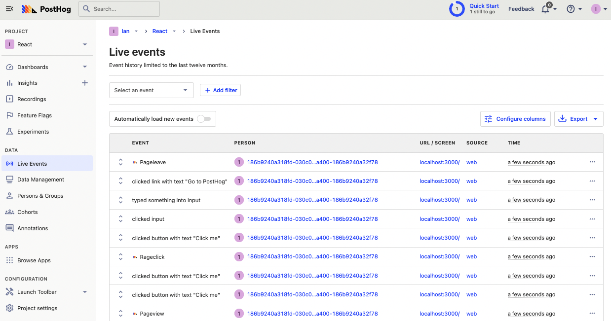
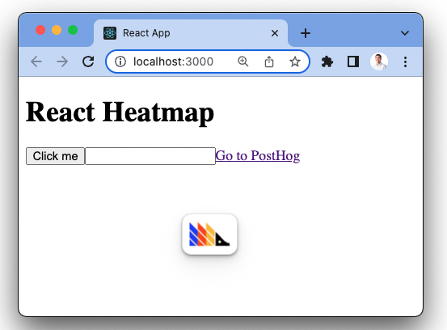
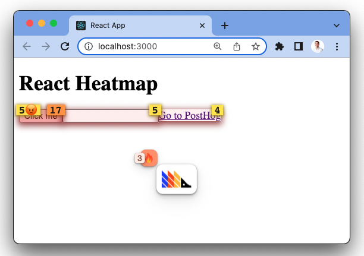

Understanding where users click your site or app shows you what interests them. A heatmap can visualize these clicks to make this analysis easier.

Setting up a heatmap for a React app with PostHog is simple. This tutorial will walk through setting up a basic React app, adding PostHog, accessing the heatmap, and customizing the heatmap to your needs.

## Creating a basic React app

First, [install Node](https://nodejs.dev/en/learn/how-to-install-nodejs/), then create a React app in your terminal, and name it whatever (we name ours `heatmap`).

```bash
npm create-react-app heatmap
```

Next, in `src/App.js`, replace the existing code with buttons, inputs, and links we can click like this:

```js
// src/App.js
function App() {
  return (
    <div className="App">
      <h1>React Heatmap</h1>
      <button>Click me</button>
      <input type="text" />
      <a href="https://www.posthog.com">Go to PostHog</a>
    </div>
  );
}

export default App;
```

When we go into the app folder and run `npm start`, this gives us a basic React app which we can use to test PostHog’s heatmap functionality.



## Adding PostHog

Next, we will add PostHog to your React app. This requires a PostHog instance to do ([sign up for free](https://app.posthog.com/signup)). Once you have a PostHog instance, go back to your terminal and install `posthog-js`:

```bash
npm i posthog-js
```

After installing, go to `src/index.js` and set up the PostHog provider. To do this:

1. import `posthog` from `posthog-js` and the `PostHogProvider` from `posthog-js/react`
2. initialize `posthog` with the details from your instance
3. wrap your `App` component in the `PostHogProvider` with the initialized `posthog` as a `client` property

```js
// src/index.js
import React from 'react';
import ReactDOM from 'react-dom/client';
import App from './App';
import posthog from 'posthog-js';
import { PostHogProvider} from 'posthog-js/react'

posthog.init(
  '<ph_project_api_key>',
  {
    api_host: '<ph_instance_address>',
  }
);

const root = ReactDOM.createRoot(document.getElementById('root'));
root.render(
  <React.StrictMode>
    <PostHogProvider client={posthog}>
      <App />
    </PostHogProvider>
  </React.StrictMode>
);
```

Once done, reload your app, click the button, enter some text into the input, and click the link. You should see events for these in your PostHog instance.



## Launching your toolbar to access the heatmap

With our React app and PostHog set up as well as some data, we can get a heatmap of this data using the toolbar. 

Click the "Launch Toolbar" tab on the left menu, then add `localhost:3000` (or whatever domain you are using) to the authorized URL, and click "Launch." This takes you to your site with the PostHog toolbar active.



To activate the heatmap, click the PostHog toolbar icon, then the "🔥 Heatmap" option. This highlights the elements users are clicking on in your React app.



## Understanding the heatmap

With the heatmap open, you see elements highlighted in shades of yellow to red. Here’s what the numbers mean:

- The numbers over the elements are how many times they were clicked over the last 7 days.
- The number next to the 😡 emoji is the number of rage clicks for that element.
- The number next to the 🔥 emoji is the number of clicked elements on the page.

When you click an element, you get a modal with different options:

1. Details about the selected option, like its text and DOM location.
2. Stats including clicks and ranking of most clicked on the page.
3. The ability to [create an action](/tutorials/how-to-capture-events-the-easy-way).

## Changing the heatmap settings

You can also change the settings for your heatmap by clicking on the number next to the 🔥 emoji. This enables you to:

- Change the events list to contain more pages using wildcards (`*`). For example, if you wanted to see the heatmap for the same elements across all blog pages, you could use `/blog/*`.
- Change the length of time the heatmap generates from. The default is 7 days.
- See all the elements in the heatmap and load more.

Once all these settings are set as you prefer, you’ve set up a heatmap for your React app. You can use it to analyze user behavior in your app.

## Further reading

- [Using the PostHog Toolbar to visualize behavior and create actions](/tutorials/toolbar)
- [How to create new events the easy way](/tutorials/how-to-capture-events-the-easy-way)
- [How to use session recordings to get a deeper understanding of user behavior](/tutorials/explore-insights-session-recordings)
