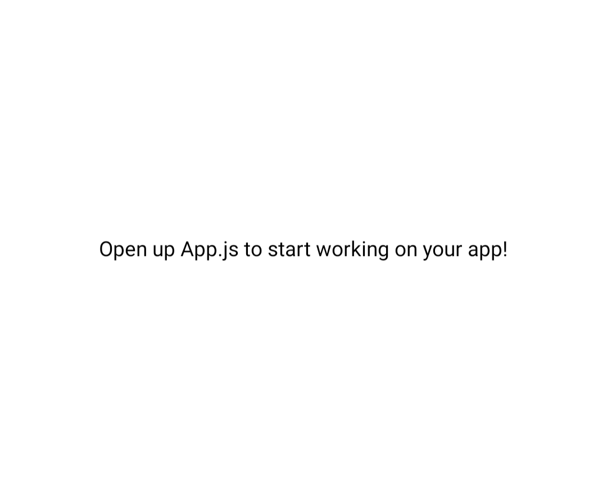
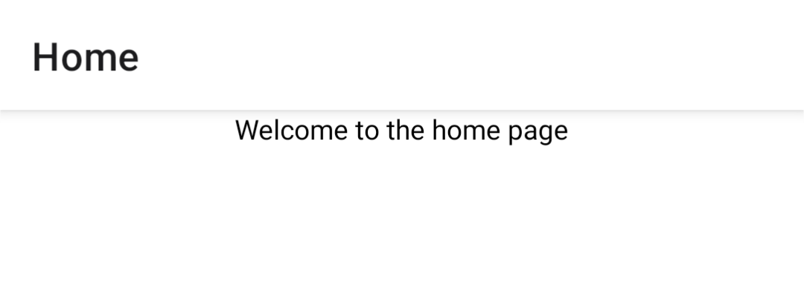
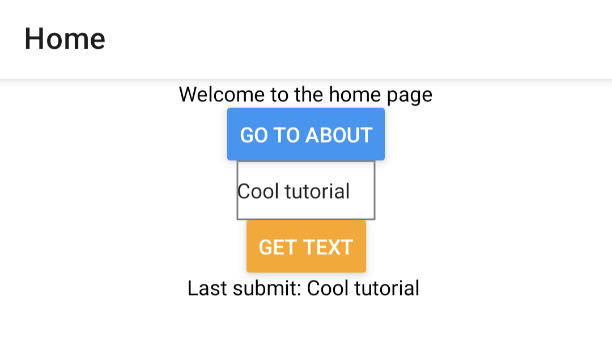
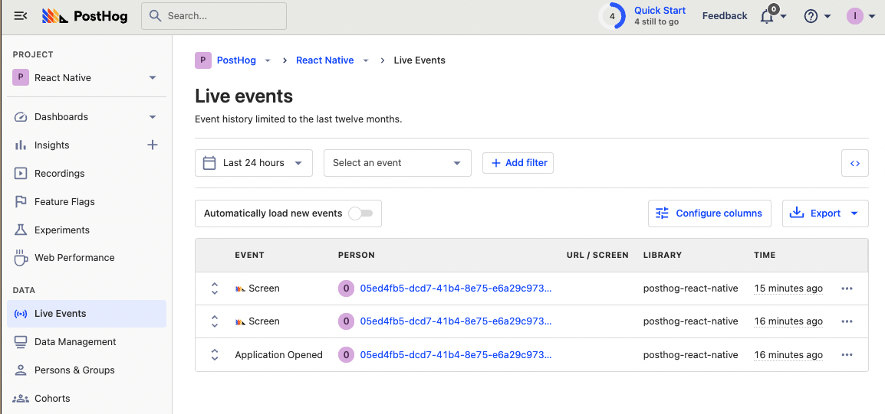
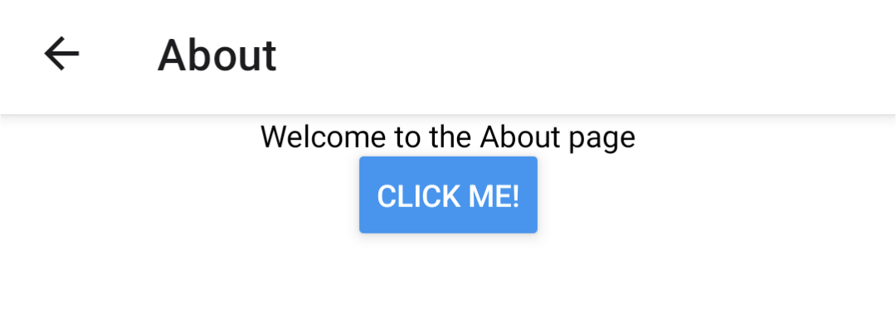

> <p align="center">Open this tutorial in PostHog and follow along step-by-step!</p> <CallToAction href="https://app.posthog.com/#panel=docs:/tutorials/react-native-analytics" size="sm" className="mt-auto self-start sm:w-auto !w-full">Launch tutorial</CallToAction>

React Native is a popular mobile app framework for writing native mobile apps using React.

In this tutorial, we show how to create a basic React Native app using Expo (a suite of dev tools for React Native). We then add PostHog to that app and set up tools like autocapture, user identification, and feature flags.

> Already know how to set up a React Native app? [Click here to skip to the PostHog setup](/tutorials/react-native-analytics#3-adding-posthog-to-our-react-native-app).

## 1. Creating the basic React Native app with Expo

To start, we need a directory for the app to live in, the Expo CLI installed, and the Expo Go app on either [Android](https://play.google.com/store/apps/details?id=host.exp.exponent&pli=1) or [iOS](https://apps.apple.com/app/expo-go/id982107779). This assumes you have [Node](https://nodejs.org/en/) and [Git](https://git-scm.com/) already installed. If you’re on Mac, you also must install [watchman](https://facebook.github.io/watchman/) by running `brew install watchman`.

Once done, you can initialize the app by running `create-expo-app` and giving it a name (we are calling ours `rn-tutorial`). Once initialized, you can go into the folder and start the app.

```bash
npx create-expo-app rn-tutorial
cd rn-tutorial
npx expo start
```

Open your Expo Go app, scan the QR code in your terminal, and you should open an app with a white screen and some text.



Now that we are up and running, we can add some functionality to help us showcase the features of PostHog.

## 2. Adding functionality to our React Native app

To start, we want a home page, an about page, and a button to go between the two. Navigation is needed to make this happen, and we use the `react-navigation` library to do it. PostHog autocaptures screens from the `react-navigation` library, which makes it the best choice for us.

To setup `react-navigation`, first, install it:

```bash
npm install @react-navigation/native-stack
```

After this, create a native stack navigator by importing the necessary functions and components from the library. Next, remove the boilerplate React Native code, rework the `App()` function to include navigation, and create a new `Home()` function. After doing all this, your App.js file looks like this:

```js
// App.js
import { StyleSheet, Text, View } from 'react-native';
import { NavigationContainer } from '@react-navigation/native';
import { createNativeStackNavigator } from '@react-navigation/native-stack';

function Home() {
  return (
    <View style={styles.container}>
      <Text>Welcome to the home page</Text>
    </View>
  );
}

const Stack = createNativeStackNavigator();

export default function App() {
  return (
    <NavigationContainer>
      <Stack.Navigator>
        <Stack.Screen name="Home" component={Home} />
      </Stack.Navigator>
    </NavigationContainer>
  );
}

const styles = StyleSheet.create({
  container: {
    flex: 1,
    backgroundColor: '#fff',
    alignItems: 'center',
  },
});
```

A navigation bar was added to the top of the app and our home page changed:



We still need a second function for the `About()` page, and a button that uses a `navigation` prop to navigate between the two. Also, set the `initialRouteName` in the `Stack.Navigator` to “Home.”

```js
import { StyleSheet, Text, View, Button } from 'react-native';
import { NavigationContainer } from '@react-navigation/native';
import { createNativeStackNavigator } from '@react-navigation/native-stack';

function Home({ navigation }) {
  return (
    <View style={styles.container}>
      <Text>Welcome to the home page</Text>
      <Button
        title="Go to About"
        onPress={() => navigation.navigate("About")}
      />
    </View>
  );
}

function About() {
  return (
    <View style={styles.container}>
      <Text>Welcome to the About page</Text>
    </View>
  );
}

const Stack = createNativeStackNavigator();

export default function App() {
  return (
    <NavigationContainer>
      <Stack.Navigator initialRouteName="Home">
        <Stack.Screen name="Home" component={Home} />
        <Stack.Screen name="About" component={About} />
      </Stack.Navigator>
    </NavigationContainer>
  );
}

// ...
```

After setting all this up, reload your app and click the button to go to the About screen page. When there, you see you automatically get a back button added via navigation.

### Adding a form

We want a form where users can submit their email so we can identify them later. To do this, import the `TextInput` component and `useState` from React (so we can keep that value). We then add and style the `TextInput`, `Button`, and a `Text` component to show the submitted value. After doing all of this, your `Home()` function looks like this:

```js
import { StyleSheet, Text, View, Button, TextInput } from 'react-native';
import { NavigationContainer } from '@react-navigation/native';
import { createNativeStackNavigator } from '@react-navigation/native-stack';
import { useState } from 'react';

function Home({ navigation }) {
  const [text, setText] = useState('')
  const [submit, setSubmit] = useState('')

  function getText() {
    setSubmit(text)
  }

  return (
    <View style={styles.container}>
      <Text>Welcome to the home page</Text>
      <Button
        title="Go to About"
        onPress={() => navigation.navigate("About")}
      />
      <TextInput
        style={{
          height: 40,
          borderColor: 'gray',
          borderWidth: 1
        }}
        placeholder="enter text here"
        onChangeText={text => setText(text)}
      />
      <Button
        onPress={getText}
        title="Get Text"
        color="orange"
      />
      <Text>Last submit: {submit}</Text>
    </View>
  );
}

// ...
```

This gives us an ugly, but functional app:



Feel free to add features and make it look better, but for the sake of our tutorial, this app is ready to integrate with PostHog.

## 3. Adding PostHog to our React Native app

To get analytics, user identification, feature flags, and all the other features of PostHog into our app, we must install and set up PostHog. The first step to doing this is installing all the relevant libraries for using PostHog:

```bash
npx expo install posthog-react-native expo-file-system expo-application expo-device expo-localization
```

Next, import `PostHogProvider` into `App.js` and add it between `NavigationContainer` and `Stack.Navigator` with your project API key and instance address (found in your project settings). This enables PostHog data and methods usage throughout the app. 

```js
import { StyleSheet, Text, View, Button, TextInput } from 'react-native';
import { NavigationContainer } from '@react-navigation/native';
import { createNativeStackNavigator } from '@react-navigation/native-stack';
import { useState } from 'react';
import { PostHogProvider } from 'posthog-react-native'

// ...

export default function App() {
  return (
    <NavigationContainer>
      <PostHogProvider 
        apiKey="<ph_project_api_key>"
        options={{
          host: "<ph_instance_address>",
        }}
      >
        <Stack.Navigator initialRouteName="Home">
          <Stack.Screen name="Home" component={Home} />
          <Stack.Screen name="About" component={About} />
        </Stack.Navigator>
      </PostHogProvider>
    </NavigationContainer>
  );
}

// ...
```

Once you save this, reload the app, and click around, you should see autocaptured events in your PostHog instance from the `react-native` library.



## 4. Setting up user identification, event capture, and feature flags

With PostHog added to our app, we can set up more of the tools it has to offer such as user identification, event capture, and feature flags.

### Identifying users

You see in your autocapture events that users have anonymous IDs. This can cause inaccuracies in your data, for example, a single person can end up with multiple IDs if they use different devices. To ensure the most accurate data possible, it is best to identify users using a distinct ID of some kind, like email or a username.

To set up user identification in our app, import `usePostHog` and call `posthog.identify` using a distinct ID when a user submits the form. Their distinct ID is the value they submit to the form. Implementing this looks like this:

```js
//...
import { PostHogProvider, usePostHog } from 'posthog-react-native'

function Home({ navigation }) {
  const [text, setText] = useState('')
  const [submit, setSubmit] = useState('')
  const posthog = usePostHog()

  function getText() {
    setSubmit(text)
    posthog.identify(text, {
      email: text
    })
  }
//...
```

When a user submits an email, an `identify` event triggers which connects their anonymous ID to their distinct ID (email). Now, future events (autocapture and custom) connect to a single user.

### Custom event capture

Setting up custom event capture is similar to user identification. To set it up, just call `posthog.capture` with the event name and any properties you want to add. PostHog automatically connects a user to the event. 

To implement it, we can switch out our identify call with a capture call which looks like this:

```js
//...
import { PostHogProvider, usePostHog } from 'posthog-react-native'

function Home({ navigation }) {
  const [text, setText] = useState('')
  const [submit, setSubmit] = useState('')
  const posthog = usePostHog()

  function getText() {
    setSubmit(text)
    posthog.capture("submitted", {
      value: text
    })
  }
}
//...
```

In your PostHog instance, you then see “submitted” events every time you submit the form.

### Feature flags

Last, but not least, is feature flags. Feature flags are a powerful way to release new features safely. They are especially important for mobile app developers whose apps go through review. Feature flags enable you to roll out change slowly to check for issues, and roll back quickly if discovered, without needing redeployment or reviews.

We use a feature flag to add a call-to-action button on our About page. To do this, first, create the feature flag in PostHog. You can do this by going to “Feature Flags” in the sidebar, clicking “Create new feature flag,” entering a key value (I chose `about-cta`), then pressing save.


Copy the key value, and head back to your code. To use feature flags in your app, import `useFeatureFlag` and then call it with the flag key where you want the decision made. Add it to our `About()` function like this:

```js
// ...
import { PostHogProvider, usePostHog, useFeatureFlag } from 'posthog-react-native'

// ...

function About() {
  const showCTA = useFeatureFlag('about-cta')

  return (
    <View style={styles.container}>
      <Text>Welcome to the About page</Text>
      {showCTA && <Button title="Click me!"/>}
    </View>
  );
}

// ...
```

Once you saved this and reloaded the app, when you go to the About page, you should see a button to click.



To confirm the feature flag is working, you can go back to PostHog and set the release condition to 0%. When you reload the app, the CTA should disappear.

Once you confirm that, you successfully set up a React Native along with PostHog and many of the tools we offer. Check out [our React Native documentation](/docs/integrate/client/react-native) for more details about what you can do with PostHog.

## Further reading

- [What to do after installing PostHog in 5 steps](/tutorials/next-steps-after-installing)
- [Complete guide to event tracking](/tutorials/event-tracking-guide)
- [Running experiments on new users](/tutorials/new-user-experiments)
