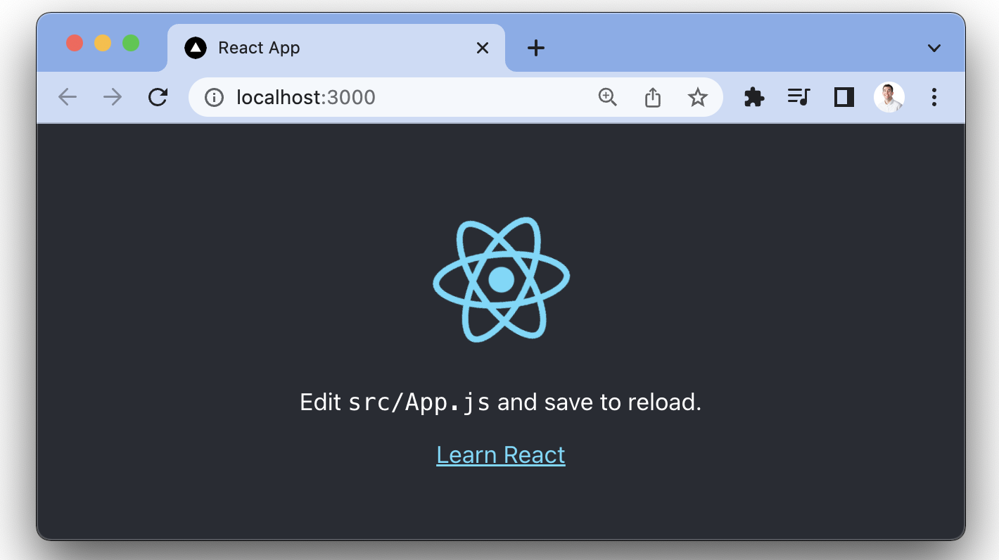
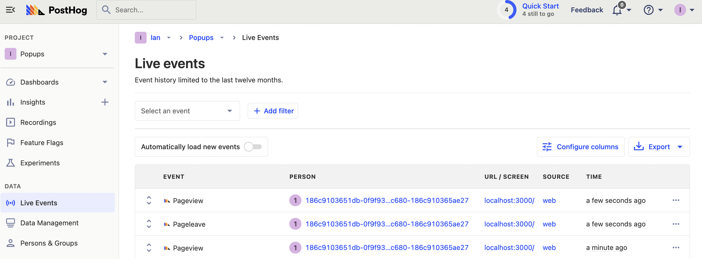
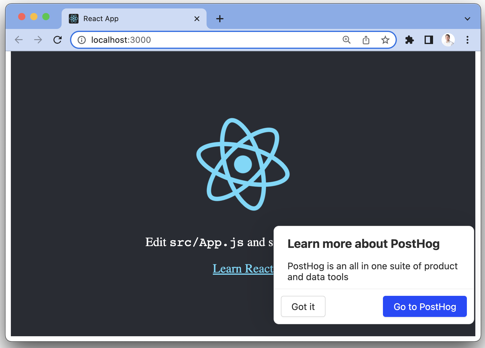
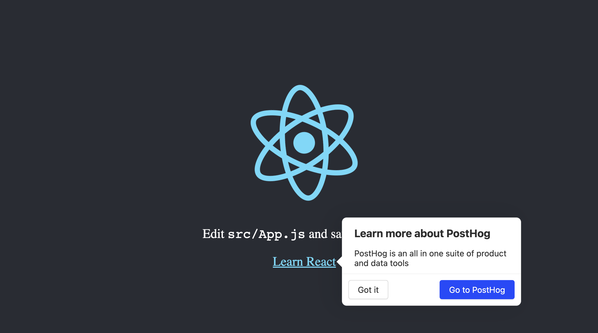

> <p align="center">Open this tutorial in PostHog and follow along step-by-step!</p> <CallToAction href="https://app.posthog.com/#panel=docs:/tutorials/react-popups" size="sm" className="mt-auto self-start sm:w-auto !w-full">Launch tutorial</CallToAction>

Popups are a way to highlight features in your app. This tutorial shows how to add them to a React app and control them using [React feature flags](/tutorials/react-feature-flags) and JSON payloads. Feature flag payloads are an ideal tool for this because they enable you to send arbitrary data that controls the popup location and content without needing to redeploy. 

## Creating a React app

We need a React app to start. Make sure you [installed Node](https://nodejs.dev/en/learn/how-to-install-nodejs/), then use the `create-react-app` command in your terminal to create an app named "popups":

```bash
npx create-react-app popups
```

Next, go into the newly created popups folder and run the app to make sure everything installed correctly.

```bash
cd popups
npm start
```

We now have a running React app where we can add popups and prompts.



## Installing PostHog

Next, we must install PostHog to control the popups. If you don’t have a PostHog instance, [you can signup for one for free](https://app.posthog.com/signup). To add PostHog, first install `posthog-js`.

```bash
npm i posthog-js
```

In `src/index.js`, initialize PostHog with your project API key and instance address and wrap your app in a PostHogProvider.

```js
import React from 'react';
import ReactDOM from 'react-dom/client';
import App from './App';
import posthog from 'posthog-js';
import { PostHogProvider} from 'posthog-js/react'

posthog.init(
  '<ph_project_api_key>',
  {
    api_host: '<ph_instance_address>',
  }
);

const root = ReactDOM.createRoot(document.getElementById('root'));
root.render(
  <React.StrictMode>
    <PostHogProvider client={posthog}>
      <App />
    </PostHogProvider>
  </React.StrictMode>
);
```

After restarting and opening your app, you should see events captured in your PostHog instance.



## Adding the code for the popup

Next, add the control that displays the popups and control when and where they display. 

Clone the code from the [PostHog prompts repository](https://github.com/PostHog/posthog-prompts). 

```bash
git clone https://github.com/PostHog/posthog-prompts
```
In the newly cloned `posthog-prompts` folder, go to `react/src`, then copy the `Popup.js` `Popup.css` and `popup-location.js` files over to our `popups/src` folder.

> You could also create the files yourself and manually copy the code from the [popup](https://github.com/PostHog/posthog-prompts/blob/main/react/src/Popup.js), [CSS](https://github.com/PostHog/posthog-prompts/blob/main/react/src/Popup.css), and [location](https://github.com/PostHog/posthog-prompts/blob/main/react/src/popup-location.js) files.

In `index.js`, import the popup code you just added and add the `<Popup />` component to the app.

```js
// src/index.js
// ...
import { Popup } from './Popup'

//...

const root = ReactDOM.createRoot(document.getElementById('root'));
root.render(
  <React.StrictMode>
    <PostHogProvider client={posthog}>
      <App />
      <Popup />
    </PostHogProvider>
  </React.StrictMode>
);
```

After this, you’re ready to set up the feature flag to control your popup.

## Create your popup feature flag

The next step is to create a feature flag with a payload to control the content. In PostHog, go to the feature flag tab and click the "New feature flag" button.

1. Name your flag something starting with `popup-`
2. Add an extra filter to exclude users with the property "`$popup-{unique name}` is not set" so that the popup is only shown once for each user
3. Set the rollout to 100%
4. Add your content in JSON as the payload like:

```js
{
    "title": "Learn more about PostHog",
    "body": "PostHog is an all in one suite of product and data tools",
    "primaryButtonText": "Go to PostHog",
    "primaryButtonURL": "/",
    "secondaryButtonText": "Got it",
    "location": "absolute-bottom-right"
}
```

Save the flag, head back to your app, and you should see a popup in the bottom right corner.



## Relatively positioning your popup

We can customize our popup by positioning it relative to elements on our page. This enables you to use these to show off specific features similar to a product tour. 

To set this up, change the location to `relative-bottom` and add a `locationCSSSelector` key with value `[class='App-link']`. Our payload now looks like this:

```json
{
    "title": "Learn more about PostHog",
    "body": "PostHog is an all in one suite of product and data tools",
    "primaryButtonText": "Go to PostHog",
    "primaryButtonURL": "/",
    "secondaryButtonText": "Got it",
    "location": "relative-right",
    "locationCSSSelector": "[class='App-link']"
}
```

This sets the popup to the relative right of the element you selected. 



You can then use this to set up product tours across multiple pages and features in your app. Just create a flag for each page and feature you want to show off, and set the `primaryButtonURL` to the next page on the tour. Using the CSS selector also enables you to only show the popup on specific pages which include that specific element.

## Running your popup as an experiment

You can also set up an experiment to test that popups drive usage of the features you are showcasing. To do this:

1. Go to the "Experiments" tab, click "Create experiment"
2. Fill in the details including your desired goal, but **make sure your feature flag key starts with `popup-`**.
3. Save and launch your experiment.
4. Go to the "Feature flags" tab, and choose your newly created flag. Click the "Edit" button for the flag.
5. Add your JSON payload to the `test` variant key and click "Save."
6. Your experiment is live and is testing the popup on users. You can see it’s results and impact on the goal back in the experiment details.

## Further reading

- [Get feedback and book user interviews with site apps](/tutorials/feedback-interviews-site-apps)
- [Running experiments on new users](/tutorials/new-user-experiments)
- [How to set up Next.js A/B tests](/tutorials/nextjs-ab-tests)
