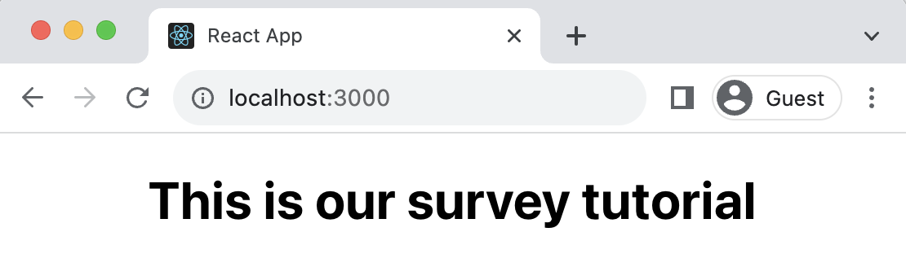
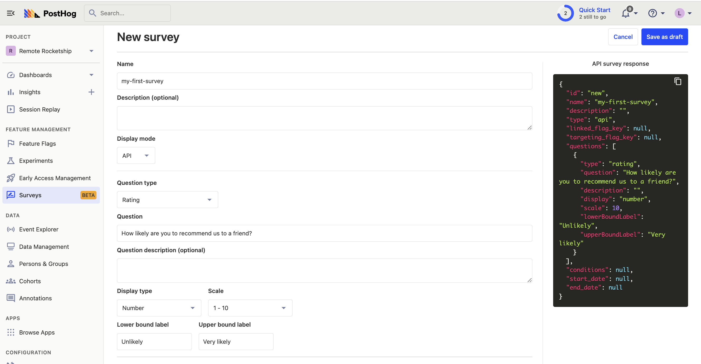
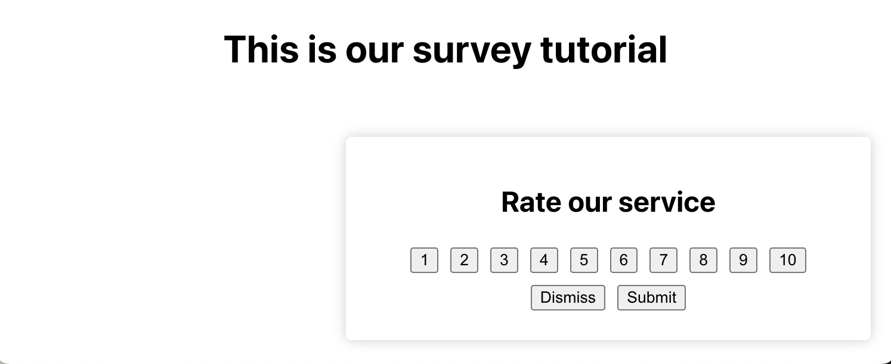
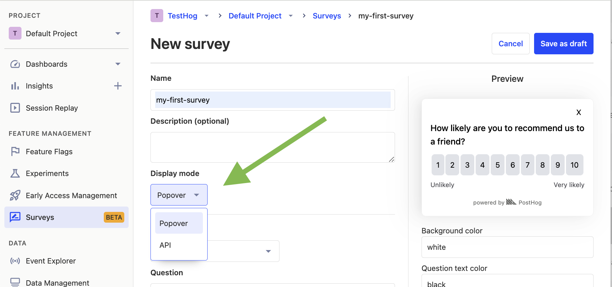
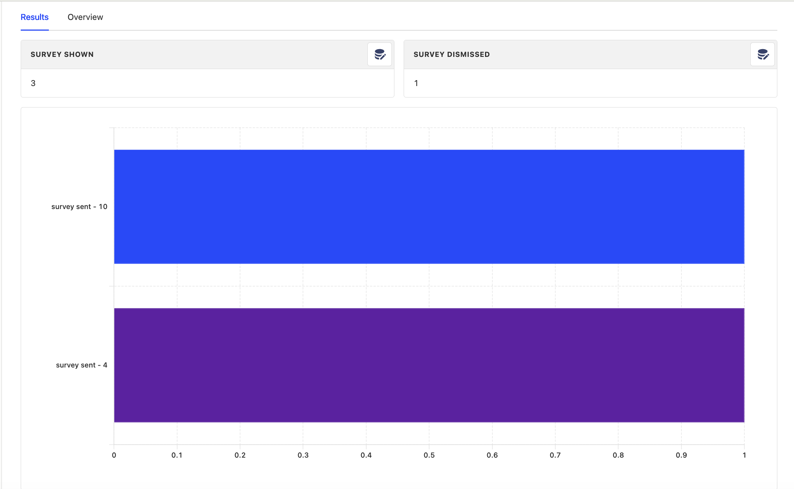

[Surveys](/docs/surveys) are a great tool to collect qualitative feedback from your users. This tutorial shows you how to implement a survey in a React app. 

We'll create a basic React app, add PostHog, create a survey, and then add the code to show the survey in-app and collect responses.

## Creating a React app

First, create a React app using `create-react-app` and go into the newly created `react-survey` folder.

```bash
npx create-react-app react-survey
cd react-flags
```

Next, replace the boilerplate code in `src/App.js` with the following:

```react
// src/App.js
import './App.css';

function App() {
  return (
    <div className="App">
      <h1>This is our survey tutorial</h1>
    </div>
  );
}

export default App;
```

Finally, run `npm start` and go to [http://localhost:3000/](http://localhost:3000/) to see our new homepage.

 

## Adding PostHog

PostHog will manage our survey and track our results. To use [PostHog's React SDK](/docs/libraries/react), install `posthog-js`:

```bash
npm install posthog-js
```

Once installed, import PostHog into `src/index.js` and set up a client using a project API key and instance address from the [project settings](https://app.posthog.com/project/settings). Then, wrap the app with `PostHogProvider` to access PostHog in any component.

```react
import React from 'react';
import ReactDOM from 'react-dom/client';
import './index.css';
import App from './App';
import posthog from 'posthog-js'
import { PostHogProvider } from 'posthog-js/react'

posthog.init('<ph_project_api_key>', {
  api_host: '<ph_instance_address>',
})

const root = ReactDOM.createRoot(document.getElementById('root'));
root.render(
  <React.StrictMode>
    <PostHogProvider client={posthog}>
      <App />
    </PostHogProvider>
  </React.StrictMode>
);
```

With PostHog set up, our React app is ready for the survey.

## Creating a survey

There are two options for displaying a survey using PostHog:

1. Implement your own survey UI.
2. Use PostHog's prebuilt survey UI.

This tutorial will cover how to implement both options:

## Option 1: Implement your own survey UI

First, create a survey in PostHog by going to the [surveys tab](https://app.posthog.com/surveys) and clicking "New survey." Then, set up your survey with the following:

1. Add a name (like `my-first-survey`)
2. Set the display mode to `API`
3. Set the question type to `Rating`, question title to `How likely are you to recommend us to a friend?`, display type to `number` and scale to `1-10`.
4. You can leave the remaining optional properties blank (such as `Targeting` or `Thank you message`).

Click "Save as draft" and then on the next screen click "Launch". We're now ready to integrate this survey into our app.



### Adding the survey code

There are three parts to adding code for our custom survey:

1. Create the survey UI.
2. Add the logic for displaying it.
3. Capture interactions from it.

#### 1. Create the survey UI

We've created an example survey UI for this tutorial. To use it, create a new file in `./src` folder called `Survey.js` and paste the following code:

```react
// src/Survey.js
import React from 'react';

function Survey({ title, onDismiss, onSubmit }) {
  const [selectedValue, setSelectedValue] = React.useState(null);

  const handleSelect = (value) => {
    setSelectedValue(value);
  }

  const handleSubmit = () => {
    onSubmit(selectedValue);
  }

  return (
    <div className="survey-popup">
      <h2>{title}</h2>
      <div>
        {[...Array(10)].map((_, i) => (
          <button key={i + 1} onClick={() => handleSelect(i + 1)}>{i + 1}</button>
        ))}
      </div>
      <div>
        <button onClick={onDismiss}>Dismiss</button>
        <button onClick={handleSubmit}>Submit</button>
      </div>
    </div>
  );
}

export default Survey;
```

Then, add the following CSS styles to your `index.css` file:

```css
.survey-popup {
  position: fixed;
  bottom: 20px;
  right: 20px;
  width: 300px;
  padding: 20px;
  background-color: #ffffff;
  box-shadow: 0px 0px 10px rgba(0, 0, 0, 0.2);
  border-radius: 5px;
  z-index: 1000;
}

button {
  margin: 5px;
}
```

Finally, integrate the component into `App.js`:

```react
// src/App.js
import './App.css';
import { useState } from 'react';
import Survey from './Survey';

function App() {
  const [showSurvey, setShowSurvey] = useState(true);

  const handleDismiss = () => {
    setShowSurvey(false);
    console.log("Survey dismissed!");
  };

  const handleSubmit = (value) => {
    setShowSurvey(false);
    console.log("User submitted:", value);
  };

  return (
    <div className="App">
      <h1>This is our survey tutorial</h1>
      {showSurvey && (
        <Survey
          title="Rate our service"
          onDismiss={handleDismiss}
          onSubmit={handleSubmit}
        />
      )}
    </div>
  );
}

export default App;
```

This shows a survey popup every time you visit your app's homepage.



#### 2. Add the logic for displaying it.

The first part of handling our display logic is fetching the survey from PostHog. PostHog keeps track of all active surveys for a user (this is especially helpful if you have set up [custom targeting options](/docs/surveys/creating-surveys#targeting)). 

To fetch the active surveys, we use the `usePostHog` hook to retrieve our PostHog instance. Then, we call `posthog.getActiveMatchingSurveys()` using `useEffect()`:

```react
// src/App.js
import './App.css';
import { useEffect, useState } from 'react';
import Survey from './Survey';
import { usePostHog } from 'posthog-js/react';

function App() {
  // ... rest of your code ...

  const posthog = usePostHog()
  useEffect(() => {
    posthog.getActiveMatchingSurveys((surveys) => {
      // TODO: configure the survey
    }); 
  }, [posthog]); // posthog may be undefined until it's had a chance to initialize. Hence use it as a dependency for useEffect
  
  // ... rest of your code ...
}

export default App;
```

`posthog.getActiveMatchingSurveys()` returns a surveys object that looks like this:

```JSON
[
   {
      "id":"018ad0e0-0de6-0000-6a56-033975bd0c68",
      "name":"my-first-survey",
      "description":"",
      "type":"api",
      "questions":[
         {
            "type":"rating",
            "scale":10,
            "display":"number",
            "question":"How likely are you to recommend us to a friend?",
            "description":"",
            "lowerBoundLabel":"Unlikely",
            "upperBoundLabel":"Very likely"
         }
      ],
      "conditions":null,
      "appearance":{
         "textColor":"black",
         "whiteLabel":false,
         "backgroundColor":"white",
         "submitButtonText":"Submit",
         "ratingButtonColor":"#e0e2e8",
         "submitButtonColor":"#2c2c2c",
         "descriptionTextColor":"#4b4b52",
         "thankYouMessageHeader":"Thank you for your feedback!",
         "displayThankYouMessage":true
      },
      "start_date":"2023-09-26T09:44:31.844000Z",
      "end_date":null
   }
]
```

We can use this survey object to configure our `Survey` component:

```react
  // ... rest of your code ...

  const [surveyTitle, setSurveyTitle] = useState(false);
  const [surveyID, setSurveyID] = useState(false);

  useEffect(() => {
    posthog.getActiveMatchingSurveys((surveys) => {
      if (surveys.length > 0) {
        const survey = surveys[0];
        setSurveyID(survey.id);
        setSurveyTitle(survey.questions[0].question)
      }
    }); 
  }, [posthog]); // posthog may be undefined until it's had a chance to initialize. Hence use it as a dependency for useEffect
  
  // ... rest of your code ...

 return (
 <div className="App">
   <h1>This is our survey tutorial</h1>
   {showSurvey && (
     <Survey
       title={surveyTitle}
       onDismiss={handleDismiss}
       onSubmit={handleSubmit}
     />
   )}
 </div>
```

Finally, we want to make sure we don't show the survey again to users who have either submitted or dismissed it. 

We use [`localStorage`](https://developer.mozilla.org/en-US/docs/Web/API/Window/localStorage) to store this data. Then, we'll add a check to show the survey based on whether the user has already interacted with it or not:

```react
// src/App.js

function App() {
  // ... rest of your code ...

  const [showSurvey, setShowSurvey] = useState(true);

  useEffect(() => {
    // Check local storage to see if the user has already seen this particular survey
    const hasInteractedWithSurvey = localStorage.getItem(`hasInteractedWithSurvey_${surveyID}`);
    setShowSurvey(!hasInteractedWithSurvey);
  }, [surveyID]);

  const handleDismiss = () => {
    setShowSurvey(false);
    console.log("Survey dismissed!");
    localStorage.setItem(`hasInteractedWithSurvey_${surveyID}`, 'true');
  };

  const handleSubmit = (value) => {
    setShowSurvey(false);
    console.log("User submitted:", value);
    localStorage.setItem(`hasInteractedWithSurvey_${surveyID}`, 'true');  
  };

  return (
    <div className="App">
      <h1>This is our survey tutorial</h1>
      {showSurvey && (
        <Survey
          title={surveyTitle}
          onDismiss={handleDismiss}
          onSubmit={handleSubmit}
        />
      )}
    </div>
  );
}

export default App;
```

#### 3. Capture interactions from it.

The final step in setting up our survey is capturing interactions. This enables us to analyze the results in PostHog. 

There are 3 events to capture:

1. `"survey shown"`
2. `"survey dismissed"`
3. `"survey sent"` (for responses)

You can capture these events using `posthog.capture()`:

```react
  // ... rest of your code ...

  const handleDismiss = () => {
    setShowSurvey(false);
    console.log("Survey dismissed!");
    localStorage.setItem(`hasInteractedWithSurvey_${surveyID}`, 'true');
    posthog.capture("survey dismissed", {
      $survey_id: surveyID // required
    })
  };

  const handleSubmit = (value) => {
    setShowSurvey(false);
    console.log("User submitted:", value);
    localStorage.setItem(`hasInteractedWithSurvey_${surveyID}`, 'true');  
    posthog.capture("survey sent", {
      $survey_id: surveyID, // required
      $survey_response: value // required
    })
  };

  useEffect(() => {
    if (posthog && surveyID && showSurvey) {
      posthog.capture("survey seen", {
        $survey_id: surveyID // required
      })
    }
  }, [showSurvey, surveyID, posthog])

 // ... rest of your code ...
```

Altogether, your code should look like this:

```react
// src/App.js
import { usePostHog } from 'posthog-js/react';
import './App.css';
import { useEffect, useState } from 'react';
import Survey from './Survey';

function App() {
  const posthog = usePostHog()
  const [showSurvey, setShowSurvey] = useState(true);
  const [surveyTitle, setSurveyTitle] = useState(false);
  const [surveyID, setSurveyID] = useState(false);

  useEffect(() => {
    posthog.getActiveMatchingSurveys((surveys) => {
      if (surveys.length > 0) {
        const survey = surveys[0];
        setSurveyID(survey.id);
        setSurveyTitle(survey.questions[0].question)
      }
    }); 
  }, [posthog]); // posthog may be undefined until it's had a chance to initialize. Hence use it as a dependency for useEffect

  useEffect(() => {
    // Check local storage to see if the user has already seen this particular survey
    const hasInteractedWithSurvey = localStorage.getItem(`hasInteractedWithSurvey_${surveyID}`);
    setShowSurvey(!hasInteractedWithSurvey);
  }, [surveyID]);

  const handleDismiss = () => {
    setShowSurvey(false);
    console.log("Survey dismissed!");
    localStorage.setItem(`hasInteractedWithSurvey_${surveyID}`, 'true');
    posthog.capture("survey dismissed", {
      $survey_id: surveyID // required
    })
  };

  const handleSubmit = (value) => {
    setShowSurvey(false);
    console.log("User submitted:", value);
    localStorage.setItem(`hasInteractedWithSurvey_${surveyID}`, 'true');  
    posthog.capture("survey sent", {
      $survey_id: surveyID, // required
      $survey_response: value // required
    })
  };

  useEffect(() => {
    if (posthog && surveyID && showSurvey) {
      posthog.capture("survey seen", {
        $survey_id: surveyID // required
      })
    }
  }, [showSurvey, surveyID, posthog])

  return (
    <div className="App">
      <h1>This is our survey tutorial</h1>
      {showSurvey && (
        <Survey
          title={surveyTitle}
          onDismiss={handleDismiss}
          onSubmit={handleSubmit}
        />
      )}
    </div>
  );
}

export default App;
```

That's it! Our survey is ready to go!

### Option 2: Use PostHog's prebuilt survey UI

For a much faster set up, you can use PostHog's prebuilt surveys. There are variety of [survey types](/docs/surveys/creating-surveys#question-type) to choose from, and PostHog handles all the display logic and event capture for you.
 
To create a survey with a prebuilt UI, set the display mode to **`Popover`** when creating your survey:



Then, select the question type you want and configure the survey as you like. Click "Save as draft" and then "Launch".

Your survey is now live and you should see it in your app. There are no further code changes needed!


## Viewing results

After interacting with your survey, you can view results by selecting the survey from the [surveys tab](https://app.posthog.com/surveys). You'll see data on:

- How many users have seen the survey.
- How many users have dismissed the survey.
- Responses.

You can also filter these results based on [user properties](/docs/product-analytics/user-properties), [cohorts](/docs/data/cohorts), [feature flags](/docs/feature-flags/creating-feature-flags) and more.



## Further reading

- [How to write great product survey questions (with examples)](/blog/product-survey-questions)
- [Get feedback and book user interviews with surveys](/tutorials/feedback-interviews-site-apps)
- [How to measure your NPS score in PostHog](/tutorials/nps-survey)