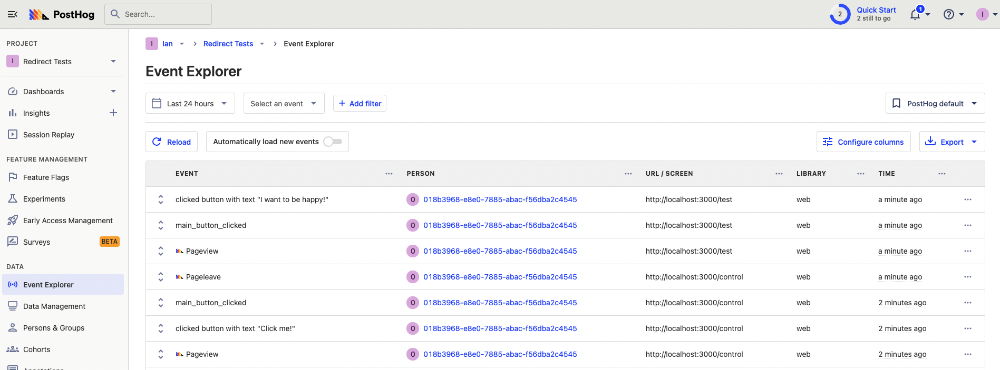
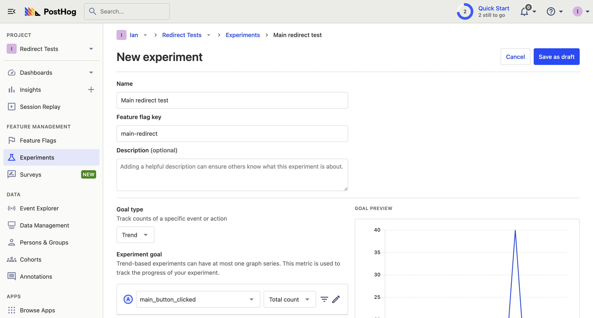

Redirect testing is a way to [A/B test](/ab-testing) web pages by redirecting users to one or the other.

To show you how to do a redirect test with PostHog, we set up a two-page Next.js app, create an A/B test in PostHog, and then implement it in our app using middleware and feature flags. 

> **Note:** Although we are using Next.js in this tutorial, this method works with any framework where you can do server-side redirects.

## Creating our Next.js app and adding PostHog

To start, we create our Next.js app. Run the command below, select No for TypeScript, Yes to use the `App Router`, and the default for all the other options.

```bash
npx create-next-app@latest redirect-test
```

### Setting up PostHog

Next, we set up PostHog. Start by going into your new `redirect-test` folder and installing it.

```bash
cd redirect-test
npm i posthog-js
```

Next, in the `redirect-test/app` folder, create a `providers.js` file and set up a component that returns an initialized `PostHogProvider`. You can get the project API key and instance address you need for initialization from [your project settings](https://app.posthog.com/project/settings).

```js
// app/providers.js
'use client'
import posthog from 'posthog-js'
import { PostHogProvider } from 'posthog-js/react'

if (typeof window !== 'undefined') {
  posthog.init("<ph_project_api_key>", {
    api_host: "<ph_instance_address>"
  })
}

export default function PHProvider({ children }) {
  return <PostHogProvider client={posthog}>{children}</PostHogProvider>
}
```

Import the `PHProvider` component into `layout.js` and wrap your app in it.

```js
import './globals.css'
import PHProvider from './providers'

export default function RootLayout({ children }) {
  return (
    <html lang="en">
      <PHProvider>
        <body>{children}</body>
      </PHProvider>
    </html>
  )
}
```

Once set up, PostHog autocaptures usage and you can use all its tools throughout your app.

## Adding test pages

In the `app` folder, create two new folders named `control` and `test`. In each of them, create a basic `page.js` file with a button to capture an event. This is what the control page looks like:

```js
// app/control/page.js
'use client'
import { usePostHog } from "posthog-js/react";

export default function Control() {
  const posthog = usePostHog();

  return (
    <main>
      <h1>Hello!</h1>
      <button onClick={() => posthog.capture("main_button_clicked")}>
        Click me!
      </button>
    </main>
  );
}
```

This is what the test page looks like:

```js
// app/test/page.js
'use client'
import { usePostHog } from "posthog-js/react";

export default function Test() {
  const posthog = usePostHog();

  return (
    <main>
      <h1>Hello from the bright side!</h1>
      <p>Clicking this button will bring you happiness</p>
      <button onClick={() => posthog.capture("main_button_clicked")}>
        I want to be happy!
      </button>
    </main>
  );
}
```

Now run `npm run dev`. Go to each of our pages to see that they work: `http://localhost:3000/control` and `http://localhost:3000/test`. 

Click the button on each page to capture a custom event in PostHog.



## Creating our A/B test

Our A/B test will compare these two pages to see which drives more button clicks. To do this, we go to the [experiment tab](https://app.posthog.com/experiments) (our name for A/B tests) in PostHog and click "New experiment." Name your experiment and feature flag key (like `main-redirect`), set your experiment goal to `main_button_clicked`, and click "Save as draft."



Because we are working locally, you can click "Launch" immediately.

## Setting up the redirect test middleware

Next.js enables you to run [middleware](https://nextjs.org/docs/app/building-your-application/routing/middleware) that intercepts and modifies requests for your app. We use it for our redirect test.

To start, create a `middleware.js` file in the base `redirect-test` directory. We want it to run on both the `/test` and `/control` paths, so we add them to the matcher config. For now, we have the `/test` path redirect to `/control` as a placeholder.

```js
// redirect-test/middleware.js
import { NextResponse } from 'next/server'

export async function middleware(request) {
  if (request.nextUrl.pathname=== '/test') {
   // Placeholder for now. We'll replace this code in the next step
    return NextResponse.redirect(new URL('/control', request.url))
  }
  return NextResponse.next()
}

export const config = {
  matcher: ['/test', '/control'],
};
```

### Getting or creating a user ID for flag evaluation

To evaluate the experiment flag in our middleware, we need a distinct user ID to target. This needs to be consistent because we want the same user to see the same variant of the experiment every time.

To do this, we need to:

1. Check if a `distinct_id` exists in the PostHog cookie, and use it if so.
2. Create a `distinct_id` if not.

This requires using your project API key to get the cookies, parsing them as JSON, and potentially creating a distinct ID using `crypto.randomUUID()`. Altogether, this looks like this:

```js
import { NextResponse } from 'next/server'

export async function middleware(request) {
  const ph_project_api_key = '<ph_project_api_key>'
  const ph_cookie_key = `ph_${ph_project_api_key}_posthog`
  const cookie = request.cookies.get(ph_cookie_key);

  let distinct_id;
  if (cookie) {
    // Use PostHog distinct_id 
    distinct_id = JSON.parse(cookie.value).distinct_id;
  } else {
    // Create new distinct_id
    distinct_id = crypto.randomUUID();
  }
//... rest of code
```

### Evaluating our redirect test with PostHog

With our distinct ID, we use the PostHog API to check the value of the `main-redirect` feature flag for a user (because [we can’t use PostHog SDKs in Next.js middleware](https://vercel.com/docs/functions/edge-functions/edge-runtime#supported-apis)). This is known as evaluating the feature flag.

Specifically, we evaluate the flag by making a POST request to the `https://app.posthog.com/decide?v=3` route (replace `app` with `eu` if you’re on EU Cloud) with your project API key and user distinct ID. From the response, we get the value of the `main-redirect` feature flag and use it to redirect to the right page. Altogether, it looks like this:

```js
// redirect-test/middleware.js
//... rest of code

	const requestOptions = {
    method: 'POST',
    headers: {
      'Content-Type': 'application/json'
    },
    body: JSON.stringify({
      api_key: ph_project_api_key,
      distinct_id: distinct_id
    })
  };
  
  // Evaluate experiment flag
  const ph_request = await fetch(
    'https://app.posthog.com/decide?v=3', // or eu.posthog.com
    requestOptions
  );
  const data = await ph_request.json();
  const flagResponse = data.featureFlags['main-redirect']

  // Redirect to correct page
  if (request.nextUrl.pathname=== '/test' && flagResponse === 'control') {
    return NextResponse.redirect(new URL('/control', request.url))
  }
  if (request.nextUrl.pathname=== '/control' && flagResponse === 'test') {
    return NextResponse.redirect(new URL('/test', request.url))
  }
  return NextResponse.next()
}
//... rest of code
```

### Capturing exposure

To get accurate results for our experiment, we also need to capture a `$feature_flag_called` event after the feature flag has been evaluated, but before redirecting. This is known as an exposure event and shows a user is part of the experiment. It requires another POST request like this:

```js
//... rest of code, after flag evaluation

// Capture exposure event
const eventOptions = {
  method: 'POST',
  headers: {
    'Content-Type': 'application/json'
  },
  body: JSON.stringify({
    api_key: ph_project_api_key,
    distinct_id: distinct_id,
    properties: {
      "$feature_flag": 'main-redirect',
      "$feature_flag_response": flagResponse
    },
    event: "$feature_flag_called"
  })
};

const eventRequest = await fetch(
  'https://app.posthog.com/capture',
  eventOptions
);

//... rest of code, redirect logic
```

## Bootstrapping the data

The final piece to our redirect test is bootstrapping the user distinct ID (and flags while we are at it). Bootstrapping is adding the flag and user data from the server to the client library so it is available as soon as the client PostHog library loads.

> **Why is bootstrapping necessary?** If we didn't bootstrap the distinct ID, PostHog would set a second distinct ID for the same user on the frontend. When calculating the results of the experiment, PostHog wouldn't know the two were connected, creating a broken test.

We create a `bootstrapData` cookie with the flags and distinct ID data and then add it to the response. We also add a check for the `bootstrapData` cookie in the middleware when we are creating the distinct ID so we don’t get two different IDs whenever we redirect.

When put together with everything else, our final `middleware.js` file looks like this:

```js
// middleware.js 
import { NextResponse } from 'next/server'

export async function middleware(request) {
  const ph_project_api_key = '<ph_project_api_key>'
  const ph_cookie_key = `ph_${ph_project_api_key}_posthog`
  const cookie = request.cookies.get(ph_cookie_key);
  const bootstrapCookie = request.cookies.get('bootstrapData');

  let distinct_id;
  if (bootstrapCookie) {
    // Use bootstrap cookie distinct_id
    distinct_id = JSON.parse(bootstrapCookie.value).distinctId;
  } else if (cookie) {
    distinct_id = JSON.parse(cookie.value).distinct_id;
  } else {
    distinct_id = crypto.randomUUID();
  }

  const requestOptions = {
    method: 'POST',
    headers: {
      'Content-Type': 'application/json'
    },
    body: JSON.stringify({
      api_key: ph_project_api_key,
      distinct_id: distinct_id
    })
  };
  
  const ph_request = await fetch(
    'https://app.posthog.com/decide?v=3', // or eu
    requestOptions
  );
  const data = await ph_request.json();

  const flagResponse = data.featureFlags['main-redirect']

  // Capture events, for exposure
  const eventOptions = {
    method: 'POST',
    headers: {
      'Content-Type': 'application/json'
    },
    body: JSON.stringify({
      api_key: ph_project_api_key,
      distinct_id: distinct_id,
      properties: {
        "$feature_flag": 'main-redirect',
        "$feature_flag_response": flagResponse
      },
      event: "$feature_flag_called"
    })
  };

  const eventRequest = await fetch(
    'https://app.posthog.com/capture',
    eventOptions
  );

  // Format flags and distinct_id for bootstrap cookie
  const bootstrapData = {
    distinctId: distinct_id,
    featureFlags: data.featureFlags
  }

  if (request.nextUrl.pathname === '/test' && flagResponse === 'control') {
    const newResponse = NextResponse.redirect(new URL('/control', request.url))
    // Set the bootstrap data cookie on the response
    newResponse.cookies.set('bootstrapData', JSON.stringify(bootstrapData))
    return newResponse
  }
  if (request.nextUrl.pathname === '/control' && flagResponse === 'test') {
    const newResponse = NextResponse.redirect(new URL('/test', request.url))
    newResponse.cookies.set('bootstrapData', JSON.stringify(bootstrapData))
    return newResponse
  }
  const newResponse = NextResponse.next()
  newResponse.cookies.set('bootstrapData', JSON.stringify(bootstrapData))
  return newResponse
}

export const config = {
  matcher: ['/test', '/control'],
};
```

### Handling bootstrap data on the frontend

To handle this bootstrap data on the frontend, we need to parse the cookie and pass the data to the PostHog initialization. We add this by first installing the `cookie-cutter` package.

```bash
npm i cookie-cutter
```

We then import and use it in `app/providers.js` to add the bootstrap data to our PostHog initialization like this:

```js
// app/providers.js
'use client'
import posthog from 'posthog-js'
import { PostHogProvider } from 'posthog-js/react'
import cookieCutter from 'cookie-cutter'

if (typeof window !== 'undefined') {

  // Get the bootstrap cookie data from the middleware
  const bootstrapData = cookieCutter.get('bootstrapData')
  let parsedBootstrapData = {}
  if (flags) {
    parsedBootstrapData = JSON.parse(flags)
  }

  posthog.init("<ph_posthog_project_api_key", {
    api_host: "<ph_instance_address>",
    bootstrap: parsedBootstrapData
  })
}

export default function PHProvider({ children }) {
  return <PostHogProvider client={posthog}>{children}</PostHogProvider>
}
```

When we relaunch our application and go to either of the test or control routes, the middleware redirects users to the correct page, their experience remains consistent across reloads, and our redirect test is successfully running.

## Further reading

- [How to use Next.js middleware to bootstrap feature flags](/tutorials/nextjs-bootstrap-flags)
- [How to evaluate and update feature flags with the PostHog API](/tutorials/api-feature-flags)
- [How to bootstrap feature flags in React and Express](/tutorials/bootstrap-feature-flags-react)
