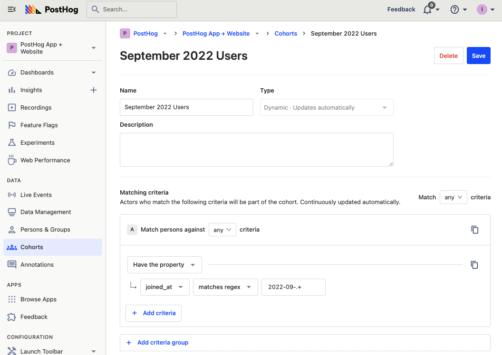
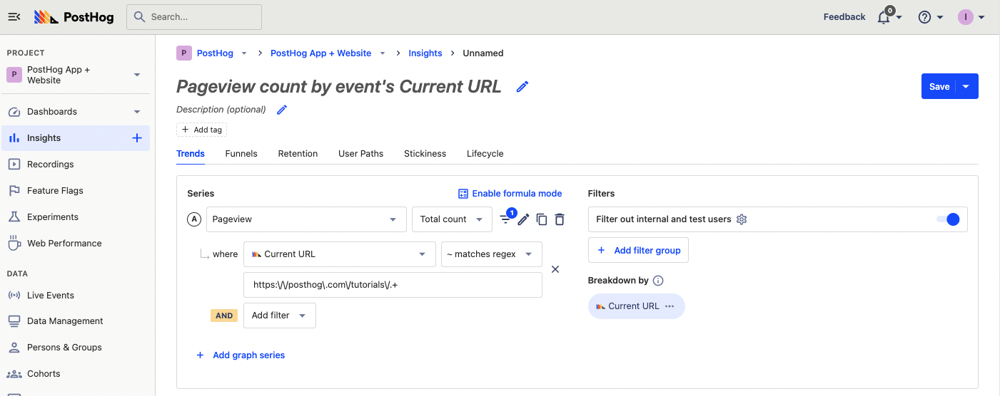
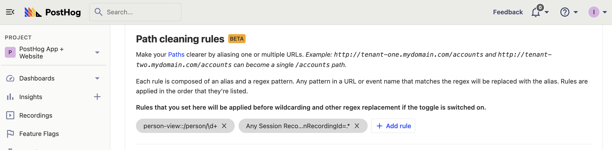

> 
Open this tutorial in PostHog and follow along step-by-step!
 <CallToAction href="https://app.posthog.com/#panel=docs:/tutorials/regex-basics" size="sm" className="mt-auto self-start sm:w-auto !w-full">Launch tutorial</CallToAction>

Regular expressions or regex is a way to search text for patterns. It is a structure of symbols that finds text matching what you want. In doing so, it is a powerful way to filter and validate strings of text.

PostHog provides the ability to use regex to filter properties in many tools from insights to cohorts to feature flags. This tutorial explains the basics of regex, as well as PostHog-specific use cases to take advantage of.

## The basics of regex

Regex is a string of symbols representing a search on a string. A basic regex pattern matching "ABC" looks like `/ABC/g`. This matches all instances of ABC across the string (case sensitive). The `g` on the end stands for "global search," allowing for iterative searches.

Other important symbols to know:

- `.` is any symbol other than newlines.
- Square brackets `[]` mean any of the characters included. `[abc]` checks any of A, B, or C. 
- `-` checks for a range. `[4-7]`, for example, searches for 4, 5, 6, and 7.
- Round brackets `()` are a group of one or more symbols. `(ABC)` checks for exactly "ABC."
- `+` checks the preceding item matches 1 or more times. `*` matches zero or more times. `.*` would match everything minus newlines.
- `\w`, `\d`, `\s` represent a word, digit, and whitespace. Capitalize them to represent NOT a word, digit, or whitespace.

There are many more symbols representing many more use cases, they include special characters, escaped characters, logic, lookahead, and more. You can play around and learn more regex on a site like [RegExr](https://regexr.com/) or [Regex101](https://regex101.com/). 

## Using regex in PostHog

With all the options, getting started with regex can be overwhelming, so here are some PostHog-specific use cases to get you started. PostHog doesn’t require you to add the forward slashes `/` to the start and end of your pattern or expression flags (like `g`), we automatically do that for you.

### Matching dates

You can use regex to match dates, specifically, a range of dates like a week or month. This is useful if you want to find events, signups, or users properties in a specific time frame. 

If you want to create a cohort of users who signed up in September of 2022, for example, you can use `2022-09-.+`. This will match any date in September of 2022. The `.+` at the end means any number of characters after the date.

This is also useful if you want a range of dates. You can use the square brackets to specify a range of dates. For example, if you wanted sign ups between April 5-9th in 2022, you can use `2022-04-0[5-9]+`. 

### Matching URL patterns

One of the most popular uses of regex in PostHog is matching URL patterns. This is useful if you have a URL scheme for pages of the same type.

For example, if you wanted to get stats from every tutorial on PostHog, use `https:\/\/posthog\.com\/tutorials\/.+`. This pattern needs a bunch of backslashes `\` to escape characters. Without this, regex would recognize the forward slashes and periods as different symbols.

Regex can also be used to match multiple pages with the same URL structure and a variable ID. For example, if you had a blog edit page with an ID in the middle of the string, something like `example.com/blog/{id}/edit`, then you could use the following regex pattern `example.com\/blog\/.+\/edit`. 

### Combining domains

If you have multiple domains or subdomains, it can be difficult to filter them together. Regex makes this easy.

To have domains that end in .com use `.*.com`, and you can add filters from here. For example, if you wanted the blog route on all your domains, you could use the regex `.*\.com\/blog\/.*`.

### Adding path cleaning rules

In settings and the path insight, PostHog lets you clean paths by combining multiple URLs. This can make multiple pages act as one in the path visual. You can set up a regex and alias for the URLs that match the regex. 

At PostHog, we use path cleaning rules for both our person and session recording views. We use the pattern `/person/\d+` to combine person pages into `person-view`, and `.sessionRecordingId=.` to combine session recordings in `Any Session Recording Route`.

## Further reading

- [Running experiments on new users](/tutorials/new-user-experiments)
- [A non-technical guide to understanding data in PostHog](/tutorials/non-technical-guide-to-data)
- [Calculating average session duration, time on site, and other session-based metrics](/tutorials/session-metrics)