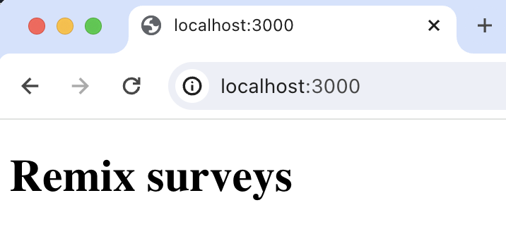
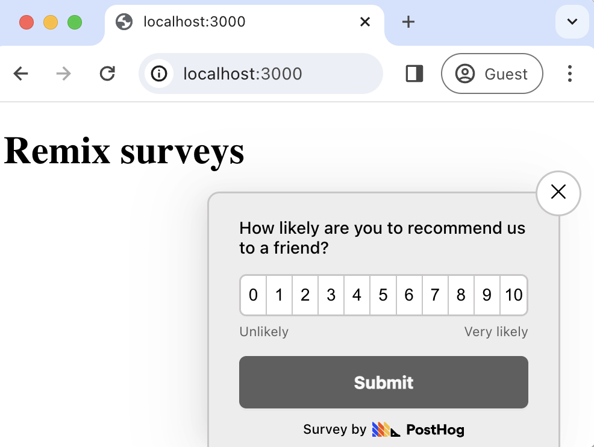
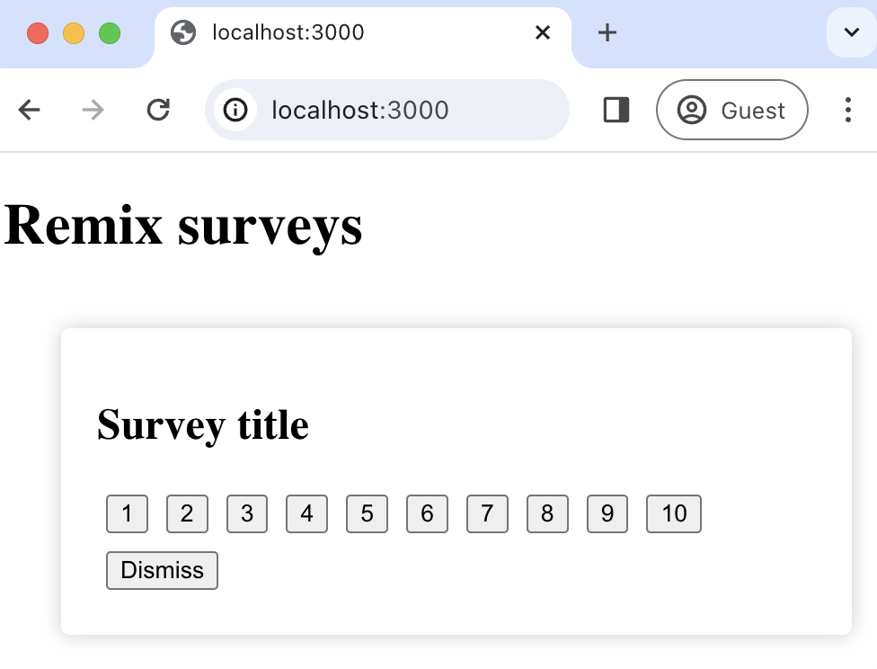

import { ProductScreenshot } from 'components/ProductScreenshot'
export const EventsLight = "https://res.cloudinary.com/dmukukwp6/image/upload/posthog.com/contents/images/tutorials/remix-surveys/events-light.png"
export const EventsDark = "https://res.cloudinary.com/dmukukwp6/image/upload/posthog.com/contents/images/tutorials/remix-surveys/events-dark.png"
export const ImgSurveyResultsLight = "https://res.cloudinary.com/dmukukwp6/image/upload/posthog.com/contents/images/tutorials/remix-surveys/survey-results-light.png"
export const ImgSurveyResultsDark = "https://res.cloudinary.com/dmukukwp6/image/upload/posthog.com/contents/images/tutorials/remix-surveys/survey-results-dark.png"
export const ImgSurveyTemplatesLight = "https://res.cloudinary.com/dmukukwp6/image/upload/posthog.com/contents/images/tutorials/remix-surveys/survey-templates-light.png"
export const ImgSurveyTemplatesDark = "https://res.cloudinary.com/dmukukwp6/image/upload/posthog.com/contents/images/tutorials/remix-surveys/survey-templates-dark.png"

[Surveys](/docs/surveys) are a great way to get feedback from your users. In this guide, we show you how to add a survey to your Remix app.

We'll create a basic Remix app, add PostHog, create a survey, and then show you how to display the survey in the app and get responses.

## 1. Create a Remix app

First, ensure [Node.js is installed](https://nodejs.dev/en/learn/how-to-install-nodejs/) (version 18.0 or newer). Then, create a new Remix app:

```bash
npx create-remix@latest
```

When prompted in the command line, name it what you like (we chose `remix-surveys`) and choose all the default options.

Next, replace the code in `app/routes/_index.tsx` with a simple heading:

```ts file=_index.tsx
export default function Index() {
  return (
    <div id="app">
      <h1>Remix surveys</h1>
    </div>
  );
}
```

Run `npm run dev` and navigate to `http://localhost:3000` to see your app in action.



## 2. Add PostHog to your app

With our app set up, it’s time to install and set up PostHog. If you don't have a PostHog instance, you can [sign up for free](https://us.posthog.com/signup).

To start, install the [JavaScript web SDK](/docs/libraries/js):

```bash
npm i posthog-js
```

Then, go to `app/entry.client.tsx` and initialize PostHog as a component. You'll need both your API key and instance address (you can find these in your [project settings](https://us.posthog.com/project/settings)).  

```ts file=entry.client.tsx
import { RemixBrowser } from "@remix-run/react";
import { startTransition, StrictMode, useEffect } from "react";
import { hydrateRoot } from "react-dom/client";
import posthog from "posthog-js";

function PosthogInit() {
  useEffect(() => {
    posthog.init('<ph_project_api_key>', {
      api_host: '<ph_instance_address>',
    });
  }, []);

  return null;
}

startTransition(() => {
  hydrateRoot(
    document,
    <StrictMode>
        <RemixBrowser />
        <PosthogInit/>
    </StrictMode>
  );
});
```

Once you’ve done this, reload your app and click the button a few times. You should see events appearing in the [PostHog activity tab](https://us.posthog.com/events).

<ProductScreenshot
  imageLight={EventsInPostHogLight} 
  imageDark={EventsInPostHogDark} 
  alt="Events captured in PostHog" 
  classes="rounded"
/>

## 3. Create a survey

There are two options for displaying a survey using PostHog:

1. Use PostHog's prebuilt survey UI.
2. Implement your own survey UI.

This tutorial covers how to implement both options:

### Option 1: Use PostHog's prebuilt survey UI

This is the simplest option. PostHog has many [survey templates](/templates?filter=type&value=survey) to choose from, handles all the display logic, and captures responses for you. You can also customize the questions, branding, and targeting as needed – see our [survey docs](/docs/surveys/creating-surveys) for more details on how to do so.
 
To create a survey with a prebuilt UI, go to the [surveys tab](https://us.posthog.com/surveys) in PostHog and click "New survey". 

<ProductScreenshot
  imageLight={ImgSurveyTemplatesLight} 
  imageDark={ImgSurveyTemplatesDark} 
  alt="PostHog survey templates" 
  classes="rounded"
/>

Select any template, or you can create your own by clicking "Create blank survey". Then, configure your survey with the following details:

1. Ensure `Presentation` is set to **Popover**.
2. Set the targeting to `All users`.
3. Use the default values for everything else.

Then, click "Save as draft" and then "Launch". Your survey is now live and you should see it in your app. After submitting responses, you can [view results in PostHog](#4-view-results).



### Option 2: Implement your own survey UI

If you prefer to have complete control of your survey UI and logic, you can still use PostHog to handle targeting as well as tracking and analyzing your results.

First, create a survey in PostHog like in option 1 above (for this tutorial, we use a Net Promoter Score survey template). The only difference is you must set `Presentation` to **API**.

Then, there are four parts to adding code for our custom survey:

1. Create the survey UI.
2. Fetch the survey from PostHog.
3. Add the logic for displaying and hiding it.
4. Capture interactions from it.

#### 1. Create the survey UI

We've created an example survey UI for this tutorial. To use it, create a new folder called `components` in the `app` directory. Then create two new files: `Survey.tsx` and `styles.css`

```bash
cd ./app
mkdir components
cd ./components
touch Survey.tsx
touch styles.css
```

Paste the following code into `Survey.tsx`:

```tsx
import React from "react";
import "./styles.css";

interface SurveyProps {
  title: string;
  onDismiss: () => void;
  onSubmit: (value: number) => void;
}

const Survey: React.FC<SurveyProps> = ({ title, onDismiss, onSubmit }) => {
  const handleSelect = (value: number) => {
    onSubmit(value);
  }

  return (
    <div className={"survey-popup"}>
      <h2>{title}</h2>
      <div>
        {[...Array(10)].map((_, i) => (
          <button className={"button"} key={i + 1} onClick={() => handleSelect(i + 1)}>
            {i + 1}
          </button>
        ))}
      </div>
      <div>
        <button className={"button"} onClick={onDismiss}>Dismiss</button>
      </div>
    </div>
  );
}

export default Survey;
```

Then, add the following to `styles.css`:

```css file=styles.css
.survey-popup {
  position: fixed;
  bottom: 20px;
  right: 20px;
  width: 400px;
  padding: 20px;
  background-color: #ffffff;
  box-shadow: 0px 0px 10px rgba(0, 0, 0, 0.2);
  border-radius: 5px;
  z-index: 1000;
}

.button {
  margin: 5px;
}
```

Finally, integrate the component into `_index.tsx`:

```tsx file=_index.tsx
import { useState } from 'react';
import Survey from '../components/Survey';

export default function Index() {
  const [showSurvey, setShowSurvey] = useState(true);
  const [surveyTitle, setSurveyTitle] = useState('Survey title')

  const handleDismiss = () => {
    setShowSurvey(false);
  };

  const handleSubmit = (value: number) => {
    setShowSurvey(false);
  };

  return (
    <div id="app">
      <h1>Remix surveys</h1>
      {showSurvey && (
        <Survey
          title={surveyTitle}
          onDismiss={handleDismiss}
          onSubmit={handleSubmit}
        />
      )}
    </div>
  );
}
```

This shows a survey popup every time you visit your app's homepage.



#### 2. Fetch the survey from PostHog

PostHog keeps track of all active surveys for a user. This is especially helpful if you set up [custom targeting options](/docs/surveys/creating-surveys#targeting). 

To fetch the active surveys, we use `posthog.getActiveMatchingSurveys()`. This returns an array of survey objects that looks like this:

```JSON
[
   {
     "id": "018cfcd5-107e-0000-49a1-8e7c6b825947",
     "name": "Net promoter score (NPS) API Survey",
     "description": "",
     "type": "api",
     "linked_flag_key": null,
     "targeting_flag_key": null,
     "questions": [
       {
         "type": "rating",
         "scale": 10,
         "display": "number",
         "question": "How likely are you to recommend us to a friend?",
         "description": "",
         "lowerBoundLabel": "Unlikely",
         "upperBoundLabel": "Very likely"
       }
     ],
     "conditions": null,
     "start_date": "2024-01-12T08:41:20.614000Z",
     "end_date": null
   }
]
```

We fetch these surveys inside a `useEffect()` hook:

```tsx file=_index.tsx
import { useState, useEffect } from 'react';
import Survey from '../components/Survey';
import posthog from 'posthog-js';

export default function Index() {
  const [showSurvey, setShowSurvey] = useState(true);
  const [surveyTitle, setSurveyTitle] = useState('Survey title')
  const [surveyID, setSurveyID] = useState<string | null>(null);

  useEffect(() => {
    posthog.getActiveMatchingSurveys((surveys) => {
      if (surveys.length > 0) {
        const survey = surveys[0];
        setSurveyID(survey.id);
        setSurveyTitle(survey.questions[0].question)
      }
    }); 
  }, []);   

  // ... rest of your code ...
}
```


#### 3. Add the display logic

We want to make sure we don't show the survey again to users who have either submitted or dismissed it. We use [`localStorage`](https://developer.mozilla.org/en-US/docs/Web/API/Window/localStorage) to store this data and use it to check whether to show the survey or not.

```tsx file=_index.tsx
// your imports

export default function Index() {
  const [showSurvey, setShowSurvey] = useState(false); // update this to be false by default
  const [surveyTitle, setSurveyTitle] = useState('Survey title')
  const [surveyID, setSurveyID] = useState<string | null>(null);

  useEffect(() => {
    posthog.getActiveMatchingSurveys((surveys) => {
      if (surveys.length > 0) {
        const survey = surveys[0];
        setSurveyID(survey.id);
        setSurveyTitle(survey.questions[0].question)

        // Check local storage to see if the user has already seen this particular survey
        const hasInteractedWithSurvey = localStorage.getItem(`hasInteractedWithSurvey_${survey.id}`);
        setShowSurvey(!hasInteractedWithSurvey);
      }
    }); 
  }, []); 

  const handleDismiss = () => {
    setShowSurvey(false);
    localStorage.setItem(`hasInteractedWithSurvey_${surveyID}`, 'true');  
  };

  const handleSubmit = (value: number) => {
    setShowSurvey(false);
    localStorage.setItem(`hasInteractedWithSurvey_${surveyID}`, 'true');  
  };

  // rest of your code
}
```

#### 4. Capture survey interactions

The final step in setting up our survey is capturing interactions. This enables us to analyze the results in PostHog. 

There are 3 events to capture:

1. `"survey shown"`
2. `"survey dismissed"`
3. `"survey sent"` (for responses)

You can capture these events using `posthog.capture()`:

```tsx file=_index.tsx
  // ... rest of your code ...

  const handleDismiss = () => {
    setShowSurvey(false);
    localStorage.setItem(`hasInteractedWithSurvey_${surveyID}`, 'true');
    posthog.capture("survey dismissed", {
      $survey_id: surveyID // required
    })  
  };

  const handleSubmit = (value: number) => {
    setShowSurvey(false);
    localStorage.setItem(`hasInteractedWithSurvey_${surveyID}`, 'true');  
    posthog.capture("survey sent", {
      $survey_id: surveyID, // required
      $survey_response: value // required
    })
  };

  useEffect(() => {
    if (showSurvey && surveyID) {
      posthog.capture("survey seen", {
        $survey_id: surveyID // required
      })
    }
  }, [showSurvey, surveyID]);

 // ... rest of your code ...
```

Altogether, your `_index.tsx` should look like this:

```tsx file=_index.tsx
import { useState, useEffect } from 'react';
import Survey from '../components/Survey';
import posthog from 'posthog-js';

export default function Index() {
  const [showSurvey, setShowSurvey] = useState(false);
  const [surveyTitle, setSurveyTitle] = useState('Survey title')
  const [surveyID, setSurveyID] = useState<string | null>(null);

  useEffect(() => {
    posthog.getActiveMatchingSurveys((surveys) => {
      if (surveys.length > 0) {
        const survey = surveys[0];
        setSurveyID(survey.id);
        setSurveyTitle(survey.questions[0].question)

        // Check local storage to see if the user has already seen this particular survey
        const hasInteractedWithSurvey = localStorage.getItem(`hasInteractedWithSurvey_${survey.id}`);
        setShowSurvey(!hasInteractedWithSurvey);
      }
    }); 
  }, []); 

  const handleDismiss = () => {
    setShowSurvey(false);
    localStorage.setItem(`hasInteractedWithSurvey_${surveyID}`, 'true');
    posthog.capture("survey dismissed", {
      $survey_id: surveyID // required
    })  
  };

  const handleSubmit = (value: number) => {
    setShowSurvey(false);
    localStorage.setItem(`hasInteractedWithSurvey_${surveyID}`, 'true');  
    posthog.capture("survey sent", {
      $survey_id: surveyID, // required
      $survey_response: value // required
    })
  };

  useEffect(() => {
    if (showSurvey && surveyID) {
      posthog.capture("survey seen", {
        $survey_id: surveyID // required
      })
    }
  }, [showSurvey, surveyID]);  

  return (
    <div id="app">
      <h1>Remix surveys</h1>
      {showSurvey && (
        <Survey
          title={surveyTitle}
          onDismiss={handleDismiss}
          onSubmit={handleSubmit}
        />
      )}
    </div>
  );
}
```

Our survey is now ready to go! The next step is to ship the changes, get responses, and view your results.

## 4. View results

After interacting with your survey, you can view results by selecting the survey from the [surveys tab](https://us.posthog.com/surveys). You'll see data on:

- How many users have seen the survey.
- How many users have dismissed the survey.
- Responses.

You can also filter these results based on [user properties](/docs/product-analytics/user-properties), [cohorts](/docs/data/cohorts), [feature flags](/docs/feature-flags/creating-feature-flags) and more.

<ProductScreenshot
  imageLight={ImgSurveyResultsLight} 
  imageDark={ImgSurveyResultsDark} 
  alt="Survey results" 
  classes="rounded"
/>

## Further reading

- [How to set up Remix analytics, feature flags, and more](/tutorials/remix-analytics)
- [How to set up A/B tests in Remix](/tutorials/remix-ab-tests)
- [How to analyze surveys with ChatGPT](/tutorials/analyze-surveys-with-chatgpt)
