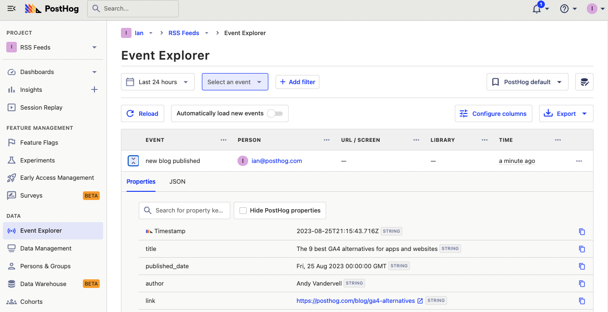

RSS is a popular format for providing feeds of content. For example, GitHub uses it to provide feeds of releases, blogs provide feeds of new posts, and status pages provide feeds of incidents

We can capture events from these feeds by polling them, checking for new entries, and then capturing them into PostHog. This is exactly what we do in this tutorial, with the help of [Val Town](https://www.val.town/), a platform for writing, running, and scheduling JavaScript functions in your browser. 

## Creating our capture function in Val Town

After signing up for [Val Town](https://www.val.town/), you can go to your workspace and start creating JavaScript functions. We start by writing a function to capture an event using the [PostHog API](/docs/api).

Since we will use this function to capture events from multiple feeds, we make it reusable. We write it as a function that takes an object ccontaining a `key`, `event`, `properties`, and `distinct_id`. It uses these to create the body of the request and then send a fetch request to `https://us.i.posthog.com/capture/` (or `https://eu.i.posthog.com/capture/`). Altogether, this looks like this:

<iframe src="https://www.val.town/embed/ianvph.postHogAPICapture" height="630" frameBorder="0" allowFullScreen></iframe>

> **Note:** you can [read and fork the code from this tutorial on Val Town](https://www.val.town/v/ianvph.postHogAPICapture). You can also call the code from your own val by using `@ianvph.postHogAPICapture();` with the object containing your event data.

## How to create a GitHub release tracker

Next, we create our function to capture data from a GitHub repo’s RSS feed for new releases. We poll the RSS feed on a schedule (which Val Town makes easy), and when there is a new release, we capture a new event in PostHog using the capture function we created.

To do this, we fetch the release feed URL that looks like `https://github.com/posthog/posthog/releases.atom`. To get the first entry from the feed, we can parse the XML using a function created by Steve Krouse on Val Town.

```js
export async function gitHubReleaseTracker() {
  // gets newest release from github
  const githubProject = "https://github.com/posthog/posthog";
  const response = await fetch(`${githubProject}/releases.atom`);
  const newestEntry =
    (await @stevekrouse.parseXML(await response.text())).feed
      .entry[0];
}
```

Next, we use another val that is simply a constant to store the latest release ID. We update this every time we successfully capture a new release.

```js
let newestReleaseId = "tag:github.com,2008:Repository/235901813/1.43.1";
```

We then check that ID against the new entry ID we get from the feed and return the function if they are the same.

```js
export async function gitHubReleaseTracker() {
  //...
	if (newestEntry.id == @me.newestReleaseId) {
    return "old release";
  }
}
```

If the entry is new, we create properties for the event and then the event request object. We then use the `postHogAPICapture()` function we created earlier to capture the event and set the `newestReleaseId` to the current one.

```js
export async function gitHubReleaseTracker() {
	const properties = {
    title: newestEntry.title,
    release_date: newestEntry.updated,
    author: newestEntry.author.name,
  };
  const captureData = {
    key: @me.phProjectAPIKey,
    event: "new release",
    properties: properties,
    distinct_id: @me.email,
  };
  @ianvph.postHogAPICapture(captureData);
	@me.newestReleaseId = newestEntry.id;
  return "new release captured";
}
```

Finally, we schedule the function to run every day by clicking the three dots next to "Save" and clicking "Schedule this val."

<iframe src="https://www.val.town/embed/ianvph.gitHubReleaseTracker" height="705" frameBorder="0" allowFullScreen></iframe>

## Capturing newly published blogs

Another type of RSS feed you might want to keep track of is blog posts. This can be useful for tracking when sites you care, like your own blog or app changelogs, publish updates.

The code for this is similar to the GitHub release tracker. We poll an RSS feed and capture an event when there is a new item. Different RSS feeds do require some tweaks because of differences in data structure.

1. We use a different link. For us, it is the PostHog blog at [`/rss.xml`](/rss.xml).
2. The newest entry depends on the format of your RSS feed. For us, it is `rss.channel.item[0]`.
3. Instead of a release ID, we use a link to check if the blog post is new.
4. The properties and event details are different.

Once we make all of these changes, we have a function that looks like this:

<iframe src="https://www.val.town/embed/ianvph.blogRSSTracker" height="720" frameBorder="0" allowFullScreen></iframe>

When we set it up and schedule it to run every day, it captures new blogs published in PostHog.



## Capturing app status changes

The final feed to track is the status of the apps we rely on. Many status pages contain an RSS feed, including PostHog’s (which we use here). The process for tracking this is the same:

1. Get the status RSS feed.
2. Get the latest entry.
3. Check if it is new.
4. Capture an event if it is new.

For `https://status.posthog.com/history.rss`, this looks like this: 

<iframe src="https://www.val.town/embed/ianvph.posthogStatusTracker" height="715" frameBorder="0" allowFullScreen></iframe>

Because status updates can have important real-time consequences for your app, we can schedule this one to run every hour (or less).

## Further reading

- [Using the PostHog API to capture events](/tutorials/api-capture-events)
- [How to use the PostHog API to get insights and persons](/tutorials/api-get-insights-persons)
- [What to do after installing PostHog in 5 steps](/tutorials/next-steps-after-installing)
