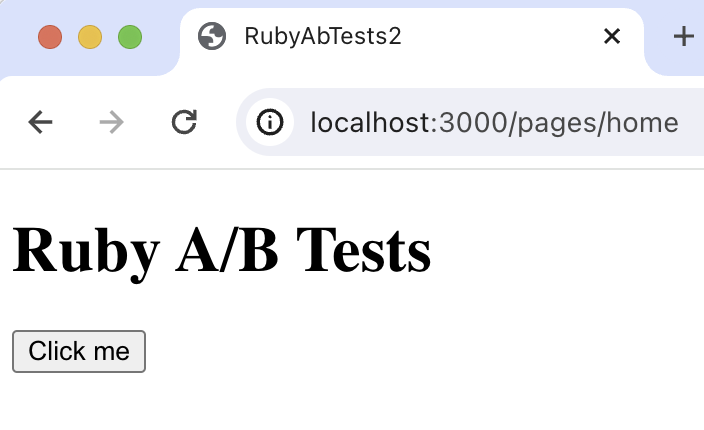

import { ProductScreenshot } from 'components/ProductScreenshot'
import EventsInPostHogLight from '../images/tutorials/ruby-ab-tests/events-light.png'
import EventsInPostHogDark from '../images/tutorials/ruby-ab-tests/events-dark.png'
import TestSetupLight from '../images/tutorials/ruby-ab-tests/experiment-setup-light.png'
import TestSetupDark from '../images/tutorials/ruby-ab-tests/experiment-setup-dark.png'
import IdentifyLight from '../images/tutorials/ruby-ab-tests/identify-light.png'
import IdentifyDark from '../images/tutorials/ruby-ab-tests/identify-dark.png'

A/B tests help you improve your Ruby on Rails app by enabling you to compare the impact of changes on key metrics. 

To show you how to set one up on both the client and server side, we create a basic Rails app, add PostHog, create an A/B test, and implement the code for it.

## 1. Create a Rails app

First, ensure [Ruby](https://www.ruby-lang.org/en/documentation/installation/) and [Rails](https://guides.rubyonrails.org/v5.0/getting_started.html) are both installed. Then, create a new Rails app:

```bash
rails new ruby-ab-tests
cd ruby-ab-tests
```

Next, we set up a home page with a simple heading and button. To do this, generate a `Pages` controller with a `home` action:

```bash
rails generate controller Pages home
```

Then replace the code in `app/views/pages/home.html.erb` with the following:

```html file=app/views/pages/home.html.erb
<main>
  <h1>Rails A/B Tests</h1>
  <button id="main-cta">Click me</button>
</main>
```

Lastly, modify `config/routes.rb` to make our new home page the root path of our app:

```ruby file=config/routes.rb
Rails.application.routes.draw do
  root 'pages#home'
end
```

Run `rails server` and navigate to `http://localhost:3000` to see our app in action.



## 2. Add PostHog on the client side

With our app set up, it’s time to install and set up PostHog. If you don't have a PostHog instance, you can [sign up for free](https://us.posthog.com/signup).

To start, we install the [PostHog Web SDK](/docs/libraries/js) on the client side using the `Web snippet`. Copy the snippet from [your project settings](https://us.posthog.com/settings/project#snippet) and paste it in the `<head>` tag of `app/views/layouts/application.html.erb`:

```html app/views/layouts/application.html.erb
<!DOCTYPE html>
<html>
  <head>
    <title>RubyAbTests</title>
    <meta name="viewport" content="width=device-width,initial-scale=1">
    <%= csrf_meta_tags %>
    <%= csp_meta_tag %>

    <%= stylesheet_link_tag "application", "data-turbo-track": "reload" %>
    <%= javascript_importmap_tags %>
    
    <!-- PostHog Snippet --> 
    <script>
      !function(t,e){var o,n,p,r;e.__SV||(window.posthog=e,e._i=[],e.init=function(i,s,a){function g(t,e){var o=e.split(".");2==o.length&&(t=t[o[0]],e=o[1]),t[e]=function(){t.push([e].concat(Array.prototype.slice.call(arguments,0)))}}(p=t.createElement("script")).type="text/javascript",p.async=!0,p.src=s.api_host+"/static/array.js",(r=t.getElementsByTagName("script")[0]).parentNode.insertBefore(p,r);var u=e;for(void 0!==a?u=e[a]=[]:a="posthog",u.people=u.people||[],u.toString=function(t){var e="posthog";return"posthog"!==a&&(e+="."+a),t||(e+=" (stub)"),e},u.people.toString=function(){return u.toString(1)+".people (stub)"},o="capture identify alias people.set people.set_once set_config register register_once unregister opt_out_capturing has_opted_out_capturing opt_in_capturing reset isFeatureEnabled onFeatureFlags getFeatureFlag getFeatureFlagPayload reloadFeatureFlags group updateEarlyAccessFeatureEnrollment getEarlyAccessFeatures getActiveMatchingSurveys getSurveys onSessionId".split(" "),n=0;n<o.length;n++)g(u,o[n]);e._i.push([i,s,a])},e.__SV=1)}(document,window.posthog||[]);
      posthog.init('<ph_project_api_key>',{api_host:'<ph_instance_address>})
    </script>
  </head>

  <body>
    <%= yield %>
  </body>
</html>
```

Once you’ve done this, reload your app and click the button a few times. You should see events appearing in the [PostHog events explorer](https://us.posthog.com/events).

<ProductScreenshot
  imageLight={EventsInPostHogLight} 
  imageDark={EventsInPostHogDark} 
  alt="Events captured in PostHog" 
  classes="rounded"
/>

## 3. Capture a custom event

The first part of setting up our A/B test in PostHog is setting up the goal metric. We'll use the number of clicks on the button as our goal.

To measure this, we [capture a custom event](/docs/product-analytics/capture-events) called `home_button_clicked` when the button is clicked. To do this, add a `onclick` attribute to our button to call `posthog.capture()`:

```html file=app/views/pages/home.html.erb
<script>
  function handleClick() {
    posthog.capture('home_button_clicked');
  }
</script>

<main>
  <h1>Rails A/B Tests</h1>
  <button id="main-cta" onclick="handleClick()">Click me</button>
</main>
```

With this set up, refresh your app and click the button a few times to see the event captured in PostHog.

## 4. Create an A/B test in PostHog

If you haven't done so already, you'll need to [upgrade](https://us.posthog.com/organization/billing) your PostHog account to include A/B testing. This requires entering your credit card, but don't worry, we have a [generous free tier](/pricing) of 1 million requests per month – so you won't be charged anything yet.

Next, go to the [A/B testing tab](https://us.posthog.com/experiments) and create an A/B test by clicking the **New experiment** button. Add the following details to your experiment:

1. Name it "My cool experiment".
2. Set "Feature flag key" to `my-cool-experiment`.
3. Under the experiment goal, select the `home_button_clicked` event we created in the previous step.
4. Use the default values for all other fields.

Click "Save as draft" and then click "Launch".

<ProductScreenshot
  imageLight={TestSetupLight} 
  imageDark={TestSetupDark} 
  alt="Experiment setup in PostHog" 
  classes="rounded"
/>

## 5. Implement the A/B test code

When it comes to implementing our experiment code, there are two options:

1. Client-side rendering
2. Server-side rendering

We'll show you how to implement both.

### Client-side rendering

To implement the A/B test, we fetch the `my-cool-experiment` flag using [`posthog.onFeatureFlags`](/docs/libraries/js#ensuring-flags-are-loaded-before-usage) in a `DOMContentLoaded` event listener. Then, we update the button text based on whether the user is in the `control` or `test` variant of the experiment:

```html file=app/views/pages/home.html.erb
<script>
  document.addEventListener('DOMContentLoaded', function() {
    posthog.onFeatureFlags(function() {
      var buttonText = 'No variant';
      if (posthog.getFeatureFlag('my-cool-experiment') === 'control') {
        buttonText = 'Control variant';
      } else if (posthog.getFeatureFlag('my-cool-experiment') === 'test') {
        buttonText = 'Test variant';
      }
      document.getElementById('main-cta').textContent = buttonText;
    });
  });

  function handleClick() {
    console.log(posthog)
    posthog.capture('home_button_clicked');
  }
</script>

<main>
  <h1>Rails A/B Tests</h1>
  <button id="main-cta" onclick="handleClick()">Click me</button>
</main>
```

Now if you refresh your app, you should see the button text updated to either `Control variant` or `Test variant`. 

### Server-side rendering

Notice that when you refresh the page, the button text flickers between `No variant` and `Control/Test variant`. This is because it takes time for PostHog to load and make the feature flag request.

Server-side rendering is a way to avoid this. This fetches the feature flag before the page loads on the client.

To set this up, we must install and use [PostHog’s Ruby SDK](/libraries/ruby) (because we are making server-side requests). Add `posthog-ruby` to your `Gemfile`:

```Gemfile
gem "posthog-ruby"
```

Then `bundle install` to install the gem.

Next, we create an initializer for our PostHog client. Create a new file in `config/initializers` called `posthog.rb`. Then, initialize PostHog in this file using your project API key and host:

```ruby file=config/initializers/posthog.rb
require 'posthog-ruby'

POSTHOG_CLIENT = PostHog::Client.new({
  api_key: '<ph_project_api_key>',
  host: '<ph_instance_address>'
})
```

Then, we fetch the feature flag in our controller `app/controllers/pages_controller.rb` and set the button text using the value from it:

```ruby file=app/controllers/pages_controller.rb
class PagesController < ApplicationController
  def home
    @button_text = 'No variant'
    begin
      distinct_id = 'placeholder-user-id'
      enabled_variant = POSTHOG_CLIENT.get_feature_flag('my-cool-experiment', distinct_id)
      if enabled_variant == 'control'
        @button_text = 'Control Variant'
      elsif enabled_variant == 'test'
        @button_text = 'Test Variant'
      end
    rescue => e
      @button_text = 'Error'
    end
  end
end
```

Lastly, update our view to use the `@button_text` variable from the controller:

```html file=app/views/pages/home.html.erb
<script>
  function handleClick() {
    console.log(posthog)
    posthog.capture('home_button_clicked');
  }
</script>

<main>
  <h1>Rails A/B Test</h1>
  <button id="main-cta" onclick="handleClick()"><%= @button_text %></button>
</main>
```

Now, when you refresh the page, the button text is already set when the page loads. 

#### Setting the correct `distinctId`

You may notice that we set `distinctId = 'placeholder-user-id'` in our flag call above. In production apps, to ensure you fetch the correct flag value for your user, `distinctId` should be set to their unique ID. 

For logged-in users, you typically use their email as their `distinctId`. However, for logged-out users, you can use the `distinct_id` property from their PostHog cookie:

```ruby file=app/controllers/pages_controller.rb
class PagesController < ApplicationController
  def home
    @button_text = 'No variant'
    
    project_api_key = '<ph_project_api_key>'
    cookie_key = "ph_#{project_api_key}_posthog"

    if cookies[cookie_key]
      begin
        distinct_id = JSON.parse(cookies[cookie_key])['distinct_id']
        enabled_variant = POSTHOG_CLIENT.get_feature_flag('my-cool-experiment', distinct_id)
        if enabled_variant == 'control'
          @button_text = 'Control variant'
        elsif enabled_variant == 'test'
          @button_text = 'Test variant'
        end
      rescue => e
        @button_text = 'Error'
      end
    end
  end
end
```

In the scenario where your PostHog cookie is not available on the server side, you can fall back to the client side evaluation of the flag.

#### Linking the `distinct_id` on the client side

If you're using `email` or `user id` for the `distinct_id` (and not the ID from the PostHog cookie), you'll need to link `distinct_id` to the PostHog instance on the client side. This ensures PostHog correctly assigns events (like our goal metric) to the user. This is done using [`posthog.identify()`](/docs/product-analytics/identify).

First update the code on the server side to return the `distinct_id` to the client:

```ruby file=app/controllers/pages_controller.rb
class PagesController < ApplicationController
  def home
    @button_text = 'No variant'
    @distinct_id = 'max@hedgehog.com' # in production, set this to your user's email or database id.
    begin
      enabled_variant = POSTHOG_CLIENT.get_feature_flag('my-cool-experiment', @distinct_id)
      if enabled_variant == 'control'
        @button_text = 'Control Variant'
      elsif enabled_variant == 'test'
        @button_text = 'Test Variant'
      end
    rescue => e
      @button_text = 'Error'
    end
  end
end
```

Then update the client side code to `identify` the user using the `distinct_id`:

```html file=app/views/pages/home.html.erb
<script>

  document.addEventListener('DOMContentLoaded', function() {
    const distinctId = "<%= @distinct_id %>";
    if (distinctId) {
      posthog.identify(distinctId);
    }
  });

  function handleClick() {
    posthog.capture('home_button_clicked');
  }
</script>

<main>
  <h1>Rails A/B Test</h1>
  <button id="main-cta" onclick="handleClick()"><%= @button_text %></button>
</main>
```

To verify you've done this correctly, you should see an `Identify` event in your [activities tab](https://us.posthog.com/events). You should also see that future client side events are assigned to the `distinct_id` you used (see the value in the `Person` tab).

<ProductScreenshot
  imageLight={IdentifyLight} 
  imageDark={IdentifyDark} 
  alt="Identified events in PostHog" 
  classes="rounded"
/>

## Further reading

- [How to set up Ruby on Rails analytics, feature flags and more](/tutorials/ruby-on-rails-analytics)
- [A software engineer's guide to A/B testing](/product-engineers/ab-testing-guide-for-engineers)
- [8 annoying A/B testing mistakes every engineer should know](/blog/ab-testing-mistakes)